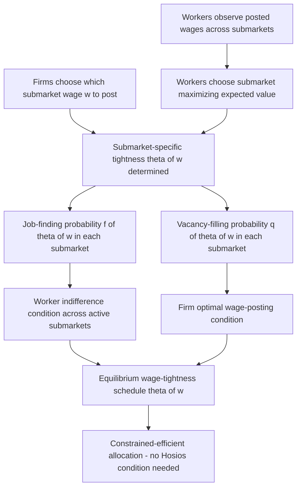

## Directed Search Models

### Motivation: An Alternative to Random Matching

Directed search models provide an alternative microfoundation to the random-matching assumption embedded in the baseline Diamond-Mortensen-Pissarides framework and the Burdett-Mortensen model. In random matching, workers encounter vacancies (and vice versa) without being able to target their search toward specific wage offers — the matching function treats all vacancies as an undifferentiated pool. Directed search relaxes this by assuming **firms publicly post wages (or more general contract terms) before meeting workers, and workers observe these postings and choose where to direct their search effort**, generating an equilibrium in which the market effectively "sorts" workers and firms without requiring a Walrasian auctioneer or explicit bargaining.

The foundational contributions are Peter Diamond's early work on the "Diamond paradox," Kenneth Burdett and Kenneth Judd's early search models, and the modern directed/competitive search literature developed by Espen Moen (1997) and Shouyong Shi (2001), later extended significantly by Guido Menzio and Shouyong Shi (2011) into a full macro-labor framework with on-the-job search.

### The Core Mechanism: Submarkets and Endogenous Tightness

In a directed search model, the labor market is conceptually divided into a continuum of **submarkets**, each indexed by a posted wage $w$. A firm choosing to post wage $w$ enters submarket $w$; a worker choosing to search in submarket $w$ commits their search effort to that specific wage level. Within each submarket, matching still occurs via a standard matching function, but crucially, **market tightness $\theta(w)$ is now endogenous and varies across submarkets** — higher posted wages attract more searchers per vacancy (making $\theta(w)$ lower, i.e., a tighter market from the firm's perspective and looser from the worker's), which endogenously lowers the probability any individual worker in that submarket finds the job, exactly offsetting part of the wage's attractiveness.

**Key Points**

- Workers face a fundamental trade-off across submarkets: higher posted wages are more attractive conditional on getting the job, but the higher associated congestion (more competing searchers) means a lower probability of actually obtaining that job — this endogenous trade-off is the defining mechanism of directed search.
- In equilibrium, workers are indifferent across all submarkets that receive positive search traffic, since any submarket offering a strictly higher expected value would attract additional searchers until the job-finding probability falls enough to re-equalize expected value — an equilibrium condition directly analogous to free entry in the DMP job-creation condition, but operating on the worker's side of the market.
- Firms choose which submarket (wage) to post in by maximizing profit taking as given how $\theta(w)$ (and hence the vacancy-filling rate $q(\theta(w))$) responds to their posted wage — internalizing the full general-equilibrium consequence of their own wage choice on the matching probability they will face.

### SVG Illustration: Submarket Structure in Directed Search (svg_diagram)

<svg xmlns="http://www.w3.org/2000/svg" viewBox="0 0 740 380">
<text x="370" y="26" text-anchor="middle" font-size="16" font-weight="bold" font-family="sans-serif">Directed Search: Submarkets Indexed by Posted Wage (svg_diagram)</text>

<text x="370" y="55" text-anchor="middle" font-size="12" font-family="sans-serif">Workers direct search toward the wage-tightness combination maximizing expected value</text>

<rect x="60" y="90" width="140" height="80" rx="6" fill="#e8f0fd" stroke="#2980b9" stroke-width="2" />
<text x="130" y="115" text-anchor="middle" font-size="12" font-weight="bold" font-family="sans-serif">Submarket w_low</text>
<text x="130" y="135" text-anchor="middle" font-size="11" font-family="sans-serif">Low wage</text>
<text x="130" y="150" text-anchor="middle" font-size="11" font-family="sans-serif">High θ (easy to get)</text>
<rect x="300" y="90" width="140" height="80" rx="6" fill="#fdf1e0" stroke="#e67e22" stroke-width="2" />
<text x="370" y="115" text-anchor="middle" font-size="12" font-weight="bold" font-family="sans-serif">Submarket w_mid</text>
<text x="370" y="135" text-anchor="middle" font-size="11" font-family="sans-serif">Medium wage</text>
<text x="370" y="150" text-anchor="middle" font-size="11" font-family="sans-serif">Medium θ</text>
<rect x="540" y="90" width="140" height="80" rx="6" fill="#fde8e8" stroke="#c0392b" stroke-width="2" />
<text x="610" y="115" text-anchor="middle" font-size="12" font-weight="bold" font-family="sans-serif">Submarket w_high</text>
<text x="610" y="135" text-anchor="middle" font-size="11" font-family="sans-serif">High wage</text>
<text x="610" y="150" text-anchor="middle" font-size="11" font-family="sans-serif">Low θ (hard to get)</text>
<rect x="200" y="250" width="340" height="60" rx="6" fill="#e8fde8" stroke="#27ae60" stroke-width="2" />
<text x="370" y="275" text-anchor="middle" font-size="13" font-weight="bold" font-family="sans-serif">Equilibrium: expected value equalized</text>
<text x="370" y="295" text-anchor="middle" font-size="12" font-family="sans-serif">across all active submarkets</text>
<line x1="130" y1="170" x2="280" y2="250" stroke="#666" stroke-width="1.5" />
<line x1="370" y1="170" x2="370" y2="250" stroke="#666" stroke-width="1.5" />
<line x1="610" y1="170" x2="460" y2="250" stroke="#666" stroke-width="1.5" />
</svg>

### Efficiency: Automatic Satisfaction of Constrained Optimality

**Key Points**

- The central theoretical result distinguishing directed search from random-matching-plus-bargaining models is that directed/competitive search equilibrium is **automatically constrained-efficient**, without requiring the coincidental parameter restriction of the Hosios condition ($\beta = \alpha$).
- The intuition is that because firms internalize the full effect of their wage posting on the equilibrium job-finding probability in their submarket, they are effectively facing (and paying) the full marginal social cost of the congestion externality their posting decision imposes — unlike in random-matching bargaining models, where the split of surplus via $\beta$ may not align with the true marginal contribution of an additional searcher or vacancy to the matching technology.
- This efficiency result is often cited as directed search's key theoretical advantage over the Nash-bargaining-based DMP framework: it removes the need to take a stand on an otherwise hard-to-verify empirical restriction ($\beta = \alpha$) in order to justify treating the decentralized equilibrium as a reasonable normative benchmark.

### Directed Search with On-the-Job Search: Menzio-Shi

Menzio and Shi (2011) extend directed search to incorporate on-the-job search, building a full quantitative macro-labor framework capable of matching many of the same business-cycle moments targeted by the DMP literature (Beveridge curve, unemployment volatility) while retaining the tractability and efficiency properties of the directed search approach.

**Key Points**

- In the Menzio-Shi framework, employed workers can also direct their search toward specific submarkets, generating job-ladder dynamics analogous to Burdett-Mortensen but with the added structural discipline that the wage-offer distribution itself is derived from firms' optimal posting decisions rather than assumed as an exogenous mixed-strategy equilibrium object.
- Because the model retains a *block-recursive* equilibrium structure (aggregate variables like the distribution of vacancies across submarkets do not depend on the detailed cross-sectional distribution of workers across employment states), it is computationally far more tractable for quantitative macro-labor analysis than comparable heterogeneous-agent random-search models with on-the-job search, which is a major reason for its adoption in quantitative macro-labor research. [Inference — "far more tractable" is a comparative characterization common in the literature's own framing; exact computational cost comparisons depend on specific implementation choices]

### Comparison with Random Search and Bargaining Models

| Feature | Random Search + Bargaining (DMP) | Directed/Competitive Search |
| --- | --- | --- |
| Wage determination | Ex-post Nash bargaining | Ex-ante posted wage |
| Efficiency | Requires Hosios condition ($\beta=\alpha$) | Automatically constrained-efficient |
| Wage dispersion source | None (baseline) / requires added heterogeneity | Endogenous across submarkets and firm types |
| Worker search behavior | Passive (matched randomly) | Active (chooses submarket) |
| Tractability with heterogeneity | Can become complex | Often retains block-recursivity |

### Mermaid Diagram: Directed Search Equilibrium Determination

### Empirical Applications and Tests

**Key Points**

- Directed search models have been used to study online labor markets and platforms (e.g., gig economy platforms, online job boards) where posted wages/rates and observable search behavior are more directly measurable than in traditional offline labor markets, providing a more natural empirical setting for testing directed-search predictions than the traditional random-matching DMP framework.
- Empirical tests distinguishing directed from random search often examine whether job-finding probabilities vary systematically with posted wages in the cross-section of vacancies in a manner consistent with the congestion trade-off (higher posted wages associated with more applicants per vacancy and lower per-applicant hiring probability) — evidence from online vacancy platforms has generally found support for this qualitative pattern. [Inference — the quantitative magnitude of this relationship and its consistency across different labor market segments is less firmly established than the qualitative direction]
- Kaas and Kircher (2015) extend directed search to a setting with heterogeneous, multi-worker firms, generating a quantitative framework used to study firm size distributions and firm-level wage-posting behavior jointly, connecting directed search theory to firm-side heterogeneity documented in matched employer-employee data.

### Limitations and Critiques

**Key Points**

- The assumption that firms can commit to a posted wage without ex-post renegotiation is a strong idealization; real-world labor markets exhibit substantial evidence of counteroffers and renegotiation (e.g., a firm matching an outside offer to retain a valued employee), which sits uneasily with the strict no-renegotiation assumption underlying the cleanest directed search efficiency results.
- The submarket/full-commitment structure, while analytically powerful, requires a degree of market organization (public, verifiable wage posting, coordinated worker search) that may be a better description of some labor market segments (formal, large-firm, publicly posted vacancies) than others (informal referral-based hiring, small-firm negotiated wages).
- As with the wage-posting-versus-bargaining choice more broadly, adjudicating empirically between directed search and random-search-plus-bargaining as the "correct" description of a given real-world labor market remains difficult given the two frameworks' ability to fit many of the same aggregate moments. [Inference — this is a broader identification challenge shared with the wage-posting-versus-bargaining literature discussed elsewhere in this chapter]

### Related Topics

- Wage Posting Versus Bargaining
- The Diamond Mortensen Pissarides Model
- The Matching Function
- On the Job Search and Job Ladders
- Burdett-Mortensen Equilibrium Search and Wage Dispersion
- The Hosios Condition and Search Externalities
- Block-Recursive Equilibrium in Heterogeneous-Agent Labor Search Models
- Online Labor Markets and Gig Economy Platform Design