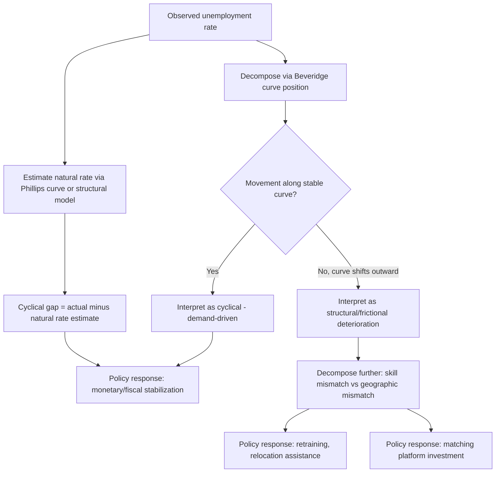

## Frictional, Structural, and Cyclical Unemployment

### The Standard Taxonomy

Labor economists conventionally decompose observed unemployment into three (sometimes four, with seasonal unemployment as a distinct category) conceptual categories, distinguished by their underlying economic cause rather than by any directly observable label attached to an individual unemployed worker. This taxonomy is a modeling and diagnostic device — no unemployed worker carries a tag identifying which category they belong to — but it organizes both theoretical search-and-matching models and applied macroeconomic policy analysis.

- **Frictional unemployment**: Arises from the time it takes for workers and firms to find each other even in a well-functioning labor market with no fundamental mismatch — the natural byproduct of search frictions, imperfect information, and the time cost of matching, as formalized directly by the McCall and DMP search models covered elsewhere in this curriculum.
- **Structural unemployment**: Arises from a persistent mismatch between the skills, location, or characteristics of job-seekers and the requirements of available vacancies — a mismatch that search frictions alone (absent retraining, relocation, or wage adjustment) cannot resolve through the ordinary matching process.
- **Cyclical unemployment**: Arises from insufficient aggregate demand for labor during economic downturns, representing the gap between actual unemployment and the "natural rate" (frictional plus structural) that would prevail if the economy were operating at potential output.

### Frictional Unemployment in Depth

**Key Points**

- Frictional unemployment is, by construction, present even in a labor market operating at "full employment" in the sense of zero cyclical unemployment and zero structural mismatch — it reflects the unavoidable time cost of the matching process itself, directly modeled by the matching function $M = m(U,V)$ and the associated job-finding rate $f(\theta)$.
- The McCall search model's reservation-wage framework provides the individual-level microfoundation for frictional unemployment: even when acceptable jobs exist somewhere in the economy, workers rationally decline below-reservation-wage offers while continuing to search, generating positive equilibrium unemployment duration even absent any true skill or location mismatch.
- Frictional unemployment is generally considered largely unavoidable and, within reasonable bounds, not obviously welfare-reducing at the margin — search takes time because better matches are valuable, and eliminating frictional unemployment entirely (e.g., by forcing workers to accept the very first offer) would generally reduce average match quality and aggregate output.
- Policy levers thought to primarily affect frictional unemployment include job search assistance and matching platforms/intermediaries (which raise $A$, matching efficiency, in the matching function), UI benefit generosity and duration (which affects the reservation wage and hence job-finding rate through the $b$ term), and public employment service quality.

### Structural Unemployment in Depth

**Key Points**

- Structural unemployment reflects a durable, not merely transitory, mismatch — common sources include **skill mismatch** (job-seekers' skills do not match the requirements of open positions, often following technological change or sectoral decline), **geographic mismatch** (job-seekers and vacancies are located in different regions with limited worker mobility to close the gap), and **wage-setting institutions** that prevent market-clearing wage adjustment at the relevant skill or geographic level (e.g., binding minimum wages or union wage floors in a declining sector, though the welfare implications of these institutional causes are separately and more contentiously debated).
- Structural unemployment is closely associated with the concept of **mismatch unemployment**, formalized in modern search-and-matching frameworks by extending the matching function to allow separate sub-markets by occupation, sector, or region and measuring the share of aggregate unemployment attributable to misallocation across these sub-markets relative to a hypothetical efficient reallocation (Şahin, Song, Topa, and Violante, 2014 develop and apply this decomposition methodology to U.S. data).
- Technological change (automation, deindustrialization) is a commonly cited driver of structural unemployment, particularly for workers whose skills become obsolete faster than they can retrain or relocate — this connects the structural unemployment concept directly to the broader literature on skill-biased technological change and labor market polarization.
- Distinguishing structural from cyclical unemployment empirically is genuinely difficult in real time, since both can produce similar aggregate symptoms (elevated unemployment duration, outward-shifted Beveridge curve); much of the applied debate around the persistence of elevated unemployment after the 2008-09 recession centered precisely on this identification challenge (was the elevated unemployment primarily cyclical, reflecting continued demand weakness, or had it become structural, reflecting persistent mismatch that would not resolve with demand recovery alone). [Inference — this remains a genuinely contested empirical question in specific historical episodes, without a fully settled consensus verdict even in retrospect]

### Cyclical Unemployment in Depth

**Key Points**

- Cyclical unemployment is conventionally measured as the gap between the actual unemployment rate and the estimated **natural rate of unemployment** (or NAIRU — non-accelerating inflation rate of unemployment), a concept originating with Milton Friedman's and Edmund Phelps's natural rate hypothesis (1968).
- Within the DMP search-and-matching framework, cyclical unemployment arises through the sensitivity of vacancy posting and hence market tightness $\theta$ to aggregate productivity/demand shocks — a negative aggregate shock reduces the value of a filled job $J$, which through the free-entry condition $c/q(\theta) = J$ reduces equilibrium $\theta$, lowering the job-finding rate $f(\theta)$ and raising steady-state (or transitional) unemployment via the flow-balance relationship $u = s/(s+f(\theta))$.
- The Shimer puzzle (documented in the DMP entry of this curriculum) is directly about whether the standard search-and-matching model can generate *enough* cyclical unemployment volatility in response to empirically realistic productivity shocks — a central quantitative challenge for connecting search theory to observed business-cycle unemployment dynamics.
- Cyclical unemployment is the primary target of countercyclical macroeconomic stabilization policy (monetary and fiscal policy aimed at closing aggregate demand shortfalls), distinguishing it sharply from frictional and structural unemployment, which are generally considered to require microeconomic/structural policy responses (search assistance, retraining, relocation support) rather than aggregate demand management.

### SVG Illustration: Decomposing Observed Unemployment (svg_diagram)

<svg xmlns="http://www.w3.org/2000/svg" viewBox="0 0 720 380">
<text x="360" y="26" text-anchor="middle" font-size="16" font-weight="bold" font-family="sans-serif">Decomposing Observed Unemployment Over Time (svg_diagram)</text>
<line x1="80" y1="330" x2="660" y2="330" stroke="black" stroke-width="2" />
<line x1="80" y1="330" x2="80" y2="50" stroke="black" stroke-width="2" />
<text x="370" y="360" text-anchor="middle" font-size="13" font-family="sans-serif">Time</text>
<text x="35" y="200" text-anchor="middle" font-size="13" font-family="sans-serif" transform="rotate(-90 35 200)">Unemployment rate</text>
<rect x="80" y="280" width="580" height="50" fill="#2980b9" opacity="0.7" />
<text x="370" y="310" text-anchor="middle" font-size="12" fill="white" font-family="sans-serif">Frictional (roughly constant baseline)</text>
<rect x="80" y="240" width="580" height="40" fill="#f1c40f" opacity="0.8" />
<text x="370" y="265" text-anchor="middle" font-size="12" font-family="sans-serif">Structural (slow-moving, trend shifts)</text>
<path d="M 80 240 Q 200 100 340 70 Q 460 60 550 180 Q 610 240 660 240" fill="none" stroke="#c0392b" stroke-width="3" />
<text x="450" y="100" text-anchor="middle" font-size="12" fill="#c0392b" font-weight="bold" font-family="sans-serif">Cyclical component</text>
<text x="450" y="115" text-anchor="middle" font-size="11" fill="#c0392b" font-family="sans-serif">(rises sharply in recessions)</text>

<text x="150" y="60" font-size="11" font-family="sans-serif" fill="#444">Total observed u = Frictional + Structural + Cyclical</text>

</svg>

### Measurement and Identification Challenges

**Key Points**

- The natural rate of unemployment (frictional plus structural) is not directly observed and must be estimated, typically via statistical filtering methods (e.g., using the empirical relationship between unemployment and inflation, the Phillips curve, to back out an implied NAIRU) or via structural search-and-matching model estimation.
- Real-time estimates of the natural rate are subject to substantial revision as more data becomes available, which has historically led to significant policy errors when contemporaneous natural-rate estimates were later found to be mismeasured (a well-documented concern in the U.S. monetary policy history literature, particularly around the 1970s stagflation episode).
- The Beveridge curve — the empirical relationship between the unemployment rate and the vacancy rate — is a key diagnostic tool for distinguishing cyclical from structural/frictional unemployment: a movement *along* a stable Beveridge curve is generally interpreted as reflecting demand-driven (cyclical) fluctuations, while an *outward shift* of the curve itself (higher unemployment at any given vacancy rate) is generally interpreted as reflecting reduced matching efficiency, consistent with rising structural mismatch or frictional deterioration. [Inference — this interpretation, while standard, requires care since outward Beveridge curve shifts can in principle also reflect composition effects or temporary factors rather than a permanent change in the natural rate]

### Mermaid Diagram: Diagnostic Decomposition Framework

### Policy Implications by Category

**Next Steps**

- **Frictional unemployment policy tools**: Public employment services, job search assistance programs, online job matching platform investment, UI benefit design that balances insurance value against reservation-wage/job-finding-rate incentive effects
- **Structural unemployment policy tools**: Worker retraining and reskilling programs, relocation assistance and housing policy reform to reduce geographic mobility frictions, education policy aimed at closing skill gaps, place-based economic development policy for regions experiencing persistent sectoral decline
- **Cyclical unemployment policy tools**: Countercyclical monetary policy (interest rate adjustments, unconventional monetary policy at the zero lower bound), countercyclical fiscal policy (automatic stabilizers, discretionary stimulus), extended UI benefits during recessions (partly insurance-motivated, partly aggregate-demand-motivated)
- Correctly diagnosing which category is driving an observed rise in unemployment is consequential precisely because the appropriate policy tools differ substantially across categories — applying aggregate demand stimulus to a primarily structural mismatch problem is generally considered less effective (and potentially inflationary without commensurate output gains) than targeted structural interventions, while applying only structural/microeconomic interventions to a primarily cyclical demand shortfall would leave substantial unemployment unaddressed

### Historical and Contemporary Applications

**Key Points**

- The post-2008 U.S. recession and subsequent slow recovery prompted extensive debate about the structural-versus-cyclical composition of persistently elevated unemployment, with some economists (e.g., emphasizing extended unemployment duration and skill/geographic mismatch evidence) arguing for a meaningfully larger structural component than had been typical in prior post-war recessions, while others (emphasizing the eventual full recovery of employment once aggregate demand conditions improved sufficiently) argued the bulk of the elevated unemployment was ultimately cyclical after all. [Inference — this specific historical debate was genuinely contested among researchers in real time and its retrospective resolution remains a matter of ongoing interpretation across different empirical approaches]
- Sectoral shocks such as trade-exposure-driven manufacturing decline (the "China shock" literature, Autor, Dorn, and Hanson, 2013 and subsequent work) are frequently cited as a structural unemployment driver operating at the level of specific regional labor markets, generating persistent local unemployment and non-employment effects that standard aggregate demand-management policy is not well-suited to address.
- The COVID-19 pandemic recession generated an unusual mix of unemployment types in a compressed period: an initial sharp cyclical/demand-driven spike combined with significant structural reallocation pressure (accelerated shifts toward remote-work-compatible sectors and away from in-person service sectors), illustrating how the three categories can operate simultaneously and interact within a single episode rather than being mutually exclusive labels for distinct historical periods. [Inference — the precise decomposition of pandemic-era unemployment into these categories remains an active area of applied research with evolving estimates]

### Related Topics

- The Diamond Mortensen Pissarides Model
- The Matching Function
- The Beveridge Curve and Labor Market Tightness
- Mismatch Unemployment and Sectoral Reallocation
- The Natural Rate of Unemployment and the Phillips Curve
- Skill-Biased Technological Change and Labor Market Polarization
- Active Labor Market Policies and Program Evaluation
- Regional Labor Markets and Trade-Exposure Shocks (China Shock Literature)