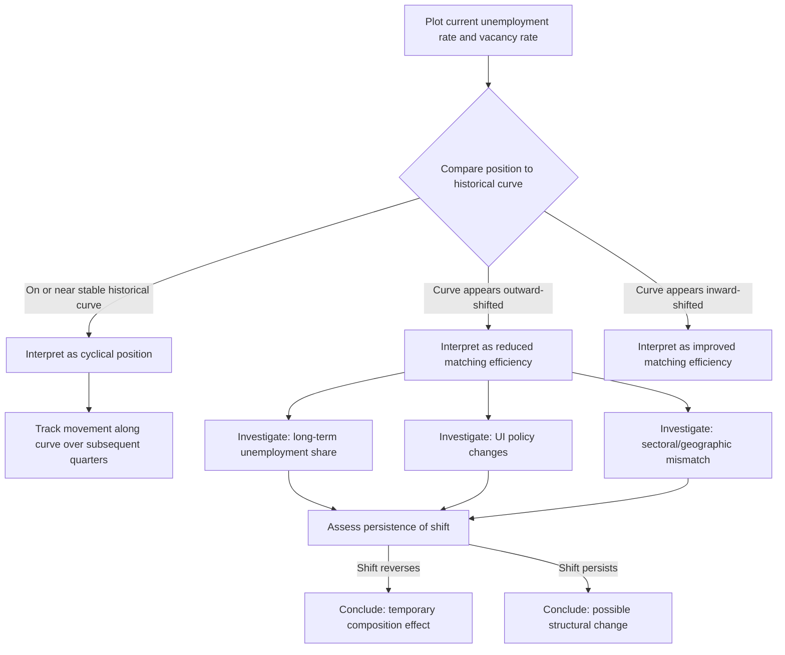

## The Beveridge Curve

### Definition and Historical Origin

The Beveridge curve is the empirical relationship, typically downward-sloping, between the unemployment rate and the job vacancy rate. Named after the British economist William Beveridge (whose 1944 report "Full Employment in a Free Society" first articulated the underlying concept of simultaneously observing unemployment and unfilled vacancies as a diagnostic of labor market conditions), the curve plots vacancy rate on the vertical axis against unemployment rate on the horizontal axis, with each point representing labor market conditions at a given point in time.

The curve's negative slope reflects a basic accounting logic: when aggregate labor demand is strong, vacancies are abundant and unemployment is low; when aggregate labor demand is weak, vacancies dry up and unemployment rises. Points along the curve trace out this inverse relationship as the business cycle moves the economy between tight and slack labor market conditions.

### Theoretical Foundation via the Matching Function

The Beveridge curve is not merely a descriptive empirical regularity — it has a precise theoretical derivation from the search-and-matching framework, specifically from the steady-state flow-balance condition of the DMP model. In steady state, the flow of workers separating into unemployment must equal the flow of unemployed workers finding jobs:

$$s(1-u) = f(\theta) \cdot u$$

where $s$ is the job separation rate and $f(\theta)$ is the job-finding rate, itself a function of market tightness $\theta = v/u$ (vacancy rate over unemployment rate). Solving for steady-state unemployment:

$$u = \frac{s}{s + f(\theta)}$$

Since $f(\theta)$ is increasing in $\theta = v/u$, this equation implicitly defines a negative relationship between $u$ and $v$ for a given separation rate $s$ and matching technology — precisely the theoretical Beveridge curve. Holding $s$ and the matching function fixed, tracing out this relationship as $\theta$ varies generates the downward-sloping curve observed in the data.

### SVG Illustration: The Beveridge Curve and Its Shifts (svg_diagram)

<svg xmlns="http://www.w3.org/2000/svg" viewBox="0 0 720 400">
<text x="360" y="26" text-anchor="middle" font-size="16" font-weight="bold" font-family="sans-serif">The Beveridge Curve: Movements Along vs. Shifts Of (svg_diagram)</text>
<line x1="90" y1="350" x2="650" y2="350" stroke="black" stroke-width="2" />
<line x1="90" y1="350" x2="90" y2="60" stroke="black" stroke-width="2" />
<text x="370" y="378" text-anchor="middle" font-size="13" font-family="sans-serif">Unemployment rate, u</text>
<text x="45" y="200" text-anchor="middle" font-size="13" font-family="sans-serif" transform="rotate(-90 45 200)">Vacancy rate, v</text>
<path d="M 130 100 Q 250 180 500 320" stroke="#2980b9" stroke-width="2.5" fill="none" />
<text x="480" y="340" font-size="11" fill="#2980b9" font-family="sans-serif">Stable Beveridge curve (expansion era)</text>
<path d="M 200 150 Q 320 230 570 370" stroke="#c0392b" stroke-width="2.5" fill="none" stroke-dasharray="6,4" />
<text x="480" y="120" font-size="11" fill="#c0392b" font-family="sans-serif">Outward-shifted curve (post-recession)</text>
<circle cx="220" cy="160" r="5" fill="#27ae60" />
<text x="240" y="155" font-size="10" font-family="sans-serif">Boom: low u, high v</text>
<circle cx="400" cy="270" r="5" fill="#e67e22" />
<text x="420" y="265" font-size="10" font-family="sans-serif">Movement along curve during downturn</text>
<circle cx="480" cy="230" r="5" fill="#c0392b" />
<text x="500" y="245" font-size="10" font-family="sans-serif">Same u, higher v needed post-shift</text>
<line x1="400" y1="270" x2="480" y2="230" stroke="#8e44ad" stroke-width="1.5" stroke-dasharray="3,3" />
</svg>

### Movements Along vs. Shifts of the Curve

**Key Points**

- **Movements along a stable Beveridge curve** are the standard business-cycle interpretation: a recession is characterized by moving down and to the right along the existing curve (unemployment rises, vacancies fall) as aggregate demand weakens and firms post fewer vacancies while more workers separate into unemployment; a recovery moves back up and to the left.
- **Outward shifts of the entire curve** — higher unemployment observed at any given vacancy rate, or equivalently higher vacancies needed to achieve any given unemployment rate — are interpreted as reflecting a *decline in matching efficiency* ($A$ falling in the matching function $M = A \cdot U^\alpha V^{1-\alpha}$), consistent with rising structural mismatch, increased search frictions, or deteriorated job-search intermediation.
- **Inward shifts** (lower unemployment at a given vacancy rate) reflect improved matching efficiency, sometimes attributed to improved job-search technology (e.g., the growth of efficient online job platforms) or improved labor market institutions.
- This along-versus-shift distinction is the primary practical use of the Beveridge curve as a real-time diagnostic tool distinguishing cyclical (demand-driven, along-the-curve) from structural/frictional (matching-efficiency-driven, shift-of-the-curve) unemployment.

### Empirical Beveridge Curve Episodes: The Great Recession

**Key Points**

- Following the 2008-09 U.S. recession, researchers documented a pronounced outward shift of the empirical Beveridge curve beginning around 2009-2010: the unemployment rate remained elevated even as the vacancy rate (measured via the JOLTS survey) recovered toward pre-recession levels, a pattern inconsistent with a simple movement back along the pre-recession curve.
- Proposed explanations for this specific episode's outward shift include extended-duration unemployment insurance potentially reducing search intensity among the unemployed (a moral-hazard channel affecting the effective search input into the matching function), rising long-term unemployment (since long-term unemployed workers empirically exhibit systematically lower job-finding rates per search effort, which mechanically shows up as reduced aggregate matching efficiency even without any change in the "true" per-searcher-type matching technology), and increased sectoral/geographic mismatch following the housing-market-driven concentration of job losses in construction and related industries.
- The shift proved to be at least partially, though not entirely, temporary: the U.S. Beveridge curve gradually moved back toward something closer to its pre-recession position over the subsequent decade as the recovery matured, which some researchers cite as evidence that composition effects (elevated long-term unemployment share) rather than a permanent change in matching technology were the dominant driver of the initial shift. [Inference — the relative weight of these competing explanations remains debated, and the degree of "full" reversion versus persistent partial shift is itself a matter of measurement and time-period sensitivity]

### The Post-Pandemic (2021-2023) Beveridge Curve Episode

**Key Points**

- The U.S. labor market recovery following the COVID-19 recession produced an unusually pronounced outward Beveridge curve shift, with vacancy rates reaching historically unprecedented levels (JOLTS data showing vacancy rates well above any prior recorded episode) while unemployment remained moderately elevated relative to what the pre-pandemic curve would have predicted at those vacancy levels.
- This episode generated substantial applied research interest (including notably from Federal Reserve economists, given its direct relevance to assessing labor market tightness and inflationary pressure during the 2021-2023 high-inflation period) into whether the shift reflected genuine reduced matching efficiency (e.g., pandemic-related labor force participation changes, childcare constraints, early retirements) versus measurement artifacts in vacancy data (some vacancy postings potentially reflecting "soft" or exploratory postings not backed by equally urgent hiring intent as in prior eras).
- Subsequent data through 2023-2024 generally showed the curve moving back toward a more normal-looking relationship as vacancy rates declined and the labor market cooled, which is broadly consistent with at least part of the 2021-2022 shift reflecting temporary pandemic-specific factors rather than a permanent change in matching technology, though the precise decomposition remains actively studied. [Unverified — readers should verify current post-2024 data directly via BLS JOLTS releases for the most up-to-date position of the curve, since this is an evolving empirical matter beyond any fixed point-in-time summary]

### Constructing an Empirical Beveridge Curve: Data Sources

**Key Points**

- In the U.S., the primary modern data source is the **JOLTS (Job Openings and Labor Turnover Survey)**, published monthly by the Bureau of Labor Statistics since December 2000, providing establishment-survey-based vacancy counts alongside hires, quits, and layoffs/discharges — enabling construction of vacancy rates directly comparable to the CPS-based unemployment rate.
- Prior to JOLTS, historical Beveridge curve analysis for the U.S. relied on the Conference Board's **Help-Wanted Index (HWI)**, a print-newspaper-classified-advertisement-based proxy for vacancies dating back to the 1950s, which became progressively less representative of true vacancy levels as online job posting grew and print classified advertising declined, complicating long-run historical Beveridge curve comparisons that splice pre- and post-JOLTS-era data.
- International Beveridge curve construction varies by country's available vacancy data infrastructure; some countries rely on public employment service registered-vacancy data (which may undercount vacancies posted only through private channels), while others have developed JOLTS-comparable establishment surveys.

### Mermaid Diagram: Beveridge Curve Diagnostic Workflow

### Beveridge Curve as a Monetary Policy Input

**Key Points**

- Central banks, including the U.S. Federal Reserve, monitor the Beveridge curve position as one input into assessing labor market tightness and its implications for wage and price inflation, since a given unemployment rate can correspond to meaningfully different degrees of underlying labor market tightness (and hence inflationary pressure) depending on where the economy sits relative to the curve.
- The vacancy-to-unemployment ratio ($V/U$, market tightness $\theta$) derived from Beveridge curve data has been used directly in empirical wage Phillips curve specifications as an alternative or complement to the unemployment rate alone, motivated by search-and-matching theory's prediction that $\theta$ (not $u$ alone) is the theoretically correct sufficient statistic for labor market tightness affecting wage-setting pressure.
- Policy debates during the 2021-2023 high-inflation period drew heavily on Beveridge curve analysis to assess whether elevated vacancy-to-unemployment ratios reflected primarily "excess" labor demand (suggesting continued monetary tightening was appropriate to cool an overheated labor market) versus a reduced-matching-efficiency phenomenon that might resolve without demand destruction (suggesting a "soft landing" was more plausible) — a debate with direct real-world stakes for the interest-rate path chosen by policymakers during that period. [Inference — the relative empirical support for each interpretation was genuinely contested among researchers and policymakers in real time]

### Limitations of Beveridge Curve Analysis

**Key Points**

- The curve is a reduced-form empirical relationship, not a structural model in itself — inferring the underlying cause of an observed shift (matching efficiency versus composition effects versus vacancy measurement changes) requires additional structural analysis beyond simply observing the curve's shape.
- Vacancy data quality and comparability across time periods and countries remains an ongoing measurement challenge, particularly regarding how consistently "soft" or non-urgent postings are counted relative to genuine active hiring intent, which can materially affect the curve's apparent position without reflecting any true change in underlying labor market matching conditions.
- The curve is typically estimated and interpreted at the aggregate national level, which can mask substantial heterogeneity in the underlying sectoral or regional Beveridge relationships — an aggregate outward shift could in principle reflect either a genuine economy-wide matching efficiency decline or simply a compositional shift toward sectors/regions that have always exhibited less efficient matching, a distinction with different policy implications. [Inference — this aggregation caveat is a standard methodological caution in the applied Beveridge curve literature]

### Related Topics

- The Matching Function
- The Diamond Mortensen Pissarides Model
- Frictional, Structural, and Cyclical Unemployment
- Mismatch Unemployment and Sectoral Reallocation
- The Natural Rate of Unemployment and the Phillips Curve
- JOLTS Data and U.S. Labor Market Flow Measurement
- Monetary Policy and Labor Market Slack Assessment
- Job-to-Job Transition Rates as a Labor Market Tightness Indicator