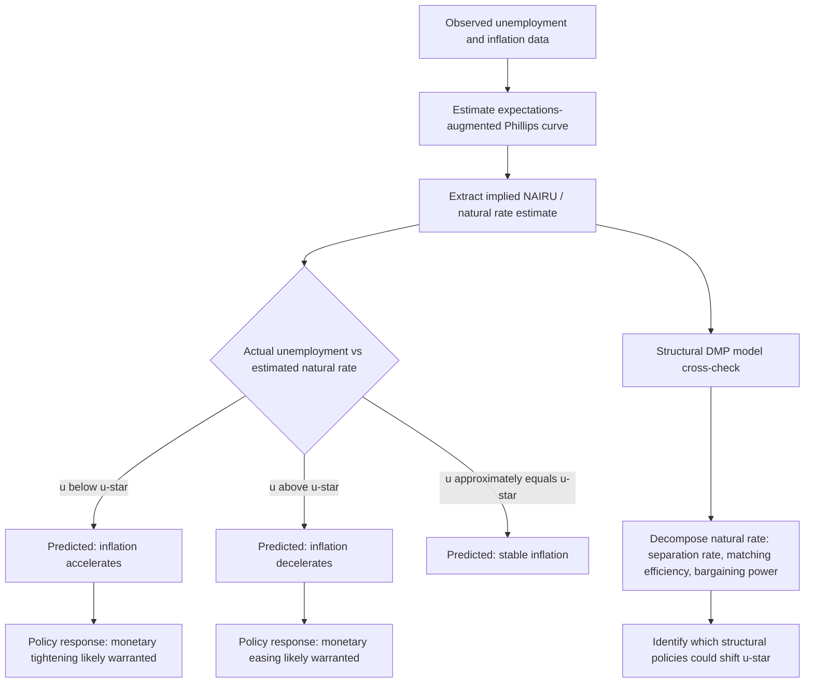

## The Natural Rate of Unemployment and NAIRU

### Origins: Friedman and Phelps

The natural rate of unemployment concept originates with Milton Friedman's 1968 American Economic Association presidential address and concurrent work by Edmund Phelps (1967, 1968), developed as a direct critique of the then-prevailing Keynesian interpretation of the Phillips curve as a stable, exploitable long-run trade-off between inflation and unemployment. Friedman and Phelps argued that any attempt to permanently hold unemployment below its "natural" level via expansionary monetary policy would only succeed temporarily, because workers and firms would eventually incorporate higher expected inflation into wage- and price-setting, shifting the short-run Phillips curve and returning unemployment to its natural rate but at a permanently higher inflation rate — the natural rate hypothesis.

Friedman defined the natural rate as the unemployment rate that would prevail once "Walrasian systems of general equilibrium equations" fully incorporate all real (non-monetary) structural features of the labor and product markets — in modern search-theoretic language, the rate consistent with frictional plus structural unemployment once monetary/nominal disturbances have fully worked through the economy, with actual inflation equal to expected inflation.

### NAIRU: The Empirically Operational Cousin

**Key Points**

- NAIRU (Non-Accelerating Inflation Rate of Unemployment) is closely related to but formally distinct from Friedman's natural rate concept: NAIRU is defined specifically as the unemployment rate at which inflation neither accelerates nor decelerates, making it a directly estimable empirical object tied to the shape of the Phillips curve relationship, whereas the natural rate is a more general theoretical construct grounded in underlying real/structural labor market equilibrium.
- In practice, the two terms are frequently used interchangeably in applied macroeconomic policy discussion, though some economists maintain the distinction carefully, particularly when discussing whether the concept should be understood as a supply-side structural equilibrium (natural rate) versus a purely reduced-form statistical property of the observed inflation-unemployment relationship (NAIRU).
- The expectations-augmented Phillips curve, the standard modern formalization, expresses inflation as:

$$\pi_t = \pi_t^e - \kappa(u_t - u^*) + \varepsilon_t$$

where $\pi_t$ is inflation, $\pi_t^e$ is expected inflation, $u_t$ is the actual unemployment rate, $u^*$ is the natural rate/NAIRU, $\kappa > 0$ is the slope parameter, and $\varepsilon_t$ is a supply shock term. When $u_t = u^*$ and expectations are correct, inflation is stable at its expected level; when $u_t < u^*$, inflation accelerates above expectations.

### SVG Illustration: The Expectations-Augmented Phillips Curve and Natural Rate (svg_diagram)

<svg xmlns="http://www.w3.org/2000/svg" viewBox="0 0 720 400">
<text x="360" y="26" text-anchor="middle" font-size="16" font-weight="bold" font-family="sans-serif">Short-Run Phillips Curves and the Natural Rate (svg_diagram)</text>
<line x1="90" y1="350" x2="650" y2="350" stroke="black" stroke-width="2" />
<line x1="90" y1="350" x2="90" y2="60" stroke="black" stroke-width="2" />
<text x="370" y="378" text-anchor="middle" font-size="13" font-family="sans-serif">Unemployment rate, u</text>
<text x="45" y="200" text-anchor="middle" font-size="13" font-family="sans-serif" transform="rotate(-90 45 200)">Inflation, π</text>
<line x1="370" y1="60" x2="370" y2="350" stroke="#8e44ad" stroke-width="2.5" stroke-dasharray="6,4" />
<text x="370" y="45" text-anchor="middle" font-size="13" font-weight="bold" fill="#8e44ad" font-family="sans-serif">u* (natural rate / NAIRU)</text>
<path d="M 150 130 Q 300 200 550 290" stroke="#2980b9" stroke-width="2.5" fill="none" />
<text x="180" y="120" font-size="11" fill="#2980b9" font-family="sans-serif">SRPC (low expected inflation)</text>
<path d="M 150 90 Q 300 160 550 250" stroke="#c0392b" stroke-width="2.5" fill="none" />
<text x="180" y="80" font-size="11" fill="#c0392b" font-family="sans-serif">SRPC (higher expected inflation)</text>
<circle cx="370" cy="215" r="5" fill="black" />
<circle cx="370" cy="175" r="5" fill="black" />
<line x1="370" y1="215" x2="370" y2="175" stroke="#666" stroke-width="1" stroke-dasharray="2,2" />
<text x="390" y="195" font-size="11" font-family="sans-serif">Shift up as π^e rises</text>

<text x="370" y="370" text-anchor="middle" font-size="12" font-family="sans-serif">Long-run Phillips curve: vertical at u*</text>

</svg>

### The Search-and-Matching Microfoundation of the Natural Rate

**Key Points**

- The DMP search-and-matching framework provides a modern structural microfoundation for the natural rate concept, absent from Friedman's and Phelps's original more informal treatment: the natural rate corresponds to the steady-state unemployment rate $u^* = s/(s+f(\theta^*))$ implied by the model's real (non-monetary) parameters — the separation rate $s$, the matching technology, and the equilibrium market tightness $\theta^*$ determined by firms' free-entry condition and Nash bargaining (or directed search) wage-setting.
- Because $\theta^*$ in the DMP framework depends only on real variables (productivity $z$, vacancy-posting cost $c$, worker bargaining power $\beta$, unemployment flow value $b$) and not on the price level or inflation rate, the model directly generates the classical dichotomy result underlying the natural rate hypothesis: monetary policy affects nominal variables but cannot permanently alter the real equilibrium unemployment rate.
- This microfoundation clarifies *which* policies can shift the natural rate itself (changes to $b$ via UI generosity, changes to matching efficiency $A$, changes to bargaining power $\beta$ via labor market institutions, changes to vacancy-posting costs $c$) versus which policies operate only on the cyclical gap between actual unemployment and the natural rate (aggregate demand management via monetary and fiscal policy) — directly connecting the theoretical taxonomy in the "Frictional, Structural, and Cyclical Unemployment" topic to a formal general-equilibrium model.

### Estimation Methods

**Key Points**

- **Statistical/reduced-form Phillips curve estimation**: The most common applied approach regresses inflation on unemployment (and lagged inflation, supply shock controls, and sometimes inflation expectations measures) and backs out the implied NAIRU as the unemployment rate at which the fitted relationship predicts stable inflation; time-varying NAIRU estimates are typically obtained via Kalman filtering or similar state-space methods allowing $u^*$ to evolve slowly over time (e.g., the approach underlying Federal Reserve Board and Congressional Budget Office natural rate estimates).
- **Structural model estimation**: Estimating a full DMP-style search-and-matching model via simulated method of moments or Bayesian likelihood-based methods, then computing the model-implied steady-state $u^*$ as a function of estimated structural parameters, providing a theoretically disciplined alternative (or complement) to purely statistical Phillips curve fitting.
- **Demographic and compositional adjustment methods**: Some natural rate estimates adjust for shifting demographic composition of the labor force (e.g., aging, changing female labor force participation patterns) on the theory that different demographic groups have systematically different average unemployment rates even at full employment, so compositional shifts alone can move the aggregate natural rate without any change in underlying labor market conditions for any given demographic group.
- Real-time NAIRU estimates are notoriously imprecise and subject to substantial retrospective revision — a well-documented empirical regularity that has generated significant caution among both academic researchers and central bank staff about relying too heavily on point estimates for real-time policy decisions. [Inference — the degree of estimation uncertainty, while widely acknowledged, is itself difficult to quantify precisely, and different estimation methods can produce meaningfully different point estimates for the same historical period]

### Historical Episodes and Policy Errors

**Key Points**

- The U.S. stagflation of the 1970s is frequently cited as a historical episode in which policymakers, operating with (in retrospect) mismeasured or overly optimistic natural rate estimates, pursued expansionary policy aimed at pushing unemployment below what turned out to be a higher true natural rate, contributing to persistent above-target inflation without a lasting unemployment benefit — a canonical illustration of the natural rate hypothesis's central policy warning.
- Estimates of the U.S. natural rate/NAIRU have varied substantially across different historical periods and different economists' contemporaneous assessments, with some retrospective analyses suggesting the "true" natural rate rose meaningfully during the 1970s (reflecting demographic shifts, including the entry of the baby-boom cohort and rising female labor force participation into demographic groups with historically higher average unemployment rates) and later declined again in subsequent decades. [Inference — the precise numerical natural rate trajectory across decades is subject to ongoing academic debate and depends heavily on the specific estimation methodology employed]
- The 1990s U.S. economic expansion, during which unemployment fell to levels many contemporaneous NAIRU estimates suggested should have triggered accelerating inflation but did not, is frequently cited as an episode that led to a broad reassessment (downward revision) of estimated NAIRU, illustrating both the practical importance and the genuine real-time uncertainty of natural rate estimation for policy purposes.

### Mermaid Diagram: Natural Rate Estimation and Policy Application Workflow

### Distinguishing Natural Rate Shifts from Cyclical Deviations

**Key Points**

- A central practical and theoretical challenge is distinguishing whether observed elevated unemployment reflects a temporary cyclical deviation above an unchanged natural rate (calling for demand-side stabilization policy) versus a genuine upward shift in the natural rate itself (calling for structural/supply-side policy responses, or simply requiring policymakers to accept a higher sustainable unemployment floor without over-stimulating the economy).
- The Beveridge curve, discussed elsewhere in this chapter, serves as one complementary diagnostic tool for this distinction: a stable Beveridge curve alongside movement toward a lower-vacancy, higher-unemployment point is more consistent with a cyclical demand shortfall, while an outward Beveridge curve shift is more consistent with (though not proof of) a rising natural rate driven by reduced matching efficiency.
- Because the natural rate is fundamentally unobservable and must be inferred indirectly, disagreements about its current level are a persistent and largely irreducible source of disagreement in real-time monetary policy debate, distinguishing natural rate estimation from more directly measurable macroeconomic quantities.

### Contemporary Relevance and Ongoing Debates

**Next Steps**

- Monitor evolving Federal Reserve, CBO, and academic natural rate/NAIRU estimates as new data on post-pandemic labor market structure accumulates, given the substantial disruption to labor force participation, remote work prevalence, and sectoral composition since 2020
- Examine the relationship between the natural rate concept and broader debates about labor market "flattening" of the Phillips curve — some research has found the empirical inflation-unemployment relationship has become notably weaker (flatter slope $\kappa$) in recent decades, which complicates natural rate estimation regardless of the specific point estimate obtained, since a flatter curve makes the NAIRU estimate less statistically precise for any given amount of inflation-unemployment covariation in the data [Inference — the causes and permanence of an apparently flatter Phillips curve remain actively debated in the macroeconomics literature]
- Consider international comparisons of natural rate estimation methodology and estimated levels, given substantial cross-country variation in labor market institutions (union density, employment protection legislation, UI generosity) that search-and-matching theory predicts should directly affect the structural natural rate

### Related Topics

- Frictional, Structural, and Cyclical Unemployment
- The Beveridge Curve
- The Diamond Mortensen Pissarides Model
- The Matching Function
- Monetary Policy and Labor Market Slack Assessment
- Phillips Curve Flattening and Its Implications for Inflation Forecasting
- Mismatch Unemployment and Sectoral Reallocation
- Labor Market Institutions and Cross-Country Natural Rate Comparisons