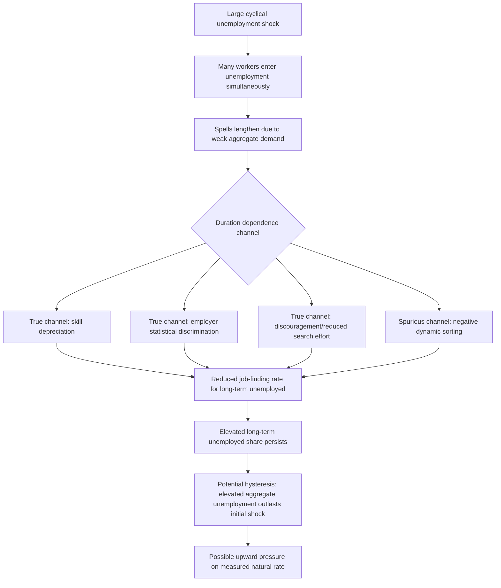

## Duration Dependence and Long Term Unemployment

### Definition and the Central Empirical Regularity

Duration dependence refers to the empirical pattern in which an individual's job-finding rate (hazard rate of exiting unemployment) changes systematically as a function of how long they have already been unemployed. The overwhelming empirical regularity documented across many countries and time periods is **negative duration dependence**: job-finding rates decline as unemployment spells lengthen, meaning a worker unemployed for six months typically has a lower probability of finding a job in the next week than an otherwise-identical worker unemployed for only one month.

Long-term unemployment (conventionally defined in U.S. official statistics as unemployment spells lasting 27 weeks or longer) is the direct empirical manifestation of negative duration dependence operating at the aggregate level — if job-finding rates did not decline with duration, the long-term unemployed share of total unemployment would be far more stable and predictable than what is actually observed, particularly its sharp cyclical amplification during and after recessions.

### Two Competing Explanations: True vs. Spurious Duration Dependence

This is the central identification challenge in the duration-dependence literature, first rigorously formalized by Heckman and Singer (1984) in the broader duration-analysis econometrics literature and specifically in unemployment research:

**Key Points**

- **True (structural) duration dependence**: The passage of time in unemployment itself *causally* reduces a given worker's job-finding probability — potential mechanisms include skill depreciation/atrophy during unemployment, loss of professional networks and up-to-date labor market information, employer statistical discrimination against long-term unemployed applicants (using unemployment duration itself as a negative signal of worker quality, independent of the worker's true underlying productivity), and psychological/discouragement effects reducing search effort or effectiveness over time.
- **Spurious duration dependence (dynamic sorting/heterogeneity)**: The aggregate decline in job-finding rates with duration reflects **unobserved heterogeneity** across workers rather than any true causal effect of duration itself — if workers differ in an unobserved "search ability" or "employability" characteristic, high-ability workers find jobs quickly and exit the unemployment pool early, leaving an increasingly negatively-selected (lower-ability) pool of remaining unemployed workers as duration lengthens, which mechanically produces a declining *aggregate* job-finding rate even if each *individual* worker's own hazard rate is constant over their own spell.
- Distinguishing these two explanations is econometrically difficult because both generate observationally identical aggregate duration-dependence patterns in standard cross-sectional or even simple panel duration data, requiring either strong distributional assumptions on the unobserved heterogeneity or genuinely exogenous variation in unemployment duration to identify the causal component cleanly.

### SVG Illustration: True vs. Spurious Duration Dependence (svg_diagram)

<svg xmlns="http://www.w3.org/2000/svg" viewBox="0 0 720 400">
<text x="360" y="26" text-anchor="middle" font-size="16" font-weight="bold" font-family="sans-serif">True vs. Spurious Duration Dependence (svg_diagram)</text>
<line x1="90" y1="350" x2="650" y2="350" stroke="black" stroke-width="2" />
<line x1="90" y1="350" x2="90" y2="60" stroke="black" stroke-width="2" />
<text x="370" y="378" text-anchor="middle" font-size="13" font-family="sans-serif">Unemployment duration</text>
<text x="45" y="200" text-anchor="middle" font-size="13" font-family="sans-serif" transform="rotate(-90 45 200)">Job-finding rate</text>

<text x="180" y="55" text-anchor="middle" font-size="12" fill="`#2980b9`" font-family="sans-serif">Individual worker hazard rates (constant, heterogeneous)</text>

<line x1="100" y1="100" x2="640" y2="100" stroke="`#2980b9`" stroke-width="1.5" />

<line x1="100" y1="160" x2="640" y2="160" stroke="`#2980b9`" stroke-width="1.5" />

<line x1="100" y1="230" x2="640" y2="230" stroke="`#2980b9`" stroke-width="1.5" />

<line x1="100" y1="290" x2="640" y2="290" stroke="`#2980b9`" stroke-width="1.5" />

<path d="M 100 145 Q 300 220 640 300" stroke="#c0392b" stroke-width="3" fill="none" />
<text x="450" y="290" text-anchor="middle" font-size="12" fill="#c0392b" font-weight="bold" font-family="sans-serif">Aggregate observed hazard rate</text>
<text x="450" y="305" text-anchor="middle" font-size="11" fill="#c0392b" font-family="sans-serif">(declines due to sorting, even if individual rates are flat)</text>
</svg>

### Empirical Findings

**Key Points**

- Studies using rich administrative panel data with individual fixed effects or dynamic mixture models (e.g., using UI claims records with sufficient repeat-spell information to separate individual heterogeneity from true duration effects) generally find evidence for *both* channels operating simultaneously — true duration dependence exists but is typically smaller in magnitude than the raw aggregate hazard decline would suggest once unobserved heterogeneity is netted out. [Inference — the precise split between true and spurious duration dependence varies across studies, datasets, and time periods, and no single "consensus percentage" split is broadly agreed upon across the literature]
- Kroft, Lange, and Notowidigdo (2013) conducted an influential field experiment sending fictitious resumes with varying stated unemployment durations to real job postings, finding a clear negative causal effect of longer unemployment duration on callback rates — direct evidence for a true, employer-side statistical discrimination channel operating independent of any change in the (identical, fictitious) worker's actual underlying skills, since the resumes were held constant except for the stated duration.
- Eriksson and Rooth (2014) conducted a similar resume-audit experiment in Sweden, likewise finding evidence of employer-side duration discrimination, with the effect appearing to strengthen (callback rates falling further) beyond roughly six to nine months of stated unemployment duration in their setting — suggesting a possible discrete threshold effect in employer perceptions rather than a smoothly continuous duration penalty. [Inference — the exact duration threshold at which discrimination effects intensify is study-specific and should not be treated as a universal constant]

### The Cyclical Amplification of Long-Term Unemployment

**Key Points**

- Long-term unemployment as a share of total unemployment rises sharply and with a lag during and after recessions — a well-documented empirical pattern across many U.S. business cycles, with the phenomenon particularly pronounced following the 2008-09 recession, when the long-term unemployed share reached levels notably higher than in prior post-war U.S. recessions.
- This cyclical amplification interacts directly with duration dependence to create a potential **hysteresis** mechanism: a large cyclical shock pushes many workers into unemployment simultaneously; as their spells lengthen due to weak aggregate demand, negative duration dependence (whether true or compositional) further reduces their job-finding rates, which can prolong the *aggregate* unemployment elevation even after the initial demand shock has fully dissipated — a channel through which temporary cyclical shocks can leave a persistent imprint on the natural rate of unemployment or at least on measured unemployment duration composition.
- Krueger, Cramer, and Cho (2014) provide influential empirical analysis specifically examining the post-2008 U.S. long-term unemployed population, finding that long-term unemployed workers exhibited systematically lower job-finding rates than short-term unemployed workers even controlling for observable characteristics, and that this gap appeared to widen (not narrow) as their analyzed sample's spells lengthened further — evidence broadly consistent with a meaningful true-duration-dependence component operating in that specific episode, alongside standard heterogeneity/sorting effects.

### Mermaid Diagram: Duration Dependence Mechanisms and Hysteresis

### Policy Responses Targeting Long-Term Unemployment

**Next Steps**

- **Targeted reemployment services and case management**: Intensive counseling and job search assistance specifically for workers approaching or exceeding the long-term unemployment threshold, motivated by the theory that additional matching assistance can partially offset true duration-dependence channels
- **Wage subsidies for hiring the long-term unemployed**: Policy proposals and pilot programs subsidizing employers who hire long-term unemployed workers, directly targeting the employer-side statistical discrimination channel documented in resume-audit experiments
- **"Ban the duration" / anti-discrimination measures**: Some jurisdictions have considered or implemented restrictions on employers explicitly screening out applicants based on unemployment duration in job postings, analogous to broader anti-discrimination employment law, directly targeting the discrimination-based true-duration-dependence channel
- **Skills retraining targeted at long-duration spells**: Programs aimed at refreshing or updating skills specifically for workers whose unemployment has extended long enough that skill depreciation is a plausible concern, distinct from general job search assistance aimed at frictional unemployment
- **UI benefit design and extended benefits during recessions**: A genuinely contested policy tradeoff, since UI benefits provide important consumption-smoothing insurance value during long spells but, per the standard McCall reservation-wage framework, more generous or longer-duration benefits can also raise the reservation wage and lower the job-finding rate — the empirical magnitude of this moral-hazard channel relative to the insurance-value benefit is a long-standing subject of empirical labor economics research with a range of estimated effect sizes depending on the specific policy episode studied

### Long-Term Unemployment and Labor Force Exit

**Key Points**

- A meaningful share of long-term unemployed workers eventually exit the labor force entirely (transitioning to non-participation rather than either finding employment or remaining classified as unemployed and actively searching), which complicates simple unemployment-rate-based analysis of long-term unemployment's full economic cost, since official unemployment statistics by construction exclude workers who have stopped actively searching.
- This labor-force-exit margin is one reason some researchers prefer broader non-employment or labor force participation rate measures (rather than the unemployment rate alone) when assessing the full scarring cost of prolonged joblessness, particularly for demographic groups or regions with historically weaker labor force attachment.
- The distinction between genuine discouraged-worker labor force exit and other reasons for non-participation (disability, retirement, caregiving, education) is itself an active measurement and interpretation challenge in the broader non-employment literature, relevant context for fully understanding the long-run consequences of extended unemployment spells beyond the simple unemployment-duration statistic itself. [Inference — precisely apportioning labor force exits among these competing explanations for any specific individual or cohort is generally not feasible with standard survey data alone]

### Related Topics

- The McCall Search Model and the Reservation Wage
- Frictional, Structural, and Cyclical Unemployment
- The Beveridge Curve
- The Natural Rate of Unemployment and NAIRU
- Unemployment Scarring and Business Cycle Effects on Wage Growth
- Statistical Discrimination in Hiring
- Unemployment Insurance Design and Moral Hazard
- Labor Force Participation and Non-Employment Measurement