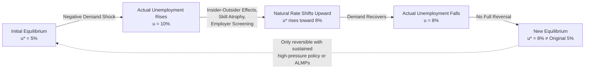

## Hysteresis in Unemployment

### Definition and Core Concept

Hysteresis in unemployment refers to the phenomenon where temporary or cyclical increases in unemployment become persistent, causing the natural rate of unemployment (or NAIRU — Non-Accelerating Inflation Rate of Unemployment) itself to rise following a shock, rather than unemployment simply returning to its pre-shock equilibrium once the shock dissipates.

The term is borrowed from physics, where hysteresis describes systems whose current state depends on their history of past states, not merely on current conditions. Applied to labor markets, this means the equilibrium unemployment rate is not a fixed, structurally determined constant but is instead path-dependent: a recession can permanently (or very persistently) shift the "natural" rate upward.

This stands in direct contrast to the standard natural-rate hypothesis (associated with Friedman and Phelps), which posits that unemployment always reverts to a unique equilibrium determined by structural factors (labor market institutions, technology, demographics) regardless of the history of demand shocks.

### Theoretical Origins

**Key Points**

- The concept was popularized in the labor economics literature by Olivier Blanchard and Lawrence Summers (1986) in their analysis of persistently high European unemployment in the 1980s.
- Their central puzzle: why did unemployment in countries like France, UK, and Germany remain elevated for years after the disinflationary shocks of the late 1970s/early 1980s, even after monetary and fiscal conditions normalized?
- Standard natural-rate models predicted unemployment should have returned to pre-shock levels; the data showed otherwise — a phenomenon dubbed "Eurosclerosis" in policy discussions.
- Blanchard and Summers proposed that the equilibrium rate itself had shifted due to mechanisms operating within the labor market during the downturn.

### Transmission Mechanisms

Several theoretical channels explain how temporary unemployment becomes structurally embedded:

#### 1. Insider-Outsider Models

- Wage bargaining is dominated by "insiders" — currently employed workers who negotiate wages via unions or implicit bargaining power.
- Insiders set wages to protect their own employment and rents, with limited regard for the welfare of "outsiders" (the unemployed).
- When a recession throws workers into unemployment, they lose insider status. Once outside the firm, they have diminished influence over subsequent wage-setting.
- Remaining insiders continue to bargain for wages consistent with their own employment security, even at levels that don't clear the labor market for outsiders.
- Result: the unemployed remain excluded from wage negotiations, and the equilibrium wage remains too high to reabsorb them, even after the initial shock passes.

#### 2. Human Capital Depreciation (Skill Atrophy)

- Extended joblessness erodes job-specific and general human capital.
- Skills degrade with disuse; technological and organizational practices in an industry continue evolving while the unemployed worker's knowledge becomes outdated.
- This reduces the long-term unemployed worker's productivity and employability, lowering their attractiveness to firms relative to more recently employed candidates.
- Over time, this can also erode "soft skills" — workplace habits, routines, and networks — compounding the effect.

#### 3. Employer Statistical Discrimination / Duration Dependence

- Employers may use unemployment duration as a screening signal, inferring (rightly or wrongly) that long-term unemployed applicants are lower quality.
- This creates a self-fulfilling dynamic: the longer someone is unemployed, the lower their callback and hiring rates, independent of their actual underlying productivity.
- Empirical audit studies (e.g., Kroft, Lange, and Notowidigdo, 2013) have documented sharply declining callback rates as a function of unemployment spell length, even holding resume quality constant.

#### 4. Loss of Labor Force Attachment / Discouragement

- Long unemployment spells can lead to discouraged-worker effects, where individuals exit the labor force entirely rather than continuing to search.
- If these workers eventually return, they may re-enter with weaker attachment, lower reservation productivity, or take longer to find matches — effectively behaving like structurally unemployed or underemployed workers.

#### 5. Capital Stock and Investment Effects

- During downturns, firms reduce investment in physical capital.
- A smaller capital stock lowers the economy's capacity to employ labor at the previous equilibrium wage, since labor's marginal product depends on the capital available per worker.
- Even after demand recovers, the depleted capital stock can persist as a supply-side constraint on employment.

#### 6. Search and Matching Frictions (Reduced Matching Efficiency)

- In search-and-matching frameworks (Diamond-Mortensen-Pissarides), hysteresis can emerge if the efficiency of matching between vacancies and job-seekers degrades during and after a downturn.
- This is often depicted as an outward shift in the **Beveridge Curve** (the relationship between vacancy rates and unemployment rates), where more vacancies coexist with more unemployment than before — signaling mismatch rather than pure demand deficiency.

### Formal Representation

A simplified way to express hysteresis is by modifying the standard adaptive expectations Phillips Curve so that the natural rate is itself a function of past actual unemployment, rather than an exogenous constant:

$$\pi_t = \pi_t^e - \alpha (u_t - u_t^*)$$

Under the standard (non-hysteresis) model:

$$u_t^* = \bar{u} \quad \text{(fixed structural constant)}$$

Under a hysteresis specification, the natural rate becomes path-dependent on lagged actual unemployment:

$$u_t^* = \lambda u_{t-1} + (1-\lambda) \bar{u}$$

Here, $\lambda \in [0,1]$ is the hysteresis coefficient:

- If $\lambda = 0$: no hysteresis — the model collapses to the standard natural-rate hypothesis, where $u_t^*$ always reverts to $\bar{u}$.
- If $\lambda = 1$: full/pure hysteresis — the natural rate simply *equals* whatever unemployment happened to be last period, with no gravitational pull back toward a structural anchor. In this polar case, shocks have permanent effects and there is no unique long-run equilibrium.
- Intermediate values of $\lambda$ represent partial hysteresis, where shocks have persistent but eventually fading effects on the equilibrium rate.

This is sometimes referred to as the "unit root" hypothesis of unemployment, since with $\lambda = 1$, the unemployment rate behaves like a random walk (non-stationary) rather than reverting to a fixed mean.

### Hysteresis vs. Persistence: An Important Distinction

**Key Points**

- **Persistence** simply means unemployment takes a long time to return to its natural rate after a shock — but it *does* eventually return. This is consistent with standard models featuring nominal/real rigidities and slow adjustment.
- **Hysteresis** means the natural rate itself has shifted — there is no "return" to the old equilibrium because the equilibrium has changed.
- Distinguishing these empirically is difficult because both produce similar short-to-medium-run time series behavior; economists often use unit-root tests on unemployment series, or examine structural indicators (long-term unemployment share, Beveridge Curve shifts, wage-Phillips-curve flattening) to infer which mechanism dominates.

### Empirical Evidence

- **European unemployment, 1980s-1990s**: The original Blanchard-Summers case; unemployment in many EU economies remained near double digits for over a decade following the disinflation shocks, notably in France, Italy, and Spain, aligning with insider-outsider dynamics in heavily unionized, employment-protected labor markets.
- **US Great Recession (2008-2009)**: The sharp rise in long-term unemployment (>26 weeks) reached historic highs, sparking renewed debate over whether US NAIRU had risen. Some economists (e.g., Krugman) argued for hysteresis-based explanations, warning that prolonged demand deficiency would permanently damage labor supply; the eventual recovery of unemployment to pre-crisis lows by the late 2010s is often cited as evidence *against* strong hysteresis in the US case, or alternatively as evidence that sufficiently sustained demand-side stimulus (a "high-pressure economy") can reverse hysteretic damage.
- **COVID-19 pandemic (2020-2022)**: Renewed hysteresis concerns emerged around sectoral reallocation (e.g., displaced retail/hospitality workers), but the unusually rapid V-shaped labor market recovery in the US suggested limited hysteresis relative to prior recessions — partly attributed to aggressive fiscal support keeping worker-employer attachment intact (e.g., furlough and job-retention schemes in Europe).
- [Inference] The degree of hysteresis observed empirically appears sensitive to policy response speed and labor market institutions, though isolating causal hysteresis effects from concurrent structural changes remains methodologically contested in the literature.

### Policy Implications

**Key Points**

- **Case for aggressive countercyclical policy**: If hysteresis is significant, policymakers should act forcefully and early during downturns — the *cost* of allowing unemployment to remain elevated is not just the current output gap but a permanently higher equilibrium unemployment rate (a much larger, compounding welfare loss).
- **"High-pressure economy" argument**: Some economists (notably Janet Yellen in a 2016 speech) have argued that running the economy "hot" — allowing unemployment to fall below conventional NAIRU estimates for a sustained period — can reverse prior hysteresis by re-attaching discouraged workers and long-term unemployed to the labor force.
- **Active Labor Market Policies (ALMPs)**: Because a key hysteresis channel is skill atrophy and employer screening against the long-term unemployed, policies such as retraining programs, wage subsidies for hiring the long-term unemployed, job-search assistance, and public employment programs are specifically designed to interrupt the hysteresis mechanism.
- **Central bank credibility trade-off**: If hysteresis exists, central banks tolerating short-run inflation overshoots to keep unemployment low may be justified on long-run welfare grounds — this complicates simple inflation-targeting frameworks and has influenced the shift toward "flexible average inflation targeting" (e.g., the Fed's 2020 framework revision).
- **Unemployment insurance design**: There's a tension — generous UI can extend unemployment duration (moral hazard), but overly stingy UI may force premature acceptance of poor job matches or push discouraged workers out of the labor force, both of which could also generate quasi-hysteretic effects.

### Diagrammatic Illustration: Hysteresis Loop

### Beveridge Curve Shift (Visualizing Matching Efficiency Decline)

<svg xmlns="http://www.w3.org/2000/svg" viewBox="0 0 600 420">
<text x="300" y="25" text-anchor="middle" font-size="16" font-weight="bold" fill="#1a1a1a">Beveridge Curve Outward Shift (svg_diagram)</text>

<line x1="80" y1="370" x2="550" y2="370" stroke="#333" stroke-width="2" />
<line x1="80" y1="370" x2="80" y2="50" stroke="#333" stroke-width="2" />

<text x="315" y="400" text-anchor="middle" font-size="13" fill="#333">Unemployment Rate (u)</text>

<text x="30" y="210" text-anchor="middle" font-size="13" fill="#333" transform="rotate(-90 30 210)">Vacancy Rate (v)</text>

<path d="M 110 340 Q 220 150 480 90" stroke="#2563eb" stroke-width="2.5" fill="none" />
<text x="480" y="80" font-size="12" fill="#2563eb" font-weight="bold">Pre-Shock Curve</text>

<path d="M 180 355 Q 300 200 530 140" stroke="#dc2626" stroke-width="2.5" fill="none" stroke-dasharray="6,3" />
<text x="440" y="130" font-size="12" fill="#dc2626" font-weight="bold">Post-Shock Curve (Hysteresis)</text>

<circle cx="230" cy="205" r="5" fill="#2563eb" />
<text x="240" y="200" font-size="12" fill="#2563eb">A (u=5%, v=4%)</text>

<circle cx="330" cy="205" r="5" fill="#dc2626" />
<text x="340" y="225" font-size="12" fill="#dc2626">B (u=8%, v=4%)</text>

<line x1="235" y1="205" x2="322" y2="205" stroke="#555" stroke-width="1.5" marker-end="url(#arrow)" />
<text x="300" y="45" text-anchor="middle" font-size="11" fill="#666" font-style="italic">Outward shift = reduced matching efficiency at same vacancy rate</text>

</svg>

### Worked Example

**Example**

Consider an economy with $\bar{u} = 5\%$ (structural anchor) and a hysteresis coefficient $\lambda = 0.6$.

A recession pushes actual unemployment to $u_{t-1} = 10\%$.

Applying the hysteresis equation:

$$u_t^* = 0.6(10) + 0.4(5) = 6 + 2 = 8\%$$

Even though the economy eventually stabilizes, the "new normal" natural rate is 8%, not the original 5% — a permanent 3-percentage-point increase in structural unemployment attributable to the hysteresis channel, unless offset by active policy intervention (retraining, high-pressure demand policy, etc.) that effectively reduces $\lambda$ or pulls $u_{t-1}$ back down through sustained low unemployment before the effect fully embeds.

### Critiques and Limitations

- **Identification problem**: It's empirically difficult to distinguish "the natural rate genuinely rose" from "our estimate of the natural rate was simply wrong to begin with," since NAIRU is unobservable and estimated indirectly (often via reduced-form Phillips Curve regressions).
- **Overstated persistence**: Critics note that some apparent hysteresis episodes (e.g., US post-2008) eventually fully reversed once demand recovered sufficiently, suggesting long adjustment lags (persistence) rather than true structural hysteresis.
- [Unverified] The precise magnitude of $\lambda$ is highly country- and period-specific, and structural estimates in the literature vary substantially depending on model specification, detrending method, and sample period.
- Alternative explanations for persistent unemployment (e.g., permanent shifts in labor demand from automation, demographic aging, or genuine structural mismatch) can mimic hysteresis empirically without the same insider-outsider or skill-atrophy microfoundations.

### Related Topics

- Natural Rate of Unemployment (NAIRU) and its estimation methods
- Insider-Outsider Theory of Wage Determination
- Search and Matching Models (Diamond-Mortensen-Pissarides framework)
- The Beveridge Curve and labor market matching efficiency
- Long-Term Unemployment and Duration Dependence
- Phillips Curve: Expectations-Augmented and New Keynesian variants
- Active Labor Market Policies (ALMPs)
- Okun's Law and the output-unemployment relationship
- "High-Pressure Economy" hypothesis and monetary policy frameworks
- Structural vs. Cyclical Unemployment
- Efficiency Wage Theory