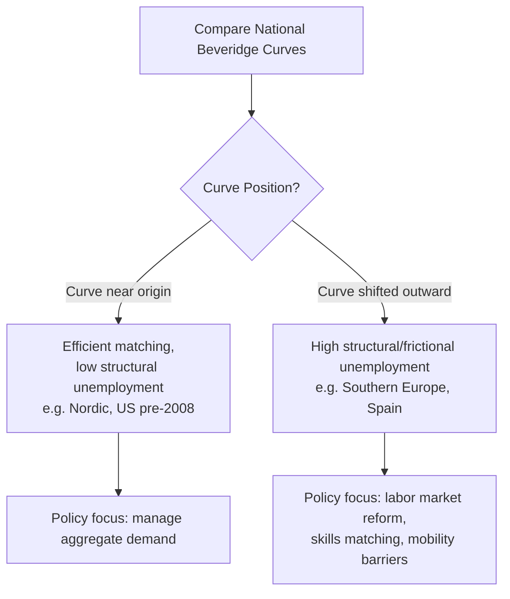

## Cross Country Unemployment Comparisons

### Overview and Analytical Purpose

Cross-country unemployment comparisons study why measured unemployment rates differ substantially across nations despite exposure to broadly similar global macroeconomic shocks (oil crises, financial crises, pandemics). The central puzzle in this literature — most famously articulated in the "Eurosclerosis" debates of the 1980s-1990s — is why some advanced economies (notably continental Europe) experienced persistently high unemployment while others (the US, and later the UK post-Thatcher reforms) maintained comparatively lower rates, even when growth performance was similar.

This area sits at the intersection of labor economics, comparative political economy, and macroeconomics, drawing on institutional, structural, and cyclical explanations.

### Measurement Comparability Issues

**Key Points**

- Cross-country comparisons are only meaningful if unemployment is measured consistently. Raw national statistics often are not directly comparable due to differing definitions.
- The **ILO (International Labour Organization) standard definition** is the primary harmonization tool: a person is "unemployed" if they are (1) without work, (2) currently available for work, and (3) actively seeking work within a reference period (typically the past 4 weeks).
- The **OECD** and **Eurostat** publish harmonized unemployment rates using ILO-consistent definitions specifically to enable comparison, since national administrative definitions (e.g., registered unemployment through benefit claims) vary widely in who is counted.

#### Sources of Non-Comparability

1. **Survey vs. administrative data**: Some countries (e.g., US via the Current Population Survey, CPS) use household labor force surveys; others historically relied more on unemployment insurance claimant counts (e.g., UK's "claimant count" measure), which undercounts unemployed individuals ineligible for or not claiming benefits.
2. **Treatment of discouraged workers**: Countries differ in how liberally they classify marginally attached workers as "out of the labor force" versus "unemployed."
3. **Treatment of short-time work / furlough schemes**: Countries with extensive short-time work programs (Kurzarbeit in Germany) can show artificially low unemployment during downturns because workers with reduced hours remain formally employed rather than being laid off — this dramatically affected cross-country comparisons during 2008-2009 and 2020.
4. **Youth and student classification**: Differences in how full-time students who are also job-seeking are counted.
5. **Informal sector prevalence**: In developing economies, a large informal sector makes headline unemployment rates less meaningful, since informally employed individuals (often underemployed) are not counted as unemployed at all — this is why unemployment rate comparisons between advanced and developing economies are particularly fraught.

### The Classic Puzzle: US vs. Europe (1970s-1990s)

**Key Points**

- Pre-1970s, European unemployment rates were generally *lower* than the US rate.
- After the oil shocks of 1973 and 1979, European unemployment rose sharply and remained persistently high (often 8-12%) through the 1980s-1990s, while US unemployment, though volatile, tended to revert toward 5-6%.
- This divergence motivated much of the theoretical work on hysteresis (see Blanchard-Summers) and on labor market institutions as structural determinants of the natural rate.

#### Leading Explanations

**1. Labor Market Institutions ("Institutional" View)**

- **Employment Protection Legislation (EPL)**: Stricter firing restrictions in countries like France, Spain, and Italy raise the cost of layoffs, which can reduce cyclical job destruction but also reduce hiring, particularly of the young and long-term unemployed, potentially raising structural unemployment and lengthening unemployment duration.
- **Union density and coverage / collective bargaining coordination**: High union bargaining power without coordination (e.g., sector-level bargaining without economy-wide coordination) is associated with higher unemployment; highly centralized/coordinated systems (e.g., historically in the Nordic countries and Austria) can offset this through wage restraint.
- **Unemployment benefit generosity and duration**: Higher replacement rates and longer benefit duration are associated with longer unemployment spells (reduced search intensity, higher reservation wages), a relationship robustly found in numerous OECD panel studies (e.g., Layard, Nickell, and Jackman's influential work).
- **Tax wedge (labor taxation)**: Higher payroll taxes and social security contributions raise the cost of labor to employers and reduce the net wage to workers, potentially reducing equilibrium employment.
- **Active Labor Market Policies (ALMPs)**: Countries investing heavily in job training, placement services, and job-search monitoring (Nordic model) tend to have both generous benefits and lower long-term unemployment, suggesting institutional design details matter more than benefit generosity alone.

**2. The "Bad Luck vs. Bad Institutions" Debate (Blanchard and Wolfers, 2000)**

- Blanchard and Wolfers proposed that European unemployment persistence resulted from the *interaction* between adverse shocks ("bad luck" — oil shocks, disinflation, and later the productivity slowdown) and rigid labor market institutions ("bad institutions") that prevented smooth adjustment.
- Their key finding: institutions alone don't explain unemployment levels in any given period, and shocks alone don't explain persistence — but institutions determine how *persistently* a given shock affects unemployment.
- This reframed the debate away from a simple "European institutions are bad" narrative toward an interaction-effects model.

**3. Total Factor Productivity Slowdown and Real Wage Rigidity**

- Some European countries experienced real wage rigidity — wages failed to adjust downward following productivity slowdowns, which, combined with capital-labor substitution, priced workers out of employment (capital-labor substitution mechanisms discussed in Blanchard's work on the "wage gap").

### Nordic Model vs. Anglo-Saxon Model vs. Continental European Model

A common typology used in comparative labor economics:

| Dimension | Anglo-Saxon (US, UK) | Continental European (France, Germany pre-2000s, Italy) | Nordic (Sweden, Denmark) |
| --- | --- | --- | --- |
| Employment protection | Low | High | Moderate |
| Unemployment benefits | Lower generosity, shorter duration | Higher generosity, longer duration | High generosity, but conditional |
| Active labor market policy spending | Low | Moderate | Very high |
| Union coordination | Low/decentralized | Fragmented/sector-level | Highly coordinated |
| Typical unemployment pattern (historical) | Lower average, more volatile | Higher average, persistent | Low, with strong recovery capacity |

This is sometimes called **"flexicurity"** in the Danish case specifically — combining low employment protection (flexibility) with generous benefits and strong ALMPs (security), theorized to achieve both dynamism and social protection.

### Germany's Post-2003 Reforms (Hartz Reforms) — A Natural Experiment

**Example**

Germany provides one of the most cited natural experiments in this literature:

- Prior to 2003, Germany exhibited persistently high unemployment (~10-11%) alongside its European peers.
- The **Hartz Reforms (2003-2005)** reduced unemployment benefit duration and generosity, tightened job-search requirements, deregulated temporary work agencies, and created "mini-jobs" (low-hour, tax-favored employment).
- German unemployment subsequently fell steadily, reaching under 5% by the mid-2010s, even through the 2008-2009 global financial crisis, where Germany's extensive use of Kurzarbeit (short-time work subsidies) helped preserve employment relationships.
- This is widely cited as evidence for the institutional/structural view — though critics note the reforms coincided with other favorable developments (wage moderation via decentralized firm-level bargaining, a competitive export sector, and eurozone-wide demand effects), making clean causal attribution to any single policy difficult. [Inference] The relative contribution of the Hartz Reforms versus other concurrent factors remains debated in the empirical literature.

### East Asian and Developing Economy Comparisons

**Key Points**

- Japan historically maintained very low unemployment rates (often 2-3%) even during prolonged stagnation ("Lost Decades"), attributed to lifetime employment norms, labor hoarding by firms, and a large "hidden unemployment" component of underemployed workers retained on payrolls.
- Many developing economies report low official unemployment rates not because labor markets are healthy, but because the absence of formal unemployment insurance forces workers into informal, low-productivity self-employment rather than open unemployment — this is the "underemployment vs. unemployment" distinction central to development economics (see Lewis dual-sector model).
- China's unemployment statistics (urban surveyed unemployment rate) have historically been criticized for excluding large segments of the migrant labor force and informally employed rural-to-urban migrants, limiting comparability with OECD figures.

### The Beveridge Curve as a Comparative Tool

The relationship between vacancy rates and unemployment rates is used comparatively to distinguish demand-deficient unemployment from matching/structural unemployment across countries:

### Key Empirical Determinants (Summary Table)

| Factor | Effect on Equilibrium Unemployment | Illustrative Countries |
| --- | --- | --- |
| Strict employment protection | Increases duration, may reduce inflow, ambiguous net level effect | France, Italy, Spain |
| Generous, long-duration UI without ALMP | Increases | Historically Belgium, pre-reform Germany |
| Coordinated/centralized wage bargaining | Decreases (via wage restraint) | Austria, Nordic countries |
| High tax wedge | Increases | France, Belgium |
| Strong ALMPs + moderate benefits | Decreases duration effects | Denmark, Sweden |
| Extensive short-time work schemes | Reduces measured unemployment in downturns | Germany, Austria |
| Large informal sector | Understates true labor market slack | Many developing economies |
| Housing market rigidity / low geographic mobility | Increases regional mismatch | Spain, Italy (regional divides) |

### Methodological Approaches in the Literature

- **Cross-country panel regressions**: Regressing national unemployment rates on institutional indices (OECD EPL index, benefit replacement rates, union density) across time and countries — the Nickell/Layard/Blanchard-Wolfers tradition.
- **Difference-in-differences around reform episodes**: Using policy reforms (like Germany's Hartz reforms, or UK's 1980s deregulation) as quasi-natural experiments.
- **Structural VAR and shock decomposition**: Distinguishing supply shocks, demand shocks, and their interaction with institutions.
- **OECD Jobs Study framework (1994)**: An influential policy-oriented comparative framework arguing for labor market flexibility as the primary remedy for structural unemployment — later nuanced by evidence that flexibility alone without complementary ALMP and social insurance produced worse outcomes on inequality and job quality.

### Contemporary Considerations

- Post-2010s convergence: Some of the historical US-Europe gap has narrowed — US unemployment became more persistent after the 2008 crisis (raising hysteresis concerns in the US context), while several European countries (Germany, UK) achieved historically low unemployment through the 2010s.
- COVID-19 divergence: Job-retention schemes (widely used in Europe) versus a "hire-fire" approach (more typical in the US, though the US also deployed unprecedented UI expansions) produced very different unemployment *rate* trajectories during 2020 despite broadly similar declines in *hours worked* and output — illustrating how measurement design and policy choice jointly shape observed cross-country comparisons.
- [Unverified] Whether recent AI-driven and automation-driven labor demand shifts will reproduce historical patterns of institutional divergence (i.e., whether flexible vs. protected labor markets will again diverge in unemployment response) is an open empirical question not yet settled in the literature.

### Related Topics

- Hysteresis in Unemployment
- Natural Rate of Unemployment (NAIRU) and Structural Determinants
- Employment Protection Legislation (EPL) and the OECD EPL Index
- Active Labor Market Policies (ALMPs)
- The Flexicurity Model (Denmark)
- Wage Bargaining Coordination and Corporatism
- The Beveridge Curve
- Informal Labor Markets and the Lewis Dual-Sector Model
- Short-Time Work Schemes (Kurzarbeit) and Labor Hoarding
- Unemployment Insurance Design and Replacement Rates
- OECD Jobs Study (1994) and Subsequent Policy Reassessments