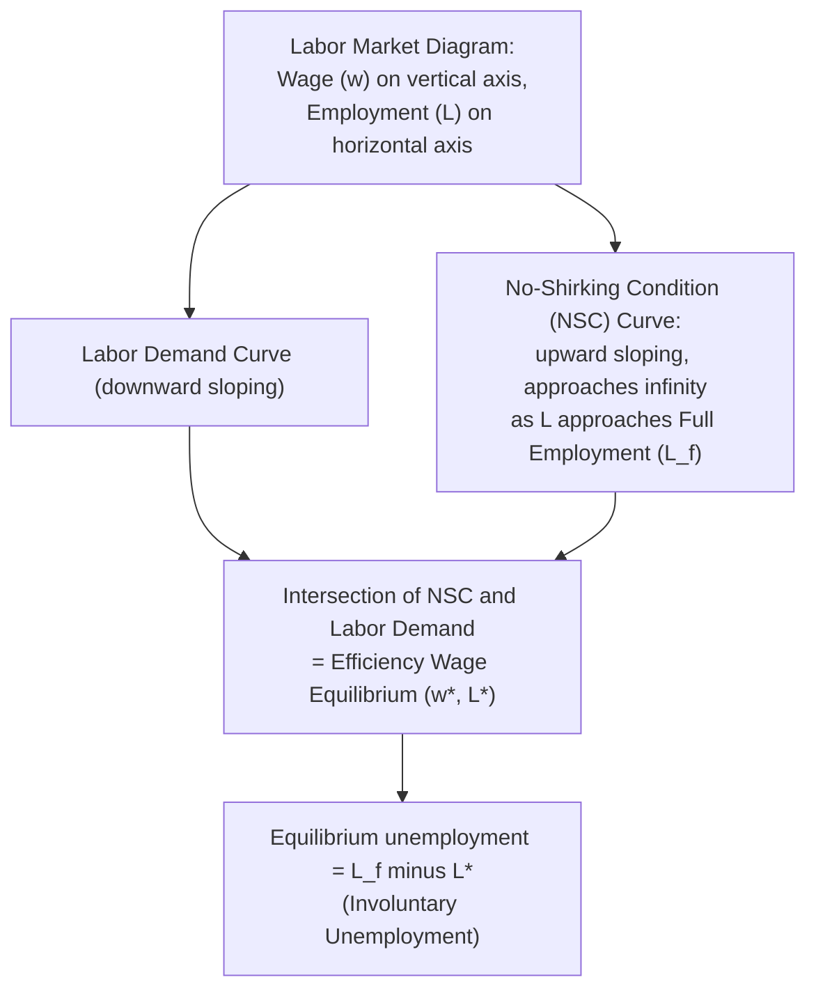

## Shirking Models of Efficiency Wages

### Definition and Core Concept

Shirking models of efficiency wages explain why profit-maximizing firms may voluntarily pay wages above the market-clearing level, resulting in involuntary equilibrium unemployment. The central insight is that when worker effort cannot be perfectly monitored, firms use wages above the going market rate as a disciplining device: workers who might otherwise shirk (exert less than contracted effort) are deterred by the risk of losing a job that pays more than they could earn elsewhere.

The canonical formalization is the **Shapiro-Stiglitz model** (1984), which shows that in equilibrium, unemployment itself functions as a "worker discipline device," and this equilibrium unemployment is involuntary — unemployed workers would gladly work at the prevailing wage, but firms have no incentive to lower wages to clear the market because doing so would increase shirking and reduce profits.

### The Underlying Problem: Imperfect Monitoring

**Key Points**

- Standard competitive labor market theory assumes wages equal the marginal product of labor and markets clear, implying zero involuntary unemployment in equilibrium.
- Efficiency wage theory relaxes the assumption that effort is costlessly observable and contractible.
- If firms could perfectly monitor and costlessly enforce effort, they could simply pay the market wage and fire (without cost) any shirking worker instantly — no efficiency wage premium would be needed.
- Because monitoring is costly and imperfect, firms face a **moral hazard problem**: workers have private information about their own effort level, and firms can only observe effort with some probability per period.

### The Shapiro-Stiglitz Model — Formal Structure

#### Setup

- Workers choose effort level $e \in \{0, \bar{e}\}$ (shirk or work).
- Shirking is detected with probability $q$ per period (imperfect monitoring).
- If caught shirking, the worker is fired.
- If a worker is fired, they enter the unemployment pool and face a probability $b$ (exogenous job-finding/re-employment rate related to the aggregate labor market tightness) of finding a new job each period.
- Workers discount the future at rate $r$.

#### The No-Shirking Condition (NSC)

The firm must set the wage high enough that the expected lifetime utility of working (and not shirking) exceeds the expected lifetime utility of shirking, accounting for the risk of detection and the cost of unemployment if caught.

This yields the **No-Shirking Condition**, which can be expressed as:

$$w^* = w_a + e\left(\frac{r+b+q}{q}\right)$$

Where:

- $w^*$ = the efficiency wage the firm must pay to deter shirking
- $w_a$ = the alternative (reservation) income available if unemployed (e.g., unemployment benefits)
- $e$ = the disutility/cost of exerting effort
- $r$ = discount rate
- $b$ = job-finding rate (inversely related to the unemployment rate — a tighter labor market means a higher $b$)
- $q$ = probability of detecting shirking

**Key implications from the NSC formula:**

- As $b$ (job-finding rate) rises — meaning the labor market is tighter and unemployment is lower — the required efficiency wage $w^*$ must rise, because the threat of job loss becomes less costly to workers when re-employment is easy.
- As $q$ (monitoring probability) rises, the required wage premium falls, since shirking is more likely to be caught and punished regardless of the wage level.
- If $b \to \infty$ (instant re-employment, i.e., full employment), the no-shirking condition becomes impossible to satisfy at any finite wage — this is the crucial result explaining why full employment cannot be a stable equilibrium in this model.

### Why Full Employment Cannot Be an Equilibrium

**Key Points**

- If the economy were at full employment, being fired would carry no cost — a shirking worker fired today would find a new job immediately.
- With no threat of unemployment, the no-shirking condition cannot be satisfied at any finite wage, so all workers would rationally shirk.
- Anticipating this, firms raise wages above market-clearing levels to create a credible threat: losing this job means a *costly* spell of unemployment (not instant re-employment) before finding another equally good job.
- Because all firms behave this way simultaneously, the **aggregate result is equilibrium unemployment** — not because any individual worker prefers unemployment, but because unemployment is *necessary* in the aggregate for wages to function as a disciplining mechanism at all.
- This unemployment is termed the **"unemployment equilibrium"** or sometimes described as the equilibrium being sustained by unemployment acting as a "worker discipline device."

### Diagrammatic Representation: The No-Shirking Condition Curve

In the standard textbook diagram: the NSC curve is horizontal at $w_a$ (or the reservation wage) at zero employment, then rises and becomes asymptotically vertical as employment approaches the full-employment level $L_f$ — reflecting that the required efficiency wage approaches infinity as $b \to \infty$. The labor demand curve intersects this NSC curve at a wage above market-clearing, and at an employment level below full employment, generating a determinate involuntary unemployment gap.

<svg xmlns="http://www.w3.org/2000/svg" viewBox="0 0 600 420">
<text x="300" y="25" text-anchor="middle" font-size="16" font-weight="bold" fill="#1a1a1a">Shapiro-Stiglitz No-Shirking Condition (svg_diagram)</text>
<line x1="80" y1="370" x2="550" y2="370" stroke="#333" stroke-width="2" />
<line x1="80" y1="370" x2="80" y2="50" stroke="#333" stroke-width="2" />

<text x="315" y="400" text-anchor="middle" font-size="13" fill="#333">Employment (L)</text>

<text x="30" y="210" text-anchor="middle" font-size="13" fill="#333" transform="rotate(-90 30 210)">Wage (w)</text>

<line x1="500" y1="60" x2="500" y2="370" stroke="#999" stroke-width="1.5" stroke-dasharray="4,3" />
<text x="500" y="390" text-anchor="middle" font-size="11" fill="#666">L_f (Full Employment)</text>

<path d="M 100 330 Q 300 320 400 260 Q 460 200 490 80" stroke="#dc2626" stroke-width="2.5" fill="none" />
<text x="380" y="150" font-size="12" fill="#dc2626" font-weight="bold">NSC (No-Shirking Condition)</text>

<line x1="100" y1="100" x2="520" y2="340" stroke="#2563eb" stroke-width="2.5" />
<text x="420" y="290" font-size="12" fill="#2563eb" font-weight="bold">Labor Demand</text>

<circle cx="345" cy="228" r="5" fill="#16a34a" />
<text x="355" y="220" font-size="12" fill="#16a34a" font-weight="bold">Equilibrium (w*, L*)</text>

<line x1="345" y1="375" x2="500" y2="375" stroke="#f59e0b" stroke-width="2" />
<text x="422" y="365" text-anchor="middle" font-size="11" fill="#f59e0b" font-weight="bold">Involuntary Unemployment</text>

<line x1="80" y1="330" x2="100" y2="330" stroke="#333" stroke-width="1" />
<text x="60" y="333" text-anchor="end" font-size="11" fill="#333">w_a</text>
</svg>

### Comparative Statics: How the NSC Shifts

**Key Points**

- **Rise in unemployment benefits ($w_a$)**: Raises the alternative income if fired, weakening the discipline effect, shifting the NSC curve upward — firms must pay even higher efficiency wages to maintain the same deterrent, which (holding labor demand fixed) *raises* equilibrium unemployment. This is a key theoretical link between generous unemployment insurance and higher structural unemployment in efficiency-wage frameworks.
- **Improvement in monitoring technology (higher $q$)**: Reduces the required wage premium, shifts the NSC curve downward, allowing lower equilibrium unemployment for a given wage. This connects the model to modern discussions of workplace surveillance technology and productivity monitoring software.
- **Higher discount rate ($r$)**: Workers who discount the future heavily place less weight on the risk of future unemployment, requiring a higher wage premium to deter shirking today — shifts NSC upward.
- **Increase in the disutility of effort ($e$)**: A higher cost of effort requires a larger wage premium to compensate for the temptation to shirk, shifting NSC upward.

### Example: Numerical Illustration

**Example**

Suppose $w_a = \$10$/hour (value of leisure plus unemployment benefits), $e = \$4$ (effort disutility), $r = 0.05$, $q = 0.20$ (20% chance of detection per period), and $b = 0.15$ (job-finding probability per period, reflecting current labor market tightness).

$$w^* = 10 + 4\left(\frac{0.05 + 0.15 + 0.20}{0.20}\right) = 10 + 4(2.0) = 10 + 8 = \$18/\text{hour}$$

If the labor market tightens (say $b$ rises to $0.40$ due to falling aggregate unemployment):

$$w^* = 10 + 4\left(\frac{0.05 + 0.40 + 0.20}{0.20}\right) = 10 + 4(3.25) = 10 + 13 = \$23/\text{hour}$$

This illustrates the model's key comparative static: firms must raise wages further above the reservation level as aggregate unemployment falls, because the threat of job loss becomes less severe when re-employment is quick. In general equilibrium, this creates a natural "floor" on how low unemployment can fall without triggering accelerating wage growth — closely related to the labor economics concept of the **NAIRU**.

### Relation to Other Efficiency Wage Theories

Shirking models are one of several efficiency wage mechanisms; distinguishing them clarifies the shirking model's specific contribution:

| Model | Core Mechanism | Key Reference |
| --- | --- | --- |
| **Shirking model** | Higher wages deter moral hazard (shirking) when monitoring is imperfect | Shapiro & Stiglitz (1984) |
| **Adverse selection model** | Higher wages attract higher-ability applicants when ability is unobservable pre-hire | Weiss (1980) |
| **Labor turnover model** | Higher wages reduce costly quits and turnover/training costs | Salop (1979), Stiglitz (1974) |
| **Gift-exchange / fair-wage model** | Workers reciprocate "generous" wages with higher effort out of reciprocity/fairness norms | Akerlof (1982), Akerlof & Yellen (1990) |
| **Nutritional efficiency wage model** | Higher wages improve worker nutrition/health, raising productivity (primarily developing-economy context) | Leibenstein (1957), Dasgupta & Ray (1986) |

The shirking model is distinguished by its explicit **game-theoretic, dynamic** structure: it is fundamentally about a repeated-game enforcement problem (dynamic incentive compatibility), whereas turnover and adverse-selection models are more static in their core mechanism.

### Policy and Macroeconomic Implications

**Key Points**

- **Involuntary unemployment as equilibrium, not disequilibrium**: Unlike classical models where unemployment reflects wage stickiness or search frictions that eventually clear, the shirking model generates unemployment as a *permanent equilibrium feature*, even with fully flexible wages and rational expectations — a striking theoretical result since it shows wage flexibility alone does not guarantee full employment when monitoring is imperfect.
- **Minimum wage effects are more nuanced**: If the efficiency wage already exceeds the statutory minimum wage, minimum wage laws are non-binding and have no employment effect within this framework, contrary to standard competitive-model predictions.
- **Unemployment insurance design implications**: The model provides a theoretical channel by which generous UI raises equilibrium unemployment (by raising $w_a$) — distinct from the standard search-theoretic channel (reduced search intensity), operating instead through a discipline/moral-hazard channel.
- **Countercyclical implications**: Because $b$ (job-finding probability) is procyclical, the model implies efficiency wages should rise during booms and fall during recessions to maintain the same disciplinary threat — offering a microfoundation for some degree of real wage procyclicality, though empirically real wages are less procyclical than many efficiency wage models would predict, a documented tension in the literature.
- **Link to hysteresis**: If the pool of unemployed relevant for wage discipline is influenced by insider-outsider dynamics or long-term unemployment stigma, shirking models can be combined with insider-outsider models to generate persistence/hysteresis effects in the natural rate.

### Critiques and Limitations

- **Empirical monitoring costs may be low in practice**: Critics argue that in many modern workplaces (especially with digital monitoring, output-based pay, and team-based accountability), the assumption of severe, costly-to-overcome imperfect monitoring may be less descriptive than in 1984 when the model was developed.
- **Real-world wage-setting evidence**: While efficiency wage theory predicts a positive wage-monitoring-difficulty relationship, empirical wage differentials across industries correlate with multiple explanations (compensating differentials, unionization, rent-sharing) making clean identification of the shirking channel specifically difficult.
- **Assumes risk-neutral workers and simple effort choice**: The binary effort choice ($0$ or $\bar{e}$) is a simplification; richer models allow continuous effort choices and more complex dynamic contracts (e.g., dynamic moral hazard / repeated principal-agent models in contract theory), which can achieve similar incentive effects through deferred compensation schemes (e.g., seniority-based pay) rather than a permanent wage premium.
- [Inference] Some economists argue that modern human resources practices (performance bonuses, stock options, at-will employment combined with severance structuring) may substitute for the pure "high fixed wage + unemployment threat" mechanism described in the original model, though this substitution is not something the original Shapiro-Stiglitz framework itself addresses.

### Related Topics

- Insider-Outsider Models of Wage Determination
- Adverse Selection and Signaling Models of Efficiency Wages
- Labor Turnover Models (Salop Model)
- Fair Wage-Effort Hypothesis (Akerlof and Yellen)
- Search and Matching Models of Unemployment
- Hysteresis in Unemployment
- NAIRU and the Natural Rate of Unemployment
- Principal-Agent Theory and Moral Hazard
- Minimum Wage Theory and Empirical Effects
- Real Wage Rigidity and Cyclicality