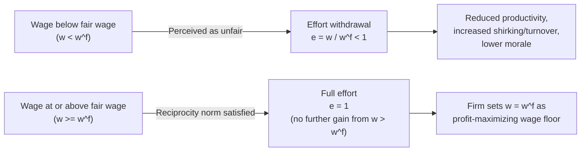

## Gift Exchange and Fair Wage Models

### Definition and Core Concept

Gift exchange and fair wage models explain wage rigidity and above-market-clearing wages through a **reciprocity/norm-based mechanism** rather than pure monitoring costs. The central idea, introduced by George Akerlof (1982) and formalized further by Akerlof and Janet Yellen (1990), is that employment relationships function partly like a **gift exchange**: firms offer wages perceived as generous relative to some reference standard ("more than fair"), and workers reciprocate by supplying effort above the contractually enforceable minimum, out of a sense of fairness or social norm rather than purely self-interested calculation.

This stands in contrast to the Shapiro-Stiglitz shirking model, which relies on rational, forward-looking calculation under imperfect monitoring. Gift exchange models instead draw on **behavioral and sociological insights** — workers are modeled as partly rule-following or norm-driven agents whose effort choice responds to perceived fairness, not solely to the risk of detection and punishment.

### Theoretical Foundations

**Key Points**

- Akerlof's original 1982 paper ("Labor Contracts as Partial Gift Exchange") drew directly on sociological research (notably George Homans' work on norms of reciprocity and Elton Mayo's Hawthorne studies) documenting that workers' effort often exceeds what pure pecuniary incentives would predict.
- The model treats the employment relationship as a partial gift exchange: the firm's "gift" is a wage above the worker's reference wage or minimum acceptable wage; the worker's reciprocal "gift" is effort above the minimum required to avoid dismissal.
- This reframes wage-effort relationships as embedded in **social exchange norms**, drawing on the broader concept of "norms of reciprocity" — a widely documented feature of human social behavior across many non-market contexts (family, gift-giving, favors) that Akerlof argued also operates within market employment relationships.

### The Fair Wage-Effort Hypothesis (Akerlof and Yellen, 1990)

**Key Points**

- Akerlof and Yellen formalized the fair-wage effort mechanism more sharply: workers have a subjective notion of a **"fair wage"** ($w^f$), and they supply effort in proportion to the ratio of their actual wage to this fair wage, up to a maximum (fully cooperative) effort level.
- The core behavioral assumption is captured in an effort function of the form:

$$e = \min\left(1, \frac{w}{w^f}\right)$$

Where:

- $e$ = effort level (normalized so that $e = 1$ represents full/normal effort)
- $w$ = actual wage paid
- $w^f$ = the worker's perceived fair wage (reference wage)
- If $w \geq w^f$, workers supply full effort ($e = 1$); paying above the fair wage does not elicit *additional* effort beyond the normal level — it is not a continuously increasing function without bound.
- If $w < w^f$, workers proportionally withdraw effort — perceiving the wage as "unfair" leads to reduced effort (shirking, reduced diligence, lower cooperation) as a form of reciprocal punishment or withdrawal of goodwill.
- Firms, anticipating this effort response, may find it profit-maximizing to set $w = w^f$ exactly (or above it, if $w^f$ itself is a function of what similar workers earn elsewhere, creating potential rigidity), rather than the market-clearing wage, if $w^f$ exceeds the market-clearing level.

### What Determines the "Fair Wage" Reference Point?

The fair wage is not a market-clearing concept but a socially and psychologically constructed reference point, generally understood in the literature to depend on:

1. **Relative wages within the firm and comparison groups**: Workers compare their pay to co-workers performing similar jobs, to workers in similar occupations at other firms, and to their own past wages (anchoring effects).
2. **Prevailing wage norms and industry standards**: Wages considered customary or standard for a given occupation, region, or industry.
3. **Firm profitability**: Workers may consider firm profits relevant to what constitutes a "fair" share — firms perceived as highly profitable while paying low wages may generate a larger fairness gap and larger effort withdrawal.
4. **Wage history and status quo**: Nominal wage cuts are typically perceived as highly unfair even when justified by economic conditions (e.g., inflation or productivity declines), which helps explain **downward nominal wage rigidity** — a well-documented empirical regularity (survey evidence, e.g., Bewley 1999's interview-based study of wage-setting managers, consistently found that managers cite morale and fairness concerns as the primary reason for avoiding nominal wage cuts, even during recessions).
5. **Internal pay equity/compression norms**: Perceived fairness of the wage *structure* across ranks within a firm (e.g., excessive CEO-to-worker pay ratios can generate perceptions of unfairness that depress effort/morale even among workers whose own wage hasn't changed).

### Diagrammatic Representation: The Effort-Wage Relationship

<svg xmlns="http://www.w3.org/2000/svg" viewBox="0 0 600 400">
<text x="300" y="25" text-anchor="middle" font-size="16" font-weight="bold" fill="#1a1a1a">Fair Wage-Effort Function (svg_diagram)</text>
<line x1="80" y1="340" x2="550" y2="340" stroke="#333" stroke-width="2" />
<line x1="80" y1="340" x2="80" y2="50" stroke="#333" stroke-width="2" />

<text x="315" y="370" text-anchor="middle" font-size="13" fill="#333">Wage (w)</text>

<text x="30" y="195" text-anchor="middle" font-size="13" fill="#333" transform="rotate(-90 30 195)">Effort (e)</text>

<line x1="300" y1="60" x2="300" y2="340" stroke="#999" stroke-width="1.5" stroke-dasharray="4,3" />
<text x="300" y="355" text-anchor="middle" font-size="11" fill="#666">w^f (Fair Wage)</text>

<line x1="80" y1="90" x2="550" y2="90" stroke="#999" stroke-width="1" stroke-dasharray="4,3" />
<text x="65" y="94" text-anchor="end" font-size="11" fill="#666">e=1</text>

<line x1="80" y1="340" x2="300" y2="90" stroke="#dc2626" stroke-width="2.5" />

<line x1="300" y1="90" x2="530" y2="90" stroke="#16a34a" stroke-width="2.5" />

<text x="150" y="220" font-size="12" fill="`#dc2626`" font-weight="bold">e = w / w^f</text>

<text x="400" y="80" font-size="12" fill="`#16a34a`" font-weight="bold">e = 1 (capped)</text>

<circle cx="300" cy="90" r="5" fill="#1a1a1a" />
</svg>

### Relationship to Downward Nominal Wage Rigidity

**Key Points**

- One of the most cited applied implications of fair wage models is explaining why firms are reluctant to cut nominal wages even during recessions or firm-specific downturns, a phenomenon robustly observed in wage-change distributions (a well-documented "spike" of wage changes exactly at zero, with very few observations of small negative nominal wage changes — the "notch" at zero in histograms of wage change data, as documented by Card and Hanson (Card & Hyslop) and others using US and international payroll microdata).
- Fair wage theory explains this pattern as follows: cutting a worker's nominal wage, even when economically justified, is perceived as a violation of the implicit fairness norm/reference point (anchored to the previous wage), triggering disproportionate effort withdrawal, increased quits among the best workers, and morale damage that can outweigh the direct cost savings from the wage cut.
- This provides a **microfounded explanation for nominal wage stickiness** distinct from menu-cost or contract-based explanations in New Keynesian macroeconomics, and it has been incorporated into some New Keynesian DSGE models featuring fair-wage-type real wage rigidities to help explain observed employment volatility.

### Distinguishing Gift Exchange/Fair Wage from Shirking Models

| Dimension | Shirking Model (Shapiro-Stiglitz) | Gift Exchange / Fair Wage Model (Akerlof-Yellen) |
| --- | --- | --- |
| Behavioral assumption | Fully rational, self-interested, forward-looking | Partly norm-driven; reciprocity and fairness norms shape effort |
| Mechanism | Threat of job loss (moral hazard deterrence) | Reciprocal exchange of "generosity" for effort |
| Role of monitoring | Central — imperfect monitoring is the core friction | Secondary or absent — effort withdrawal can occur even under normal monitoring |
| Wage-effort relationship shape | Wage premium needed rises continuously with tightness ($b$) | Effort rises proportionally with $w/w^f$, then flattens (satiation at $w = w^f$) |
| Explains nominal wage rigidity? | Less directly | Directly — central applied implication |
| Source discipline | Game theory / dynamic incentive compatibility | Behavioral economics / social psychology / sociology of norms |

Both models arrive at similar aggregate predictions (equilibrium involuntary unemployment, wage rigidity above market-clearing), but via distinct behavioral microfoundations — they are often presented as complementary rather than competing explanations, since real-world wage-setting behavior (per interview-based evidence, e.g., Bewley 1999; Campbell and Kamlani 1997) suggests both mechanisms operate simultaneously in practice.

### Empirical Evidence

- **Bewley's (1999) interview study**: Extensive structured interviews with US managers during the early 1990s recession found that the dominant reason cited for avoiding wage cuts was concern about worker morale and perceived fairness — directly consistent with the fair-wage hypothesis, and notably *not* primarily about search/turnover costs or explicit contracts.
- **Laboratory gift-exchange experiments**: Fehr, Kirchsteiger, and Riedl (1993) and subsequent experimental economics literature designed labor market experiments where "firms" (experimental subjects) offered wages to "workers," who then chose effort levels with no formal enforcement mechanism. These experiments robustly find a **positive correlation between wage offers and effort provided**, even absent any repeated-game or reputational incentive to reciprocate — widely interpreted as direct experimental support for reciprocity-based gift exchange behavior distinct from pure incentive-based (shirking-model) explanations.
- **Field evidence on relative pay and productivity**: Multiple field studies (e.g., studies of unexpected wage increases, and studies of pay comparisons among coworkers) have found productivity and effort responses correlated with relative pay perceptions, consistent with the fairness-comparison mechanism, though isolating this cleanly from morale/turnover-cost channels remains an identification challenge across studies.
- [Inference] The relative empirical weight of the fairness/reciprocity channel versus alternative explanations (efficient turnover-cost avoidance, insider bargaining power) for observed wage rigidity patterns is not fully settled and likely varies by labor market context and country.

### Example: Applied Illustration

**Example**

A firm employs workers at a "fair wage" $w^f = \$25$/hour, based on the going rate for similar roles at comparable local firms.

- If the firm pays $w = \$25$/hour: $e = \min(1, 25/25) = 1$ — full effort.
- If, facing a downturn, the firm cuts wages to $w = \$20$/hour: $e = \min(1, 20/25) = 0.8$ — effort falls to 80% of normal, even though workers remain formally employed at their contracted hours and tasks. The firm's expected labor cost savings from the 20% wage cut may be partly or fully offset by the 20% effort reduction, potentially making the wage cut unprofitable — which is precisely the mechanism the model uses to explain why rational, profit-maximizing firms often avoid nominal wage cuts even in recessions.
- If the firm instead raises wages to $w = \$30$/hour: $e = \min(1, 30/25) = 1$ (capped) — no further effort gain is elicited, since effort is already at its maximum; the extra $5/hour represents pure "rent" from the firm's perspective within this simple functional form, though richer extensions of the model (incorporating morale spillovers, retention effects, or applicant quality) can generate additional benefits from wages above $w^f$.

### Extensions and Related Behavioral Refinements

- **Relative wage comparisons and reference groups**: Extensions incorporate multiple reference groups (internal coworkers, external labor market, own past wage) with different weights, allowing richer predictions about internal pay compression and external competitiveness trade-offs.
- **Loss aversion and wage cuts**: Behavioral extensions incorporating prospect theory (Kahneman and Tversky) suggest wage cuts are weighted more heavily in the "unfairness" perception than equivalent-sized wage gains are weighted in generating goodwill — an asymmetry consistent with the empirically stronger downward wage rigidity relative to any corresponding "upward flexibility" ceiling.
- **Social comparison and inequality**: The framework has been extended to analyze how rising within-firm pay inequality (e.g., large executive compensation relative to median worker pay) may depress morale and effort among the broader workforce, connecting labor economics to debates on income inequality and corporate governance.
- **Cross-cultural and institutional variation**: Some comparative work suggests the strength of fairness norms in wage-setting (and thus the degree of wage rigidity generated) may vary across countries with different collective bargaining institutions and social norms — though this remains a less thoroughly empirically resolved extension.

### Policy and Macroeconomic Implications

**Key Points**

- **Nominal wage rigidity and monetary policy**: If fair-wage effort effects are quantitatively important, this strengthens the case for central banks to avoid deflationary environments, since deflation would otherwise require nominal wage cuts to maintain constant real wages — cuts that fair-wage theory predicts are especially costly to firm productivity and morale.
- **Minimum wage and equity policy**: Fair wage models offer a channel by which minimum wage increases (or general wage floors) could, within some ranges, be less costly to employment than simple competitive models predict, if higher wages also elicit higher effort/productivity that partially offsets the higher labor cost (an efficiency-wage style "shock effect," echoing similar arguments made regarding Henry Ford's 1914 "Five Dollar Day" wage policy, often cited descriptively in this literature as an early illustrative gift-exchange-style wage-setting episode, albeit outside the formal Akerlof-Yellen model itself).
- **Pay transparency policy debates**: Since fair wage perceptions depend heavily on relative/comparative pay information, pay transparency mandates (increasingly adopted in various jurisdictions) interact directly with this mechanism — transparency can either improve perceived fairness (if pay gaps are justifiable and visible) or worsen morale (if previously hidden inequities become salient), a tension actively discussed in current applied policy literature.

### Related Topics

- Shirking Models of Efficiency Wages (Shapiro-Stiglitz)
- Insider-Outsider Models of Wage Determination
- Downward Nominal Wage Rigidity
- Behavioral Labor Economics and Reciprocity Norms
- Adverse Selection Models of Efficiency Wages
- Labor Turnover Models of Efficiency Wages
- New Keynesian Wage Rigidity in Macroeconomic Models
- Pay Transparency and Wage Compression Policy
- Prospect Theory and Loss Aversion in Labor Markets
- Hysteresis in Unemployment