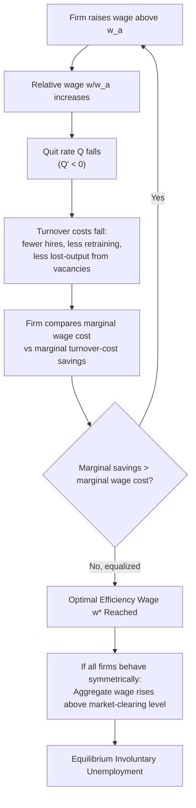

## Turnover Cost Models of Efficiency Wages

### Definition and Core Concept

Turnover cost models of efficiency wages explain why firms pay wages above the market-clearing level as a means of reducing costly employee turnover (quits), rather than as a response to shirking risk (Shapiro-Stiglitz) or fairness norms (Akerlof-Yellen). The central insight, most closely associated with **Joseph Stiglitz (1974)** and formalized further by **Steven Salop (1979)**, is that hiring, training, and separation involve substantial firm-specific costs, so firms find it profit-maximizing to pay wages high enough to reduce quit rates, even if this means paying above the wage that would otherwise clear the labor market.

Unlike the shirking model, this framework does not require imperfect monitoring of effort as its core friction — it requires only that turnover itself is costly to the firm, independent of any moral hazard problem.

### The Underlying Problem: Costly Labor Turnover

**Key Points**

- In a frictionless labor market, workers can be replaced instantly and costlessly, so firms have no incentive to pay above the market wage to retain any given worker.
- In reality, hiring involves substantial costs: recruitment/advertising, screening and interviewing, administrative onboarding, and — critically — **firm-specific human capital investment** that must be rebuilt with each new hire.
- Every quit therefore imposes a real cost on the firm, separate from any wage paid: lost output during the vacancy period, direct hiring costs, and lost investment in the departing worker's training.
- Because a worker's individual decision to quit does not internalize the cost this imposes on the firm (a **negative externality** of quitting), the socially/firm-optimal quit rate is generally lower than what workers, acting solely on their own wage comparisons, would generate at the competitive wage.
- Firms can reduce quit rates by raising wages above what other firms (or the market generally) pay, since a worker who receives an above-market wage faces a larger opportunity cost from quitting to search for or accept another job.

### Formal Structure: The Wage-Turnover Trade-off

The essential mechanism can be represented through a **quit-rate function** that is decreasing in the relative wage the firm pays compared to the market/alternative wage:

$$Q = Q\left(\frac{w}{w_a}\right), \quad Q' < 0$$

Where:

- $Q$ = the firm's quit rate (turnover rate)
- $w$ = the wage paid by the firm
- $w_a$ = the alternative wage available elsewhere in the market
- $Q' < 0$ indicates that as the firm's relative wage rises, the quit rate falls

The firm minimizes total labor costs, which include both the wage bill and turnover costs:

$$TC = wL + C(Q(w/w_a)) \cdot L$$

Where $C(\cdot)$ represents the per-worker cost of turnover (hiring, training, and lost-output costs per replacement), increasing in the quit rate $Q$.

#### First-Order Condition

The firm chooses $w$ to minimize total cost. Differentiating with respect to $w$ and setting the derivative to zero yields an optimality condition where the firm equates the **marginal cost of a higher wage** (paying more to every existing worker) with the **marginal saving in turnover costs** (fewer costly separations and replacements):

$$1 = -C'(Q) \cdot Q'\left(\frac{w}{w_a}\right) \cdot \frac{1}{w_a}$$

Intuitively: the firm raises wages up to the point where an additional dollar of wage cost is exactly offset by the reduction in expected turnover costs generated by the resulting drop in the quit rate. Because this optimal wage can exceed the market-clearing wage — especially when turnover costs $C(\cdot)$ are large (highly skilled/specialized roles, extensive firm-specific training) — the model generates an equilibrium wage premium and, in aggregate across firms behaving symmetrically, involuntary unemployment.

### Why This Generates Aggregate Unemployment

**Key Points**

- If a single firm raises its wage above the market rate, it can reduce its own turnover, taking the aggregate labor market wage as given.
- If **all firms** behave this way simultaneously (since all firms face the same turnover-cost incentive), the "market wage" itself rises above the level that would clear the labor market.
- At this elevated aggregate wage, labor supply exceeds labor demand, generating equilibrium involuntary unemployment — workers willing to work at the going wage (or below) cannot find jobs, because no individual firm has an incentive to undercut the prevailing wage (doing so would raise its own turnover costs even though it might attract otherwise-unemployed applicants).
- This is structurally similar in spirit to the Shapiro-Stiglitz outcome (equilibrium involuntary unemployment sustained by a wage premium) but arrived at through a **cost-minimization** rather than **incentive-compatibility (moral hazard)** logic.

### Diagrammatic Representation

<svg xmlns="http://www.w3.org/2000/svg" viewBox="0 0 600 400">
<text x="300" y="25" text-anchor="middle" font-size="16" font-weight="bold" fill="#1a1a1a">Turnover Cost Minimization (svg_diagram)</text>
<line x1="80" y1="340" x2="550" y2="340" stroke="#333" stroke-width="2" />
<line x1="80" y1="340" x2="80" y2="50" stroke="#333" stroke-width="2" />

<text x="315" y="370" text-anchor="middle" font-size="13" fill="#333">Wage (w)</text>

<text x="30" y="195" text-anchor="middle" font-size="13" fill="#333" transform="rotate(-90 30 195)">Cost ($)</text>

<line x1="100" y1="320" x2="520" y2="90" stroke="#2563eb" stroke-width="2.5" />
<text x="420" y="130" font-size="12" fill="#2563eb" font-weight="bold">Marginal Wage Cost</text>

<path d="M 100 90 Q 250 100 350 180 Q 450 260 520 320" stroke="#dc2626" stroke-width="2.5" fill="none" />
<text x="150" y="130" font-size="12" fill="#dc2626" font-weight="bold">Marginal Turnover-Cost Savings</text>

<circle cx="330" cy="192" r="5" fill="#16a34a" />
<line x1="330" y1="192" x2="330" y2="340" stroke="#999" stroke-width="1" stroke-dasharray="3,3" />
<text x="330" y="360" text-anchor="middle" font-size="11" fill="#16a34a" font-weight="bold">w* (Efficiency Wage)</text>
</svg>

### Comparative Statics

**Key Points**

- **Higher training/skill-specificity costs**: Occupations requiring substantial firm-specific training (e.g., specialized manufacturing roles, technical positions with proprietary systems) generate steeper $C(Q)$ functions, implying a larger optimal wage premium — this predicts, and is broadly consistent with, observed patterns of higher wage premiums in industries with substantial firm-specific human capital investment.
- **Tighter external labor markets (higher $w_a$ relative to internal wage)**: If outside options improve (e.g., during a labor market boom), quit rates rise for any given internal wage, pushing firms to raise wages further to maintain the same retention level — implying procyclical wage pressure, consistent with wage growth acceleration typically observed during tight labor markets.
- **Occupation and industry heterogeneity**: The model naturally predicts **inter-industry wage differentials** — industries or firms with higher turnover costs (specialized skills, safety-critical roles, long training pipelines) should exhibit higher wage premiums relative to observably similar workers in low-turnover-cost industries, a pattern documented empirically in inter-industry wage differential studies (e.g., Krueger and Summers, 1988), though those differentials have alternative explanations (rent-sharing, unmeasured ability sorting) as well.
- **Business cycle sensitivity**: During recessions, outside job options worsen (lower $w_a$ relative to any given firm's wage), reducing the quit rate for any given wage — this can allow firms to reduce wage premiums somewhat during downturns without triggering proportionally higher turnover, offering a partial explanation for some observed real wage flexibility that coexists with broader wage rigidity evidence.

### Worked Numerical Example

**Example**

Suppose a firm's per-worker turnover cost function is $C(Q) = 5000 \cdot Q^2$ (higher-order costs rising sharply with quit rate, reflecting increasingly disruptive turnover at high rates), and the quit-rate function is $Q(w/w_a) = 1 - 0.5(w/w_a)$, valid for $w/w_a \in [1, 2]$, with $w_a = \$20$/hour.

At $w = \$20$ (i.e., $w/w_a = 1$): $Q = 1 - 0.5(1) = 0.5$ (50% annual quit rate) → $C(Q) = 5000(0.5)^2 = \$1{,}250$ per worker per year in turnover costs.

At $w = \$26$ (i.e., $w/w_a = 1.3$): $Q = 1 - 0.5(1.3) = 0.35$ → $C(Q) = 5000(0.35)^2 = \$612.50$ per worker per year.

The wage increase of $6/hour (roughly $12,480/year at 2,080 hours) would only be justified if the reduction in turnover costs ($1,250 − $612.50 = $637.50 per worker) plus any productivity/output gains from lower disruption exceed the wage increase — in this simplified illustration, the wage increase alone is far larger than the direct turnover savings, illustrating that in practice, turnover-cost efficiency wages are most economically justified in **high-turnover-cost occupations** (e.g., highly specialized technical roles, pilots, surgeons' support staff) where $C(Q)$ is much steeper than in this stylized low-cost example — a role better filled by occupations where the constant in $C(Q)$ is far larger (e.g., $C(Q) = 50{,}000 \cdot Q^2$ for highly specialized roles), which would make comparable wage premiums easily self-financing.

### Empirical Evidence

- **Inter-industry wage differentials**: A long empirical literature (Krueger and Summers, 1988; Dickens and Katz, 1987) finds that observably similar workers (same measured education, experience, occupation) earn systematically different wages across industries, and that these differentials are correlated with proxies for turnover costs (training intensity, capital intensity, skill specificity) — consistent with turnover-cost efficiency wage predictions, though also consistent with rent-sharing and unmeasured ability-sorting explanations, making definitive attribution to the turnover-cost channel specifically difficult.
- **Firm-level studies on training investment and wage premiums**: Studies of firms with substantial apprenticeship or firm-specific training programs (e.g., German dual apprenticeship system firms, specialized manufacturing) often show wage-setting behavior consistent with retention-focused efficiency wage logic, paying above-market wages to protect training investments.
- **Quit-rate responsiveness to relative wages**: Labor economics studies using linked employer-employee data have generally found quit rates are indeed negatively related to a firm's wage relative to comparable firms/occupations, supporting the core behavioral assumption ($Q' < 0$) underlying the model, though the magnitude of responsiveness (wage elasticity of quits) varies substantially by occupation, tenure, and labor market tightness.
- [Inference] Precisely separating the turnover-cost efficiency wage channel from other coexisting efficiency wage mechanisms (shirking, fair wage/reciprocity) in observational wage data remains an identification challenge, since all three theories predict qualitatively similar outcomes (wage premiums, involuntary unemployment) that are difficult to distinguish using standard labor market data alone.

### Relation to Search and Matching Theory

- Turnover cost models share conceptual DNA with **search and matching models** (Diamond-Mortensen-Pissarides) in emphasizing that hiring/replacing workers is costly and time-consuming, generating a rationale for wage-setting behavior that departs from spot-market wage determination.
- However, turnover-cost efficiency wage models are typically **partial equilibrium** and firm-level in focus (explaining a single firm's wage-setting decision to minimize costs), whereas search and matching models are typically **general equilibrium** frameworks explicitly modeling the matching process between vacancies and unemployed workers, wage bargaining (often via Nash bargaining), and the resulting steady-state unemployment rate.
- The two frameworks are often viewed as complementary: turnover costs help explain *why* any given wage level generates less quitting/turnover, while search-and-matching models explain the aggregate flows and equilibrium dynamics of unemployment given such wage-setting behavior.

### Distinguishing Turnover Cost Models from Other Efficiency Wage Theories

| Dimension | Turnover Cost Model | Shirking Model | Fair Wage / Gift Exchange Model |
| --- | --- | --- | --- |
| Core friction | Costly hiring/training/replacement | Imperfect effort monitoring | Reciprocity/fairness norms |
| Behavioral assumption | Standard rational cost-minimization | Rational, forward-looking (game theory) | Partly norm/reciprocity-driven |
| Mechanism generating wage premium | Reducing quit-driven replacement costs | Deterring shirking via job-loss threat | Eliciting effort via perceived generosity |
| Best-fit context | High training-cost, specialized-skill jobs | Jobs with difficult-to-monitor effort | Jobs where morale/social comparison salient |
| Predicts inter-industry wage differentials tied to training intensity? | Yes, directly | Less directly | Less directly |
| Explains downward nominal wage rigidity? | Indirectly (via cyclical outside-option effects) | Not directly | Directly (central prediction) |

### Policy and Macroeconomic Implications

**Key Points**

- **Minimum wage effects**: Similar to other efficiency wage frameworks, if the market-determined efficiency wage already exceeds a proposed minimum wage, the minimum wage would be non-binding within this model — relevant to ongoing empirical minimum-wage debates about employment effects in different wage-premium contexts.
- **Training subsidies and apprenticeship policy**: Because turnover costs are closely tied to firm-specific training investment, policies that reduce the private cost of training (e.g., government-subsidized apprenticeship programs, portable/transferable credentialing) can reduce the marginal turnover cost $C(Q)$ facing firms, which — within this framework — could reduce the equilibrium wage premium and associated unemployment, though it could also reduce firms' incentive to invest in retention-focused wage-setting altogether, an ambiguous net effect requiring empirical assessment.
- **Non-compete and retention contract policy**: Legal restrictions on non-compete agreements interact with this model's mechanism — non-competes are an alternative (contractual, rather than wage-based) tool for reducing effective turnover/poaching costs; jurisdictions restricting non-competes may see firms substitute toward higher wage premiums as an alternative retention mechanism, a plausible extension though not extensively tested empirically in this specific literature. [Speculation]
- **Recession-era wage-setting**: The model's cyclical prediction (reduced need for wage premiums when outside options worsen) has been invoked to explain some of the real wage moderation observed during severe recessions in specific high-turnover-cost sectors, though this remains one channel among several competing explanations for cyclical wage behavior.

### Related Topics

- Shirking Models of Efficiency Wages (Shapiro-Stiglitz)
- Gift Exchange and Fair Wage Models (Akerlof-Yellen)
- Adverse Selection Models of Efficiency Wages
- Inter-Industry Wage Differentials
- Firm-Specific Human Capital and Training Investment
- Search and Matching Models of Unemployment (Diamond-Mortensen-Pissarides)
- Insider-Outsider Models of Wage Determination
- Non-Compete Agreements and Labor Mobility Policy
- Downward Nominal Wage Rigidity
- Hysteresis in Unemployment