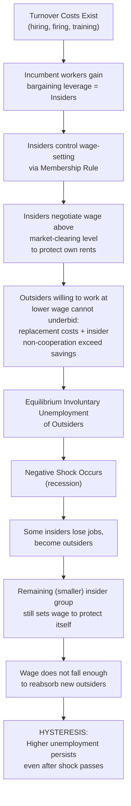

## Insider Outsider Theory

### Definition and Core Concept

Insider-outsider theory explains persistent involuntary unemployment and real wage rigidity by dividing the workforce into two groups with fundamentally different labor market power: **insiders** — currently employed workers who possess bargaining power due to the costs firms face in replacing them — and **outsiders** — unemployed workers (or workers in the secondary/informal sector) who lack comparable bargaining power and are effectively excluded from the wage-setting process. The theory was developed most extensively by **Assar Lindbeck and Dennis Snower** through the 1980s, culminating in their influential book *The Insider-Outsider Theory of Employment and Unemployment* (1988).

The central claim is that wages are set primarily to serve insiders' interests — protecting their employment, income, and working conditions — with limited regard for the welfare or employment prospects of outsiders, even though outsiders would often be willing to work at wages below what insiders currently receive. This generates equilibrium involuntary unemployment that can persist independent of standard market-clearing forces, and provides one of the principal microfoundations for **hysteresis in unemployment**.

### The Source of Insider Power: Labor Turnover Costs

**Key Points**

- Insider power derives fundamentally from the same friction underlying turnover-cost efficiency wage models: **hiring, firing, and training costs** make incumbent workers costly to replace.
- These costs create a **rent** that can be divided between the firm and the incumbent worker — the insider can credibly threaten costly-to-the-firm actions (reduced cooperation, non-cooperation with new hires, exit) if the firm attempts to replace them with a cheaper outsider or undercut their wage.
- Types of turnover costs that generate insider power:
  1. **Hiring and firing costs**: Recruitment, screening, severance payments, administrative/legal costs of dismissal (often shaped by employment protection legislation).
  2. **Firm-specific human capital**: Insiders possess knowledge, skills, and relationships specific to the firm that a new outsider hire would lack and would take time to acquire.
  3. **Cooperation and harassment costs**: Insiders can refuse to cooperate with, train, or even actively harass a newly hired outsider willing to work at a lower wage — raising the effective cost of employing that outsider even if their nominal wage is lower.

### The Membership Rule and Wage-Setting

**Key Points**

- Lindbeck and Snower's key modeling device is the **"membership rule"**: only current employees (insiders) participate in or influence wage negotiations — whether through formal unions, informal workplace bargaining, or implicit firm-level wage norms. Outsiders have no seat at the table.
- Insiders set wages to maximize their own interests (a combination of wage level and employment security for themselves), not to clear the labor market or to maximize total employment.
- Because insiders do not fully internalize the cost their wage demands impose on unemployed outsiders, the wage insiders negotiate is generally **above the market-clearing wage** — insiders can push wages up to the point where the firm's cost of replacing them (turnover costs) is exhausted, without triggering their own dismissal, even though this wage exceeds what outsiders would accept.
- The firm tolerates this insider wage premium up to the point where $w_{insider} \leq w_{outsider,reservation} + \text{turnover/replacement cost of firing insider and hiring outsider}$ — beyond this point, replacement becomes profitable despite insider resistance.

### Why Outsiders Cannot Simply Underbid Insiders

This is the theoretical crux of the model, addressing an obvious objection: if outsiders are willing to work for less, why don't firms simply hire them instead?

1. **Replacement is not costless**: Even if an outsider offers to work for a lower wage, firing an insider and hiring/training a replacement involves real costs (severance, recruitment, onboarding, lost firm-specific productivity during the transition) that can exceed the wage savings.
2. **Insider harassment/non-cooperation**: Existing insiders can make life difficult for underbidding outsiders or newly hired replacements — through social ostracism, withholding of informal training/knowledge transfer, or reduced cooperation — raising the effective cost of employing the cheaper outsider beyond the nominal wage difference.
3. **Legal and institutional protections**: Employment protection legislation (notice periods, severance requirements, unfair dismissal litigation risk) directly raises the cost of firing insiders, reinforcing their bargaining position independent of firm-level social dynamics.
4. **Union representation asymmetry**: Where unions represent only currently employed members, formal bargaining structures may exclude outsiders' interests by design, particularly in "insider-dominated" union governance structures.

### Diagrammatic Representation

<svg xmlns="http://www.w3.org/2000/svg" viewBox="0 0 600 400">
<text x="300" y="25" text-anchor="middle" font-size="16" font-weight="bold" fill="#1a1a1a">Insider Wage-Setting Range (svg_diagram)</text>
<line x1="80" y1="340" x2="550" y2="340" stroke="#333" stroke-width="2" />
<line x1="80" y1="340" x2="80" y2="50" stroke="#333" stroke-width="2" />

<text x="315" y="370" text-anchor="middle" font-size="13" fill="#333">Employment Level (L)</text>

<text x="30" y="195" text-anchor="middle" font-size="13" fill="#333" transform="rotate(-90 30 195)">Wage (w)</text>

<line x1="80" y1="250" x2="550" y2="250" stroke="#16a34a" stroke-width="1.5" stroke-dasharray="4,3" />
<text x="500" y="243" font-size="11" fill="#16a34a">Market-Clearing Wage</text>

<line x1="80" y1="150" x2="550" y2="150" stroke="#dc2626" stroke-width="2.5" />
<text x="500" y="143" font-size="11" fill="#dc2626" font-weight="bold">Insider-Set Wage</text>

<rect x="80" y="150" width="470" height="100" fill="#fca5a5" opacity="0.3" />
<text x="200" y="200" font-size="11" fill="#7f1d1d" font-style="italic">Zone protected by turnover/ replacement costs</text>

<line x1="380" y1="60" x2="380" y2="340" stroke="#999" stroke-width="1" stroke-dasharray="3,3" />
<text x="380" y="360" text-anchor="middle" font-size="11" fill="#666">L_insiders (employed)</text>
<line x1="520" y1="60" x2="520" y2="340" stroke="#999" stroke-width="1" stroke-dasharray="3,3" />
<text x="520" y="360" text-anchor="middle" font-size="11" fill="#666">L_full (Full Employment)</text>

<text x="450" y="300" text-anchor="middle" font-size="11" fill="`#7f1d1d`" font-weight="bold">Outsiders (Unemployed)</text>

</svg>

### Formal Wage-Setting Condition

A simplified representation of the insider wage-setting rule, capturing the "rent capture up to the replacement cost" logic:

$$w_{insider} = w_a + \tau$$

Where:

- $w_{insider}$ = the wage insiders successfully negotiate
- $w_a$ = the alternative/reservation wage (what outsiders would accept, or the outsider's next-best option)
- $\tau$ = the per-worker turnover/replacement cost the firm would incur to fire the insider and hire+train a replacement outsider (hiring costs, severance, training costs, lost productivity during transition, and any insider non-cooperation costs)

As long as $w_{insider} \leq w_a + \tau$, the firm's cost of dismissing and replacing the insider exceeds the wage savings, so the firm tolerates the insider wage premium. Insiders, understanding this constraint, push wages up to (but not beyond) this ceiling — generating a determinate, turnover-cost-bounded wage premium above the market-clearing rate.

### Insider-Outsider Theory and Hysteresis: The Central Mechanistic Link

**Key Points**

- Insider-outsider theory provides the primary microfoundation for the **hysteresis** channel in unemployment dynamics (as developed by Blanchard and Summers, 1986).
- **Mechanism**: A negative demand shock causes layoffs; workers who lose their jobs immediately lose insider status and become outsiders.
- The **remaining, smaller pool of insiders** continues to bargain for wages that protect their own employment and rents — they have no incentive to moderate wage demands to help re-employ the newly created outsiders, since outsiders are excluded from the bargaining process by the membership rule.
- As a result, even after the shock passes and demand recovers, the wage does not fall (or does not fall enough) to reabsorb the outsiders back into employment — the natural rate of unemployment has effectively risen, and it can remain elevated indefinitely unless the outsider pool find ways to re-enter (e.g., through active labor market policy, direct government employment, or eventual erosion of insider power).
- This directly explains why unemployment can display a "ratchet effect" — rising sharply during recessions but failing to fall symmetrically during recoveries.

### Comparative Statics

**Key Points**

- **Higher employment protection legislation (EPL)**: Directly raises $\tau$ (firing/replacement costs), strengthening insider bargaining power and widening the gap between the insider wage and the outsider reservation wage — a key link between EPL and structural unemployment discussed extensively in cross-country unemployment comparisons.
- **Higher union density and insider-dominated bargaining structures**: Strengthens the membership rule's exclusionary effect, since unions bargaining exclusively for current members have institutional incentives to prioritize insider job security and wages over broader employment.
- **Faster erosion of firm-specific skills/relationships (higher outsider substitutability)**: Reduces $\tau$, weakening insider power — this is why insider-outsider effects tend to be more pronounced in industries and occupations with high skill specificity and long tenure norms, and weaker in low-skill, high-turnover sectors.
- **Duration of unemployment for outsiders**: The longer outsiders remain unemployed, the more their own human capital may depreciate (connecting to a further hysteresis-reinforcing mechanism) and the less credible their underbidding threat becomes, since employers may statistically discriminate against long-term unemployed candidates independent of the insider-outsider wage dynamic itself.

### Distinguishing Insider-Outsider Theory from Efficiency Wage Theories

| Dimension | Insider-Outsider Theory | Efficiency Wage Theories (Shirking, Turnover, Fair Wage) |
| --- | --- | --- |
| Source of wage premium | Bargaining power of incumbents via turnover costs | Firm's unilateral profit-maximizing choice given a friction (monitoring, turnover, fairness norms) |
| Who sets the wage? | Insiders (workers), via bargaining/union power | The firm, choosing wage to maximize profit given worker response function |
| Core friction | Cost of replacing incumbent workers | Imperfect monitoring / costly turnover / fairness-driven effort response |
| Institutional dependence | Very high — depends heavily on EPL, union structure, bargaining institutions | Lower — can operate even in weakly unionized, low-EPL settings |
| Primary application | Explaining cross-country/cyclical unemployment persistence and hysteresis | Explaining why wages sit above market-clearing generally |
| Relationship | Often modeled as **complementary**: turnover costs are the common root cause, but insider-outsider theory emphasizes worker-side bargaining power, while efficiency wage theory emphasizes firm-side optimal wage-setting | — |

Many modern treatments (including Lindbeck and Snower's own later work) treat insider-outsider dynamics and efficiency wage mechanisms as **operating jointly** — firms may set efficiency wages for incentive/retention reasons, and insiders separately leverage turnover costs to extract additional rents on top of any efficiency wage baseline.

### Empirical Evidence

- **European unemployment persistence (1980s-1990s)**: The insider-outsider framework was developed substantially to explain why European unemployment remained elevated for years following the disinflationary shocks of the late 1970s, in economies characterized by strong union coverage and high employment protection — precisely the institutional conditions the theory predicts should generate strong insider effects (as discussed extensively in cross-country unemployment comparisons literature, e.g., Blanchard and Wolfers, 2000).
- **Union wage bargaining studies**: Empirical studies of union wage-setting behavior have generally found unions weight the interests of senior/tenured members (insiders) more heavily than those of junior workers or non-members, consistent with the membership rule assumption, though the degree of this bias varies across union governance structures and countries.
- **Wage curve and local unemployment studies**: The "wage curve" literature (Blanchflower and Oswald) documenting a negative relationship between local unemployment rates and wages is sometimes interpreted through an insider-outsider lens, though it also has alternative interpretations (efficiency wage and bargaining models generally).
- [Inference] Directly isolating insider-outsider effects econometrically from other coexisting explanations (efficiency wages, search frictions, skill mismatch) remains empirically challenging, since most of these theories predict qualitatively similar aggregate patterns (wage rigidity, unemployment persistence) even though their behavioral mechanisms differ.

### Policy Implications

**Key Points**

- **Employment protection reform**: Since EPL directly strengthens insider bargaining power (by raising $\tau$), reforms reducing dismissal costs are predicted by the theory to reduce the insider-outsider wage gap and improve outsider employment prospects — though such reforms are also predicted to reduce job security for existing insiders, generating the well-documented political economy tension around labor market deregulation.
- **"Two-tier" labor market reforms**: Several European countries (notably France and Spain in various reform episodes) introduced more flexible, lower-protection contracts for new hires while preserving strong protections for existing (insider) workers — a direct policy response to insider-outsider dynamics, though critics note this can create a segmented labor market where outsiders churn through temporary contracts without ever gaining full insider status, potentially worsening rather than resolving the underlying dualism.
- **Active labor market policies**: Because outsiders' primary disadvantage is exclusion from the wage-bargaining process and erosion of their bargaining credibility, ALMPs (retraining, job placement, wage subsidies for hiring long-term unemployed) can help re-integrate outsiders and counteract hysteresis, complementing (rather than substituting for) EPL reform.
- **Works councils and outsider representation**: Some policy proposals suggest formally including unemployed or non-member worker representation in bargaining structures to counteract the membership-rule exclusion, though implementation is institutionally difficult and not widely adopted in practice.
- **Sectoral vs. firm-level bargaining coordination**: Highly coordinated, economy-wide bargaining systems (as in some Nordic countries) can partially internalize the insider-outsider externality by having negotiators account for aggregate unemployment effects, in contrast to fragmented firm- or plant-level insider bargaining, which has no such incentive.

### Related Topics

- Hysteresis in Unemployment
- Shirking Models of Efficiency Wages (Shapiro-Stiglitz)
- Turnover Cost Models of Efficiency Wages
- Gift Exchange and Fair Wage Models
- Cross Country Unemployment Comparisons
- Employment Protection Legislation (EPL) and the OECD EPL Index
- The Wage Curve (Blanchflower and Oswald)
- Two-Tier Labor Markets and Contract Dualism
- Union Bargaining Models and Collective Bargaining Coordination
- Active Labor Market Policies (ALMPs)