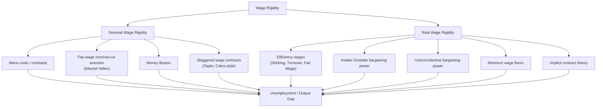
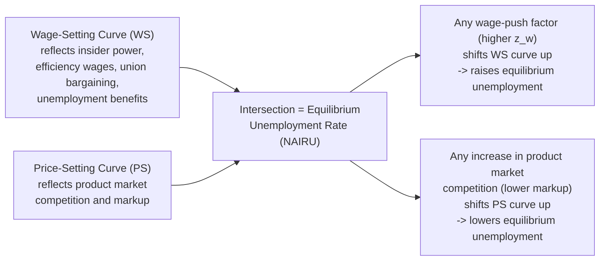

## Wage Rigidity and Unemployment

### Definition and Core Concept

Wage rigidity refers to the failure of wages to adjust freely and quickly to changes in labor supply and demand conditions, preventing the labor market from clearing at a market-clearing wage that would otherwise equate labor supply and labor demand. When wages fail to fall in response to a negative demand shock or an excess supply of labor, the result is **involuntary unemployment**: workers willing to work at the prevailing (or even lower) wage cannot find jobs, because the wage remains "stuck" above the level that would clear the market.

Wage rigidity is a central organizing concept across much of modern labor and macroeconomics, synthesizing the mechanisms explored in efficiency wage theory, insider-outsider theory, and search/bargaining models. This topic surveys the taxonomy of wage rigidity types, their distinct behavioral microfoundations, and their shared implication: unemployment as a persistent equilibrium or slow-adjustment phenomenon rather than a rapidly self-correcting market friction.

### Taxonomy: Real vs. Nominal Wage Rigidity

**Key Points**

- **Nominal wage rigidity**: The failure of the *nominal* (money) wage to adjust downward, even when price-level or productivity conditions would imply a lower nominal wage is warranted. This is the classic Keynesian concern — if prices are flexible but nominal wages are sticky downward, a fall in aggregate demand raises the real wage (via falling prices with unchanged nominal wages), reducing labor demand and increasing unemployment.
- **Real wage rigidity**: The failure of the *real* (inflation/productivity-adjusted) wage to adjust to clear the labor market, even if nominal wages are technically flexible. This is the more structurally-oriented concern emphasized by efficiency wage and insider-outsider theories — real wages remain "too high" relative to labor's marginal product because of the underlying frictions (moral hazard, fairness norms, bargaining power) discussed in those models, regardless of nominal wage flexibility.
- These two concepts are complementary, not competing: an economy can exhibit both simultaneously, and empirically distinguishing which is more binding in a given episode is a recurring challenge in the literature.

### Diagrammatic Overview: The Two Rigidity Channels

### Theories of Nominal Wage Rigidity

#### 1. Menu Costs and Contract Theory

- Adjusting nominal wages is costly in itself — renegotiating contracts, recalculating payroll systems, and the administrative/legal costs of formal wage changes create a friction against frequent nominal adjustment, analogous to "menu costs" in price-setting models.
- **Staggered wage contracts** (Taylor, 1979; Calvo-style wage-setting in New Keynesian models) assume only a fraction of wage contracts can be renegotiated in any given period, so aggregate nominal wages adjust slowly even if individual contracts are eventually renegotiated — this creates persistent real effects of nominal demand shocks in the short-to-medium run.

#### 2. Fair-Wage / Reciprocity-Based Aversion to Nominal Cuts

- As detailed under gift exchange and fair wage models, workers perceive nominal wage cuts as a violation of an implicit fairness norm (anchored to the status quo/previous wage), even when justified by falling prices or productivity, triggering morale and effort withdrawal that can make nominal cuts unprofitable for firms even in downturns.
- This is empirically supported by extensive survey evidence (Bewley, 1999; Campbell and Kamlani, 1997) in which managers cite morale concerns, not contractual constraints, as the primary reason for avoiding nominal wage cuts.
- The empirical wage-change distribution literature (documenting a "spike" of observations exactly at zero nominal wage change, and a scarcity of small negative changes) is widely cited as the key stylized fact motivating this channel.

#### 3. Money Illusion

- Some behavioral models incorporate **money illusion** — the tendency for workers to focus on nominal wage changes rather than real (inflation-adjusted) wage changes, resisting nominal cuts even when the real wage change is equivalent to an "acceptable" real cut achieved instead through inflation eroding a frozen nominal wage.
- This behavioral asymmetry provides one explanation for why moderate positive inflation can "grease the wheels" of the labor market — allowing real wage adjustments to occur via inflation without requiring painful nominal cuts.

### Theories of Real Wage Rigidity

**Key Points**

- **Efficiency wage theories** (shirking, turnover cost, and fair-wage/gift-exchange models) each provide a distinct microfoundation for why firms voluntarily set real wages above the market-clearing level, generating equilibrium involuntary unemployment even absent any nominal rigidity.
- **Insider-outsider bargaining power**: As detailed in insider-outsider theory, incumbent workers with bargaining leverage (due to turnover costs) can sustain real wages above market-clearing levels even during downturns, since the excluded outsiders have no voice in wage-setting.
- **Union and collective bargaining power**: Unions negotiating on behalf of members may set real wages above competitive levels as a matter of bargaining strategy, particularly where bargaining is coordinated at the sector or occupation level rather than tied closely to firm-level productivity or local labor market conditions.
- **Minimum wage laws**: A statutory wage floor mechanically prevents the wage from falling below a legislated level, generating unemployment among low-productivity workers if the minimum exceeds their marginal product — though the empirical magnitude of this effect remains actively debated (the "new minimum wage economics" literature, e.g., Card and Krueger, found smaller-than-predicted disemployment effects in several settings, attributed partly to monopsony power in local labor markets).
- **Implicit contract theory** (Azariadis, Baily, Gordon, 1970s): Risk-averse workers and risk-neutral (or less risk-averse) firms may implicitly agree to a smoother wage path than spot-market conditions would dictate, insuring workers against income volatility in exchange for accepting layoffs (rather than wage cuts) during downturns — this reframes wage rigidity as an efficient risk-sharing arrangement rather than a market failure, though it has been critiqued for not fully explaining why insurance takes the form of layoffs rather than work-sharing.

### The Real Wage and Employment: A Standard Diagram

<svg xmlns="http://www.w3.org/2000/svg" viewBox="0 0 600 420">
<text x="300" y="25" text-anchor="middle" font-size="16" font-weight="bold" fill="#1a1a1a">Real Wage Rigidity and Involuntary Unemployment (svg_diagram)</text>
<line x1="80" y1="370" x2="550" y2="370" stroke="#333" stroke-width="2" />
<line x1="80" y1="370" x2="80" y2="50" stroke="#333" stroke-width="2" />

<text x="315" y="400" text-anchor="middle" font-size="13" fill="#333">Employment (L)</text>

<text x="30" y="210" text-anchor="middle" font-size="13" fill="#333" transform="rotate(-90 30 210)">Real Wage (w/P)</text>

<line x1="100" y1="90" x2="520" y2="340" stroke="#2563eb" stroke-width="2.5" />
<text x="440" y="290" font-size="12" fill="#2563eb" font-weight="bold">Labor Demand</text>

<line x1="100" y1="340" x2="520" y2="100" stroke="#16a34a" stroke-width="2.5" />
<text x="440" y="140" font-size="12" fill="#16a34a" font-weight="bold">Labor Supply</text>

<circle cx="310" cy="220" r="5" fill="#333" />
<line x1="310" y1="220" x2="310" y2="370" stroke="#999" stroke-width="1" stroke-dasharray="3,3" />
<text x="310" y="390" text-anchor="middle" font-size="11" fill="#333">L_clearing</text>

<line x1="80" y1="150" x2="550" y2="150" stroke="#dc2626" stroke-width="2.5" stroke-dasharray="6,3" />
<text x="500" y="143" font-size="11" fill="#dc2626" font-weight="bold">Rigid Real Wage (w*)</text>

<circle cx="235" cy="150" r="5" fill="#dc2626" />
<line x1="235" y1="150" x2="235" y2="370" stroke="#999" stroke-width="1" stroke-dasharray="3,3" />
<text x="235" y="390" text-anchor="middle" font-size="11" fill="#dc2626">L_demand</text>

<circle cx="435" cy="150" r="5" fill="#16a34a" />
<line x1="435" y1="150" x2="435" y2="370" stroke="#999" stroke-width="1" stroke-dasharray="3,3" />
<text x="435" y="390" text-anchor="middle" font-size="11" fill="#16a34a">L_supply</text>

<line x1="235" y1="365" x2="435" y2="365" stroke="#f59e0b" stroke-width="2" />
<text x="335" y="358" text-anchor="middle" font-size="11" fill="#f59e0b" font-weight="bold">Involuntary Unemployment</text>
</svg>

### The Unified Wage-Setting/Price-Setting Framework

A widely used pedagogical synthesis (following Layard, Nickell, and Jackman) combines real wage rigidity with price-setting behavior to determine the equilibrium unemployment rate (NAIRU):

$$\text{Wage-Setting (WS) curve: } \frac{W}{P} = F(u, z_w)$$

$$\text{Price-Setting (PS) curve: } \frac{W}{P} = \frac{1}{1+\mu}$$

Where:

- $W/P$ = the real wage
- $u$ = the unemployment rate
- $z_w$ = a vector of wage-push factors (union power, unemployment benefit generosity, insider power, efficiency wage considerations, minimum wage)
- $\mu$ = the price markup over marginal cost (reflecting product market competitiveness)

The **WS curve** is typically downward-sloping in $(u, W/P)$ space: higher unemployment weakens worker/insider bargaining power (or increases the shirking-deterrence effect via lower $b$ in Shapiro-Stiglitz terms), reducing the real wage that workers can successfully demand or that firms need to pay. The **PS curve** is horizontal (or slowly varying), reflecting the real wage firms are willing to pay given the markup they charge over costs. Their intersection determines the **equilibrium unemployment rate** — this framework unifies wage rigidity theories (embedded in the WS curve's position and slope) with product market structure (embedded in the PS curve) into a single determination of the NAIRU.

### Empirical Evidence on Wage Rigidity

**Key Points**

- **Micro-level wage change distributions**: Studies using payroll and household panel microdata across many countries (US, UK, and various European economies) consistently document a pronounced spike in the distribution of individual nominal wage changes at exactly zero, with far fewer small negative changes than a smooth, symmetric distribution would predict — strong evidence for downward nominal wage rigidity at the individual level.
- **Cross-country variation in rigidity and unemployment persistence**: Cross country unemployment comparisons show that economies with more centralized/coordinated bargaining, higher union density, and higher employment protection tend to exhibit greater real wage rigidity and, historically, more persistent unemployment responses to shocks (the Blanchard-Wolfers "bad luck meets bad institutions" framework).
- **International Wage Flexibility Project (IWFP) findings**: Large-scale international research collaborations comparing wage rigidity across countries using harmonized microdata (spearheaded through central bank research networks in the 2000s-2010s) have documented substantial cross-country heterogeneity in the degree of downward nominal wage rigidity, correlated with institutional factors such as collective bargaining coverage and inflation history.
- [Inference] The relative importance of nominal versus real wage rigidity in explaining any specific unemployment episode is generally difficult to disentangle empirically, since both channels frequently operate simultaneously and produce similar aggregate symptoms (unemployment persistence, sluggish wage adjustment).

### Macroeconomic Consequences

**Key Points**

- **Amplification of demand shocks**: Wage rigidity (of either type) prevents the labor market from absorbing negative demand shocks through price (wage) adjustment, forcing adjustment instead through **quantities** (layoffs, reduced hours, unemployment) — a central mechanism in Keynesian and New Keynesian business cycle theory.
- **Monetary policy non-neutrality**: Nominal wage rigidity is one of the core microfoundations (alongside price stickiness) underlying **New Keynesian models**, in which monetary policy has real effects on output and employment in the short-to-medium run, in contrast to classical/RBC models with fully flexible wages and prices where money is neutral.
- **Zero lower bound and deflation risk**: If nominal wages cannot fall, sustained deflationary pressure (falling prices with sticky nominal wages) mechanically raises the real wage, worsening unemployment — a key reason central banks generally target low but positive inflation rather than zero or negative inflation, partly to "grease the wheels" of relative wage adjustment across sectors/firms without requiring painful nominal cuts anywhere.
- **Interaction with hysteresis**: Persistent real wage rigidity (via insider-outsider or efficiency wage channels) is the direct mechanism through which temporary shocks can translate into permanent increases in the natural rate of unemployment, linking this topic directly to the broader hysteresis in unemployment framework.

### Policy Implications

**Key Points**

- **Inflation targeting level considerations**: Given evidence of downward nominal wage rigidity, some economists argue for a positive inflation target (rather than zero) specifically to facilitate real wage adjustments across firms/sectors without requiring nominal cuts anywhere — an argument prominently associated with Akerlof, Dickens, and Perry (1996).
- **Labor market reform targeting real rigidity**: Policies aimed at reducing real wage rigidity include reducing employment protection (weakening insider power), decentralizing wage bargaining (reducing union-driven wage-push), and reforming unemployment benefit generosity/duration (reducing the wage floor implied by high reservation wages) — each targeting a specific real-rigidity mechanism identified above.
- **Work-sharing and short-time work schemes**: As an alternative to wage-cut-driven adjustment, schemes like German Kurzarbeit allow firms to reduce hours rather than wages or headcount during downturns, sidestepping nominal wage rigidity concerns entirely by adjusting the quantity of labor input per worker rather than its price.
- **Countercyclical fiscal/monetary support**: Given that wage rigidity forces demand shocks to be absorbed via unemployment, aggressive countercyclical demand management (monetary easing, fiscal stimulus) is a natural complementary policy response to limit the quantity-side adjustment (job losses) that rigid wages would otherwise necessitate.

### Related Topics

- Hysteresis in Unemployment
- Insider-Outsider Theory
- Shirking, Turnover Cost, and Gift Exchange Models of Efficiency Wages
- The NAIRU and the Wage-Setting/Price-Setting (WS-PS) Framework
- New Keynesian Models of Nominal Rigidity
- Implicit Contract Theory
- Minimum Wage Theory and Monopsony
- Cross Country Unemployment Comparisons
- Inflation Targeting and the Case for Positive Inflation Targets
- Short-Time Work Schemes and Labor Hoarding