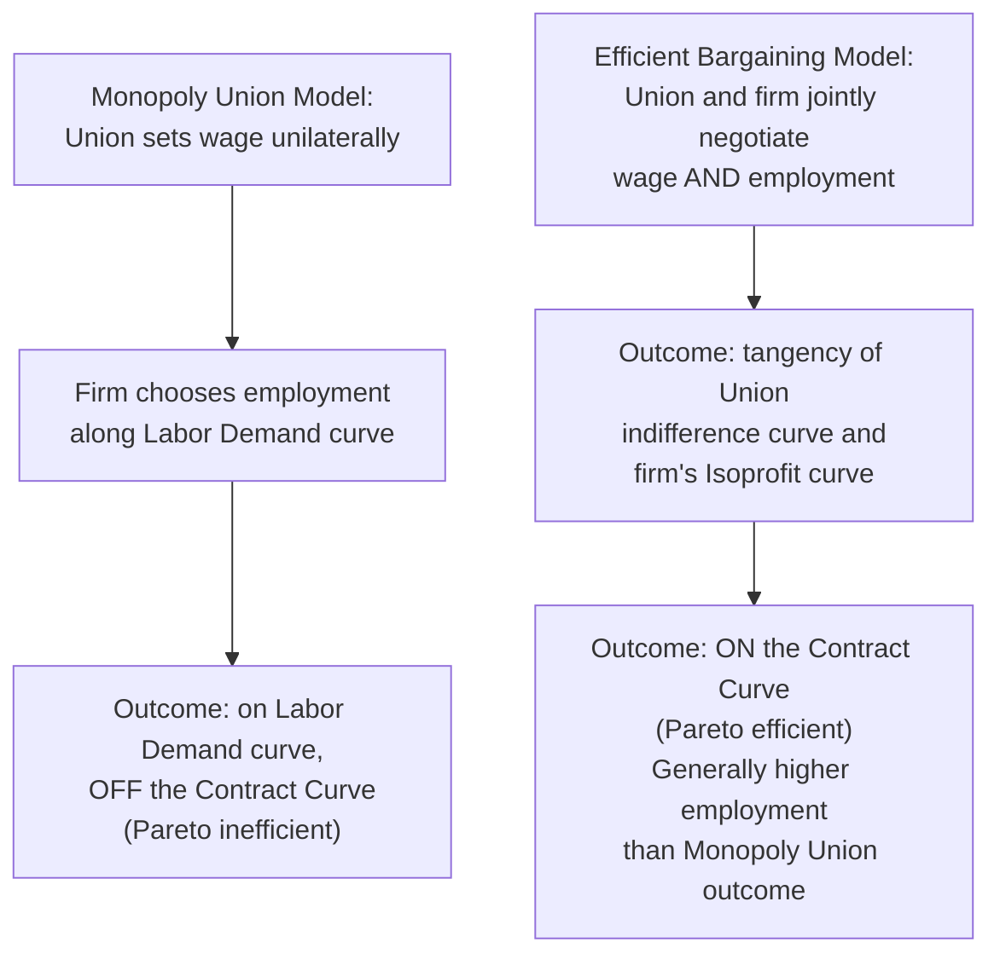

## Union Objectives and Membership Models

### Definition and Core Concept

Union objectives and membership models formalize how labor unions determine their bargaining goals — the combination of wages, employment levels, and non-wage benefits they seek to negotiate with employers — and how the underlying structure of union membership shapes those objectives. Because a union represents a heterogeneous group of workers whose individual interests (wage level vs. employment security vs. seniority protection) may diverge, economists model unions using explicit **objective functions**, analogous to how firms are modeled as profit-maximizers and consumers as utility-maximizers.

The dominant frameworks in this literature are the **monopoly union model**, the **efficient bargaining (contract curve) model**, and the **median voter model of union preferences**, each embedding different assumptions about union decision-making and its interaction with the firm's labor demand.

### Union Utility Functions

**Key Points**

- Since a union is a collective institution representing many individual members rather than a single decision-maker, economists typically model the union as maximizing an aggregated **union utility function** over the two key variables it can influence through bargaining: the wage rate ($w$) and the employment level ($L$).
- A commonly used specification is the **Stone-Geary** or **rent-maximizing** utility function:

$$U(w, L) = L \cdot (w - w_a)$$

Where:

- $L$ = employment level (number of union members employed)
- $w$ = the negotiated wage
- $w_a$ = the alternative (reservation/market) wage available to members if not employed by the unionized firm

This functional form treats union utility as the **total wage rent** captured by the membership — the wage premium above the alternative wage, multiplied by the number of members enjoying that premium. It is analogous to a firm maximizing total profit rather than a per-unit margin.

- Alternative, more general utility functions incorporate a fixed union membership size $M$ (with $L \leq M$ members employed and the remainder unemployed or receiving unemployment benefits $b$), and a weighting parameter reflecting the union's relative preference for wages versus employment:

$$U(w, L) = L \cdot U(w) + (M - L) \cdot U(b)$$

This form makes explicit that the union cares both about the well-being of its **employed members** (who receive wage $w$) and its **unemployed members** (who receive alternative income $b$, e.g., unemployment benefits or other outside options), with the union's objective a weighted aggregation across both groups.

### The Monopoly Union Model

**Key Points**

- In the **monopoly union model**, the union unilaterally sets the wage, and the firm then unilaterally chooses employment by hiring along its labor demand curve at that wage (i.e., the firm retains full control over the employment level, taking the union-set wage as given).
- This sequential structure mirrors a monopolist setting a price and the market determining quantity demanded — hence the name.
- The union maximizes its utility function $U(w, L)$ subject to the constraint that employment $L$ will equal whatever the firm's labor demand curve dictates at the chosen wage: $L = L^d(w)$.
- Substituting the firm's labor demand function into the union's utility function and maximizing with respect to $w$ yields the union's **optimal monopoly wage** — this occurs where the union's indifference curve is tangent to the firm's labor demand curve.

#### Key Result: Inefficiency of the Monopoly Union Outcome

- Because the union chooses wages while the firm unilaterally determines employment via its labor demand curve, the resulting outcome lies **on** the labor demand curve but is generally **off the efficient contract curve** (a Pareto-inefficient outcome from the perspective of the union and firm jointly).
- Specifically, the monopoly union wage typically exceeds the wage that would maximize the *joint* surplus of the union and firm combined, resulting in lower employment (and lower total surplus) than could be achieved through a different bargaining arrangement — analogous to the deadweight loss created by monopoly pricing in product markets.

### Diagrammatic Representation: Monopoly Union Model

<svg xmlns="http://www.w3.org/2000/svg" viewBox="0 0 600 420">
<text x="300" y="25" text-anchor="middle" font-size="16" font-weight="bold" fill="#1a1a1a">Monopoly Union Model (svg_diagram)</text>
<line x1="80" y1="370" x2="550" y2="370" stroke="#333" stroke-width="2" />
<line x1="80" y1="370" x2="80" y2="50" stroke="#333" stroke-width="2" />

<text x="315" y="400" text-anchor="middle" font-size="13" fill="#333">Employment (L)</text>

<text x="30" y="210" text-anchor="middle" font-size="13" fill="#333" transform="rotate(-90 30 210)">Wage (w)</text>

<path d="M 100 90 Q 300 200 520 340" stroke="#2563eb" stroke-width="2.5" fill="none" />
<text x="430" y="270" font-size="12" fill="#2563eb" font-weight="bold">Labor Demand Curve</text>

<path d="M 150 340 Q 250 220 420 150" stroke="#f59e0b" stroke-width="1.5" fill="none" stroke-dasharray="3,3" />
<path d="M 200 340 Q 300 200 460 120" stroke="#dc2626" stroke-width="2" fill="none" />
<text x="420" y="112" font-size="11" fill="#dc2626" font-weight="bold">Union Indifference Curve U0</text>

<circle cx="280" cy="205" r="5" fill="#16a34a" />
<line x1="280" y1="205" x2="280" y2="370" stroke="#999" stroke-width="1" stroke-dasharray="3,3" />
<line x1="80" y1="205" x2="280" y2="205" stroke="#999" stroke-width="1" stroke-dasharray="3,3" />
<text x="280" y="390" text-anchor="middle" font-size="11" fill="#16a34a" font-weight="bold">L_monopoly</text>
<text x="60" y="209" text-anchor="end" font-size="11" fill="#16a34a" font-weight="bold">w_monopoly</text>

<line x1="80" y1="300" x2="550" y2="300" stroke="#999" stroke-width="1" stroke-dasharray="4,3" />
<text x="60" y="304" text-anchor="end" font-size="11" fill="#666">w_a</text>
</svg>

### The Efficient Bargaining Model

**Key Points**

- The **efficient bargaining model** (McDonald and Solow, 1981) relaxes the monopoly union assumption that the firm unilaterally sets employment after the wage is fixed. Instead, the union and firm jointly negotiate over **both** wage and employment simultaneously.
- The efficient outcome occurs where the union's indifference curve is tangent to the firm's **isoprofit curve** (not the labor demand curve), generating a solution **on the contract curve** — the locus of Pareto-efficient wage-employment combinations where no alternative combination could make both parties better off.
- A key theoretical result: efficient bargaining generally produces **higher employment** than the monopoly union outcome for any given wage level (or equivalently, achieves the same union utility at higher employment/lower wage than the monopoly union solution), since it captures gains from trade left on the table by the sequential monopoly union structure.
- The contract curve is typically **not vertical** and can even be positively sloped (unlike the labor demand curve, which the monopoly union outcome is constrained to lie on) — a striking implication is that efficient bargains can imply the **firm hires beyond the point where the wage equals the marginal product of labor**, since the firm accepts some employment "in exchange" for a wage concession, as part of the joint efficient package rather than as a unilateral marginal-product-based hiring decision.

### Comparing the Two Models

| Dimension | Monopoly Union Model | Efficient Bargaining Model |
| --- | --- | --- |
| What is negotiated | Wage only | Wage AND employment jointly |
| Who sets employment | Firm (unilaterally, given wage) | Jointly negotiated |
| Resulting locus | On the labor demand curve | On the contract curve |
| Pareto efficiency | Inefficient (leaves joint surplus on the table) | Efficient (by construction) |
| Typical employment outcome | Lower | Higher (for comparable union bargaining power) |
| Empirical relevance | Better fit where unions have limited direct control over staffing/hiring decisions | Better fit where unions have significant influence over staffing levels (e.g., through seniority/layoff rules, work-rule negotiations) |

### The Median Voter Model of Union Preferences

**Key Points**

- Because unions are democratic organizations (in many institutional contexts, leadership responds to a voting membership), the **median voter model** applies standard political-economy median voter theorems to predict which member's preferences the union's bargaining objective will reflect.
- If union members differ by seniority (with layoffs, when they occur, typically following a "last-in-first-out" — LIFO — rule), the **median-seniority member** is the one whose employment is at the margin of being safe versus at risk under alternative wage-employment outcomes, and this member's preferences tend to dominate the union's revealed bargaining objective.
- This has an important implication: unions with a highly senior median member (an "aging" membership with strong job security under LIFO rules) will bargain more aggressively for higher wages (since the median voter is essentially insulated from layoff risk and cares primarily about wage level) — while a union with a more junior median member (facing meaningful layoff risk) will weight employment security more heavily relative to wage gains.
- This provides a micro-political-economy link between union demographic/seniority composition and observed bargaining outcomes, and connects directly to insider-outsider theory: senior "insider" members effectively control union wage-setting objectives, often at the expense of junior members' employment security.

### Membership Models: Union Density and the Union/Non-Union Wage Gap

**Key Points**

- **Union density** (the fraction of the workforce that is unionized) varies substantially across countries and sectors, and is a key parameter shaping the aggregate wage effects of unionization, as discussed in cross country unemployment comparisons.
- The **union wage premium** (or union/non-union wage gap) is the empirically estimated wage differential between otherwise similar unionized and non-unionized workers, typically estimated in the range of roughly 10-20% in US studies (Card, Lemieux, and others), though estimates vary considerably by industry, time period, and methodology (particularly regarding selection bias — workers who select into unionized jobs may differ systematically from those who do not, a persistent identification challenge in this literature).
- **Threat effects**: Even non-union firms may raise wages in response to a credible union organizing threat, partially compressing the measured union/non-union wage gap relative to the "true" union effect on wages absent any spillover.
- **Union coverage vs. union membership**: In many countries (e.g., much of continental Europe under sectoral extension agreements), collective bargaining coverage substantially exceeds formal union membership, since negotiated wage agreements are extended by law or custom to cover non-member workers in the same sector/occupation — an important institutional distinction affecting cross-country comparisons of union influence.

### Right-to-Manage Models and Bargaining Power Parametrization

**Key Points**

- Many applied models nest the monopoly union and efficient bargaining models within a more general **"right-to-manage"** framework, in which wages are bargained (via, e.g., a generalized Nash bargaining solution) but employment remains determined unilaterally by the firm's labor demand curve given the negotiated wage — combining bargained wage determination with the monopoly-union-style employment outcome.
- The **generalized Nash bargaining solution** for the wage is typically written as maximizing the weighted product of each party's surplus over the disagreement point:

$$w^* = \arg\max_w \left[ U(w,L(w)) - U(w_a, \cdot) \right]^\beta \left[ \pi(w, L(w)) - \pi_0 \right]^{1-\beta}$$

Where $\beta \in [0,1]$ represents the union's relative bargaining power/strength, $\pi(w, L(w))$ is firm profit given the wage and resulting labor demand, and $\pi_0$ is the firm's profit at the disagreement point (e.g., a strike, with $\pi_0$ potentially reflecting lost production).

- As $\beta \to 0$, the outcome converges to the competitive/non-union wage; as $\beta \to 1$, the outcome approaches the pure monopoly union wage — this parametrization allows empirical estimation of union bargaining power from wage and employment data, a common approach in the applied labor economics literature on union wage effects.

### Example: Numerical Illustration of the Monopoly Union Outcome

**Example**

Suppose a firm's labor demand curve is $L^d(w) = 100 - 2w$, and the union's alternative wage is $w_a = \$10$.

The union maximizes $U(w, L) = L(w - w_a) = (100 - 2w)(w - 10)$.

Taking the first-order condition with respect to $w$:

$$\frac{dU}{dw} = (100 - 2w) - 2(w-10) = 100 - 2w - 2w + 20 = 120 - 4w = 0$$

$$w^* = 30$$

At this wage, employment is $L^d(30) = 100 - 2(30) = 40$.

Union utility (total rent) is $U = 40 \times (30 - 10) = 40 \times 20 = \$800$.

Under an efficient bargain achieving the same union utility ($U = 800$) but at a point on the contract curve, employment would generally be **higher** than 40 (with a correspondingly different wage), since the efficient bargaining solution is not constrained to lie on the labor demand curve — illustrating the core inefficiency result distinguishing the two models.

### Empirical Evidence

- **Contract curve vs. labor demand curve tests**: Empirical tests (e.g., MaCurdy and Pencavel, 1986, studying US printing industry union contracts) have sought to distinguish whether observed wage-employment outcomes in unionized settings lie on the labor demand curve (consistent with monopoly union / right-to-manage models) or off it, on a contract curve (consistent with efficient bargaining) — evidence has been mixed, with some studies favoring efficient bargaining in industries with strong work-rule and staffing-level negotiation traditions, and others finding outcomes more consistent with right-to-manage dynamics.
- **Union wage premium studies**: A large empirical literature (surveyed extensively by Card, Lemieux, Riddell, and others) documents robust but variable estimated wage premiums for unionized workers, generally larger for lower-skill and blue-collar workers, and larger in the US than in many European countries with more centralized/coordinated bargaining systems (where non-union wages are pulled up via coverage extension and threat effects, compressing the measured gap).
- [Inference] The precise empirical prevalence of efficient bargaining versus right-to-manage/monopoly union dynamics likely varies substantially by industry, country, and the specific institutional details of collective bargaining (e.g., whether work rules and staffing levels are explicitly subject to negotiation), and no single model is considered universally dominant in the literature.

### Policy and Macroeconomic Implications

**Key Points**

- **Union bargaining structure and unemployment**: As discussed in cross country unemployment comparisons, the *degree of coordination* in union bargaining (highly centralized/coordinated vs. fragmented enterprise-level bargaining) interacts with union objective functions to determine aggregate employment outcomes — highly coordinated systems can internalize some of the negative employment externalities that atomistic monopoly-union-style bargaining generates.
- **Right-to-work and union density policy debates**: Policies affecting union density (right-to-work laws, card-check unionization rules, sectoral bargaining extension laws) directly affect the scope of the union objective function's influence over the aggregate wage-setting process, connecting this topic to ongoing policy debates over labor law reform.
- **Seniority/LIFO layoff rules and union objectives**: Because the median voter model implies union bargaining objectives are shaped by the seniority distribution of the membership and the layoff rule in place, policy or contractual reforms to layoff rules (e.g., shifting away from strict seniority-based layoffs toward performance-based criteria) would be predicted to shift the union's revealed bargaining priorities toward greater relative emphasis on wages if it reduces median-member layoff risk exposure, or vice versa. [Inference]

### Related Topics

- Insider-Outsider Theory
- Nash Bargaining Solutions in Labor Economics
- The Union Wage Premium and Its Measurement
- Right-to-Manage Models of Collective Bargaining
- Efficient Bargaining and the Contract Curve
- Cross Country Unemployment Comparisons
- Collective Bargaining Coordination and Coverage Extension
- Seniority Systems and Layoff Rules (LIFO)
- Median Voter Theorem in Political Economy
- Monopsony and Labor Market Power