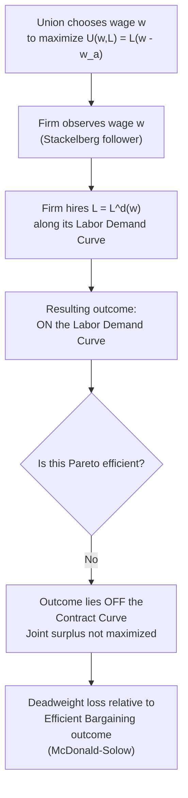

## The Monopoly Union Model

### Definition and Core Concept

The monopoly union model is a formal framework for analyzing union wage-setting in which the union is treated as a **monopolist supplier of labor** that unilaterally sets the wage rate, while the firm retains full and unconstrained control over the resulting employment level, hiring along its own labor demand curve at whatever wage the union imposes. The model was developed and popularized primarily through the work of labor economists in the 1970s-1980s (notably formalized in contrast to the McDonald-Solow efficient bargaining alternative, 1981) as the baseline "one-sided power" case against which more cooperative bargaining models are compared.

The name draws a direct analogy to product-market monopoly theory: just as a monopolist firm sets a price and lets consumers determine the quantity demanded, the monopoly union sets a wage and lets the firm determine the quantity of labor demanded — with an analogous efficiency loss relative to a competitive or jointly-efficient outcome.

### Model Setup and Assumptions

**Key Points**

- The union has a well-defined objective function over the wage $w$ and the resulting employment level $L$, most commonly the rent-maximizing form:

$$U(w, L) = L(w - w_a)$$

where $w_a$ is the alternative (reservation) wage members would receive if not employed at the unionized firm.

- The firm's labor demand curve, $L^d(w)$, is derived in the standard way from profit maximization — the firm hires labor up to the point where the wage equals the marginal revenue product of labor (MRPL): $w = MRPL(L)$.
- **Critical sequencing assumption**: the union moves first, setting $w$; the firm moves second, choosing $L = L^d(w)$ taking the wage as fixed. This is a **Stackelberg-leader structure** with the union as leader and the firm as follower.
- The union is constrained to choose a point *on* the firm's labor demand curve — it cannot directly negotiate employment, staffing levels, or work rules; its only instrument is the wage.

### Formal Derivation

The union's optimization problem is:

$$\max_{w} \; U(w, L) = L^d(w) \cdot (w - w_a)$$

subject to the firm's labor demand function $L = L^d(w)$.

Taking the first-order condition with respect to $w$:

$$\frac{dU}{dw} = L^d(w) + \frac{dL^d}{dw}(w - w_a) = 0$$

Rearranging:

$$w^* - w_a = -\frac{L^d(w)}{dL^d/dw}$$

This can be re-expressed in terms of the **wage elasticity of labor demand**, $\epsilon_d = \left|\frac{dL^d}{dw} \cdot \frac{w}{L^d}\right|$:

$$w^* = w_a \cdot \frac{\epsilon_d}{\epsilon_d - 1}$$

This has an important and intuitive structural parallel to the standard **monopoly markup formula** in product markets (price as a markup over marginal cost inversely related to demand elasticity): the more elastic the firm's labor demand (the more sensitive employment is to wage increases — e.g., due to easy capital-labor substitution or output market competition), the **closer the monopoly union wage sits to the alternative wage** $w_a$, since aggressive wage demands would cost too many jobs. Conversely, highly **inelastic labor demand** allows the union to push wages far above $w_a$ with comparatively little employment loss.

### Diagrammatic Representation

<svg xmlns="http://www.w3.org/2000/svg" viewBox="0 0 600 420">
<text x="300" y="25" text-anchor="middle" font-size="16" font-weight="bold" fill="#1a1a1a">Monopoly Union Wage Determination (svg_diagram)</text>
<line x1="80" y1="370" x2="550" y2="370" stroke="#333" stroke-width="2" />
<line x1="80" y1="370" x2="80" y2="50" stroke="#333" stroke-width="2" />

<text x="315" y="400" text-anchor="middle" font-size="13" fill="#333">Employment (L)</text>

<text x="30" y="210" text-anchor="middle" font-size="13" fill="#333" transform="rotate(-90 30 210)">Wage (w)</text>

<path d="M 100 90 Q 300 200 520 340" stroke="#2563eb" stroke-width="2.5" fill="none" />
<text x="420" y="260" font-size="12" fill="#2563eb" font-weight="bold">Labor Demand L^d(w)</text>

<path d="M 100 90 Q 220 250 320 370" stroke="#7c3aed" stroke-width="2" fill="none" stroke-dasharray="5,3" />
<text x="200" y="180" font-size="11" fill="#7c3aed" font-weight="bold">Union "Marginal Revenue" (analog to MR curve)</text>

<path d="M 210 340 Q 300 190 460 130" stroke="#dc2626" stroke-width="2" fill="none" />
<text x="420" y="122" font-size="11" fill="#dc2626" font-weight="bold">Union Indifference Curve</text>

<circle cx="270" cy="215" r="5" fill="#16a34a" />
<line x1="270" y1="215" x2="270" y2="370" stroke="#999" stroke-width="1" stroke-dasharray="3,3" />
<line x1="80" y1="215" x2="270" y2="215" stroke="#999" stroke-width="1" stroke-dasharray="3,3" />
<text x="270" y="390" text-anchor="middle" font-size="11" fill="#16a34a" font-weight="bold">L*</text>
<text x="60" y="219" text-anchor="end" font-size="11" fill="#16a34a" font-weight="bold">w*</text>

<line x1="80" y1="300" x2="550" y2="300" stroke="#999" stroke-width="1" stroke-dasharray="4,3" />
<text x="60" y="304" text-anchor="end" font-size="11" fill="#666">w_a</text>
</svg>

### Key Result: Employment Below the Competitive/Efficient Level

**Key Points**

- Because the union sets $w^* > w_a$ (a wage above the competitive/alternative level whenever the union has any market power, i.e., whenever labor demand is not perfectly elastic), and employment is determined by the firm moving along its downward-sloping labor demand curve, employment under the monopoly union outcome is **necessarily lower** than the competitive equilibrium level of employment that would prevail at $w = w_a$.
- This generates a form of **voluntary/negotiated unemployment or underemployment** among union members relative to the competitive benchmark — analogous to (but conceptually distinct from) the involuntary unemployment generated by efficiency wage and insider-outsider mechanisms, since here the wage-employment trade-off is the *deliberate, chosen* outcome of the union's own utility-maximizing wage choice, not an unintended equilibrium byproduct.
- The **key inefficiency**: this monopoly union outcome is generally Pareto-dominated by points on the **contract curve** (the McDonald-Solow efficient bargaining locus) — there typically exist alternative wage-employment combinations that would make both the union (its members collectively) and the firm (via higher profit) simultaneously better off, but the monopoly union model's institutional structure (wage-only bargaining, firm retains unilateral hiring control) prevents the parties from reaching them.

### Comparative Statics

**Key Points**

- **More elastic labor demand** (e.g., due to greater capital-labor substitutability, more competitive product markets making output demand more elastic, or a larger share of the industry's costs represented by labor) → the monopoly union wage $w^*$ moves closer to $w_a$, since aggressive wage demands cost proportionally more jobs, discouraging the union from pushing wages far above the alternative level.
- **Less elastic labor demand** (e.g., highly specialized/non-substitutable labor, inelastic product demand, labor a small share of total costs) → the union can extract a larger wage premium with a comparatively smaller employment sacrifice, so $w^*$ rises further above $w_a$.
- **Higher alternative wage $w_a$** (e.g., due to a strong overall labor market, generous unemployment benefits, or good outside job prospects for members) → shifts the entire wage-setting problem upward, generally raising $w^*$ proportionally (per the markup formula above), since the union's members have a higher floor below which they would simply choose the alternative option.
- **Union preference weighting between wages and employment**: If the union objective function is generalized to place different relative weights on wage gains versus employment/membership size (rather than pure rent maximization), a union weighting employment more heavily (e.g., due to concern for younger/junior members' job security, connecting to the median voter model of union preferences) will choose a lower wage and correspondingly higher employment point along the labor demand curve than a rent-maximizing union.

### Worked Numerical Example

**Example**

Suppose a firm's labor demand curve is linear: $L^d(w) = 200 - 4w$, and the union's alternative wage is $w_a = \$15$.

The union maximizes:

$$U(w) = (200 - 4w)(w - 15)$$

Expanding: $U(w) = 200w - 3000 - 4w^2 + 60w = -4w^2 + 260w - 3000$

First-order condition:

$$\frac{dU}{dw} = -8w + 260 = 0 \implies w^* = 32.50$$

Resulting employment: $L^* = 200 - 4(32.50) = 200 - 130 = 70$

Compare to the competitive employment level (at $w = w_a = 15$): $L^d(15) = 200 - 4(15) = 140$.

The monopoly union outcome ($w = \$32.50$, $L = 70$) generates exactly **half** the competitive employment level in this example — illustrating how a substantial wage markup (more than double the alternative wage) can come at the cost of a very large employment reduction when labor demand is only moderately elastic. Using the elasticity-markup formula as a check: at $w=32.50$, $L=70$, the point elasticity is $\epsilon_d = |{-4}| \times (32.50/70) \approx 1.857$, and $\frac{\epsilon_d}{\epsilon_d - 1} \approx \frac{1.857}{0.857} \approx 2.167$; $w_a \times 2.167 = 15 \times 2.167 \approx 32.5$ ✓, confirming internal consistency with the markup formula derived above.

### Relationship to Other Union Bargaining Models

| Dimension | Monopoly Union Model | Right-to-Manage Model | Efficient Bargaining Model |
| --- | --- | --- | --- |
| What is bargained | Wage only, union sets unilaterally | Wage bargained (e.g., via Nash bargaining); employment still set by firm | Both wage and employment jointly negotiated |
| Firm's role | Passive follower on labor demand curve | Passive follower on labor demand curve, but wage reflects bargaining power $\beta$ | Active co-negotiator over both variables |
| Resulting locus | On the labor demand curve | On the labor demand curve | On the contract curve |
| Special case relationship | A right-to-manage model with union bargaining power $\beta = 1$ collapses to the monopoly union outcome | Generalizes monopoly union by allowing $\beta \in [0,1]$ | Strictly weakly Pareto-superior to both of the above for the union and firm jointly |
| Pareto efficiency | Inefficient | Inefficient (same locus as monopoly union) | Efficient by construction |

The monopoly union model can thus be understood as the **limiting case of the right-to-manage model** where the union possesses full (maximal) bargaining power ($\beta = 1$) — a useful conceptual anchor point in the broader union objectives and membership models framework.

### Empirical Relevance and Tests

- **When is the monopoly union model empirically plausible?** The model fits institutional settings where unions have genuine wage-setting power but little or no formal influence over hiring, layoffs, or staffing decisions — historically more characteristic of settings with weaker work-rule bargaining traditions or where management retains strong unilateral rights over workforce size under the labor contract.
- **Contract curve tests**: As referenced in the broader union objectives literature, empirical studies (e.g., MaCurdy and Pencavel, 1986; Brown and Ashenfelter, 1986) have tested whether observed union wage-employment outcomes lie on the labor demand curve (consistent with monopoly union / right-to-manage predictions) or off it on a contract curve (consistent with efficient bargaining) — results have varied by industry and dataset, without a clear universal resolution favoring one model.
- [Inference] In practice, many real-world union contracts include work-rule and staffing-level provisions (grievance procedures over layoffs, seniority rules, minimum staffing requirements) that push actual outcomes toward the efficient bargaining end of the spectrum rather than the pure monopoly union extreme, suggesting the monopoly union model is best understood as a useful theoretical benchmark/polar case rather than a literal empirical description of most modern collective bargaining arrangements.

### Policy and Macroeconomic Implications

**Key Points**

- **Employment cost of union wage-setting power**: The model formally demonstrates that unchecked union wage-setting power, absent complementary bargaining over employment, generates a real efficiency cost (foregone employment and joint surplus) relative to more cooperative/efficient bargaining arrangements — a key argument sometimes invoked in policy debates over the appropriate scope of collective bargaining rights (i.e., whether bargaining should extend beyond wages to work rules and staffing).
- **Interaction with product market competition**: Because the wage markup depends inversely on the elasticity of labor demand (itself partly determined by the elasticity of product demand facing the firm), increased product market competition (e.g., via trade liberalization or antitrust enforcement) is predicted by this model to reduce the union's ability to extract wage premiums without proportionally larger employment losses — connecting labor market outcomes to product market structure and competition policy.
- **Bargaining structure reform**: To the extent this model highlights the inefficiency of wage-only bargaining, it provides a theoretical rationale for institutional reforms (co-determination, works councils, mandatory bargaining over staffing/employment alongside wages) intended to shift outcomes from the monopoly union locus toward the efficient contract curve, benefiting both parties.
- **Link to insider-outsider dynamics**: The monopoly union's rent-maximizing wage choice, which sacrifices employment to raise wages for the remaining employed members, is structurally consistent with — and reinforces — the insider-outsider theory's central claim that incumbent (insider) workers' bargaining objectives do not internalize the employment costs imposed on excluded or marginal (outsider) workers.

### Related Topics

- Union Objectives and Membership Models
- Efficient Bargaining and the Contract Curve (McDonald-Solow)
- Right-to-Manage Models and Nash Bargaining
- Insider-Outsider Theory
- The Union Wage Premium and Its Measurement
- Elasticity of Labor Demand
- Median Voter Model of Union Preferences
- Wage Rigidity and Unemployment
- Product Market Competition and Labor Market Outcomes
- Collective Bargaining Coordination