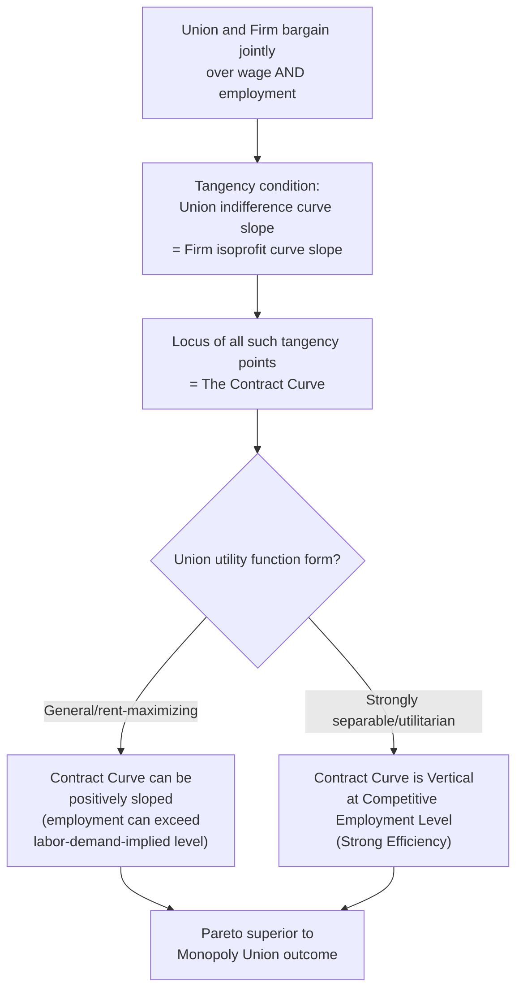

## Efficient Bargaining Models

### Definition and Core Concept

Efficient bargaining models describe collective bargaining arrangements in which the union and the firm jointly negotiate over **both** the wage rate and the employment level simultaneously, rather than the union unilaterally setting the wage and leaving the firm to unilaterally determine employment (as in the monopoly union model). The seminal formalization is due to **Ian McDonald and Robert Solow (1981)**, and the resulting outcomes are commonly referred to as **"McDonald-Solow" or "strongly efficient" bargains**.

The defining theoretical result is that jointly negotiating over both variables allows the union and firm to reach outcomes on the **contract curve** — the full set of Pareto-efficient wage-employment combinations — rather than being constrained to the firm's labor demand curve, as in the monopoly union or right-to-manage models. This generates a strictly superior joint outcome (higher combined surplus) whenever both parties can credibly commit to and enforce an agreement covering employment terms alongside wages.

### The Contract Curve: Formal Derivation

**Key Points**

- The contract curve is defined as the locus of points $(w, L)$ where the union's indifference curve is **tangent** to the firm's isoprofit curve — i.e., where no alternative combination of wage and employment could make either party strictly better off without making the other strictly worse off (the standard Pareto-efficiency condition applied to a bilateral bargaining setting).
- Formally, efficient bargains satisfy:

$$\frac{\partial U/\partial w}{\partial U/\partial L} = \frac{\partial \pi/\partial w}{\partial \pi/\partial L}$$

i.e., the union's marginal rate of substitution between wage and employment equals the firm's marginal rate of substitution between the same two variables (the slope of the union's indifference curve equals the slope of the firm's isoprofit curve at that point).

- Using the rent-maximizing union utility $U(w,L) = L(w - w_a)$ and a standard firm profit function $\pi(w, L) = R(L) - wL$ (where $R(L)$ is total revenue as a function of labor input), the tangency condition works out to:

$$w - w_a = -\frac{L \cdot \partial\pi/\partial L}{\partial \pi/\partial w} \implies w - w_a = \frac{L(R'(L) - w)}{L}= R'(L) - w$$

Solving through the algebra of the tangency condition yields the key general result that **efficient contract curve points do not require $w = R'(L)$ (the marginal product/marginal revenue product condition)** that characterizes competitive labor demand — the wage on the contract curve can exceed the marginal revenue product of labor at the negotiated employment level, since the firm is compensated for this "excess" wage payment via a correspondingly favorable employment concession that raises overall joint surplus relative to the monopoly union alternative.

### Key Result: The Contract Curve is Not Vertical

**Key Points**

- A striking and often counterintuitive implication of the model: under quite general conditions (in particular, when the union utility function is *not* separable in a specific restrictive way — see the "strong efficiency" conditions below), the contract curve is **not a vertical line** at the competitive employment level, and can even be **positively sloped** in $(L, w)$ space.
- This contrasts sharply with the intuition (sometimes drawn from naive extensions of monopoly union or right-to-manage logic) that efficient bargains should still respect $w = MRPL(L)$. Efficient bargains can instead involve the firm hiring **more labor than the wage alone would justify on a marginal product basis** — because the *joint* contract (higher wage + more employment together) makes both parties better off relative to points on the labor demand curve, even though neither could unilaterally be improved by considering wage or employment changes in isolation.
- **Special case — "strongly efficient" contracts**: If the union's utility function takes specific separable forms (e.g., utilitarian objective functions where employment enters linearly and independently of the wage in a particular way), the contract curve **can** become vertical, replicating the employment level that would prevail under perfect competition ($w = w_a$, full/competitive employment) while allowing the wage itself to be bargained up to any level between $w_a$ and the point where firm profit is fully expropriated — this special "strongly efficient" case is a key theoretical benchmark since it implies the union and firm can achieve full efficiency in employment terms while purely redistributing surplus via the wage.

### Diagrammatic Representation

<svg xmlns="http://www.w3.org/2000/svg" viewBox="0 0 600 420">
<text x="300" y="25" text-anchor="middle" font-size="16" font-weight="bold" fill="#1a1a1a">The Contract Curve (svg_diagram)</text>
<line x1="80" y1="370" x2="550" y2="370" stroke="#333" stroke-width="2" />
<line x1="80" y1="370" x2="80" y2="50" stroke="#333" stroke-width="2" />

<text x="315" y="400" text-anchor="middle" font-size="13" fill="#333">Employment (L)</text>

<text x="30" y="210" text-anchor="middle" font-size="13" fill="#333" transform="rotate(-90 30 210)">Wage (w)</text>

<path d="M 100 90 Q 300 210 520 340" stroke="#2563eb" stroke-width="2" fill="none" stroke-dasharray="5,3" />
<text x="430" y="270" font-size="11" fill="#2563eb">Labor Demand Curve</text>

<circle cx="260" cy="220" r="5" fill="#dc2626" />
<text x="270" y="215" font-size="11" fill="#dc2626" font-weight="bold">Monopoly Union Point</text>

<path d="M 150 340 Q 280 250 450 130" stroke="#16a34a" stroke-width="2.5" fill="none" />
<text x="400" y="120" font-size="12" fill="#16a34a" font-weight="bold">Contract Curve</text>

<circle cx="380" cy="175" r="5" fill="#16a34a" />
<text x="390" y="170" font-size="11" fill="#16a34a" font-weight="bold">Efficient Bargain Point</text>

<path d="M 250 100 Q 380 150 480 280" stroke="#7c3aed" stroke-width="1.5" fill="none" stroke-dasharray="3,3" />
<text x="440" y="260" font-size="10" fill="#7c3aed">Firm Isoprofit Curve</text>

<path d="M 300 340 Q 370 220 480 140" stroke="#f59e0b" stroke-width="1.5" fill="none" stroke-dasharray="3,3" />
<text x="440" y="150" font-size="10" fill="#f59e0b">Union Indifference Curve</text>

<line x1="265" y1="217" x2="373" y2="178" stroke="#333" stroke-width="1.5" marker-end="url(#arrowEB)" />
</svg>

### Comparison to the Monopoly Union Model

| Dimension | Monopoly Union Model | Efficient Bargaining Model |
| --- | --- | --- |
| Bargaining scope | Wage only | Wage AND employment jointly |
| Institutional requirement | None beyond wage-setting power | Requires enforceable agreements covering staffing/employment terms (e.g., work rules, minimum staffing, layoff procedures) |
| Resulting locus | On the labor demand curve | On the contract curve |
| Employment relative to monopoly union outcome | Baseline (lower) | Generally higher, for a given union utility level |
| Pareto efficiency | Inefficient — leaves joint surplus unexploited | Efficient by construction |
| Wage-marginal product relationship | $w \neq MRPL$ typically, but employment always satisfies $w=MRPL(L)$ given the chosen wage | $w$ can exceed $MRPL(L)$ at the negotiated point; employment is not constrained to satisfy the marginal product condition |

The efficient bargaining outcome **Pareto-dominates** the monopoly union outcome: for the same level of union utility, efficient bargaining can be structured to deliver strictly higher employment (and higher firm profit) than the monopoly union solution — this is the central welfare implication of the model and the primary motivation for the theoretical distinction from union objectives and membership models more broadly.

### Worked Numerical Example

**Example**

Using the same setup as a monopoly union example: labor demand $L^d(w) = 200 - 4w$ (implying an underlying revenue function such that $R'(L) = 50 - L/4$), alternative wage $w_a = \$15$, and monopoly union outcome $w^* = 32.50$, $L^* = 70$, giving union utility $U = 70 \times (32.50 - 15) = 70 \times 17.50 = \$1{,}225$.

Under efficient bargaining, the union and firm can locate a point on the contract curve delivering the **same union utility** ($U = 1{,}225$) but at **higher employment**. Suppose the efficient bargain settles at $L = 100$ (compared to $L=70$ under the monopoly union outcome). To hold union utility constant:

$$1{,}225 = 100 \times (w - 15) \implies w - 15 = 12.25 \implies w = 27.25$$

At this point, $(w,L) = (27.25, 100)$ delivers the union the *same* utility ($1{,}225$) as the monopoly union outcome $(32.50, 70)$, but with **30 more workers employed** — since firm revenue is higher at $L=100$ than at $L=70$ (more output produced, even though the wage per worker is lower), firm profit under this efficient bargain point is also higher than under the monopoly union outcome, confirming the Pareto-improving nature of the efficient bargain relative to the monopoly union solution. [Inference: the exact profit comparison requires the full specification of $R(L)$, but the qualitative direction — efficient bargaining points can simultaneously raise union utility-equivalent outcomes and firm profit relative to the monopoly union point — is the model's standard general result.]

### Bargaining Solution Concepts Used to Select a Point on the Contract Curve

**Key Points**

- The contract curve identifies the *set* of efficient outcomes but does not, by itself, pin down which specific point the parties will select — this requires an additional bargaining solution concept.
- **Generalized Nash Bargaining Solution**: The most common approach, selecting the point on the contract curve that maximizes the weighted product of each party's surplus over their respective disagreement/threat points:

$$\max_{w,L} \; [U(w,L) - U_0]^{\beta} [\pi(w,L) - \pi_0]^{1-\beta}$$

subject to the constraint that $(w, L)$ lies on the contract curve, where $\beta$ represents the union's relative bargaining power/weight (as also used in right-to-manage models), and $U_0$, $\pi_0$ are the utility/profit levels at the disagreement point (e.g., a strike).

- **Kalai-Smorodinsky and other axiomatic solutions**: Alternative bargaining solution concepts from cooperative game theory can also be applied, though the Nash bargaining solution remains the dominant approach in applied labor economics due to its tractability and well-known axiomatic foundations (Pareto efficiency, symmetry, invariance to affine transformations, and independence of irrelevant alternatives).

### Empirical Tests: Efficient Bargaining vs. Right-to-Manage

**Key Points**

- A substantial applied labor economics literature has sought to empirically distinguish whether real-world union contracts are better characterized as efficient bargains (on the contract curve) or as right-to-manage/monopoly-union-style outcomes (on the labor demand curve).
- **Brown and Ashenfelter (1986)**: An early influential test using US data found evidence more consistent with contracts lying on the labor demand curve (favoring right-to-manage models) in some settings.
- **MaCurdy and Pencavel (1986)**: Studying the US printing industry (a setting with detailed, long-running union contract data), found mixed but somewhat more favorable evidence for efficient bargaining in certain specifications, particularly where explicit staffing/manning provisions were part of the negotiated agreement.
- **Subsequent international evidence**: Studies of European collective bargaining systems, particularly those with strong co-determination and works council traditions (e.g., Germany), have generally found stronger support for efficient bargaining dynamics, consistent with the more extensive institutional machinery in those systems for negotiating over staffing and employment terms alongside wages.
- [Inference] The empirical resolution of this debate likely depends heavily on the specific institutional features of the bargaining system studied — particularly whether formal mechanisms exist for negotiating employment/staffing terms alongside wages — rather than there being a single universally "correct" model across all union contract settings.

### Practical and Institutional Requirements for Efficient Bargaining

**Key Points**

- Achieving efficient bargaining outcomes in practice requires **credible, enforceable agreements covering employment terms** — not just the wage. This typically requires:
  1. **Work rules and manning/staffing agreements**: Explicit contractual provisions specifying minimum staffing levels, job classifications, or work-rule constraints that effectively bind the firm's employment choice.
  2. **Job security and layoff provisions**: Formal grievance and arbitration procedures governing layoffs, which constrain the firm's ability to unilaterally reduce employment below negotiated levels.
  3. **Co-determination institutions**: In systems with works councils or board-level employee representation (e.g., Germany's Mitbestimmung), employees have institutionalized influence over employment and investment decisions beyond pure wage bargaining, providing a stronger institutional foundation for efficient-bargaining-consistent outcomes.
- Where such institutional machinery is absent or weak, actual bargaining outcomes are more likely to resemble the right-to-manage or monopoly union polar cases, since the firm retains de facto unilateral control over employment regardless of the negotiated wage.

### Policy and Macroeconomic Implications

**Key Points**

- **Efficiency gains from broader bargaining scope**: The model provides a formal efficiency rationale for extending collective bargaining beyond wages to encompass employment and staffing terms — institutional reforms that broaden the scope of what can be jointly negotiated (rather than restricting unions purely to wage demands) can, per this framework, generate genuine Pareto improvements for both workers and firms.
- **Co-determination and works councils as efficiency-enhancing institutions**: Countries with strong co-determination traditions (Germany, and to varying degrees other Northern European economies) can be understood, through this theoretical lens, as having institutionalized mechanisms that push bargaining outcomes closer to the efficient contract curve relative to systems with purely adversarial, wage-only bargaining.
- **Implications for aggregate employment and cross-country unemployment comparisons**: If efficient bargaining systems generate higher employment for a given union wage markup relative to monopoly-union-style systems, this offers an additional (institutionally-grounded) explanation, alongside insider-outsider and wage rigidity mechanisms, for why some highly unionized economies (e.g., certain coordinated European economies) have not necessarily exhibited the highest unemployment rates despite substantial union wage-setting power — bargaining *structure*, not just union *strength*, matters for employment outcomes.
- **Caution on "strong efficiency" and full employment claims**: While the "strongly efficient" special case (vertical contract curve at competitive employment) is a useful theoretical benchmark, it relies on specific, restrictive assumptions about the union utility function's functional form; policymakers should not assume real-world efficient bargaining arrangements automatically deliver competitive/full employment levels, since the general (non-strongly-efficient) contract curve can settle at employment levels above, below, or different from the competitive benchmark depending on the specific tangency conditions and bargaining power distribution. [Inference]

### Related Topics

- The Monopoly Union Model
- Union Objectives and Membership Models
- Right-to-Manage Models and Nash Bargaining
- Insider-Outsider Theory
- Co-Determination and Works Councils
- The Union Wage Premium and Its Measurement
- Wage Rigidity and Unemployment
- Cross Country Unemployment Comparisons
- Cooperative Game Theory and Bargaining Solutions
- Elasticity of Labor Demand