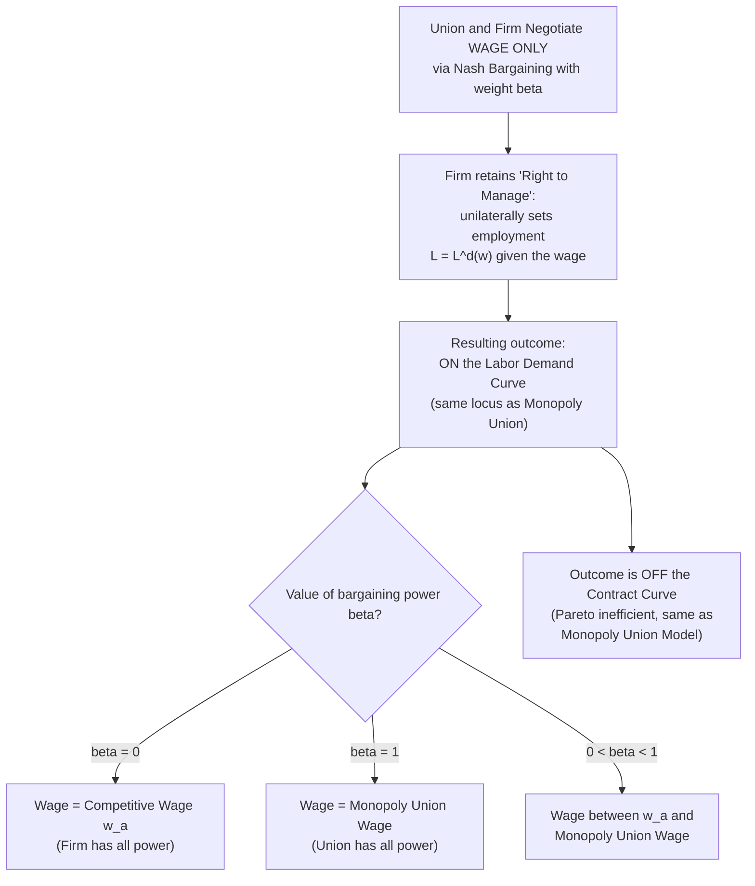

## The Right to Manage Model

### Definition and Core Concept

The right-to-manage model is a framework for collective bargaining in which the union and firm **negotiate over the wage** — typically via a formal bargaining solution such as Nash bargaining — while the firm **retains sole and unilateral control ("the right to manage")** over the resulting employment level, hiring along its own labor demand curve at whatever wage emerges from the negotiation. It occupies a middle ground in the taxonomy of union bargaining models: it generalizes the monopoly union model (which assumes the union has *all* the bargaining power over the wage) while stopping short of the efficient bargaining model (which allows employment itself to be jointly negotiated).

The name reflects the traditional labor-relations distinction between wage and benefit issues, which are typically subject to bargaining, and "management rights" or "managerial prerogative" issues — staffing levels, hiring, layoffs, and work assignment — which many collective bargaining agreements explicitly reserve to management's unilateral discretion, subject only to any specific work-rule or seniority provisions separately negotiated.

### Model Setup and Formal Structure

**Key Points**

- The wage $w$ is determined through a **generalized Nash bargaining solution** between the union and the firm, but employment is *not* a bargaining variable — it remains determined entirely by the firm choosing $L = L^d(w)$ along its labor demand curve once the wage is set.
- The Nash bargaining problem is specified as:

$$w^* = \arg\max_{w} \; \left[U(w, L^d(w)) - U_0\right]^{\beta} \left[\pi(w, L^d(w)) - \pi_0\right]^{1-\beta}$$

Where:

- $U(w, L^d(w))$ = union utility given the wage and the firm's resulting labor demand
- $\pi(w, L^d(w))$ = firm profit given the wage and the resulting employment
- $U_0, \pi_0$ = the disagreement point (fallback) payoffs for the union and firm respectively — commonly interpreted as the payoffs during a strike or work stoppage
- $\beta \in [0, 1]$ = the union's relative bargaining power (or "bargaining strength" parameter)
- Crucially, the maximization is taken *subject to* $L = L^d(w)$ substituted in — the model constrains the outcome to lie on the labor demand curve, exactly as in the monopoly union model, but the wage itself now reflects the *relative bargaining power* of both parties rather than being unilaterally union-determined.

### The Monopoly Union Model as a Special/Limiting Case

**Key Points**

- When $\beta = 1$ (the union has full/maximal bargaining power, and the firm's payoff enters the objective with weight zero), the Nash bargaining solution collapses exactly to the **pure monopoly union outcome** — the union effectively dictates the wage as if it had complete market power.
- When $\beta = 0$ (the firm has all the bargaining power), the outcome converges to the **competitive/non-union wage** $w = w_a$, since the union's objective plays no role in the wage determination.
- For any $\beta \in (0, 1)$, the right-to-manage model generates a wage that lies **between** the competitive wage $w_a$ and the pure monopoly union wage $w^*_{monopoly}$ — the bargaining power parameter $\beta$ acts as a continuous dial between these two theoretical extremes.
- This makes the right-to-manage model the natural **generalization/unifying framework** that nests the monopoly union model as a polar case, allowing empirical researchers to estimate $\beta$ from observed wage-employment data as a measure of revealed union bargaining strength.

### Diagrammatic Representation

<svg xmlns="http://www.w3.org/2000/svg" viewBox="0 0 600 420">
<text x="300" y="25" text-anchor="middle" font-size="16" font-weight="bold" fill="#1a1a1a">Right-to-Manage: Wage as a Function of Bargaining Power (svg_diagram)</text>
<line x1="80" y1="370" x2="550" y2="370" stroke="#333" stroke-width="2" />
<line x1="80" y1="370" x2="80" y2="50" stroke="#333" stroke-width="2" />

<text x="315" y="400" text-anchor="middle" font-size="13" fill="#333">Employment (L)</text>

<text x="30" y="210" text-anchor="middle" font-size="13" fill="#333" transform="rotate(-90 30 210)">Wage (w)</text>

<path d="M 100 90 Q 300 210 520 340" stroke="#2563eb" stroke-width="2.5" fill="none" />
<text x="430" y="270" font-size="12" fill="#2563eb" font-weight="bold">Labor Demand Curve</text>

<circle cx="440" cy="300" r="5" fill="#16a34a" />
<text x="445" y="295" font-size="11" fill="#16a34a" font-weight="bold">beta=0: w_a (Competitive)</text>

<circle cx="340" cy="255" r="5" fill="#f59e0b" />
<text x="345" y="248" font-size="11" fill="#f59e0b" font-weight="bold">beta=0.5: Intermediate</text>

<circle cx="260" cy="210" r="5" fill="#dc2626" />
<text x="265" y="203" font-size="11" fill="#dc2626" font-weight="bold">beta=1: Monopoly Union Wage</text>

<line x1="440" y1="300" x2="260" y2="210" stroke="#999" stroke-width="1" stroke-dasharray="4,3" />
<text x="330" y="180" font-size="10" fill="#666" font-style="italic">All outcomes lie ON the Labor Demand Curve</text>
</svg>

### Comparative Statics on Bargaining Power ($\beta$)

**Key Points**

- **Higher union bargaining power ($\beta$)** raises the negotiated wage (moving the outcome further up and to the left along the labor demand curve, toward the monopoly union point), and correspondingly **reduces employment**, since the outcome remains constrained to the labor demand curve throughout.
- Factors that raise $\beta$ in applied and institutional discussions include: higher union density/coverage, a more favorable strike/disagreement payoff for workers (e.g., generous strike funds or unemployment benefits during a work stoppage), greater product market concentration (reducing the firm's ability to substitute toward non-union competitors), and legal/institutional frameworks favoring union recognition and bargaining rights.
- Factors that lower $\beta$ include weaker union density, a poor strike/disagreement payoff for the union (e.g., a large pool of available replacement workers, weak strike funds), and strong product market competition constraining the firm's ability to absorb a wage premium without losing market share.

### Distinguishing Right-to-Manage from the Monopoly Union and Efficient Bargaining Models

| Dimension | Monopoly Union Model | Right-to-Manage Model | Efficient Bargaining Model |
| --- | --- | --- | --- |
| Wage determination | Union sets unilaterally | Nash-bargained with weight $\beta$ | Jointly negotiated alongside employment |
| Employment determination | Firm, unilaterally, along $L^d(w)$ | Firm, unilaterally, along $L^d(w)$ | Jointly negotiated |
| Resulting locus | On labor demand curve | On labor demand curve | On the contract curve |
| Special case relationship | Right-to-manage with $\beta=1$ | Generalizes monopoly union ($\beta=1$) and competitive wage ($\beta=0$) | Not nested within right-to-manage; a distinct, Pareto-superior structure |
| Pareto efficiency | Inefficient | Inefficient (same inefficiency source as monopoly union) | Efficient by construction |
| Number of free parameters determining the wage | None (fully determined by union utility maximization) | One: $\beta$ (estimable empirically) | Requires both a contract-curve-selection rule and possibly its own bargaining-power parameter |

The right-to-manage model's key conceptual contribution is allowing **union bargaining power to be a continuous, empirically estimable parameter** ($\beta$) rather than the all-or-nothing assumption embedded in the pure monopoly union model — this makes it considerably more useful for applied econometric work on union wage effects.

### Worked Numerical Example

**Example**

Using the same setup as prior union model examples: labor demand $L^d(w) = 200 - 4w$, alternative wage $w_a = \$15$, and pure monopoly union wage $w^*_{monopoly} = \$32.50$ (from the earlier derivation).

Suppose the union's bargaining power is estimated at $\beta = 0.6$ (moderate-to-strong bargaining power, reflecting a well-organized union facing a firm with meaningful, though not overwhelming, market power in the disagreement state).

A simplified linear interpolation approximation between the two polar wages (a common illustrative simplification, though the true Nash bargaining solution generally interpolates non-linearly given the underlying functional forms) gives:

$$w^*_{RTM} \approx \beta \cdot w^*_{monopoly} + (1-\beta) \cdot w_a = 0.6(32.50) + 0.4(15) = 19.50 + 6.00 = \$25.50$$

Resulting employment: $L^d(25.50) = 200 - 4(25.50) = 200 - 102 = 98$

Compare across the three reference points:

- **Competitive** ($\beta=0$): $w=15$, $L=140$
- **Right-to-manage** ($\beta=0.6$): $w\approx25.50$, $L=98$
- **Monopoly union** ($\beta=1$): $w=32.50$, $L=70$

[Inference: This linear interpolation is a pedagogical simplification for illustrative purposes; the exact Nash bargaining solution for a given underlying utility and profit specification generally does not interpolate linearly between the two polar wage levels, though it shares the same qualitative monotonic relationship between $\beta$ and the resulting wage.]

### Empirical Estimation of Union Bargaining Power ($\beta$)

**Key Points**

- A substantial applied labor economics literature has used the right-to-manage framework's structural form to **econometrically estimate $\beta$** from observed wage and employment data across unionized industries and firms, treating it as a summary measure of "revealed" union bargaining strength.
- Estimation typically requires specifying (and estimating) the underlying union utility function, the firm's profit/labor-demand function, and the disagreement-point payoffs, then fitting the resulting first-order conditions to panel data on wages, employment, and relevant covariates (e.g., product demand shifters, industry concentration measures).
- Studies applying this framework (e.g., across UK and US manufacturing industries in the 1980s-1990s wage-bargaining literature) have generally found estimated $\beta$ values well below 1 (i.e., rejecting the pure monopoly union polar case) but well above 0 (rejecting the fully competitive polar case), consistent with the intermediate, "shared bargaining power" characterization the model is designed to capture.
- [Inference] Precise point estimates of $\beta$ vary substantially across studies, industries, and time periods depending on econometric specification and the strength of instruments used to identify the underlying structural parameters, so a single universally applicable estimate of union bargaining power is not established in the literature.

### The "Right to Manage" as an Institutional/Legal Concept

**Key Points**

- Beyond its formal economic modeling role, "right to manage" is also a term of art in labor relations and industrial relations practice, referring to management rights clauses commonly included in collective bargaining agreements that explicitly reserve certain decisions — staffing levels, work assignment, technology adoption, scheduling — to management's unilateral discretion, outside the scope of the negotiated contract (subject to any specific limitations separately bargained, such as seniority-based layoff procedures).
- The economic model's assumption that employment remains a unilateral firm decision closely mirrors this real-world institutional practice in many collective bargaining systems (particularly in the US private sector, historically), lending the model considerable practical/institutional grounding relative to the more idealized efficient bargaining alternative, which requires more extensive negotiated employment-related provisions than many actual labor contracts contain.

### Empirical Tests: Right-to-Manage vs. Efficient Bargaining

**Key Points**

- As discussed under efficient bargaining models, empirical tests distinguishing right-to-manage from efficient bargaining generally examine whether observed wage-employment combinations lie on the labor demand curve (right-to-manage prediction) or off it, on a contract curve (efficient bargaining prediction).
- Evidence has been mixed across studies and industries: Brown and Ashenfelter (1986) found results more consistent with the labor demand curve (favoring right-to-manage) in the US data they examined, while MaCurdy and Pencavel (1986) found some evidence more favorable to efficient bargaining, particularly in industries and contract settings with more extensive negotiated work-rule provisions.
- [Inference] The empirical prevalence of right-to-manage versus efficient bargaining dynamics likely depends on country- and industry-specific institutional features — particularly the extent to which employment/staffing terms are formally subject to negotiation — rather than one model being universally superior as a description of real-world collective bargaining.

### Policy and Macroeconomic Implications

**Key Points**

- **Union bargaining power and cross-country unemployment**: Because the right-to-manage model formalizes union bargaining strength as a continuous parameter, it integrates naturally into the broader wage-setting/price-setting (WS-PS) framework used to analyze cross country unemployment comparisons — higher estimated $\beta$ in a given country/industry corresponds to a higher wage-push factor in the WS curve, shifting equilibrium unemployment upward, all else equal.
- **Strike legislation and disagreement-point policy**: Because $\beta$ (and the resulting wage) depend on the relative attractiveness of each party's disagreement-point payoff, policies affecting strike replacement worker rules, unemployment benefit eligibility during labor disputes, or strike fund regulations directly influence the effective bargaining power balance captured by this model.
- **Relative appeal versus efficient bargaining for policy design**: Since right-to-manage outcomes are Pareto-inefficient (as in the monopoly union case), policymakers interested in improving joint outcomes for workers and firms might consider institutional reforms (broader collective bargaining scope, works councils, co-determination — as discussed under efficient bargaining models) that shift real-world bargaining practice from the right-to-manage paradigm toward more efficient, employment-inclusive negotiation structures.
- **Interaction with insider-outsider dynamics**: Because right-to-manage bargaining still leaves the firm with unilateral control over *who* is employed (subject only to the negotiated wage), it is structurally compatible with insider-outsider theory's account of how the employed "insider" workforce's bargaining representatives negotiate wages without directly internalizing effects on unemployed "outsiders" — the two frameworks can be viewed as complementary layers of the same underlying wage-setting story.

### Related Topics

- The Monopoly Union Model
- Efficient Bargaining Models (McDonald-Solow)
- Union Objectives and Membership Models
- Nash Bargaining Solutions in Labor Economics
- Insider-Outsider Theory
- Wage Rigidity and Unemployment
- Cross Country Unemployment Comparisons
- The Union Wage Premium and Its Measurement
- Strike Legislation and Labor Dispute Resolution
- Elasticity of Labor Demand