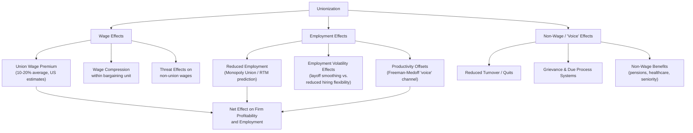

## Union Wage and Employment Effects

### Definition and Core Concept

Union wage and employment effects refer to the empirical and theoretical study of how unionization causally impacts wages, employment levels, employment volatility, and the broader distribution of compensation, comparing unionized workers/sectors to otherwise similar non-union counterparts. While the theoretical bargaining models (monopoly union, right-to-manage, efficient bargaining) predict the *direction and mechanism* of these effects, this topic focuses on the **measurement, magnitude, and broader labor market consequences** of unionization — synthesizing decades of empirical labor economics research on the union wage premium, employment/hours effects, and non-wage dimensions of the union impact.

### The Union Wage Premium: Definition and Measurement

**Key Points**

- The **union wage premium** (or union/non-union wage gap) is the percentage difference in wages between unionized and non-unionized workers, holding constant observable characteristics (education, experience, occupation, industry, region, and demographic factors).
- Standard estimation approaches include:
  1. **Cross-sectional OLS wage regressions** with a union status indicator, controlling for observable worker and job characteristics — the simplest approach, but vulnerable to **selection bias** if unionized workers differ systematically in unobserved ability, motivation, or job characteristics from non-union workers.
  2. **Fixed-effects/panel data methods**: Following the same workers over time as they move into or out of union jobs, differencing out time-invariant unobserved worker characteristics — a key methodological advance associated with researchers such as Freeman and others using panel datasets.
  3. **Instrumental variables approaches**: Using instruments correlated with union status but uncorrelated with unobserved wage determinants (e.g., state right-to-work laws, industry union density shocks) to address remaining endogeneity concerns.
- Landmark studies in this tradition include work by **Richard Freeman and James Medoff** (*What Do Unions Do?*, 1984), and subsequent refinements by **David Card**, **Thomas Lemieux**, **W. Craig Riddell**, and others using increasingly sophisticated panel and quasi-experimental methods.

### Magnitude and Heterogeneity of the Union Wage Premium

**Key Points**

- US estimates of the average union wage premium have historically ranged roughly **10-20%**, though this masks substantial heterogeneity:
  - **Larger premiums** are typically found for lower-skill, blue-collar, and less-educated workers — consistent with unions compressing the wage distribution by raising the floor for workers who would otherwise have weaker individual bargaining power.
  - **Smaller or negligible premiums** are often found for highly skilled, professional, or already well-compensated workers, whose individual market power may already approximate or exceed what collective bargaining would secure.
  - Premiums also vary substantially by **industry, region, and time period** — declining somewhat in many US studies since the 1980s alongside declining union density.
- **Cross-country variation**: The measured union wage premium tends to be **smaller in countries with more centralized/coordinated bargaining and high collective bargaining coverage extension** (e.g., much of continental Europe), since non-union wages are pulled up toward union-negotiated levels via sectoral extension agreements and "threat effects," compressing the measured gap even where union *influence* over aggregate wages remains substantial — an important nuance connecting this topic to cross country unemployment comparisons.
- **Wage compression within the union sector**: Beyond the average premium, unions are also empirically associated with **reduced wage dispersion** among covered workers — compressing pay differentials by skill, tenure, and even race/gender within the bargaining unit, a well-documented "voice" effect distinct from the pure wage-level premium.

### Diagrammatic Overview: Channels of Union Wage and Employment Effects

### Employment Effects: Theoretical Predictions vs. Empirical Findings

**Key Points**

- **Theoretical prediction (monopoly union / right-to-manage models)**: A union wage premium above the competitive wage should reduce employment, moving the firm up its labor demand curve to a lower quantity of labor — the standard prediction discussed extensively under the monopoly union model.
- **Empirical evidence on employment levels**: Studies generally do find some negative association between unionization and firm-level employment growth, particularly in more price-competitive, trade-exposed industries where the firm's labor demand is more elastic — consistent with the theoretical prediction that more elastic labor demand limits the wage premium a union can extract without substantial employment cost.
- **The Freeman-Medoff "voice/institutional response" counterargument**: Freeman and Medoff's influential work argued that unions can also **raise productivity** through several non-wage "voice" channels that partially or fully offset the pure wage-premium employment cost:
  1. Reduced costly turnover (as in turnover cost efficiency wage models) via improved grievance/due-process mechanisms that give workers a "voice" alternative to quitting.
  2. Better communication of worker preferences to management, improving workplace organization and reducing costly management errors.
  3. More effective monitoring/enforcement of workplace safety and training standards.
- The empirical magnitude and generality of this productivity-offset ("voice" and "exit") effect remains debated: some industry and firm-level studies find productivity effects sufficient to substantially offset wage-premium-driven employment costs, while others find limited or no significant net productivity benefit, particularly outside settings with strong grievance/due-process institutions.

### Employment Volatility and Adjustment Effects

**Key Points**

- Beyond the *level* of employment, unionization is empirically associated with changes in employment **volatility and adjustment patterns** over the business cycle:
  - **Seniority-based layoff rules (LIFO — last-in-first-out)**: Commonly negotiated in union contracts, these rules concentrate employment volatility on junior workers while providing greater job security to senior members — connecting directly to the median voter model of union preferences discussed under union objectives and membership models.
  - **Reduced use of layoffs relative to hours adjustment**: Some studies find unionized firms rely relatively more on adjusting hours (overtime, short-time work) and less on layoffs during downturns compared to non-union firms, consistent with implicit contract theory's risk-sharing rationale, potentially reinforced by union preferences for employment stability among incumbent (insider) members.
  - **Reduced overall employment responsiveness to wage changes**: Where efficient bargaining or extensive work-rule provisions apply, unionized firms may exhibit less elastic employment responses to wage changes than the pure labor-demand-curve prediction would suggest, consistent with the efficient bargaining model's departure from strict marginal-product-based hiring.

### Effects on Firm Profitability and Investment

**Key Points**

- A substantial literature (e.g., studies using stock market event-study methodology around union certification elections) finds that **union certification is generally associated with a decline in firm market value/profitability**, consistent with the theoretical prediction that unions extract rents from firm profits via the wage bargaining process.
- Some studies also find evidence that unionization is associated with **reduced capital investment and R&D spending** at unionized firms, potentially reflecting a "hold-up" problem — firms may be reluctant to make investments whose returns could subsequently be partially expropriated through renegotiated union wage demands (an underinvestment mechanism related to incomplete contracting theory in industrial organization).
- [Inference] These profitability and investment effects, while robustly documented directionally in several studies, vary in estimated magnitude across industries, time periods, and identification strategies, and causal interpretation requires care given the potential for unions to organize disproportionately in firms/industries already characterized by higher rents or different investment profiles prior to unionization.

### Worked Numerical Illustration: Aggregate Welfare Accounting

**Example**

Consider a stylized illustration combining the wage premium and employment effect channels. Suppose a firm's labor demand is $L^d(w) = 200 - 4w$, the competitive/non-union wage is $w_a = \$15$ (giving competitive employment $L=140$), and unionization moves the firm to the right-to-manage outcome from the earlier example: $w = \$25.50$, $L = 98$.

- **Wage bill change**: Competitive wage bill $= 15 \times 140 = \$2{,}100$. Union wage bill $= 25.50 \times 98 = \$2{,}499$. Total labor payments rise by $399 despite lower employment.
- **Displaced workers**: $140 - 98 = 42$ workers who would have been employed at the competitive wage are not employed under the union outcome — these workers either find employment elsewhere (potentially depressing wages in the non-union sector, a "spillover" effect frequently discussed in union wage effect literature) or experience unemployment/reduced labor force attachment.
- **Distributional effect**: The 98 workers who retain union jobs gain $10.50/hour each relative to the competitive wage — a substantial within-group gain — while the 42 displaced workers bear the employment cost, illustrating the classic **distributional tension** at the heart of union wage effects: gains are concentrated among retained/insider members, while employment costs are borne by those excluded from the bargaining unit (directly paralleling the insider-outsider theory framework).

### Spillover Effects on the Non-Union Sector

**Key Points**

- Workers displaced from unionized employment (as in the illustration above) may seek employment in the non-union sector, potentially **depressing non-union wages** through increased labor supply — this "spillover" or "crowding" effect is a long-standing theoretical prediction in union wage effect studies, implying that the *measured* union/non-union wage gap may partly overstate the pure causal union wage effect, since non-union wages themselves may be pushed down by union-sector employment contraction.
- Conversely, **threat effects** (discussed above) can work in the opposite direction — non-union firms facing a credible unionization threat may proactively raise wages to remain competitive with union-scale compensation and deter organizing, which would cause the measured union/non-union gap to *understate* the pure union wage effect.
- The net direction and magnitude of these offsetting spillover and threat effects on the aggregate wage structure is empirically ambiguous and has been the subject of ongoing research, with results varying by industry concentration, regional labor market integration, and the credibility of organizing threats in a given period.

### Effects on Wage Inequality

**Key Points**

- Because unions tend to compress wages within the bargaining unit (raising the wage floor disproportionately for lower-paid workers) and historically had substantial membership among blue-collar, non-college-educated workers, the **decline in US union density since the 1970s-1980s has been identified in several influential studies (e.g., Card, 2001; DiNardo, Fortin, and Lemieux, 1996) as a meaningfully contributing factor to rising US wage inequality** over the subsequent decades, particularly within-industry and within-education-group wage dispersion.
- Cross-country comparisons show that countries maintaining higher union density and bargaining coverage (many continental European and Nordic economies) have generally experienced less dramatic increases in wage inequality over the same period relative to the US and UK, though disentangling the specific causal contribution of union decline from other concurrent factors (skill-biased technological change, trade/globalization, minimum wage policy changes) remains methodologically complex and actively debated in the inequality literature.

### Summary Table: Documented Union Effects

| Dimension | Typical Direction of Effect | Key Mechanism / Theoretical Link |
| --- | --- | --- |
| Wage level (covered workers) | Positive (union wage premium) | Monopoly union / right-to-manage bargaining power |
| Wage dispersion (within bargaining unit) | Negative (compression) | Standardized pay scales, seniority-based structures |
| Employment level (firm-level) | Generally negative | Movement up the labor demand curve |
| Productivity | Ambiguous/mixed; potentially positive via "voice" | Freeman-Medoff voice/exit framework, reduced turnover |
| Firm profitability/market value | Generally negative | Rent extraction via wage bargaining |
| Capital investment/R&D | Generally negative in several studies | Hold-up problem / incomplete contracting |
| Employment volatility | Mixed; often more hours-based, less layoff-based adjustment | Seniority (LIFO) rules, implicit contract risk-sharing |
| Aggregate wage inequality | Higher union density associated with lower inequality | Wage compression, floor-raising for low-wage workers |
| Non-union sector wages | Ambiguous (spillover vs. threat effects) | Displaced worker supply increase vs. organizing deterrence |

### Policy Implications

**Key Points**

- **Labor law reform debates**: Because union wage and employment effects have both efficiency costs (employment reduction, potential investment disincentives) and equity benefits (wage floor protection, reduced inequality, "voice" mechanisms), policy debates over labor law reform (union certification procedures, right-to-work laws, sectoral bargaining extension) inherently involve weighing these documented trade-offs rather than a simple efficiency-only calculus.
- **Sectoral/coordinated bargaining as a potential resolution**: As discussed under efficient bargaining models and cross country unemployment comparisons, moving toward more coordinated, sector-wide bargaining structures (rather than fragmented enterprise-level bargaining) has been argued to potentially capture more of the equity benefits of unionization (wage floors, reduced inequality) while limiting some of the firm-level employment and investment costs associated with adversarial, enterprise-level monopoly-union-style bargaining.
- **Complementary active labor market policy**: Given the documented displacement effects on workers excluded from union employment, policies supporting the retraining, job search, and re-employment of workers displaced from (or unable to access) unionized employment — connecting to the active labor market policy discussion under cross country unemployment comparisons — can help offset some of the distributional costs borne by "outsider" workers in the union wage effect framework.
- [Inference] The overall net welfare assessment of any given union wage/employment effect estimate depends substantially on how policymakers weigh efficiency losses (reduced aggregate employment, investment) against equity gains (wage compression, reduced inequality, worker voice), a normative judgment on which the empirical evidence itself does not adjudicate.

### Related Topics

- The Monopoly Union Model
- The Right to Manage Model
- Efficient Bargaining Models
- Union Objectives and Membership Models
- Insider-Outsider Theory
- Turnover Cost Models of Efficiency Wages
- Wage Inequality and Its Determinants
- Cross Country Unemployment Comparisons
- Implicit Contract Theory
- Active Labor Market Policies (ALMPs)