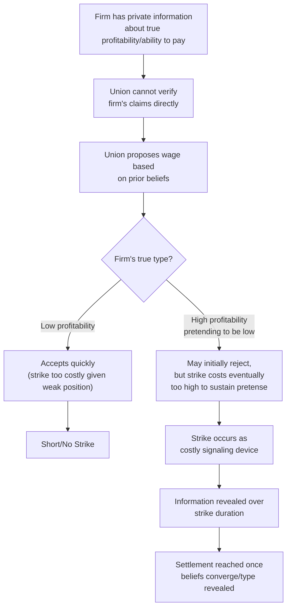

## Strikes and Bargaining Theory

### Definition and Core Concept

Strikes and bargaining theory addresses one of the central puzzles in labor economics: if both the union and the firm know the eventual bargaining outcome would be mutually beneficial to reach without a costly work stoppage, why do strikes occur at all? Since a strike destroys value for both parties (lost wages for workers, lost production and profit for the firm) relative to reaching the same or a similar settlement without the stoppage, a strike represents an apparent **bargaining inefficiency** — and understanding why rational parties nonetheless sometimes strike has motivated a substantial body of theoretical and empirical work in labor economics and game theory.

This topic surveys the leading theoretical explanations for strike incidence (asymmetric information models, the Hicksian accident-avoidance framework, and joint-cost/political models), their formal structures, and the empirical evidence on strike frequency, duration, and macroeconomic determinants.

### The Coasian/Efficiency Puzzle

**Key Points**

- Under the assumption of **complete information** (both parties know each other's payoffs, costs, and reservation values with certainty) and rational behavior, standard bargaining theory (following the logic of the **Coase theorem** applied to bilateral bargaining) predicts that strikes should **not occur** in equilibrium — the parties should always be able to identify and agree to the eventual settlement wage immediately, without incurring the joint deadweight loss of a work stoppage.
- This creates the theoretical puzzle motivating the strikes literature: since strikes are empirically observed with some regularity, any successful theory of strikes must relax one or more of the standard assumptions (complete information, full rationality, or the absence of relevant frictions/constraints) that would otherwise rule strikes out.

### The Hicksian Model: Strikes as Errors Along a Learning Curve

**Key Points**

- **John Hicks (1932)** provided one of the earliest formal treatments, modeling strikes as resulting from **miscalculation or incomplete information** about the other party's true resistance/concession curves during negotiation.
- In the Hicksian framework, each party has a "concession curve": the union's minimum acceptable wage falls the longer a strike persists (as accumulated lost wages erode their resolve/resources), while the firm's maximum acceptable wage offer rises the longer a strike persists (as accumulated lost profit erodes their resistance).
- A strike occurs, in this framework, when the parties' initial expectations about where these curves intersect are **mutually inconsistent** — each side initially believes it can extract better terms by holding out, and the strike itself serves to reveal information (about resolve, financial resources, and true willingness to concede) that brings expectations into alignment, at which point a settlement is reached.
- **Critique**: The Hicksian model has been widely criticized for treating strikes essentially as the result of a *forecasting error* without a rigorous account of why fully rational parties would systematically make such errors, or why the same negotiating parties would repeat this error across renegotiation cycles rather than learning from experience — this critique motivated the shift toward asymmetric information models as a more rigorous microfoundation.

### Diagrammatic Representation: Hicksian Concession Curves

<svg xmlns="http://www.w3.org/2000/svg" viewBox="0 0 600 400">
<text x="300" y="25" text-anchor="middle" font-size="16" font-weight="bold" fill="#1a1a1a">Hicksian Concession Curves (svg_diagram)</text>
<line x1="80" y1="340" x2="550" y2="340" stroke="#333" stroke-width="2" />
<line x1="80" y1="340" x2="80" y2="50" stroke="#333" stroke-width="2" />

<text x="315" y="370" text-anchor="middle" font-size="13" fill="#333">Strike Duration</text>

<text x="30" y="195" text-anchor="middle" font-size="13" fill="#333" transform="rotate(-90 30 195)">Wage Demand/Offer</text>

<path d="M 100 90 Q 300 180 520 260" stroke="#dc2626" stroke-width="2.5" fill="none" />
<text x="380" y="200" font-size="12" fill="#dc2626" font-weight="bold">Union Minimum Acceptable Wage (falls with strike duration)</text>

<path d="M 100 300 Q 300 220 520 150" stroke="#2563eb" stroke-width="2.5" fill="none" />
<text x="380" y="140" font-size="12" fill="#2563eb" font-weight="bold">Firm Maximum Acceptable Offer (rises with strike duration)</text>

<circle cx="330" cy="205" r="5" fill="#16a34a" />
<text x="340" y="200" font-size="11" fill="#16a34a" font-weight="bold">Settlement Point</text>
<line x1="330" y1="205" x2="330" y2="340" stroke="#999" stroke-width="1" stroke-dasharray="3,3" />
<text x="330" y="360" text-anchor="middle" font-size="11" fill="#16a34a">Strike ends here</text>
</svg>

### Asymmetric Information Models: The Modern Standard Framework

**Key Points**

- The dominant modern theoretical approach relies on **asymmetric information** between the union and the firm — most influentially formalized in models building on Kennan and Wilson's extensive work (surveyed in Kennan and Wilson, 1993) applying bargaining-under-incomplete-information game theory to labor disputes.
- **Core mechanism**: The firm typically possesses private information the union cannot directly observe (e.g., true profitability, ability to pay, or the state of product demand). The union does not know precisely how much the firm can afford to pay, and the firm has a strategic incentive to **understate its true ability to pay** in order to negotiate a lower wage settlement.
- A strike can then function as a **costly signaling/screening device**: a firm claiming poor financial conditions can be tested by the union's willingness to hold out through a costly strike — a firm that is *genuinely* struggling financially will find it relatively cheaper to concede a lower wage quickly (since production losses matter less when profitability is already low or negative), while a firm that is actually profitable (but claiming otherwise) faces a higher opportunity cost of prolonged production loss, making it more likely to concede to reveal its true type and end the strike sooner.
- **Screening equilibrium implication**: In equilibrium, strikes occur with positive probability specifically because they help separate firms of different true types (financial conditions) — the union cannot distinguish a "poor" firm from a "rich" firm claiming poverty without some costly test, and the strike (or the credible threat of one) serves this information-revealation role. This provides a rigorous game-theoretic explanation for why rational parties might strike even though, with full information, they could reach the same eventual settlement immediately.

### Formal Sketch: A Simple Asymmetric Information Bargaining Setup

Consider a simplified setup where the firm's true type $\theta \in \{\theta_L, \theta_H\}$ (low or high profitability) is private information, with the union holding a prior belief $p = \Pr(\theta = \theta_H)$.

- If the union proposes a wage $w$ and the firm rejects, a strike of length $T$ ensues before a revised offer.
- The **low-profitability firm** finds it optimal to accept a relatively modest wage offer quickly (avoiding a strike that would compound its already weak financial position).
- The **high-profitability firm**, if it can obtain a better settlement by "pretending" to be low-profitability (rejecting the initial offer), has an incentive to mimic the low-type's rejection behavior, but the strike cost imposed by rejection screens out this pretense over time — because the high-type firm loses more (in expected foregone profit) by prolonging the strike than the low type does, only the high type finds it worthwhile to hold out long enough to eventually extract a better settlement, whereas mimicking becomes too costly for a genuinely low-profitability firm.
- This generates a **separating equilibrium** in which strike duration itself carries information: longer strikes (in equilibrium) signal that the striking party is of a type (financial condition) more resistant to the initial offer, and the settlement reached reflects information revealed through the passage of costly strike time.

### Determinants of Strike Incidence and Duration

**Key Points**

- **Business cycle sensitivity**: Strike frequency has been empirically found to be **procyclical** in many studies (strikes more common during economic expansions) — a somewhat counterintuitive finding given that one might expect strikes during hard economic times; the leading explanation is that during expansions, the potential surplus at stake (higher expected firm profits) is larger, raising the incentive for unions to test/probe firm profitability through a strike threat, and workers face better outside options (easier re-employment) reducing the cost of striking.
- **Information asymmetry severity**: Industries or firms where financial information is less transparent (harder for unions and outside analysts to verify true profitability) are predicted, and have some empirical support, to exhibit higher strike incidence, consistent with the asymmetric information framework's core mechanism.
- **Union and firm resources**: The size of strike funds (union side) and financial reserves/insurance (firm side) affect the relative cost of prolonged disputes for each party, directly shaping the Hicksian concession curves and the negotiating leverage in an asymmetric information framework.
- **Legal/institutional environment**: Rules governing replacement worker hiring during strikes, mandatory cooling-off periods, final-offer/interest arbitration provisions (common in public-sector labor law, particularly for essential services like police and firefighters), and unemployment benefit eligibility during labor disputes all directly affect the relative costs each party bears during a strike, shaping both strike incidence and expected duration.
- **Public sector considerations**: In many jurisdictions, public-sector strikes are legally restricted or prohibited (particularly for essential services), and disputes are instead resolved through **mandatory arbitration** mechanisms — this substitutes a different (non-strike) mechanism for resolving the underlying bargaining-under-uncertainty problem, with its own separate theoretical literature on arbitrator behavior and its effects on bargaining incentives (e.g., the "chilling effect" hypothesis, where anticipation of arbitration can reduce the parties' own incentive to negotiate seriously).

### Final-Offer Arbitration and Strategic Effects

**Key Points**

- **Final-offer arbitration (FOA)**: A dispute resolution mechanism (common in some public-sector contexts, notably certain North American police/firefighter and other essential-service bargaining regimes) in which each party submits a final wage offer, and a neutral arbitrator must select **one of the two offers in its entirety** (rather than splitting the difference) — designed explicitly to incentivize both parties to submit "reasonable" offers, since an extreme offer risks being rejected wholesale in favor of the other side's more moderate proposal.
- Theoretical and empirical work on FOA (following early formalizations, e.g., by Farber, 1980) generally supports the prediction that FOA induces more moderate, closely-converging offers from both parties compared to conventional arbitration (where the arbitrator can split the difference or impose any settlement), since the "winner-take-all" structure of FOA penalizes extreme positions more severely.
- **"Narcotic effect" and "chilling effect" concerns**: Critics of arbitration mechanisms (both final-offer and conventional) have raised concerns that anticipation of eventual arbitration can reduce the parties' incentive to reach a negotiated settlement on their own ("chilling" genuine bargaining), and that repeated reliance on arbitration in successive contract cycles can create a habitual dependence on third-party resolution rather than direct negotiation ("narcotic effect") — empirical evidence on the magnitude of these effects has been mixed across studies and jurisdictions.

### Empirical Evidence on Strike Trends

**Key Points**

- **Long-run decline in strike activity**: Most advanced economies, including the US, have experienced a substantial long-run decline in strike frequency and days lost to work stoppages since the mid-20th century peak, closely tracking the broader decline in union density discussed under union wage and employment effects.
- **Concentration in specific sectors**: Contemporary strike activity in many advanced economies is disproportionately concentrated in the public sector, education, healthcare, and a small number of heavily unionized private industries (e.g., certain manufacturing and logistics sectors), reflecting the sectoral concentration of remaining union density.
- **Duration patterns**: Empirical studies of strike duration generally find results consistent with the asymmetric information framework's predictions — strikes tend to be longer when there is greater uncertainty about the firm's true financial position, and duration is influenced by measurable proxies for information asymmetry (e.g., firm size, public listing status affecting financial disclosure requirements).
- [Inference] While the asymmetric information framework has gained substantial theoretical and some empirical support as the leading modern explanation for strike incidence, isolating this specific mechanism cleanly from alternative or complementary explanations (union leadership political incentives to demonstrate militancy to the membership, inter-union rivalry, imperfect rationality/behavioral factors) in observational strike data remains an active area of empirical labor economics research.

### Political/Organizational Models of Strikes

**Key Points**

- Beyond the pure information-economics framework, some models emphasize **intra-union political dynamics** as a contributing explanation for strike incidence: union leadership may call or prolong strikes partly to demonstrate militancy and responsiveness to the median voter model of union preferences within the membership, even when a comparable settlement could plausibly have been reached without a work stoppage — particularly relevant where union leadership faces internal electoral competition or ratification votes requiring visible demonstration of bargaining effort.
- This political-economy channel is generally viewed as **complementary** to, rather than a full substitute for, the asymmetric information framework — both mechanisms can operate simultaneously in explaining real-world strike incidence and duration.

### Costs of Strikes

**Key Points**

- **Direct costs**: Lost wages for striking workers (partially offset in some cases by strike fund payments), lost production and revenue for the firm, and potential permanent customer/market share loss if substitutes are found during the disruption.
- **Indirect/spillover costs**: Effects on suppliers, downstream customers, and — in sectors with significant externalities (transportation, healthcare, utilities) — the broader public, which is part of the justification frequently offered for restricting strikes and mandating arbitration in essential public services.
- **Reputational and relationship costs**: Strikes can damage the longer-term labor-management relationship, potentially reducing the scope for the kind of extensive information-sharing and trust-building that could support efficient bargaining outcomes (as discussed under efficient bargaining models) in future contract negotiations.

### Policy Implications

**Key Points**

- **Information disclosure requirements**: Since asymmetric information about firm profitability is the central driver of strikes in the modern theoretical framework, policies or institutional practices that improve credible financial disclosure to unions (e.g., "open-book" bargaining practices, mandatory financial disclosure in certain bargaining contexts) are predicted by the theory to reduce strike incidence by narrowing the information gap that motivates costly signaling.
- **Design of dispute resolution mechanisms**: The choice between conventional arbitration, final-offer arbitration, and unrestricted strike rights involves an explicit policy trade-off between minimizing direct strike costs (particularly relevant in essential public services) and preserving the parties' incentives to negotiate directly and reveal private information efficiently, since heavy-handed dispute resolution mechanisms can generate "chilling effects" on genuine bargaining.
- **Sector-specific considerations**: Given the disproportionate concentration of contemporary strike activity and its associated public costs in essential public services, ongoing policy debates continue over the appropriate scope of strike restrictions versus reliance on mandatory arbitration mechanisms, with each approach carrying its own trade-offs in terms of bargaining efficiency, wage outcome fairness, and public service continuity.

### Related Topics

- Union Wage and Employment Effects
- The Monopoly Union Model
- The Right to Manage Model and Nash Bargaining
- Efficient Bargaining Models
- Union Objectives and Membership Models
- Asymmetric Information and Signaling Games
- Final-Offer and Conventional Arbitration Mechanisms
- Public Sector Labor Relations
- Cross Country Unemployment Comparisons
- Game Theory in Labor Economics