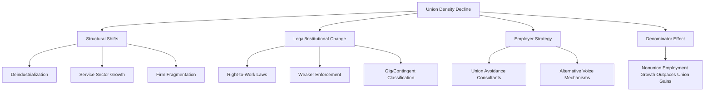

## Trends in Union Density

### Definition and Measurement

Union density refers to the proportion of employed workers who are members of a labor union, typically expressed as:

$$\text{Union Density} = \frac{\text{Number of Union Members}}{\text{Total Employed Workers}} \times 100$$

A related but distinct measure is **collective bargaining coverage**, which includes workers covered by a union contract regardless of formal membership (relevant in countries with extension mechanisms or agency-shop arrangements). The two measures can diverge substantially — in France, for example, union density is low (roughly single digits) while collective bargaining coverage exceeds 90% due to legal extension of sectoral agreements. Analysts should always specify which measure is being discussed, since policy conclusions differ depending on which is used.

Data sources include:

- Household surveys (e.g., the U.S. Current Population Population Survey, CPS)
- Establishment/employer surveys
- Administrative records from union federations or labor ministries
- OECD/ILOSTAT harmonized cross-country series

### Historical Trend: The United States

U.S. private-sector union density has declined almost continuously since its mid-20th-century peak.

| Period | Approx. Overall Density | Approx. Private-Sector Density | Approx. Public-Sector Density |
| --- | --- | --- | --- |
| 1950s peak | ~33% | ~35% | Low |
| 1983 (earliest consistent BLS series) | 20.1% | 16.8% | 36.7% |
| 2000 | 13.5% | 9.0% | 37.5% |
| 2020s (recent) | ~10% | ~6% | ~32-33% |

**Key Points**

- The decline is concentrated almost entirely in the private sector; public-sector density has remained comparatively stable and much higher.
- Because the public sector has held steady while the private sector shrank, the *composition* of the union movement has shifted: a much larger share of unionized workers today are government employees than in the mid-20th century.
- Total membership counts have not always tracked density in the same direction — total employment growth can cause density to fall even when absolute union membership is flat or rising modestly.

### Cross-Country Patterns

Union density trajectories vary considerably by country, driven by differing institutional architectures.

| Country Type | Density Trend | Illustrative Cases |
| --- | --- | --- |
| Ghent-system countries | Relatively stable/high | Sweden, Denmark, Finland, Belgium |
| Liberal market economies | Sharp, sustained decline | United States, United Kingdom, Australia |
| Coordinated economies w/ extension | Density low but coverage high | France, Spain |
| Post-communist transition economies | Steep decline from historically inflated levels | Poland, Hungary, Czech Republic |

The **Ghent system** — where unions administer or co-administer unemployment insurance — is one of the most robust institutional predictors of sustained high density, since it ties a tangible, ongoing benefit to membership rather than relying solely on collective bargaining outcomes.

### Explanatory Factors

Economists generally decompose the causes of union density decline into several categories:

**Structural/Compositional Shifts**

- Deindustrialization: manufacturing, historically union-dense, has shrunk as a share of employment in most advanced economies.
- Growth of services, especially non-tradable, dispersed-employer service sectors that are harder to organize.
- Firm-size effects: smaller establishments and more fragmented supply chains (subcontracting, franchising) raise organizing costs per worker covered.

**Legal and Institutional Factors**

- Right-to-work laws (in the U.S. context) reduce union security by prohibiting mandatory dues as a condition of employment, weakening union finances and membership incentives.
- Changes in labor law enforcement intensity (e.g., National Labor Relations Board case backlogs, penalty structures for unfair labor practices) affect employer cost-benefit calculus around resisting organizing drives.
- Globalization and increased capital mobility raise the elasticity of labor demand, which theoretically increases the cost of union wage premiums to employers and can suppress both bargaining power and worker willingness to unionize (see [[Union Bargaining Power and Elasticity of Demand]] concepts).

**Employer Behavior**

- Increased use of professional union-avoidance consultants and "persuader" campaigns during organizing drives.
- Substitution of formal collective voice with HR-managed "employee involvement" programs offering some grievance/voice functions without formal bargaining rights.

**Worker Preferences and Composition**

- Survey evidence (e.g., "worker representation gap" studies) has historically found that a nontrivial share of nonunion workers report they would vote for a union if given the opportunity — suggesting *revealed* density understates *latent* demand for representation. [Inference: the magnitude of this gap varies significantly by survey methodology and time period, and is contested in the literature.]
- Demographic shifts, including growth of contingent, gig, and platform-based work arrangements that fall outside traditional employee classifications used in labor law.

### Formal Model: A Simple Density Dynamics Framework

A basic stock-flow model treats density as driven by organizing gains net of decertifications and job losses in unionized firms:

$$\Delta U_t = G_t - D_t - L_t$$

Where:

- $U_t$ = union membership stock in period $t$
- $G_t$ = gains from new organizing (NLRB election wins, voluntary recognition)
- $D_t$ = losses from decertification elections
- $L_t$ = losses from unionized-firm contraction, plant closure, or relocation

Density itself, $u_t = U_t / N_t$ (where $N_t$ is total employment), falls whenever $\Delta N_t$ (aggregate employment growth) outpaces $\Delta U_t$, even absent any decertification — this is the pure "denominator effect" often cited to explain density decline during periods of strong non-union job growth.

### Mermaid Diagram: Causal Pathways to Density Decline

### SVG Diagram: Stylized Density Trend Comparison (svg_diagram)

<svg xmlns="http://www.w3.org/2000/svg" viewBox="0 0 640 360">
<text x="320" y="24" text-anchor="middle" font-size="16" font-weight="bold" font-family="sans-serif">Stylized Union Density Trends (svg_diagram)</text>
<line x1="60" y1="300" x2="600" y2="300" stroke="black" stroke-width="1.5" />
<line x1="60" y1="300" x2="60" y2="40" stroke="black" stroke-width="1.5" />

<text x="30" y="305" font-size="11" font-family="sans-serif">0%</text>

<text x="20" y="180" font-size="11" font-family="sans-serif">25%</text>

<text x="20" y="55" font-size="11" font-family="sans-serif">50%</text>

<line x1="55" y1="175" x2="600" y2="175" stroke="#ccc" stroke-width="0.5" stroke-dasharray="4" />

<line x1="55" y1="50" x2="600" y2="50" stroke="#ccc" stroke-width="0.5" stroke-dasharray="4" />

<text x="55" y="320" font-size="11" font-family="sans-serif">1950</text>

<text x="290" y="320" font-size="11" font-family="sans-serif">1985</text>

<text x="570" y="320" font-size="11" font-family="sans-serif">2025</text>

<polyline points="60,110 150,120 240,160 320,215 400,245 480,265 560,278" fill="none" stroke="#1f77b4" stroke-width="2.5" />
<text x="410" y="240" font-size="11" fill="#1f77b4" font-family="sans-serif">US Overall</text>
<polyline points="60,90 150,95 240,100 320,105 400,108 480,110 560,112" fill="none" stroke="#2ca02c" stroke-width="2.5" />
<text x="410" y="100" font-size="11" fill="#2ca02c" font-family="sans-serif">Ghent-system (e.g. Sweden)</text>
<polyline points="60,105 150,140 240,190 320,230 400,255 480,270 560,280" fill="none" stroke="#d62728" stroke-width="2.5" stroke-dasharray="6,3" />
<text x="410" y="285" font-size="11" fill="#d62728" font-family="sans-serif">US Private Sector</text>
</svg>

*[Unverified: this SVG is a schematic illustration of relative shapes and orderings, not a precisely scaled plot of official statistics; consult BLS, OECD, or ILOSTAT series for exact historical values.]*

### Consequences of Declining Density

**Wage and Inequality Effects**

- The union wage premium — the wage differential between comparably skilled union and nonunion workers — means declining density mechanically reduces the share of the workforce receiving that premium.
- Research associates declining density with a meaningful share of the rise in wage inequality in the U.S. since the 1970s, operating both through direct wage effects and through erosion of union "threat effects" that had previously raised nonunion wages in unionized industries. [Inference: the precise share of inequality growth attributable to union decline is disputed across studies and estimation methods.]

**Political Economy Effects**

- Unions have historically been significant institutional actors in voter mobilization and campaign finance; declining density is associated with reduced union political spending capacity and organizational reach.

**Firm-Level Effects**

- Lower density is associated with reduced worker voice mechanisms at the firm level, though nonunion alternatives (open-door policies, works-council-like committees where legal) partially substitute in some contexts.

### Recent Developments

Public attention to unionization in the U.S. has increased in the 2020s, marked by high-profile organizing campaigns (e.g., large e-commerce warehouses, coffee retail chains, university graduate student units) and elevated NLRB election petition filings relative to the prior decade. However, aggregate density has continued to decline or remain flat because the *rate* of new organizing has not been large enough relative to overall employment growth to reverse the denominator effect. [Unverified: figures for the most recent one to two years should be checked against the latest BLS "Union Members" annual release, as density statistics are revised and updated annually and this response may not reflect the most current release.]

**Next Steps**

- Union Wage Premium: Estimation Methods and Empirical Findings
- The Ghent System: Institutional Design and Comparative Effects
- Right-to-Work Laws: Economic Theory and Empirical Evidence
- NLRB Election Procedures and Card-Check Recognition
- Union Bargaining Power and Elasticity of Labor Demand
- Collective Bargaining Coverage vs. Union Density: Measurement Issues
- The "Representation Gap": Latent Demand for Unionization
- Public-Sector Bargaining Rights and State-Level Variation
- Gig Economy Worker Classification and Collective Action
- Sectoral Bargaining Models and Extension Mechanisms in Europe