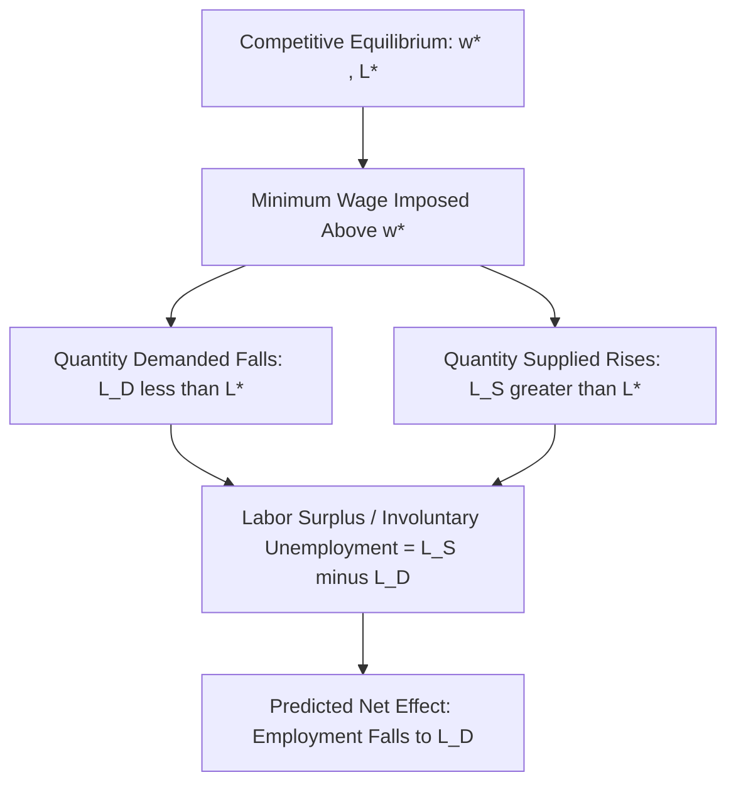

## Competitive Model Predictions

### Theoretical Foundation

The competitive labor market model treats labor as a homogeneous good traded in a market with many buyers (firms) and many sellers (workers), none of whom individually possesses market power. Under this framework, both labor supply and labor demand curves are derived from optimizing behavior:

- **Labor demand** is derived from firms' profit maximization, where firms hire workers up to the point where the marginal revenue product of labor (MRPL) equals the wage.
- **Labor supply** is derived from workers' utility maximization over the leisure-consumption tradeoff, yielding an upward-sloping supply curve (at least over the relevant range) with respect to the wage.

Equilibrium occurs where these curves intersect, determining the competitive wage $w^*$ and employment level $L^*$.

### The Core Prediction: A Binding Minimum Wage Reduces Employment

If a minimum wage $w_{min}$ is set above the competitive equilibrium wage $w^*$, the model predicts a **disemployment effect**: quantity of labor demanded falls, quantity supplied rises, and a labor surplus (involuntary unemployment) emerges.

$$L_D(w_{min}) < L^* < L_S(w_{min})$$

The magnitude of the employment decline depends on the wage elasticity of labor demand, $\varepsilon_D$:

$$\varepsilon_D = \frac{\%\Delta L_D}{\%\Delta w}$$

A larger (more negative) elasticity implies a larger predicted employment loss for a given minimum wage increase. The competitive model's core comparative-static result:

$$\frac{\partial L^*}{\partial w_{min}} < 0 \quad \text{for } w_{min} > w^*$$

### Graphical Representation

### SVG Diagram: Standard Supply-Demand Minimum Wage Diagram (svg_diagram)

<svg xmlns="http://www.w3.org/2000/svg" viewBox="0 0 640 400">
<text x="320" y="24" text-anchor="middle" font-size="16" font-weight="bold" font-family="sans-serif">Competitive Model: Binding Minimum Wage (svg_diagram)</text>
<line x1="70" y1="340" x2="600" y2="340" stroke="black" stroke-width="1.5" />
<line x1="70" y1="340" x2="70" y2="40" stroke="black" stroke-width="1.5" />
<text x="600" y="360" font-size="12" font-family="sans-serif">Employment (L)</text>
<text x="20" y="40" font-size="12" font-family="sans-serif">Wage (w)</text>
<line x1="90" y1="60" x2="480" y2="320" stroke="#1f77b4" stroke-width="2.5" />
<text x="485" y="325" font-size="12" fill="#1f77b4" font-family="sans-serif">Supply (L_S)</text>
<line x1="90" y1="320" x2="480" y2="60" stroke="#d62728" stroke-width="2.5" />
<text x="485" y="65" font-size="12" fill="#d62728" font-family="sans-serif">Demand (L_D)</text>
<line x1="70" y1="190" x2="285" y2="190" stroke="#888" stroke-width="1" stroke-dasharray="4" />
<line x1="285" y1="190" x2="285" y2="340" stroke="#888" stroke-width="1" stroke-dasharray="4" />
<circle cx="285" cy="190" r="4" fill="black" />
<text x="245" y="185" font-size="12" font-family="sans-serif">w*, L*</text>
<line x1="70" y1="130" x2="600" y2="130" stroke="#2ca02c" stroke-width="2" />
<text x="500" y="125" font-size="12" fill="#2ca02c" font-family="sans-serif">Minimum Wage (w_min)</text>
<line x1="205" y1="130" x2="205" y2="340" stroke="#d62728" stroke-width="1" stroke-dasharray="3" />
<text x="150" y="355" font-size="11" fill="#d62728" font-family="sans-serif">L_D (employment)</text>
<line x1="365" y1="130" x2="365" y2="340" stroke="#1f77b4" stroke-width="1" stroke-dasharray="3" />
<text x="370" y="355" font-size="11" fill="#1f77b4" font-family="sans-serif">L_S (job seekers)</text>
<line x1="205" y1="130" x2="365" y2="130" stroke="black" stroke-width="4" />
<text x="230" y="115" font-size="12" font-weight="bold" font-family="sans-serif">Surplus (Unemployment)</text>
</svg>

### Key Assumptions Driving the Prediction

**Key Points**

- **Firms are wage-takers**: no individual firm's hiring decision affects the market wage — this rules out monopsony power.
- **Homogeneous labor and jobs**: workers are perfect substitutes within the relevant labor market segment, so there is no differentiation in match quality or non-wage compensation.
- **Perfect information**: workers and firms have full knowledge of wages and job opportunities, so there is no search friction.
- **Flexible wages absent the policy**: in the absence of the minimum wage, wages adjust freely to clear the market.
- **No monopsony power, no efficiency wage considerations, and no compensating differentials complicating the wage-employment relationship.**

Each of these assumptions is a point of departure for alternative models (most notably monopsony models — see [[Monopsony Models of the Labor Market]]) that generate different predictions.

### Secondary Predictions of the Competitive Model

Beyond aggregate employment, the standard competitive model generates several auxiliary predictions:

1. **Disproportionate effects on low-skill/low-wage workers**: because the minimum wage binds only on workers whose competitive wage would otherwise fall below $w_{min}$, disemployment effects should concentrate among teens, low-experience workers, and low-education workers.
2. **Reduced non-wage compensation**: firms may respond to a wage floor by cutting fringe benefits, training, or workplace amenities to offset the higher mandated cash wage, since total compensation (not just the wage) is what equates at the margin in the model. [Inference: the empirical magnitude of this substitution is contested and appears to vary by industry and enforcement context.]
3. **Reduced hours per worker**: firms may adjust on the hours margin rather than (or in addition to) the headcount margin, since $L$ in the model can represent labor input broadly (hours × workers).
4. **Increased job search duration/queuing**: with a labor surplus, the model predicts increased queuing for available minimum-wage jobs, potentially via non-price rationing mechanisms (favoritism, informal screening, discrimination).
5. **Disemployment concentrated in competitive/low-margin sectors**: industries with thin margins and higher exposure to low-wage labor costs (e.g., some segments of retail and food service) are predicted to see larger relative effects, all else equal.
6. **Substitution toward capital or higher-skill labor**: a higher relative price of low-skill labor should induce substitution toward capital equipment (automation) or toward higher-skill labor if these are relative substitutes in the firm's production function, consistent with standard factor-demand theory:

$$\frac{\partial L_{low}}{\partial w_{min}} < 0, \quad \frac{\partial K}{\partial w_{min}} > 0 \text{ (if K and L are substitutes)}$$

### Elasticity-Based Magnitude Predictions

The competitive model's employment-loss prediction scales with the elasticity of labor demand. Two polar textbook cases:

| Elasticity Scenario | Demand Curve Shape | Predicted Employment Response |
| --- | --- | --- |
| Perfectly inelastic ($\varepsilon_D = 0$) | Vertical | No employment change; wage bill rises fully |
| Highly elastic ($\varepsilon_D \to -\infty$) | Near-horizontal | Large employment loss for small wage increase |
| Unit elastic ($\varepsilon_D = -1$) | — | Wage bill (i.e. $w \times L$) unchanged |

**Example**

If $\varepsilon_D = -0.3$ (commonly cited textbook range for teen labor demand) and the minimum wage rises by 10%, the competitive model predicts approximately a 3% decline in teen employment, holding other factors constant. [Inference: this is a stylized textbook illustration using a commonly cited elasticity estimate range, not a claim about a specific real-world episode; actual elasticity estimates vary across studies, time periods, and demographic groups.]

### Distributional and Welfare Predictions

The competitive model also generates unambiguous welfare predictions under its assumptions:

- **Deadweight loss** arises because some mutually beneficial trades (between workers willing to work below $w_{min}$ and firms willing to hire at that wage) are precluded by the price floor.
- **Transfer effects**: workers who retain employment at $w_{min}$ receive higher earnings (a transfer from firm surplus, and partly from consumers via price pass-through), while displaced workers and firms bear efficiency losses.
- The net welfare change is theoretically ambiguous in sign only if one incorporates externalities or distributional weighting outside the basic model; the *basic* competitive model without such extensions predicts an unambiguous efficiency loss relative to the competitive equilibrium.

### Contrast with Empirical Findings

**Conclusion**

The competitive model's central disemployment prediction has been extensively tested empirically, most famously via natural-experiment and difference-in-differences designs (e.g., cross-border minimum wage comparisons). Empirical findings have been mixed: some studies find employment effects consistent with the competitive model's direction (negative, small-to-moderate magnitude), while other influential studies find employment effects statistically indistinguishable from zero or occasionally positive in certain settings. This empirical ambiguity is a primary motivation for monopsony-based alternative models, which can rationalize small or null employment effects within a coherent theoretical framework rather than treating them merely as measurement noise. [Unverified: the balance of the broader empirical literature, and which specific studies are considered most credible, remains an active and disputed area of ongoing labor economics research; consult recent meta-analyses and literature reviews for the current state of the evidence.]

**Next Steps**

- Monopsony Models of the Labor Market
- Elasticity of Labor Demand: Determinants and Estimation
- Empirical Methods: Difference-in-Differences in Minimum Wage Research
- Compensating Wage Differentials and Non-Wage Adjustment Margins
- Efficiency Wage Theory
- Deadweight Loss and Welfare Analysis of Price Floors
- Card-Krueger Natural Experiment and Its Critiques
- Minimum Wage Effects on Skill Substitution and Automation