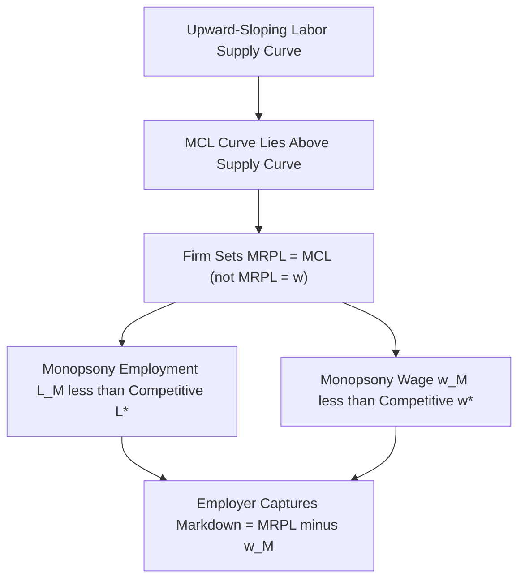

## Monopsony Model Predictions

### Theoretical Foundation

A monopsony is a market structure in which a single buyer (or a small number of buyers with market power) faces the entire market labor supply curve, rather than being a wage-taker. In the labor market context, this means the firm's hiring decision itself affects the wage it must pay — to hire additional workers, the firm must raise the wage offered, and (in the classic single-price monopsony model) this higher wage typically applies to *all* workers hired, not just the marginal one.

This generates a critical wedge: the firm's **marginal cost of labor (MCL)** exceeds the wage, because hiring one more worker requires raising pay to all inframarginal workers as well:

$$MCL = w + L\frac{dw}{dL}$$

Since the labor supply curve is upward-sloping ($dw/dL > 0$), $MCL > w$ at every point along the supply curve (except at $L=0$).

### Profit Maximization Under Monopsony

The monopsonist hires labor up to the point where marginal revenue product of labor equals marginal cost of labor (not the wage):

$$MRPL = MCL$$

This yields an equilibrium employment level $L_M$ that is **below** the competitive employment level $L^*$, and a wage $w_M$ that is **below** the competitive wage $w^*$ — the monopsonist deliberately restricts hiring to suppress the wage it must pay, extracting a form of employer surplus analogous to markdown pricing on the input side.

### Graphical Representation

### SVG Diagram: Monopsony Equilibrium and Minimum Wage Effect (svg_diagram)

<svg xmlns="http://www.w3.org/2000/svg" viewBox="0 0 640 420">
<text x="320" y="24" text-anchor="middle" font-size="16" font-weight="bold" font-family="sans-serif">Monopsony Model: Wage Floor Can Raise Employment (svg_diagram)</text>
<line x1="70" y1="360" x2="600" y2="360" stroke="black" stroke-width="1.5" />
<line x1="70" y1="360" x2="70" y2="40" stroke="black" stroke-width="1.5" />
<text x="590" y="380" font-size="12" font-family="sans-serif">Employment (L)</text>
<text x="20" y="40" font-size="12" font-family="sans-serif">Wage (w)</text>
<line x1="90" y1="80" x2="500" y2="340" stroke="#1f77b4" stroke-width="2.5" />
<text x="505" y="345" font-size="12" fill="#1f77b4" font-family="sans-serif">Supply (S = ACL)</text>
<path d="M 90 80 L 260 300 L 500 220" fill="none" stroke="#9467bd" stroke-width="2.5" stroke-dasharray="2,2" />
<text x="505" y="220" font-size="12" fill="#9467bd" font-family="sans-serif">MCL</text>
<line x1="90" y1="330" x2="500" y2="80" stroke="#d62728" stroke-width="2.5" />
<text x="505" y="85" font-size="12" fill="#d62728" font-family="sans-serif">Demand (MRPL)</text>
<circle cx="260" cy="185" r="4" fill="black" />
<line x1="70" y1="185" x2="260" y2="185" stroke="#888" stroke-width="1" stroke-dasharray="4" />
<line x1="260" y1="185" x2="260" y2="360" stroke="#888" stroke-width="1" stroke-dasharray="4" />
<text x="150" y="180" font-size="11" font-family="sans-serif">MRPL=MCL intersection</text>
<line x1="70" y1="252" x2="260" y2="252" stroke="green" stroke-width="1" stroke-dasharray="3" />
<text x="20" y="256" font-size="11" fill="green" font-family="sans-serif">w_M</text>
<circle cx="260" cy="252" r="4" fill="green" />
<text x="270" y="252" font-size="11" fill="green" font-family="sans-serif">Monopsony Equilibrium (L_M, w_M)</text>
<line x1="70" y1="150" x2="390" y2="150" stroke="orange" stroke-width="2" />
<text x="400" y="150" font-size="12" fill="orange" font-family="sans-serif">Minimum Wage set between w_M and w*</text>
<line x1="390" y1="150" x2="390" y2="360" stroke="orange" stroke-width="1" stroke-dasharray="3" />
<text x="330" y="378" font-size="11" fill="orange" font-family="sans-serif">L_min &gt; L_M</text>
</svg>

### Central Prediction: Minimum Wage Can Raise Employment

**Key Points**

- Under monopsony, imposing a minimum wage $w_{min}$ *at or slightly above* $w_M$ **eliminates the firm's incentive to restrict hiring for wage-suppression purposes**, because the firm can no longer lower the wage by hiring less — the wage is fixed by the floor.
- Within a specific range ($w_M \le w_{min} \le w^*$), the effective marginal cost of labor facing the firm becomes horizontal at $w_{min}$ (since all workers are paid the same mandated wage regardless of quantity hired), so the firm simply hires along the demand curve up to $MRPL = w_{min}$.
- This produces the counterintuitive **monopsony prediction**: employment *increases* as the minimum wage rises from $w_M$ toward $w^*$, reaching a maximum at $w_{min} = w^*$ (the competitive employment level).
- **Beyond $w^*$**, the model reverts to standard competitive-model logic: further increases in the minimum wage above $w^*$ reduce employment, since the firm is now off its demand curve entirely.

Formally, the employment response is non-monotonic:

$$\frac{\partial L}{\partial w_{min}} > 0 \quad \text{for } w_M \le w_{min} \le w^*$$

$$\frac{\partial L}{\partial w_{min}} < 0 \quad \text{for } w_{min} > w^*$$

This produces an inverted-U (or "hump-shaped") relationship between the minimum wage level and employment, in contrast to the strictly monotonic negative relationship predicted by the competitive model.

### Sources of Monopsony Power

Modern labor economics distinguishes monopsony power arising from several distinct mechanisms, not only literal single-employer "company town" scenarios:

1. **Search frictions**: workers face costs (time, information, relocation) in finding and switching to alternative jobs, giving even competitively-structured markets an effectively upward-sloping firm-level labor supply curve.
2. **Job differentiation and compensating differentials**: heterogeneous preferences over non-wage job attributes reduce the substitutability of jobs from the worker's perspective, granting each employer some wage-setting power over its specific workforce.
3. **Geographic concentration**: local labor markets with few employers in a given occupation/industry (e.g., a single hospital system in a rural area) exhibit classical monopsony concentration.
4. **Employer concentration/oligopsony**: even with more than one employer, a small number of dominant local employers can exercise coordinated or independent wage-setting power, measurable via concentration indices such as the Herfindahl-Hirschman Index (HHI) applied to local labor markets.
5. **Mobility frictions and non-competes**: contractual restrictions on worker mobility (non-compete agreements, no-poach agreements) directly increase employer wage-setting power by raising the cost of switching employers.

### Empirical Signatures Distinguishing Monopsony from Competition

**Example**

Researchers commonly test for monopsony power using several empirical strategies:

- **Employer concentration and wage regressions**: estimating the elasticity of wages with respect to local labor market concentration (higher concentration predicted to correlate with lower wages under monopsony).
- **Estimating labor supply elasticity to the individual firm**: a low estimated elasticity of labor supply facing an individual firm ($\varepsilon_{LS}^{firm}$) is consistent with monopsony power; a very high (near-infinite) elasticity is consistent with the competitive model.
- **Minimum wage "natural experiments"**: null or positive employment effects following minimum wage increases (as found in several well-known studies, most famously in the fast-food industry literature) are frequently cited as evidence more consistent with monopsony-type models than the pure competitive model, though this interpretation remains debated. [Inference: attributing any specific empirical null result to monopsony rather than to other explanations (e.g., low labor demand elasticity, monopsonistic competition, efficiency wage effects, or measurement issues) requires additional identifying evidence beyond the employment effect alone.]

### Wage Markdown and Welfare Implications

The gap between MRPL and the actual wage under monopsony is often summarized via the **markdown ratio**:

$$\text{Markdown} = \frac{MRPL - w_M}{MRPL} = \frac{1}{1 + \varepsilon_{LS}^{firm}}$$

where $\varepsilon_{LS}^{firm}$ is the firm-level labor supply elasticity. A lower elasticity implies a larger markdown (greater monopsony power).

**Welfare implications diverge sharply from the competitive model:**

- Under monopsony, both employment *and* wages are inefficiently low relative to the competitive benchmark, meaning a well-calibrated minimum wage can improve *both* efficiency and worker welfare simultaneously — a result impossible in the pure competitive model, where any binding wage floor is necessarily distortionary.
- This gives monopsony-based models a distinct normative implication: minimum wage policy is not unambiguously a trade-off between wages and jobs, but potentially a **corrective** policy addressing an underlying market failure (employer wage-setting power).

### Boundary Conditions and Caveats

**Conclusion**

The monopsony prediction that minimum wage increases can raise employment is *conditional*, not universal — it depends critically on the initial minimum wage being below or near $w^*$ and the degree of monopsony power actually present in the specific labor market being analyzed. A minimum wage set well above $w^*$ reduces employment under both the competitive and monopsony models alike. Consequently, monopsony theory does not imply "minimum wage increases never reduce employment" as a general law — it implies that the sign and magnitude of the employment effect is an empirical question that depends on where the current wage sits relative to underlying (unobserved) monopsonistic and competitive benchmarks. [Unverified: real-world labor markets likely exhibit a continuum or mixture of competitive and monopsonistic features across different geographies, occupations, and firm sizes, and the applicable model may differ by context; consult current empirical literature and meta-analyses for market-specific evidence.]

**Next Steps**

- Competitive Model Predictions (contrast case)
- Measuring Labor Market Concentration: HHI and Its Applications
- Search-and-Matching Models of the Labor Market
- Non-Compete Agreements and Labor Mobility
- Card-Krueger Fast-Food Study and Subsequent Replications
- Dynamic Monopsony and Job-to-Job Transition Models
- Efficiency Wage Theory
- Oligopsony and Employer Concentration Empirics