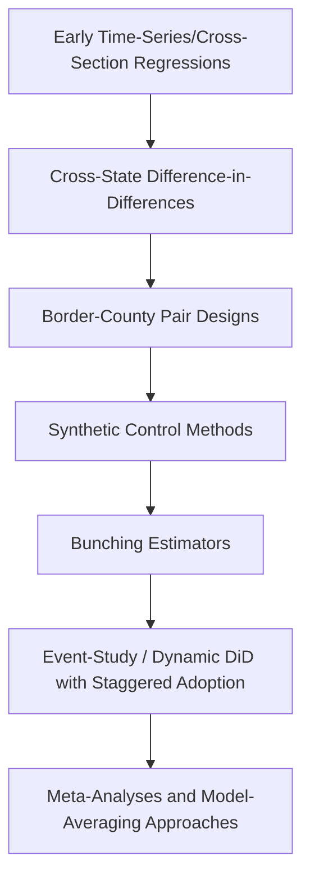

## Empirical Minimum Wage Studies

### Overview and Research Motivation

Empirical minimum wage research seeks to identify the causal effect of minimum wage changes on labor market outcomes — primarily employment, hours, wages, and prices — in real-world settings where the researcher cannot randomly assign wage floors. The central methodological challenge is **confounding**: minimum wage changes are not random; they are often correlated with broader economic conditions, regional trends, or political cycles that independently affect employment. The literature's history is largely a history of increasingly sophisticated strategies to isolate a credible counterfactual.

### The Early Consensus and Its Disruption

Prior to the late 1980s/early 1990s, the dominant empirical approach used time-series or cross-sectional regressions of aggregate employment (often teen employment) on the minimum wage level, generally finding modest negative employment elasticities broadly consistent with the competitive model. This approach relied on national-level variation and struggled to separate the minimum wage's effect from other coincident macroeconomic trends.

The methodological landscape shifted substantially with the introduction of **difference-in-differences (DiD)** designs exploiting *geographic* variation in minimum wage policy, most famously in the Card-Krueger New Jersey/Pennsylvania fast-food study.

### The Card-Krueger Design: A Canonical Difference-in-Differences Study

**Example**

The 1994 Card and Krueger study compared fast-food employment in New Jersey (which raised its minimum wage) to neighboring eastern Pennsylvania (which did not) before and after the policy change, using the untreated state as a counterfactual for what would have happened in New Jersey absent the increase.

The DiD estimator can be expressed as:

$$\hat{\delta}_{DiD} = (\bar{Y}_{NJ,after} - \bar{Y}_{NJ,before}) - (\bar{Y}_{PA,after} - \bar{Y}_{PA,before})$$

The study's central and highly influential finding was that fast-food employment in New Jersey did not fall relative to Pennsylvania following the minimum wage increase — a result inconsistent with the standard competitive model's disemployment prediction, and widely cited as early empirical support for monopsony-consistent (or at least non-competitive) labor market models. This result was highly controversial on publication, prompting a large subsequent literature of replications, critiques, and methodological refinements.

### Methodological Evolution: Identification Strategies

**Key Points**

- **Border-discontinuity designs** (Dube, Lester, and Reich, 2010) compare contiguous county pairs straddling a state border with differing minimum wages, aiming to control more tightly for local economic shocks than the earlier state-pair approach. This literature generally found small or statistically insignificant employment effects.
- **Synthetic control methods** construct a weighted composite of untreated regions designed to closely match the treated region's pre-treatment outcome trajectory, providing an alternative counterfactual construction to simple DiD.
- **Bunching estimators** examine how the wage distribution "bunches" just at or above the new minimum wage, using the shape of this bunching to back out implied labor demand elasticities without relying on employment counts directly.
- **Modern dynamic/event-study designs** address concerns (raised prominently in the broader DiD econometrics literature, e.g., Goodman-Baco, Callaway-Sant'Anna, Sun-Abraham) about bias in traditional two-way fixed-effects estimators when treatment (minimum wage increases) is staggered across units and time.

### Key Empirical Findings by Category

| Outcome Studied | General Finding Pattern | Notes |
| --- | --- | --- |
| Teen/low-wage employment | Mixed: small negative to null in most modern quasi-experimental studies | Effect size sensitive to methodology and time period |
| Restaurant/fast-food employment | Predominantly null to small negative in border-pair studies | Card-Krueger tradition |
| Hours worked | Some evidence of reduction on the hours margin even where headcount is stable | Suggests adjustment on intensive margin |
| Prices (pass-through) | Modest price increases in directly affected sectors (e.g., restaurants) | Consistent with partial cost pass-through |
| Non-wage compensation/benefits | Some evidence of reduced fringe benefits or scheduling flexibility | Mechanism for absorbing cost without headcount cuts |
| Worker turnover | Evidence of reduced turnover in several studies | Consistent with monopsony-type search-friction models |
| Firm exit/entry | Some evidence of increased exit among low-margin, low-wage-intensive firms in a subset of studies | Effects appear concentrated in specific sectors/geographies |

**[Inference: the table above summarizes broad directional tendencies found across a large and heterogeneous literature; individual studies vary considerably in point estimates, statistical significance, and confidence intervals, and the table should not be read as a precise quantitative consensus.]**

### The Neumark-Wascher vs. Card-Krueger-Dube Divide

A defining feature of this literature has been sustained disagreement between research groups using different methodologies and data sources:

- **David Neumark and William Wascher**, using payroll/establishment-level data and broader national panel approaches, have generally reported findings more consistent with modest negative employment effects, and have published methodological critiques of the border-pair and synthetic control literatures.
- **Arindrajit Dube, along with T. William Lester and Michael Reich**, using border-discontinuity designs, have generally reported employment effects statistically indistinguishable from zero, and have in turn critiqued the identification strategies used in studies finding larger negative effects.

This dispute is not merely about data — it substantially concerns which control group construction is most credible for isolating minimum-wage-specific effects from confounding regional trends, and reflects a broader methodological debate in applied microeconomics about the two-way fixed-effects estimator's validity under heterogeneous treatment effects. [Unverified: characterizing the current "balance" of this literature is contested among practitioners themselves; readers should consult recent meta-analyses rather than treat either side's summary as definitive.]

### Meta-Analytic Evidence

**Example**

Meta-analyses (e.g., Doucouliagos and Stanley, 2009, and subsequent updates) that pool employment elasticity estimates across dozens of published studies have generally found:

- A central tendency clustering close to zero, with a wide dispersion of individual study estimates around that center.
- Evidence of **publication bias**, where studies finding statistically significant negative effects appear to be somewhat overrepresented in the published literature relative to what the underlying distribution of true effects would predict, based on funnel-plot asymmetry tests.

[Inference: meta-analytic "average effect" estimates are sensitive to which studies are included, how effect sizes are weighted, and how heterogeneity in study design and context is handled; different meta-analyses using different sample criteria have reached somewhat different quantitative conclusions.]

### SVG Diagram: Effect Size Distribution Across Studies (svg_diagram)

<svg xmlns="http://www.w3.org/2000/svg" viewBox="0 0 640 340">
<text x="320" y="24" text-anchor="middle" font-size="15" font-weight="bold" font-family="sans-serif">Stylized Distribution of Estimated Employment Elasticities (svg_diagram)</text>
<line x1="70" y1="280" x2="580" y2="280" stroke="black" stroke-width="1.5" />
<line x1="320" y1="280" x2="320" y2="60" stroke="#888" stroke-width="1" stroke-dasharray="4" />
<text x="300" y="300" font-size="11" font-family="sans-serif">0</text>
<text x="130" y="300" font-size="11" font-family="sans-serif">-0.3</text>
<text x="500" y="300" font-size="11" font-family="sans-serif">+0.1</text>
<text x="200" y="320" font-size="12" font-family="sans-serif" fill="#555">Negative (competitive-consistent)</text>
<text x="400" y="320" font-size="12" font-family="sans-serif" fill="#555">Null/positive (monopsony-consistent)</text>
<circle cx="150" cy="200" r="5" fill="#d62728" />
<circle cx="180" cy="230" r="5" fill="#d62728" />
<circle cx="210" cy="180" r="5" fill="#d62728" />
<circle cx="250" cy="210" r="5" fill="#d62728" />
<circle cx="290" cy="150" r="5" fill="#9467bd" />
<circle cx="310" cy="190" r="5" fill="#9467bd" />
<circle cx="330" cy="130" r="5" fill="#9467bd" />
<circle cx="345" cy="170" r="5" fill="#2ca02c" />
<circle cx="370" cy="140" r="5" fill="#2ca02c" />
<circle cx="400" cy="200" r="5" fill="#2ca02c" />
<circle cx="420" cy="160" r="5" fill="#2ca02c" />
<path d="M 100 260 Q 320 80 540 260" fill="none" stroke="black" stroke-width="1.5" stroke-dasharray="5,3" />
<text x="440" y="100" font-size="11" font-family="sans-serif">Density of published estimates</text>
</svg>

*[Unverified: this is a schematic illustration of dispersion and central tendency around zero, not a plot of actual meta-analytic data points; consult the primary meta-analysis papers for exact estimates and confidence intervals.]*

### Beyond Employment: Broader Outcome Measures

More recent empirical work has expanded beyond simple employment counts to examine:

- **Household income and poverty effects**: studies examining whether minimum wage increases reduce poverty rates, given imperfect targeting (many minimum-wage workers are not in poor households, and many poor households have no minimum-wage earner).
- **Automation and long-run capital substitution**: emerging research uses establishment-level data and technology adoption measures to test whether minimum wage increases accelerate automation investment in exposed industries over longer time horizons than traditional short-run employment studies capture.
- **Effects on job quality and firm-provided training**: examining whether wage floors induce compensating reductions in training investment or job amenities.
- **Spillover/"ripple" effects on wages above the new minimum**: testing whether minimum wage increases compress the broader low-wage wage distribution beyond just the bottom bracket.

### Methodological Caveats for Interpreting This Literature

**Conclusion**

No single study or design is universally accepted as definitive, and researchers should evaluate empirical minimum wage claims with attention to: (1) the specific identification strategy used and its underlying assumptions, (2) the time horizon studied (short-run vs. long-run effects may differ substantially, particularly regarding capital substitution), (3) the specific population and industry studied (effects plausibly differ across low-wage-intensive sectors, regions with differing labor market concentration, and demographic subgroups), and (4) whether the estimate reflects a *local* average treatment effect specific to the studied minimum wage range, which may not generalize to substantially larger minimum wage increases outside the range of historical policy variation studied. [Unverified: extrapolating estimated elasticities from historically observed minimum wage ranges to much larger prospective increases carries substantial external-validity uncertainty, and is a recurring point of caution raised within the literature itself.]

**Next Steps**

- Card-Krueger Study: Design, Critiques, and Replications
- Difference-in-Differences Methodology and Modern Staggered-Adoption Corrections
- Synthetic Control Methods in Applied Microeconomics
- Bunching Estimators and Their Application to Wage Distributions
- Meta-Analysis Methods: Publication Bias and Funnel Plots
- Minimum Wage Effects on Automation and Capital-Labor Substitution
- Monopsony Model Predictions (theoretical counterpart)
- Poverty Targeting Efficiency of Minimum Wage Policy