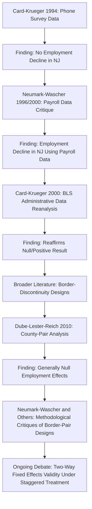

## The Card Krueger Debate

### Origins of the Debate

The Card-Krueger debate refers to the sustained academic controversy sparked by David Card and Alan Krueger's research on the employment effects of minimum wage increases, beginning with their study of the 1992 New Jersey minimum wage increase and its influential 1995 book *Myth and Measurement: The New Economics of the Minimum Wage*. The debate is significant not only for its substantive conclusions but as a landmark episode in the methodological evolution of applied microeconomics, catalyzing broader adoption of quasi-experimental research designs across labor economics.

### The Original Study and Its Central Claim

**Example**

Card and Krueger (1994) surveyed fast-food restaurants in New Jersey and eastern Pennsylvania before and after New Jersey raised its state minimum wage from $4.25 to $5.05 per hour in April 1992, using Pennsylvania (which made no change) as a comparison group in a difference-in-differences design:

$$\hat{\delta}_{DiD} = (\bar{Y}_{NJ,after} - \bar{Y}_{NJ,before}) - (\bar{Y}_{PA,after} - \bar{Y}_{PA,before})$$

The study's headline finding — that employment in New Jersey fast-food restaurants did not fall relative to Pennsylvania, and if anything rose modestly — directly contradicted the standard competitive labor market model's core prediction (see [[Competitive Model Predictions]]) and provided some of the most-cited early empirical support for monopsony-consistent labor market models (see [[Monopsony Model Predictions]]).

### The Neumark-Wascher Critique

**Key Points**

- David Neumark and William Wascher (1996, 2000) challenged the Card-Krueger findings on **data quality grounds**, arguing that the original study's telephone survey data on employment was less reliable than administrative payroll records.
- Using payroll data obtained directly from a sample of the same fast-food chains, Neumark and Wascher reported finding a *relative decline* in New Jersey employment following the minimum wage increase — the opposite sign from Card and Krueger's original result.
- This exchange became a canonical illustration of how **data provenance and measurement choices** can materially affect empirical conclusions in applied economics, independent of the identification strategy's validity.
- Card and Krueger (2000) responded with a reanalysis using Bureau of Labor Statistics administrative employment data (ES-202 series) for the same region and period, reporting results consistent with their original null-to-positive employment finding, disputing the representativeness and construction of the Neumark-Wascher payroll sample.

### Anatomy of the Dispute

### Points of Persistent Disagreement

| Dimension | Card-Krueger / Dube-Lester-Reich Position | Neumark-Wascher Position |
| --- | --- | --- |
| Preferred data source | Direct survey / BLS administrative series | Payroll records from sampled establishments |
| Preferred control group | Adjacent states or border counties | Broader national panel with state and time fixed effects |
| View of border-pair designs | More credible; better controls for local shocks | Potentially biased if border counties are not fully comparable or if there is spatial spillover across the border |
| Interpretation of null effects | Consistent with monopsony power in low-wage labor markets | Potentially reflects insufficiently precise identification or confounding factors rather than a true zero effect |
| View of long-run effects | Limited evidence of large long-run disemployment in studied ranges | Long-run effects may be larger and harder to detect with short post-treatment windows used in most studies |

**[Inference: this table summarizes each camp's general published positions and should not be read as verbatim quotations; individual papers within each research tradition vary in emphasis and specific claims.]**

### The Methodological Legacy: Border-Discontinuity Designs

Arindrajit Dube, T. William Lester, and Michael Reich (2010) extended the Card-Krueger design conceptually by comparing all contiguous county pairs across state borders in the U.S. that experienced differential minimum wage changes over an extended period, rather than a single state pair. This design aimed to average across many natural experiments simultaneously, addressing concerns that any single state-pair comparison (like the original New Jersey-Pennsylvania case) might be idiosyncratic. Their findings were broadly consistent with the original Card-Krueger conclusion: minimal evidence of negative employment effects from minimum wage increases within the historically observed range.

Neumark, together with other coauthors (notably J.M. Ian Salas and William Wascher), subsequently published methodological critiques arguing that the county-pair matching approach could itself introduce bias, particularly if it discards useful identifying variation or fails to fully account for spatial heterogeneity in economic shocks unrelated to the minimum wage. [Unverified: assessing which critique's assumptions are more empirically valid in a given setting is a technical econometric question actively debated by specialists, and this response does not adjudicate between the positions.]

### SVG Diagram: The Dueling-Studies Structure (svg_diagram)

<svg xmlns="http://www.w3.org/2000/svg" viewBox="0 0 640 320">
<text x="320" y="24" text-anchor="middle" font-size="15" font-weight="bold" font-family="sans-serif">Structure of the Card-Krueger vs. Neumark-Wascher Exchange (svg_diagram)</text>
<rect x="40" y="60" width="240" height="80" rx="8" fill="none" stroke="#1f77b4" stroke-width="2" />
<text x="160" y="90" text-anchor="middle" font-size="13" font-family="sans-serif" fill="#1f77b4">Card &amp; Krueger</text>
<text x="160" y="110" text-anchor="middle" font-size="11" font-family="sans-serif">Survey / BLS data</text>
<text x="160" y="128" text-anchor="middle" font-size="11" font-family="sans-serif">Finding: null/positive</text>
<rect x="360" y="60" width="240" height="80" rx="8" fill="none" stroke="#d62728" stroke-width="2" />
<text x="480" y="90" text-anchor="middle" font-size="13" font-family="sans-serif" fill="#d62728">Neumark &amp; Wascher</text>
<text x="480" y="110" text-anchor="middle" font-size="11" font-family="sans-serif">Payroll records</text>
<text x="480" y="128" text-anchor="middle" font-size="11" font-family="sans-serif">Finding: negative effect</text>
<line x1="280" y1="100" x2="360" y2="100" stroke="black" stroke-width="1.5" marker-end="url(#arrow)" />
<text x="320" y="90" text-anchor="middle" font-size="10" font-family="sans-serif">critiques</text>
<line x1="360" y1="115" x2="280" y2="115" stroke="black" stroke-width="1.5" />
<text x="320" y="150" text-anchor="middle" font-size="10" font-family="sans-serif">rebuts with reanalysis</text>
<rect x="200" y="220" width="240" height="70" rx="8" fill="none" stroke="#2ca02c" stroke-width="2" />
<text x="320" y="248" text-anchor="middle" font-size="13" font-family="sans-serif" fill="#2ca02c">Dube-Lester-Reich</text>
<text x="320" y="266" text-anchor="middle" font-size="11" font-family="sans-serif">Border county-pairs, broadly null</text>
<line x1="160" y1="140" x2="280" y2="220" stroke="#888" stroke-width="1" stroke-dasharray="3" />
<line x1="480" y1="140" x2="380" y2="220" stroke="#888" stroke-width="1" stroke-dasharray="3" />
</svg>

### Broader Significance for Applied Economics

**Key Points**

- The debate significantly accelerated the adoption of **quasi-experimental and natural-experiment methods** in labor economics more broadly, influencing the design of subsequent research on unemployment insurance, welfare reform, and other labor market policies.
- It highlighted the importance of **data transparency and replication**: Card and Krueger's willingness to reanalyze with alternative data sources, and the broader back-and-forth exchange of critiques, is frequently cited as a model of productive (if contentious) scientific discourse in economics.
- The dispute prefigured later, more general econometric concerns about the validity of two-way fixed-effects difference-in-differences estimators under staggered or heterogeneous treatment timing — concerns formalized decades later in the work of Goodman-Bacon, Callaway and Sant'Anna, and Sun and Abraham, which apply to minimum wage research (where different states raise wages at different times) as well as to many other applied settings.

### Assessing the Current State of the Debate

**Conclusion**

Neither side's position has been fully vindicated nor fully overturned by the subsequent three decades of research; rather, the debate evolved into a broader, more technically sophisticated literature (see [[Empirical Minimum Wage Studies]]) that continues to produce a range of estimates depending on data, geography, time period, and econometric specification. The most defensible summary is that the original Card-Krueger finding was not an anomaly attributable solely to data or methodological error, but it also does not settle the question definitively for all minimum wage levels, time horizons, or labor market contexts. [Unverified: characterizing which side's overall body of evidence is currently more persuasive is a matter of ongoing disagreement among specialists in the field, and readers are encouraged to consult recent meta-analyses and literature reviews rather than treat this summary as the final word.]

**Next Steps**

- Empirical Minimum Wage Studies (broader literature context)
- Difference-in-Differences Methodology and Its Assumptions
- Monopsony Model Predictions
- Competitive Model Predictions
- Border-Discontinuity Research Designs
- Two-Way Fixed Effects Bias Under Staggered Treatment Timing
- Replication and Data Transparency in Applied Economics
- Dube-Lester-Reich County-Pair Methodology