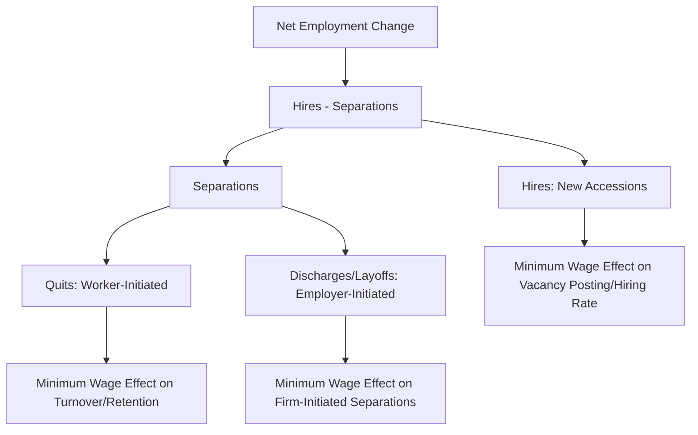

## Minimum Wage Effects on Employment Dynamics

### Distinguishing Employment Levels from Employment Dynamics

Most classical minimum wage analysis (competitive and monopsony models alike) focuses on comparative statics: the change in the *level* of employment at a new equilibrium. **Employment dynamics** research instead examines the *flows* underlying that level — hiring, separations, turnover, job creation, and job destruction — and how the minimum wage affects the rate and composition of these flows over time, not merely the net stock outcome.

This distinction matters because two labor markets can exhibit identical net employment changes while having very different underlying flow dynamics, with different implications for worker welfare, firm behavior, and policy design.

### Core Flow Concepts

The standard labor market flow accounting identity decomposes the change in employment stock as:

$$\Delta L_t = H_t - S_t$$

Where:

- $H_t$ = hires (accessions) during period $t$
- $S_t$ = separations (quits + layoffs + discharges) during period $t$

Separations are further decomposed:

$$S_t = Q_t + D_t$$

Where $Q_t$ = quits (worker-initiated) and $D_t$ = discharges/layoffs (employer-initiated). This decomposition is central to minimum wage dynamics research because the competitive and monopsony models generate different predictions about *which* flow component should respond to a wage floor.

### Mermaid Diagram: Flow Decomposition Framework

### Competing Predictions on Turnover

**Key Points**

- **Competitive model prediction**: a binding minimum wage that reduces net employment does so partly or wholly through reduced hiring and/or increased layoffs, since firms are simply moving along a labor demand curve to a lower quantity.
- **Monopsony/search-friction model prediction**: a minimum wage increase (within the appropriate range) can *reduce quit rates* by closing the gap between the wage paid and the wage workers could earn elsewhere, reducing the incentive to search for and move to alternative jobs. This is sometimes called the **turnover-reduction channel**, and represents one of the most empirically distinctive predictions separating monopsony-type models from the competitive model.
- Reduced turnover is economically significant independent of net employment effects: turnover is costly to firms (recruiting, training, lost productivity during ramp-up), so a wage floor that reduces quits can partially or fully offset the direct cost of the higher wage bill through reduced turnover costs — a mechanism sometimes invoked to explain why measured net employment effects can be small even when a naïve competitive-model cost calculation would predict larger effects.

### Job Creation and Job Destruction Margins

Beyond aggregate hires and separations, dynamics research examines the **establishment-level** decomposition into job creation and destruction:

$$\text{Net Employment Change} = \text{Job Creation (expanding/opening establishments)} - \text{Job Destruction (contracting/closing establishments)}$$

This margin is important because a minimum wage increase could, in principle, leave net employment roughly unchanged while substantially **reallocating** employment: destroying jobs at low-margin, low-wage-intensive establishments while creating jobs at higher-productivity establishments better able to absorb the wage floor. Aggregate net-employment-focused studies can mask this underlying reallocation. [Inference: the empirical magnitude of this reallocation channel, relative to the pure net-level effect, is an active area of research and appears to vary by study design and industry.]

### Firm Entry, Exit, and Survival Dynamics

**Example**

A distinct strand of dynamics research examines establishment-level entry and exit responses:

- **Exit/closure risk**: some studies find increased closure probability among low-wage-intensive, thin-margin establishments (a subset of independent restaurants is frequently studied) following minimum wage increases, particularly in markets with high baseline exposure (i.e., a large share of workers already earning near the new floor).
- **Entry/new establishment formation**: evidence on whether higher minimum wages deter new business formation in exposed sectors is more mixed, with some studies finding limited effects on entry rates relative to exit/survival effects.
- **Firm size distribution effects**: because larger firms typically have greater capacity to absorb labor cost increases (via scale economies, capital substitution, or geographic diversification), dynamics research sometimes finds employment share shifting toward larger, more productive establishments within an industry following minimum wage increases — a form of "reallocation toward productivity" that is largely invisible in aggregate net employment counts. [Unverified: findings on firm-size-specific reallocation effects vary across studies and geographic contexts, and this pattern should not be treated as a universal empirical regularity.]

### The Hours Margin and Within-Job Adjustment

Employment dynamics research also disaggregates adjustment along the **intensive margin** (hours per worker) versus the **extensive margin** (number of workers employed):

$$\text{Total Labor Input} = (\text{Number of Workers}) \times (\text{Average Hours per Worker})$$

A firm facing a binding minimum wage may prefer adjusting hours rather than headcount when: (a) hiring/firing carries fixed costs (search, training, severance-equivalent costs) that hours adjustment avoids, or (b) scheduling systems allow granular hours reductions across the existing workforce rather than discrete separations. Some studies of scheduling data find evidence of reduced hours or altered shift structures following minimum wage increases even in settings where headcount effects are small or statistically insignificant.

### SVG Diagram: Adjustment Margins Following a Minimum Wage Increase (svg_diagram)

<svg xmlns="http://www.w3.org/2000/svg" viewBox="0 0 640 380">
<text x="320" y="24" text-anchor="middle" font-size="15" font-weight="bold" font-family="sans-serif">Possible Adjustment Margins to a Minimum Wage Increase (svg_diagram)</text>
<rect x="240" y="50" width="160" height="50" rx="8" fill="none" stroke="black" stroke-width="2" />
<text x="320" y="80" text-anchor="middle" font-size="12" font-family="sans-serif">Minimum Wage Increase</text>
<line x1="280" y1="100" x2="130" y2="160" stroke="black" stroke-width="1.5" />
<line x1="320" y1="100" x2="320" y2="160" stroke="black" stroke-width="1.5" />
<line x1="360" y1="100" x2="510" y2="160" stroke="black" stroke-width="1.5" />
<rect x="50" y="160" width="160" height="55" rx="8" fill="none" stroke="#1f77b4" stroke-width="2" />
<text x="130" y="185" text-anchor="middle" font-size="11" font-family="sans-serif" fill="#1f77b4">Extensive Margin</text>
<text x="130" y="202" text-anchor="middle" font-size="10" font-family="sans-serif">Headcount changes</text>
<rect x="240" y="160" width="160" height="55" rx="8" fill="none" stroke="#2ca02c" stroke-width="2" />
<text x="320" y="185" text-anchor="middle" font-size="11" font-family="sans-serif" fill="#2ca02c">Intensive Margin</text>
<text x="320" y="202" text-anchor="middle" font-size="10" font-family="sans-serif">Hours per worker</text>
<rect x="430" y="160" width="160" height="55" rx="8" fill="none" stroke="#d62728" stroke-width="2" />
<text x="510" y="185" text-anchor="middle" font-size="11" font-family="sans-serif" fill="#d62728">Turnover Margin</text>
<text x="510" y="202" text-anchor="middle" font-size="10" font-family="sans-serif">Quit/hire rates</text>
<line x1="130" y1="215" x2="130" y2="260" stroke="#888" stroke-width="1" />
<line x1="320" y1="215" x2="320" y2="260" stroke="#888" stroke-width="1" />
<line x1="510" y1="215" x2="510" y2="260" stroke="#888" stroke-width="1" />

<text x="130" y="280" text-anchor="middle" font-size="10" font-family="sans-serif">Layoffs, reduced</text>

<text x="130" y="294" text-anchor="middle" font-size="10" font-family="sans-serif">hiring, closures</text>

<text x="320" y="280" text-anchor="middle" font-size="10" font-family="sans-serif">Reduced shifts,</text>

<text x="320" y="294" text-anchor="middle" font-size="10" font-family="sans-serif">scheduling changes</text>

<text x="510" y="280" text-anchor="middle" font-size="10" font-family="sans-serif">Reduced quits</text>

<text x="510" y="294" text-anchor="middle" font-size="10" font-family="sans-serif">(monopsony channel)</text>

</svg>

### Dynamic (Long-Run vs. Short-Run) Effects

**Key Points**

- Most quasi-experimental minimum wage studies estimate effects over relatively short post-treatment windows (often 1–3 years), which may understate longer-run adjustment margins that unfold more slowly.
- **Capital-labor substitution and automation adoption** are hypothesized to operate on a longer time horizon than headcount or hours adjustments, since capital investment decisions involve planning, financing, and installation lags. Research using longer panels and technology-adoption proxies (e.g., self-checkout kiosk installation, automated ordering systems) has examined whether minimum wage increases accelerate this substitution, with some studies finding suggestive evidence concentrated in specific sub-sectors. [Inference: the long-run automation-substitution literature is younger and less settled than the short-run employment-level literature, and estimates of timing and magnitude vary across studies.]
- **Dynamic event-study designs** (plotting employment effects separately for each period before and after the minimum wage change, rather than a single pooled post-treatment average) have become standard practice in this literature, partly to visually assess pre-trends (a validity check on the parallel-trends assumption underlying difference-in-differences designs) and partly to trace out the *time path* of adjustment rather than assuming an instantaneous jump to a new steady state.

### Worker-Level Dynamics: Who Adjusts?

Dynamics research using linked employer-employee data has also examined **compositional** adjustment — whether firms respond to a minimum wage increase not by reducing total headcount, but by changing *who* they hire or retain:

- Some evidence suggests firms may shift hiring toward workers perceived as higher-productivity or lower-risk within the pool of minimum-wage-eligible applicants, potentially disadvantaging groups already facing labor market frictions (e.g., workers with less experience or thinner work histories), though this finding is not universal across studies. [Unverified: compositional/discriminatory hiring responses to minimum wage changes are harder to identify empirically than aggregate employment counts and remain an active, less-settled area of research.]
- Retention effects: consistent with the monopsony-based turnover-reduction channel described above, some studies find increased job tenure/reduced separation hazard specifically among workers directly affected by the wage floor (those previously earning near the old minimum).

### Conclusion

**Conclusion**

Employment dynamics research complements and refines the classical level-based minimum wage debate by asking not simply "did aggregate employment rise or fall" but "through which channels did the labor market adjust, over what time horizon, and for which workers." This finer-grained view helps reconcile seemingly conflicting findings in the aggregate employment literature: small or null net employment effects are compatible with substantial underlying churn in job creation/destruction, turnover, hours, and firm survival, meaning that net-level null results should not be interpreted as evidence of "no adjustment whatsoever." [Unverified: the relative importance of each adjustment channel (hours, turnover, reallocation, automation) appears to vary considerably by industry, region, and the specific minimum wage change studied, and current research has not established a single generalizable ranking of channel importance.]

**Next Steps**

- Empirical Minimum Wage Studies (methodological foundation)
- Monopsony Model Predictions (turnover-reduction channel)
- Job Creation and Job Destruction: Davis-Haltiwanger Framework
- Event-Study Designs and Parallel Trends Testing
- Minimum Wage Effects on Automation Adoption
- Linked Employer-Employee Data Methods
- Firm Entry, Exit, and Survival in Low-Wage Industries
- Search-and-Matching Models of Labor Turnover