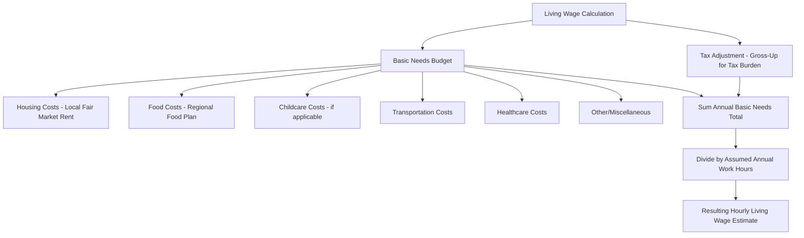

## Living Wage Policies

### Definition and Distinction from Statutory Minimum Wage

A **living wage** is a wage level calculated to allow a worker (and often a specified household configuration) to afford a basic, locally-defined standard of living — typically covering housing, food, transportation, childcare, healthcare, and other necessities — without relying on public assistance. This distinguishes living wage policy conceptually from a standard **statutory minimum wage**, which is typically set through a legislative or administrative political process without a formal, standardized methodology tying it to a specific cost-of-living calculation.

| Dimension | Statutory Minimum Wage | Living Wage |
| --- | --- | --- |
| Basis for the wage level | Legislative/political process, sometimes indexed to inflation | Calculated from local cost-of-living components (housing, food, etc.) |
| Geographic scope | Typically national or state/province-wide | Often city/county-specific, or targeted to specific employer contracts |
| Coverage | Universal within jurisdiction | Frequently limited to municipal contractors, specific employers, or voluntary certification programs |
| Update mechanism | Periodic legislative action or statutory indexing | Often recalculated annually/periodically using updated cost data |

### Calculation Methodology

**Key Points**

- Living wage calculations typically begin from a **basic needs budget**: itemized estimated costs for housing, food, transportation, healthcare, childcare, taxes, and a modest allowance for savings/miscellaneous expenses, summed to an annual or hourly figure.
- The most widely cited academic methodology in the U.S. context is the **MIT Living Wage Calculator** (Amy Glasmeier), which produces county-level and family-composition-specific living wage estimates using regionally sourced cost data (e.g., HUD Fair Market Rent data for housing, USDA food plans for food costs).
- A general formula structure:

$$\text{Living Wage (hourly)} = \frac{\sum_i C_i + T}{H \times 52}$$

Where $C_i$ = annual cost of basic-needs category $i$ (housing, food, childcare, healthcare, transportation, other), $T$ = estimated tax burden required to net the after-tax basic needs total, and $H$ = assumed annual full-time work hours (commonly 2,080, i.e., 40 hours × 52 weeks).

- Living wage estimates vary substantially by **household composition** (single adult vs. single parent with children vs. two working adults with children), since childcare and housing needs scale nonlinearly with household size and number of dependents.
- Estimates also vary substantially by **geography**, since housing costs in particular differ enormously across metropolitan areas — a defining feature that distinguishes living wage calculations from a single national minimum wage figure.

### Mermaid Diagram: Living Wage Calculation Components

### Policy Implementation Mechanisms

Living wage requirements are typically implemented through one or more of the following mechanisms, which vary substantially in coverage breadth:

1. **Municipal contractor ordinances**: requiring firms holding contracts with a city or county government (janitorial, security, food service contracts, etc.) to pay employees working on those contracts at least the calculated living wage — this was the dominant early implementation model, beginning notably with Baltimore's 1994 ordinance, generally credited as the first modern U.S. living wage ordinance.
2. **Subsidy-recipient conditions**: requiring firms receiving direct economic development subsidies, tax abatements, or public financing to meet living wage standards as a condition of the subsidy.
3. **Broader municipal minimum wage ordinances**: some jurisdictions have moved beyond contractor-specific coverage to city-wide minimum wage floors explicitly framed or calculated with reference to living wage methodology, effectively merging the living wage concept with a broader statutory minimum wage at the municipal level.
4. **Voluntary employer certification programs**: third-party certification bodies (e.g., Living Wage Foundation-style programs, used prominently in the UK) certify employers who voluntarily commit to paying at least the calculated living wage, functioning as a market/reputational mechanism rather than a legal mandate.

### SVG Diagram: Coverage Breadth Across Implementation Mechanisms (svg_diagram)

<svg xmlns="http://www.w3.org/2000/svg" viewBox="0 0 640 320">
<text x="320" y="24" text-anchor="middle" font-size="15" font-weight="bold" font-family="sans-serif">Living Wage Policy Coverage Breadth (svg_diagram)</text>
<rect x="240" y="50" width="160" height="45" rx="6" fill="none" stroke="#d62728" stroke-width="2" />
<text x="320" y="77" text-anchor="middle" font-size="11" font-family="sans-serif" fill="#d62728">Municipal Contractors Only</text>
<rect x="200" y="120" width="240" height="45" rx="6" fill="none" stroke="#ff7f0e" stroke-width="2" />
<text x="320" y="147" text-anchor="middle" font-size="11" font-family="sans-serif" fill="#ff7f0e">+ Subsidy Recipients</text>
<rect x="140" y="190" width="360" height="45" rx="6" fill="none" stroke="#2ca02c" stroke-width="2" />
<text x="320" y="217" text-anchor="middle" font-size="11" font-family="sans-serif" fill="#2ca02c">+ Voluntary Certified Employers (Market Mechanism)</text>
<rect x="60" y="260" width="520" height="45" rx="6" fill="none" stroke="#1f77b4" stroke-width="2" />
<text x="320" y="287" text-anchor="middle" font-size="11" font-family="sans-serif" fill="#1f77b4">City-Wide Statutory Minimum Wage (Broadest Coverage)</text>

<text x="600" y="80" font-size="10" font-family="sans-serif">Narrow</text>

<text x="600" y="280" font-size="10" font-family="sans-serif">Broad</text>

<line x1="620" y1="60" x2="620" y2="280" stroke="black" stroke-width="1" />

<line x1="615" y1="60" x2="625" y2="60" stroke="black" stroke-width="1" />

<line x1="615" y1="280" x2="625" y2="280" stroke="black" stroke-width="1" />

</svg>

### Economic Theory Applied to Living Wage Policy

**Key Points**

- Because living wage ordinances are typically narrowly targeted (contractors, subsidy recipients) rather than economy-wide, their *aggregate* labor market effects are theoretically expected to be smaller in scale than a comparable economy-wide minimum wage increase, since only a limited subset of employers and workers is directly covered.
- The **competitive model** predicts standard disemployment effects among covered contractor firms/workers, potentially concentrated further because contractor labor markets can be relatively substitutable (a city could, in principle, contract with a different, non-covered vendor, though this is often precluded by the ordinance's design).
- The **monopsony model** framework applies similarly to living wage analysis as to statutory minimum wage analysis (see [[Monopsony Model Predictions]]): if covered employers/sectors possess wage-setting power, a living wage requirement could raise both wages and employment within the covered segment, up to the competitive benchmark for that segment.
- A distinguishing economic feature of living wage ordinances is their potential for **spillover and threshold effects** at the geographic boundary of coverage (e.g., a firm relocating a small number of jobs outside city limits to avoid a municipal ordinance) — conceptually analogous to the state-border dynamics studied in the broader minimum wage literature (see [[The Card Krueger Debate]]), but operating at a finer (city/county) geographic scale.

### Empirical Evidence on Living Wage Ordinances

**Example**

Empirical research specifically on municipal living wage ordinances (as distinct from the broader statutory minimum wage literature) has generally found:

- Modest wage gains for directly covered workers, consistent with the ordinance's design intent.
- Employment effects among covered contractor workers that are more mixed and harder to estimate precisely than in the broader minimum wage literature, partly because covered worker populations are smaller and administrative data specifically identifying "covered" workers is less consistently available than for a jurisdiction-wide minimum wage.
- Some studies find limited detectable citywide poverty-rate effects from narrowly targeted contractor-only ordinances, attributed to the relatively small share of a city's low-wage workforce actually covered by contractor-specific provisions, in contrast to broader city-wide minimum wage increases which cover a much larger share of the low-wage workforce. [Inference: precise poverty and employment effect magnitudes vary substantially by study design, city, and time period, and this is a smaller and less extensively replicated empirical literature than the statutory minimum wage literature.]

### Living Wage vs. Minimum Wage: Policy Tradeoffs

**Conclusion**

Living wage policy represents a conceptually distinct but practically related tool to the statutory minimum wage: it offers the advantage of geographic and household-composition specificity (better matching the wage floor to actual local costs) and can serve as a policy testing ground or complement to broader minimum wage legislation, but typically at the cost of narrower coverage and, in some implementation forms, more complex and costly administrative/compliance monitoring (verifying which workers and contracts are actually covered). The choice between pursuing living wage ordinances versus broader statutory minimum wage increases reflects, in part, a tradeoff between calculation precision/local targeting and universality of coverage — a tradeoff with no unambiguous efficiency ranking independent of the specific policy goals and political constraints faced in a given jurisdiction. [Unverified: normative judgments about which approach is preferable depend on policy priorities (targeting precision vs. universal coverage vs. administrative simplicity) that are not resolved by economic analysis alone.]

**Next Steps**

- MIT Living Wage Calculator Methodology
- Municipal Minimum Wage Ordinances and Local Labor Market Effects
- Monopsony Model Predictions
- The Card Krueger Debate (geographic boundary effects)
- Public Procurement and Government Contracting Labor Standards
- Poverty Measurement and Basic Needs Budgets
- UK Living Wage Foundation Certification Model
- Earned Income Tax Credit as an Alternative/Complementary Policy Tool