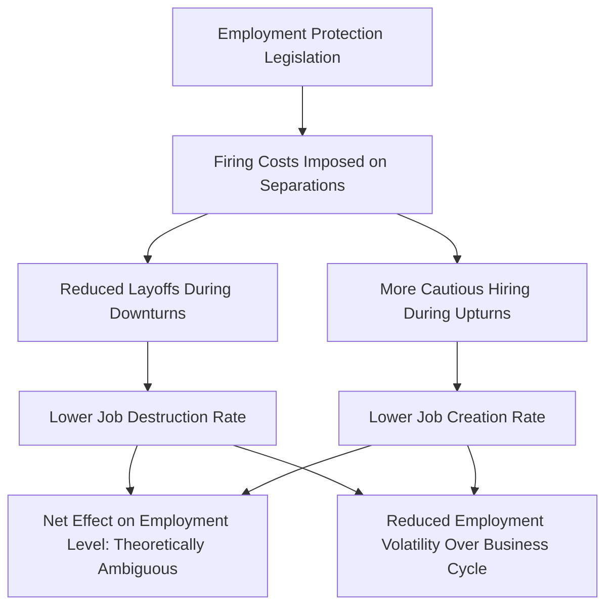

## Employment Protection Legislation

### Definition and Scope

**Employment Protection Legislation (EPL)** refers to the body of regulations governing the hiring and firing of workers, including rules on individual and collective dismissals, notice periods, severance pay requirements, procedural requirements for termination, and restrictions on the use of temporary or fixed-term contracts. EPL is a central object of study in labor economics because it directly affects the cost and risk firms face when adjusting employment, thereby shaping hiring behavior, labor market flows, and worker bargaining dynamics.

EPL is conventionally decomposed into two broad categories:

- **Regulation of individual dismissals of regular (permanent) contracts**: notice periods, severance pay, procedural requirements (e.g., requirement of "just cause," administrative or judicial approval), and reinstatement rights.
- **Regulation of collective dismissals**: additional requirements (consultation with worker representatives, government notification, extended notice) triggered when layoffs exceed a specified threshold of affected workers.
- **Regulation of temporary/fixed-term contracts**: restrictions on the use, renewal, and maximum duration of temporary contracts, which affects the extent to which firms can circumvent permanent-contract protections via contract type.

### The OECD EPL Index

**Key Points**

- The most widely used cross-country measure is the **OECD Employment Protection Legislation Index**, which aggregates numerous specific regulatory provisions into a summary score (typically scaled 0 to 6, with higher values indicating stricter protection) across three sub-indices: protection of regular workers against individual dismissal, additional requirements for collective dismissals, and regulation of temporary contracts.
- The index construction involves expert coding of statutory provisions, weighted aggregation across sub-components, and is periodically updated as countries revise labor law — meaning cross-country and over-time comparisons should reference the specific index vintage used, since methodology has been revised over time.
- Countries are commonly grouped into stylized categories: "flexible" labor markets (e.g., United States, United Kingdom, historically low EPL scores) versus "highly regulated" labor markets (e.g., historically, several continental European countries such as Spain, France, and Portugal, with notably higher EPL scores, particularly prior to 2010s-era reforms in several of these countries). [Unverified: specific current-year EPL index values and country rankings should be verified against the latest OECD release, as several countries have undergone significant EPL reform in the past decade.]

### Theoretical Framework: The Firing Cost Model

The canonical theoretical treatment models EPL as a **firing cost**, $F$, that the firm must pay upon separating from a worker (whether via severance pay, litigation risk, or procedural delay costs). This cost drives a wedge into the firm's dynamic labor demand decision.

In a simple dynamic framework, a firm retains a worker if the expected present value of continued employment exceeds the cost of separation:

$$E\left[\sum_{t} \beta^t (MRPL_t - w_t)\right] > -F$$

Firing costs create an **inaction region**: because $F$ must be paid to separate but is not refunded upon hiring, firms become more cautious both about firing (during downturns) and about hiring (during upturns), since today's hire is tomorrow's costly-to-reverse commitment if conditions worsen.

### Mermaid Diagram: Firing Cost Effects on Firm Behavior

### Predicted Effects: Levels vs. Volatility

**Key Points**

- **Effect on the average employment level**: theoretically ambiguous in canonical models — EPL simultaneously discourages layoffs (raising employment during downturns relative to an unregulated benchmark) and discourages hiring (lowering employment during upturns), and the net long-run average effect depends on the relative magnitude of these offsetting forces along with the specific model's assumptions about labor demand volatility and worker bargaining power.
- **Effect on employment volatility**: this is the most robust and widely replicated theoretical and empirical prediction — EPL is predicted to, and generally found to, **reduce the cyclical volatility of employment and worker flows** (hires and separations both decline), acting as a "shock absorber" that smooths employment adjustment over the business cycle at the cost of reduced labor market fluidity.
- **Effect on worker flows (churn)**: EPL is consistently associated with reduced job-to-job mobility and reduced overall hiring/separation rates ("labor market fluidity"), independent of its ambiguous net level effect — this reduced churn has secondary implications for allocative efficiency (worker-job match quality) and wage growth via job switching.
- **Distributional effect between insiders and outsiders**: EPL is frequently characterized as protecting **incumbent ("insider") workers** at the potential expense of **outsiders** (the unemployed, new labor market entrants, and workers on temporary contracts), since firms facing high firing costs on permanent contracts become more reluctant to convert temporary workers to permanent status or to hire new permanent workers at all, particularly during uncertain economic conditions.

### The Insider-Outsider Framework

**Example**

The insider-outsider theoretical framework (associated notably with Lindbeck and Snower) posits that incumbent workers protected by EPL and other labor market institutions can extract wage premiums or resist wage concessions because turnover costs (partly created by EPL itself) make it costly for firms to replace them with cheaper outsider labor, even when outsiders would accept lower wages. This can generate:

- **Wage rigidity**: insider bargaining power sustains wages above the market-clearing level even amid substantial outsider unemployment.
- **Segmented/dual labor markets**: particularly documented in countries with high EPL on permanent contracts combined with looser regulation of temporary contracts (a common reform pattern, e.g., historically in Spain), where firms respond to strict permanent-contract EPL by disproportionately using temporary contracts for new hires — resulting in a labor market segmented between well-protected permanent "insiders" and precarious, high-turnover temporary "outsiders" who bear a disproportionate share of adjustment during downturns.

### SVG Diagram: Insider-Outsider Labor Market Segmentation (svg_diagram)

<svg xmlns="http://www.w3.org/2000/svg" viewBox="0 0 640 340">
<text x="320" y="24" text-anchor="middle" font-size="15" font-weight="bold" font-family="sans-serif">Dual Labor Market Under Asymmetric EPL (svg_diagram)</text>
<rect x="60" y="70" width="220" height="200" rx="10" fill="none" stroke="#1f77b4" stroke-width="2.5" />
<text x="170" y="100" text-anchor="middle" font-size="13" font-weight="bold" fill="#1f77b4" font-family="sans-serif">Permanent Contracts</text>
<text x="170" y="125" text-anchor="middle" font-size="11" font-family="sans-serif">High EPL / Firing Costs</text>
<text x="170" y="150" text-anchor="middle" font-size="11" font-family="sans-serif">Low turnover</text>
<text x="170" y="175" text-anchor="middle" font-size="11" font-family="sans-serif">Wage premium (insider power)</text>
<text x="170" y="200" text-anchor="middle" font-size="11" font-family="sans-serif">"Insiders"</text>
<rect x="360" y="70" width="220" height="200" rx="10" fill="none" stroke="#d62728" stroke-width="2.5" />
<text x="470" y="100" text-anchor="middle" font-size="13" font-weight="bold" fill="#d62728" font-family="sans-serif">Temporary Contracts</text>
<text x="470" y="125" text-anchor="middle" font-size="11" font-family="sans-serif">Low EPL / Low Firing Costs</text>
<text x="470" y="150" text-anchor="middle" font-size="11" font-family="sans-serif">High turnover</text>
<text x="470" y="175" text-anchor="middle" font-size="11" font-family="sans-serif">Bears cyclical adjustment</text>
<text x="470" y="200" text-anchor="middle" font-size="11" font-family="sans-serif">"Outsiders"</text>
<line x1="280" y1="170" x2="360" y2="170" stroke="black" stroke-width="1.5" stroke-dasharray="4" />
<text x="320" y="160" text-anchor="middle" font-size="10" font-family="sans-serif">Limited conversion</text>

<text x="170" y="300" text-anchor="middle" font-size="11" font-family="sans-serif" fill="#555">New entrants/youth disproportionately here first</text>

</svg>

### Empirical Findings

| Outcome | General Empirical Pattern | Notes |
| --- | --- | --- |
| Employment level | Small or ambiguous effects in most cross-country panel studies | Consistent with theoretical ambiguity |
| Employment/output volatility | Robust finding: EPL reduces volatility | One of the most consistently replicated EPL findings |
| Job/worker flow rates (hires + separations) | Robust finding: EPL reduces flows | Reduced "labor market fluidity" or "churn" |
| Youth and new-entrant unemployment | Some evidence of disproportionate effects, particularly in dual labor markets | Consistent with insider-outsider predictions |
| Temporary contract share | Higher in countries with large gap between permanent and temporary contract EPL | "EPL gap" hypothesis |
| Long-term unemployment duration | Some evidence of longer average unemployment duration under high EPL | Reduced hiring flow slows re-employment |
| Productivity/reallocation | Some evidence that high EPL reduces allocative efficiency by slowing reallocation from low- to high-productivity firms | [Inference: mechanism and magnitude vary across studies] |

**[Inference: cross-country EPL empirical estimates are sensitive to the specific index used, sample period, and control variables; the general directional patterns above reflect a broad reading of the literature rather than a single definitive point estimate.]**

### Policy Reform Trends and the "Flexicurity" Model

**Conclusion**

Given the insider-outsider and dual-labor-market concerns associated with asymmetric EPL (strict on permanent contracts, loose on temporary contracts), a significant strand of labor market policy reform — most closely associated with Denmark and referred to as **"flexicurity"** — has sought to reduce EPL-driven rigidity on permanent contracts while substantially strengthening unemployment insurance generosity and active labor market policy (job search assistance, retraining programs) as a substitute mechanism for worker income security. The underlying policy logic is that worker security can be decoupled from job security: rather than protecting a specific job via high firing costs, the state protects the *worker* via a generous safety net and re-employment support, potentially achieving both greater labor market fluidity/efficiency and adequate worker welfare simultaneously. [Unverified: the transferability of the flexicurity model's apparent success in the Danish context to countries with different fiscal capacity, administrative infrastructure, and labor market institutions remains a debated question in comparative labor economics.]

**Next Steps**

- The Flexicurity Model: Denmark and Comparative Case Studies
- Insider-Outsider Theory of Wage Determination
- Temporary and Fixed-Term Contract Regulation
- Unemployment Insurance Design and Generosity
- Job Creation and Job Destruction Dynamics Under Regulation
- Cross-Country Labor Market Institution Comparisons (OECD Framework)
- Active Labor Market Policies
- Firing Costs and Dynamic Labor Demand Models