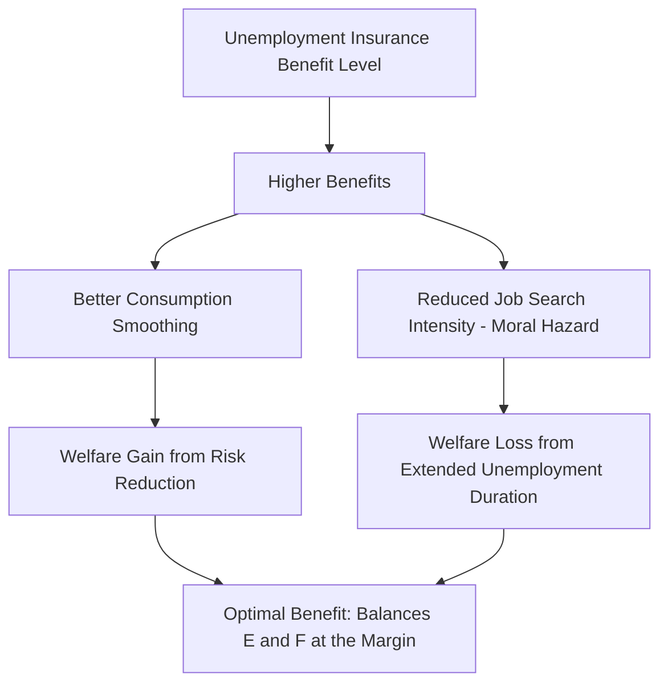

## Unemployment Insurance Design

### Purpose and Core Economic Rationale

Unemployment insurance (UI) is a social insurance program providing partial, temporary wage replacement to workers who lose employment involuntarily. Its core economic rationale rests on **consumption smoothing** under incomplete private insurance and credit markets: because private insurers face severe adverse selection and moral hazard problems in insuring against job loss, and because many workers cannot fully self-insure via savings or borrowing against future income, a mandatory public program can improve welfare by pooling risk across the labor force. This is a canonical application of insurance theory to the labor market, formalized in the Baily-Chetty optimal UI framework.

### The Baily-Chetty Optimal UI Framework

The dominant theoretical framework for UI design formalizes the **central tradeoff**: UI benefits provide valuable consumption smoothing for risk-averse workers, but by reducing the cost of unemployment, they also reduce job search intensity and can extend unemployment duration (**moral hazard**).

The Baily-Chetty condition for the optimal replacement rate balances these forces at the margin:

$$\frac{\Delta C}{C} \cdot \gamma = \varepsilon \cdot \frac{b}{1-b}$$

Where:

- $\frac{\Delta C}{C}$ = the consumption drop upon job loss (the "consumption smoothing gap" that UI benefits address)
- $\gamma$ = the coefficient of relative risk aversion
- $\varepsilon$ = the elasticity of unemployment duration with respect to the benefit level (the moral hazard parameter)
- $b$ = the replacement rate (benefit as a fraction of prior wage)

**Key Points**

- A larger consumption drop upon unemployment (implying workers are poorly self-insured) argues for a *higher* optimal replacement rate.
- A larger duration elasticity $\varepsilon$ (implying UI benefits substantially extend unemployment spells) argues for a *lower* optimal replacement rate.
- This framework reframes the classic "equity vs. efficiency" tradeoff in UI design as an empirically estimable optimization problem: the key sufficient statistics ($\Delta C/C$ and $\varepsilon$) can, in principle, be estimated from micro-data without needing to fully specify or solve a complete structural model of the labor market. [Inference: applying this framework to actual policy design requires assumptions about the risk-aversion parameter and functional form that are themselves contested, so real-world "optimal" benefit calculations are sensitive to auxiliary assumptions beyond the two headline sufficient statistics.]

### Mermaid Diagram: The Core UI Design Tradeoff

### Key Design Parameters

UI programs are characterized by several structural design choices, each with distinct theoretical and empirical implications:

1. **Replacement rate ($b$)**: the fraction of prior earnings replaced by the benefit, often subject to a maximum weekly benefit cap that makes the *effective* replacement rate lower for higher earners.
2. **Potential benefit duration (PBD)**: the maximum number of weeks a worker may draw benefits, frequently extended during recessions via emergency federal or discretionary programs (e.g., Extended Benefits and various emergency compensation programs in the U.S. context).
3. **Experience rating**: the degree to which an individual employer's UI payroll tax rate reflects that employer's own history of layoffs — a mechanism intended to internalize the social cost of layoffs onto the firms generating them, discussed further below.
4. **Waiting period**: a mandatory unpaid period (often one week) before benefits begin, intended partly to reduce administrative costs of very short claims and partly to preserve some incentive for immediate job search.
5. **Eligibility/monetary requirements**: minimum prior earnings or work history required to qualify, and job-separation-reason requirements (typically excluding voluntary quits without good cause, and excluding terminations for misconduct).
6. **Work search requirements and monitoring**: ongoing eligibility conditioned on documented job search activity, with varying intensity of verification/enforcement across jurisdictions.

### SVG Diagram: UI Benefit Duration Profile (svg_diagram)

<svg xmlns="http://www.w3.org/2000/svg" viewBox="0 0 640 340">
<text x="320" y="24" text-anchor="middle" font-size="15" font-weight="bold" font-family="sans-serif">Stylized UI Benefit Schedule Over an Unemployment Spell (svg_diagram)</text>
<line x1="70" y1="280" x2="580" y2="280" stroke="black" stroke-width="1.5" />
<line x1="70" y1="280" x2="70" y2="60" stroke="black" stroke-width="1.5" />
<text x="560" y="300" font-size="12" font-family="sans-serif">Weeks Unemployed</text>
<text x="20" y="60" font-size="12" font-family="sans-serif">Benefit ($)</text>
<line x1="70" y1="280" x2="90" y2="280" stroke="#888" stroke-width="1.5" />
<text x="60" y="295" font-size="10" font-family="sans-serif">Waiting</text>
<text x="60" y="308" font-size="10" font-family="sans-serif">period</text>
<line x1="90" y1="130" x2="380" y2="130" stroke="#1f77b4" stroke-width="3" />
<text x="150" y="120" font-size="11" fill="#1f77b4" font-family="sans-serif">Regular benefits (replacement rate x prior wage)</text>
<line x1="380" y1="130" x2="470" y2="130" stroke="#2ca02c" stroke-width="3" stroke-dasharray="6,3" />
<text x="385" y="115" font-size="10" fill="#2ca02c" font-family="sans-serif">Extended benefits (recession trigger)</text>
<line x1="380" y1="280" x2="380" y2="130" stroke="#888" stroke-width="1" stroke-dasharray="3" />
<text x="360" y="300" font-size="10" font-family="sans-serif">PBD (e.g. 26 wks)</text>
<line x1="470" y1="280" x2="470" y2="130" stroke="#888" stroke-width="1" stroke-dasharray="3" />
<line x1="470" y1="280" x2="580" y2="280" stroke="#d62728" stroke-width="3" />
<text x="480" y="260" font-size="10" fill="#d62728" font-family="sans-serif">Benefit exhaustion</text>
</svg>

### Financing Mechanisms and Experience Rating

**Key Points**

- UI is typically financed through **payroll taxes on employers** (and in some systems, employee contributions), often structured as **experience-rated** taxes — meaning firms with a history of more layoffs face higher UI tax rates.
- The economic purpose of experience rating is to address a **negative externality**: absent experience rating, an individual firm's layoff decisions impose costs on the broader UI trust fund (and, ultimately, on all contributing employers) without the laying-off firm bearing the full social cost of its own layoffs.
- **Imperfect experience rating** is common in practice — most systems cap the maximum and minimum tax rates a firm can face, meaning the marginal cost of an additional layoff to a firm at the rate ceiling is effectively zero from an experience-rating perspective, which theoretically blunts the intended incentive effect for firms with persistently high layoff histories.
- [Inference: the empirical magnitude of experience rating's effect on firm layoff behavior is estimated to be meaningful but is sensitive to how "imperfect" the rating scheme is in a given jurisdiction, and estimates vary across studies of different state/national systems.]

### Empirical Evidence on Moral Hazard: The Duration Elasticity

**Example**

A large empirical literature has estimated the elasticity of unemployment duration with respect to UI benefit generosity ($\varepsilon$ in the Baily-Chetty formula above), commonly using:

- **Regression discontinuity designs** around benefit formula kinks or caps (comparing workers just above and below an earnings threshold that determines their benefit level).
- **Natural experiments from policy changes**: state-level or national UI benefit extensions (e.g., extended benefit programs during the 2008–2009 recession and the COVID-19 pandemic period) provide quasi-experimental variation in potential benefit duration.
- Findings generally document a **positive elasticity**: higher benefits and/or longer potential duration are associated with modestly longer unemployment spells, with commonly cited elasticity estimates in a range where a 10% increase in benefits is associated with roughly a 1-week or several-percentage-point increase in expected duration in various studies. [Inference: the specific elasticity magnitude varies considerably across studies, time periods (particularly recession vs. expansion), and benefit margins studied (level vs. duration), and there is no single universally agreed-upon point estimate.]
- A distinct and important finding from the "bunching at exhaustion" literature is that a disproportionate share of job-finding occurs in the weeks immediately surrounding benefit exhaustion, which some researchers interpret as evidence of moral hazard (strategic timing of job acceptance) while others emphasize alternative explanations such as reservation wage adjustment or liquidity effects becoming binding near exhaustion. [Unverified: the relative contribution of pure moral hazard versus liquidity/reservation-wage mechanisms to the exhaustion-timing pattern remains actively debated in the literature.]

### Liquidity Effects vs. Moral Hazard: Disentangling Mechanisms

A methodologically important development in this literature (notably associated with work by Chetty) distinguishes two distinct channels through which UI benefits could affect job search behavior:

- **Moral hazard channel**: higher benefits reduce the pure incentive to search/accept jobs by lowering the relative cost of remaining unemployed.
- **Liquidity channel**: for credit-constrained workers, UI benefits relax a binding liquidity constraint, allowing for a longer, potentially higher-quality job search process that is not "moral hazard" in the traditional welfare-reducing sense, but rather a corrective effect addressing missing credit markets.

This distinction matters substantially for optimal policy design because the *liquidity* channel implies that higher benefits for liquidity-constrained workers can be **welfare-improving** even though it appears empirically identical to standard moral hazard in reduced-form duration-elasticity estimates — motivating research designs (e.g., examining whether behavioral responses differ by measures of a worker's assets or access to credit) that attempt to separately identify the two channels.

### International Design Variation

| Design Feature | High-Replacement/Long-Duration Model (e.g., historically several continental European systems) | Lower-Replacement/Shorter-Duration Model (e.g., historically the U.S. system) |
| --- | --- | --- |
| Typical initial replacement rate | Often 60-80%+ of prior wage | Often 40-50% of prior wage, subject to caps |
| Typical potential duration | Often extends beyond 6 months, in some cases 1+ years | Commonly 26 weeks (state programs), absent emergency extensions |
| Experience rating | Often limited or absent (system-wide financing) | Common in the U.S. state-administered system |
| Active labor market policy linkage | Frequently tightly integrated (mandatory training/job search programs), notably in the flexicurity-associated systems | Historically less integrated, though work search verification requirements exist |

**[Inference: this table presents stylized, generalized categories; substantial within-category variation exists across specific countries and states, and design parameters change over time through legislative reform.]**

### Conclusion

**Conclusion**

Unemployment insurance design exemplifies a canonical social insurance optimization problem in labor economics, in which the socially optimal generosity level is neither the highest feasible (due to moral hazard costs) nor the lowest feasible (due to foregone consumption-smoothing and liquidity benefits), but rather a level determined by the empirically estimated balance between these forces — a balance that plausibly differs across countries, business cycle conditions, and worker subpopulations (e.g., credit-constrained versus unconstrained workers). The ongoing empirical research agenda of disentangling moral hazard from liquidity effects, and of estimating experience rating's effect on firm behavior, directly informs live policy debates about benefit generosity, duration extensions during recessions, and UI financing reform. [Unverified: specific current benefit levels, duration limits, and reform proposals vary by jurisdiction and change frequently through legislation; consult current program-specific documentation for up-to-date parameters.]

**Next Steps**

- Baily-Chetty Optimal Unemployment Insurance Model
- Moral Hazard vs. Liquidity Effects in Job Search
- Experience Rating and Employer Layoff Incentives
- Regression Discontinuity Designs in Labor Economics
- Active Labor Market Policies and Job Search Assistance
- The Flexicurity Model (UI-EPL Policy Substitution)
- Reservation Wage Theory and Job Search Models
- COVID-19 Unemployment Insurance Expansions: Natural Experiment Evidence