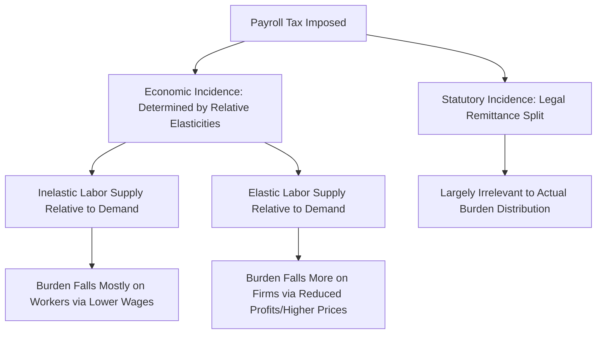

## Payroll Taxes and Mandated Benefits

### Definitions and Scope

**Payroll taxes** are taxes levied on wages, typically earmarked to finance specific social insurance programs (e.g., Social Security, Medicare, unemployment insurance) rather than flowing into general government revenue. **Mandated benefits** are non-wage benefits that employers are legally required to provide to workers (e.g., health insurance mandates, paid sick leave, parental leave, workers' compensation coverage), which function economically as a form of compensation requirement distinct from a tax but analytically similar in several key respects.

Both instruments raise the same core labor economics question: **who actually bears the cost** of a policy nominally imposed on the employer (or split between employer and employee), and how does that cost incidence affect wages, employment, and prices?

### Tax Incidence Theory: Statutory vs. Economic Incidence

A foundational principle in public/labor economics is that **statutory incidence** (who is legally required to remit the tax) is generally distinct from **economic incidence** (who actually bears the burden in terms of reduced real income). Economic incidence is determined by the relative elasticities of labor supply and labor demand, not by which party writes the check to the government.

For a payroll tax $t$ levied on the employer side, the wedge between what the firm pays and what the worker receives is:

$$w_{firm} = w_{worker}(1 + t)$$

The division of the tax burden between workers (via lower wages) and firms (via lower profits/higher prices) is governed by the relative elasticities:

$$\frac{\text{Burden on Workers}}{\text{Burden on Firms}} = \frac{\varepsilon_S}{\varepsilon_D}$$

Where $\varepsilon_S$ is the elasticity of labor supply and $\varepsilon_D$ is the (absolute value of the) elasticity of labor demand. This yields a canonical and empirically well-supported prediction: **if labor supply is relatively inelastic relative to labor demand** (a common finding for prime-age workers with limited ability to easily reduce hours worked or exit the labor force in response to a wage change), **the majority of a payroll tax's economic burden falls on workers, in the form of lower wages, regardless of the statutory split between employer and employee contributions.**

### Mermaid Diagram: Statutory vs. Economic Incidence

### SVG Diagram: Tax Incidence Under Inelastic Labor Supply (svg_diagram)

<svg xmlns="http://www.w3.org/2000/svg" viewBox="0 0 640 380">
<text x="320" y="24" text-anchor="middle" font-size="15" font-weight="bold" font-family="sans-serif">Payroll Tax Incidence: Inelastic Supply Case (svg_diagram)</text>
<line x1="70" y1="330" x2="580" y2="330" stroke="black" stroke-width="1.5" />
<line x1="70" y1="330" x2="70" y2="50" stroke="black" stroke-width="1.5" />
<text x="560" y="350" font-size="12" font-family="sans-serif">Employment (L)</text>
<text x="20" y="50" font-size="12" font-family="sans-serif">Wage</text>
<line x1="250" y1="60" x2="250" y2="320" stroke="#1f77b4" stroke-width="3" />
<text x="150" y="55" font-size="12" fill="#1f77b4" font-family="sans-serif">Supply (steep = inelastic)</text>
<line x1="90" y1="300" x2="490" y2="90" stroke="#d62728" stroke-width="2.5" />
<text x="495" y="90" font-size="12" fill="#d62728" font-family="sans-serif">Demand (pre-tax)</text>
<line x1="90" y1="270" x2="490" y2="60" stroke="#d62728" stroke-width="2.5" stroke-dasharray="5,3" />
<text x="495" y="60" font-size="11" fill="#d62728" font-family="sans-serif">Demand shifted down by tax wedge</text>
<circle cx="250" cy="185" r="4" fill="black" />
<text x="255" y="175" font-size="10" font-family="sans-serif">Original: w*, L*</text>
<circle cx="250" cy="220" r="4" fill="green" />
<line x1="70" y1="220" x2="250" y2="220" stroke="green" stroke-width="1" stroke-dasharray="3" />
<text x="30" y="224" font-size="10" fill="green" font-family="sans-serif">w_worker (after tax)</text>
<line x1="70" y1="185" x2="70" y2="220" stroke="black" stroke-width="4" />
<text x="10" y="205" font-size="9" font-family="sans-serif">Tax wedge borne by worker</text>

<text x="150" y="360" font-size="11" font-family="sans-serif" fill="#555">Employment barely changes (L stays near L*) — burden falls on wage, not jobs</text>

</svg>

### Application to Specific Payroll-Financed Programs

**Key Points**

- **Social Security/pension contributions**: Because these programs often provide a direct, actuarially-linked (though imperfectly so) future benefit tied to lifetime contributions, workers may perceive a portion of the payroll tax as **deferred compensation** rather than a pure tax, which theoretically could reduce the labor supply distortion relative to a payroll tax with no linked benefit — though the degree of this "benefit linkage" perception varies by program design and worker understanding of the benefit formula. [Inference: the empirical magnitude of this benefit-linkage effect on labor supply behavior is difficult to isolate and estimates vary across studies and country contexts.]
- **Health insurance mandates** (e.g., employer mandates to provide health coverage or pay a penalty): standard incidence theory predicts that if workers value the mandated benefit at or near its full cost to the employer, wages should adjust downward by approximately the cost of the benefit, leaving total compensation and employment largely unaffected — this is the **"benefit offset" hypothesis**, tested extensively in studies of employer-mandated health insurance.
- **Workers' compensation and mandated leave programs**: similarly analyzed via the framework of whether the mandated benefit's value to workers approximates its cost to employers (in which case wage offsets absorb most of the cost with limited employment effects) or whether a wedge exists between employer cost and worker valuation (in which case employment effects are more likely).

### The Summers "Full-Offset" Model

**Example**

A highly influential theoretical benchmark (associated with Lawrence Summers' analysis of mandated benefits) shows that if workers value a mandated benefit **exactly** at its cost to the firm, and if wages are sufficiently flexible to adjust downward, then a mandated benefit has **zero employment effect**: the entire cost is absorbed via a one-for-one wage reduction, and workers are left exactly as well off as before (having traded wage income for an equally-valued in-kind benefit) — a result structurally identical to the standard tax-incidence result under inelastic supply.

This benchmark generates a key testable and policy-relevant implication:

$$\Delta w = -c \quad \text{and} \quad \Delta L \approx 0 \quad \text{if worker valuation} = \text{employer cost}$$

**Deviations from full offset arise when:**

1. **Binding minimum wage constraints** prevent the wage from falling by the full cost of the mandate for low-wage workers (since the wage cannot fall below the statutory floor), forcing the burden onto employment or hours instead of wages for the affected worker population.
2. **Heterogeneous worker valuation**: if some workers value the mandated benefit less than its cost (e.g., young, healthy workers who would not have purchased health insurance voluntarily), the wage offset may be incomplete for that subgroup, generating a real employment effect concentrated among low-valuation workers.
3. **Wage rigidity from other sources** (union contracts, efficiency wage considerations, social norms against nominal wage cuts) that prevent the wage adjustment the full-offset model requires.

### Empirical Evidence on Benefit Offsets and Employment Effects

**Key Points**

- Studies of state-level mandated maternity/parental leave benefit expansions in the U.S. have found evidence broadly consistent with partial wage offsets among covered workers, with employment effects that are generally small relative to a naive calculation ignoring wage adjustment, though not always a full 100% offset.
- Research on employer health insurance mandates has similarly found mixed but generally supportive evidence for partial wage-cost offsetting, with the degree of offset varying by whether the affected worker population is bound by a minimum wage floor (where offset is mechanically constrained) versus higher-wage workers with more room for wage adjustment.
- Cross-country comparisons of payroll tax burden studies (using variation in statutory employer/employee split across countries and over time) generally support the theoretical prediction that **statutory split has limited effect on actual economic incidence**, consistent with the elasticity-based framework rather than a naive "whoever writes the check pays it" model. [Unverified: precise offset magnitudes vary substantially by specific program, country, time period, and the wage level of the affected worker population; the qualitative direction of these findings is more robust across the literature than any specific quantitative offset percentage.]

### Interaction with the Minimum Wage: A Key Policy Tension

**Conclusion**

The interaction between mandated benefits/payroll taxes and a binding minimum wage represents an important and policy-relevant special case within this literature: for workers earning at or near the minimum wage, the standard wage-offset mechanism that would otherwise absorb the cost of a mandate is **mechanically constrained**, since the wage cannot legally fall to accommodate the mandate's cost. This implies that mandated benefit costs and payroll tax increases are predicted to generate **larger employment effects specifically among minimum-wage and near-minimum-wage workers** than among higher-wage workers, for whom wage offset remains available — a distributional nuance with direct implications for the design of any policy that layers additional mandated costs (e.g., a health insurance mandate or a paid leave requirement) on top of an existing minimum wage floor. [Unverified: the precise quantitative importance of this interaction effect, relative to other minimum-wage employment channels discussed elsewhere in this course, is an area of ongoing empirical estimation rather than settled consensus.]

**Next Steps**

- Tax Incidence Theory and Elasticity-Based Burden Sharing
- The Summers Full-Offset Model of Mandated Benefits
- Employer Health Insurance Mandates: Empirical Evidence
- Social Security Financing and Benefit-Linkage Perception
- Minimum Wage Interaction Effects with Mandated Costs (see Competitive Model Predictions)
- Paid Family and Medical Leave Policy Design
- Workers' Compensation Program Design and Incidence
- Cross-Country Payroll Tax Structure Comparisons