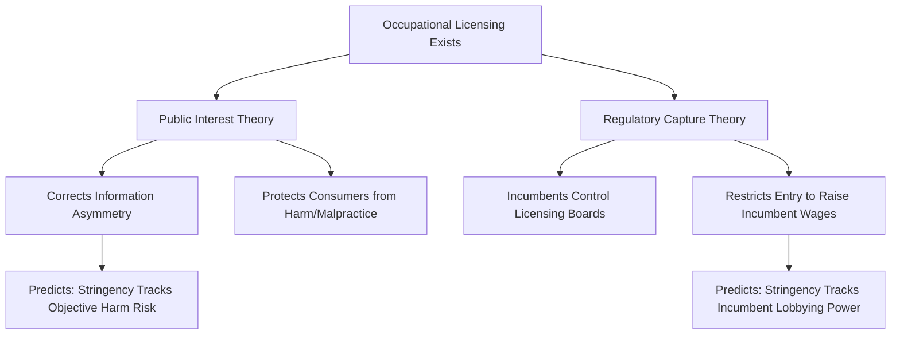

## Occupational Licensing

### Definition and Scope

**Occupational licensing** refers to government-mandated requirements that individuals obtain a license — typically involving education/training thresholds, examinations, fees, and sometimes background checks — before legally practicing a given occupation. It is distinguished from weaker forms of occupational regulation:

| Regulatory Form | Description | Legal Enforceability |
| --- | --- | --- |
| **Licensing** | Practicing the occupation without a license is illegal | Strongest — legal barrier to entry |
| **Certification** | Practicing without certification is legal, but only certified individuals may use the protected title | Moderate — title protection only |
| **Registration** | Practitioners must register with a government body but face minimal substantive requirements | Weakest — primarily informational |

Licensing is the most economically significant of these forms because it constitutes a direct **legal barrier to entry** into an occupation, distinguishing it from voluntary market-based quality signals.

### Theoretical Framework: Public Interest vs. Capture Theory

Two competing theoretical frameworks motivate the economic analysis of occupational licensing:

**Key Points**

- **Public interest theory**: licensing exists to correct an information asymmetry between service providers and consumers regarding service quality, particularly relevant for occupations where quality is difficult to verify prior to purchase (a "credence good" problem) and where poor quality can impose significant harm (e.g., medical or legal malpractice, safety hazards in skilled trades).
- **Regulatory capture / rent-seeking theory** (associated notably with George Stigler and the broader public choice tradition): licensing boards are frequently controlled or heavily influenced by incumbent practitioners in the regulated occupation, who have a direct financial incentive to use the licensing apparatus to **restrict entry**, thereby raising incumbents' wages and reducing competitive pressure — a form of successful rent-seeking that transfers surplus from consumers and prospective entrants to incumbent license-holders.
- These two theories generate observationally similar policy instruments (licensing requirements) but sharply different normative implications and different empirical predictions about *which* occupations get licensed and *how stringent* those requirements become over time — capture theory in particular predicts that licensing stringency should correlate more strongly with incumbent political organization and lobbying capacity than with objective measures of public harm from unlicensed practice.

### Mermaid Diagram: Competing Theoretical Frameworks

### Standard Economic Model: Licensing as an Entry Barrier

The core labor-supply-restriction model treats licensing analogously to any quantity restriction on entry into a labor market segment. By imposing training, examination, and fee costs, licensing raises the effective cost of entering the occupation, shifting the *effective* labor supply curve leftward/upward relative to the unrestricted supply curve.

$$w_{licensed} > w_{unlicensed-counterfactual}, \quad L_{licensed} < L_{unlicensed-counterfactual}$$

This produces a wage premium for licensed practitioners, but — critically for welfare analysis — this premium reflects **artificial scarcity rents** rather than (or in addition to) a genuine human-capital or quality-compensating return, to the extent the licensing requirement exceeds what would be needed purely to ensure adequate quality.

### SVG Diagram: Licensing as Entry Restriction (svg_diagram)

<svg xmlns="http://www.w3.org/2000/svg" viewBox="0 0 640 380">
<text x="320" y="24" text-anchor="middle" font-size="15" font-weight="bold" font-family="sans-serif">Occupational Licensing as a Labor Supply Restriction (svg_diagram)</text>
<line x1="70" y1="330" x2="580" y2="330" stroke="black" stroke-width="1.5" />
<line x1="70" y1="330" x2="70" y2="50" stroke="black" stroke-width="1.5" />
<text x="560" y="350" font-size="12" font-family="sans-serif">Practitioners (L)</text>
<text x="20" y="50" font-size="12" font-family="sans-serif">Wage</text>
<line x1="90" y1="300" x2="490" y2="70" stroke="#1f77b4" stroke-width="2.5" />
<text x="495" y="70" font-size="11" fill="#1f77b4" font-family="sans-serif">Unrestricted Supply</text>
<line x1="200" y1="300" x2="530" y2="70" stroke="#9467bd" stroke-width="2.5" stroke-dasharray="5,3" />
<text x="535" y="70" font-size="11" fill="#9467bd" font-family="sans-serif">Licensed Supply (shifted left)</text>
<line x1="90" y1="80" x2="480" y2="310" stroke="#d62728" stroke-width="2.5" />
<text x="485" y="315" font-size="11" fill="#d62728" font-family="sans-serif">Demand</text>
<circle cx="290" cy="195" r="4" fill="black" />
<text x="230" y="185" font-size="10" font-family="sans-serif">Unrestricted: w0, L0</text>
<circle cx="345" cy="150" r="4" fill="green" />
<line x1="70" y1="150" x2="345" y2="150" stroke="green" stroke-width="1" stroke-dasharray="3" />
<line x1="345" y1="150" x2="345" y2="330" stroke="green" stroke-width="1" stroke-dasharray="3" />
<text x="350" y="145" font-size="10" fill="green" font-family="sans-serif">Licensed: w1 &gt; w0, L1 &lt; L0</text>

<text x="150" y="360" font-size="11" fill="#555" font-family="sans-serif">Wage premium reflects scarcity rent from restricted entry</text>

</svg>

### Empirical Scope: Prevalence and Growth

**Example**

Occupational licensing has grown substantially as a share of the U.S. workforce over recent decades — research (notably by Morris Kleiner and coauthors) has documented that the share of U.S. workers required to hold a license to legally perform their job has risen from roughly 5% in the 1950s to approximately one-fifth to one-quarter of the workforce in recent decades, a substantially larger regulated share than either unionization or minimum wage coverage in the contemporary U.S. labor market. Licensing requirements also vary enormously in stringency **across states** for the *same* occupation (e.g., cosmetologists, interior designers, or florists face vastly different training-hour requirements depending on the state), providing researchers with quasi-experimental variation for empirical study. [Unverified: precise current-year prevalence figures should be checked against the latest Kleiner/Bureau of Labor Statistics or state-level licensing board data, as this figure is subject to periodic updates and revisions.]

### Empirical Findings: Wage and Employment Effects

**Key Points**

- **Wage premium**: numerous studies exploiting cross-state variation in licensing requirements for the same occupation find that licensed practitioners earn a wage premium relative to comparable unlicensed workers in states without the requirement, commonly cited in a range around 10-15% though estimates vary by occupation and study design.
- **Reduced employment/labor supply**: consistent with the entry-barrier model, licensing is associated with reduced numbers of practitioners in more stringently licensed occupations/states, and reduced interstate mobility for licensed workers (since licenses are frequently not portable across state lines without additional cost/delay, a "license reciprocity" problem).
- **Effect on service prices and consumer welfare**: some studies find modestly higher prices for licensed services with limited or statistically insignificant improvements in measurable service quality outcomes for certain occupations, which is often interpreted as more consistent with the capture/rent-seeking theory than the pure public-interest theory for those specific occupations — though this finding is occupation-specific and not universal (e.g., evidence for licensing's quality benefits is generally considered stronger for occupations with higher genuine harm potential, such as certain healthcare specialties). [Inference: the balance of evidence on quality effects is heterogeneous across occupations, and blanket claims that licensing either universally improves or universally fails to improve quality are not well supported by the disaggregated literature.]
- **Racial and criminal-record-related entry barriers**: some research has examined how licensing requirements (particularly "good moral character" clauses and criminal background provisions) disproportionately restrict entry for individuals with criminal records or from disadvantaged backgrounds, an equity dimension distinct from the aggregate wage/employment efficiency analysis. [Unverified: the magnitude and generalizability of these disparate-impact findings vary across the specific occupations and jurisdictions studied.]

### Licensing Reciprocity and Interstate Mobility

A specific and heavily studied friction is the general **lack of interstate licensing reciprocity**: because most licenses are issued at the state level with state-specific requirements, a licensed worker relocating to a different state frequently must undergo some combination of additional training, re-examination, or fees to requalify, even for occupations with essentially uniform underlying skill content across states. This friction is theorized to reduce aggregate labor market efficiency by discouraging geographic mobility toward higher-productivity regions — a particularly salient concern for military spouses and other frequently-relocating populations, which has motivated a wave of state-level reciprocity reforms in recent years. [Unverified: the current status of specific interstate reciprocity agreements and compact memberships varies by occupation and state and changes frequently through legislation; consult current state licensing board resources for up-to-date reciprocity status.]

### Policy Reform Approaches

**Conclusion**

Given the mixed and occupation-specific empirical evidence on licensing's quality benefits relative to its clear entry-restriction costs, several policy reform approaches have gained traction in the applied policy literature: **sunrise/sunset review processes** requiring periodic cost-benefit justification for maintaining or newly imposing licensing requirements; **substituting certification for licensing** in occupations where the harm-from-incompetence risk is relatively low, preserving a quality signal without a hard legal entry barrier; **universal licensing recognition/reciprocity** to reduce interstate mobility frictions; and **narrowing "scope of practice" restrictions** that may extend licensing requirements beyond the specific tasks that genuinely warrant regulation within a broader occupational category. The overarching policy tension mirrors the theoretical divide described above: reforms favored by economists emphasizing capture-theory concerns (contraction of licensing scope, reciprocity, certification substitution) are frequently resisted by incumbent practitioner associations, consistent with the capture theory's own prediction about the political economy of licensing regulation. [Unverified: the political feasibility and actual adoption rate of these specific reforms varies substantially by state, occupation, and current legislative context, and should be verified against current state-level policy tracking sources.]

**Next Steps**

- Stigler's Theory of Economic Regulation and Regulatory Capture
- Kleiner's Empirical Research Program on U.S. Licensing Prevalence
- Interstate Licensing Reciprocity and Labor Mobility
- Credence Goods and Information Asymmetry in Service Markets
- Scope-of-Practice Regulation in Healthcare Occupations
- Criminal Record Restrictions and Labor Market Reentry
- Sunrise/Sunset Review Processes for Occupational Regulation
- Comparative Analysis: Licensing vs. Certification vs. Registration