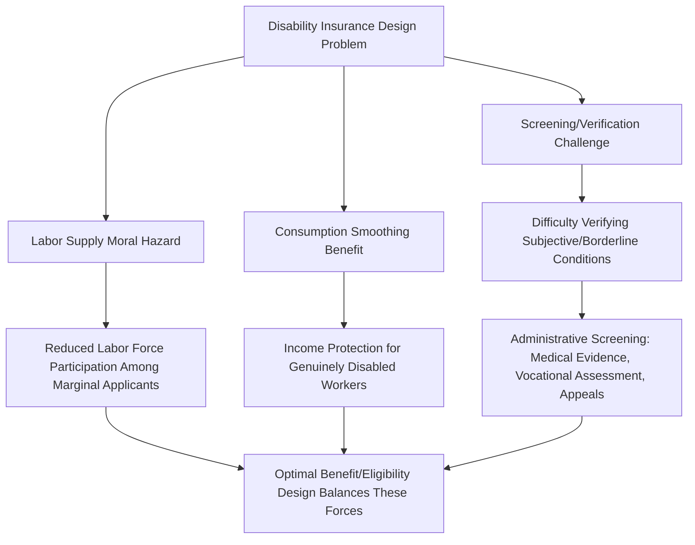

## Disability Insurance

### Definition and Program Scope

**Disability insurance (DI)** provides income replacement to workers who are unable to engage in substantial employment due to a medically determinable physical or mental impairment. In the U.S. context, the primary public program is **Social Security Disability Insurance (SSDI)**, a federal social insurance program financed through payroll taxes and administered under the broader Social Security system, alongside a separate means-tested program, **Supplemental Security Income (SSI)**, for individuals with limited work history or assets. Many other countries operate broadly analogous public disability insurance systems, often integrated with broader social insurance or national health systems, alongside varying degrees of private/employer-provided short- and long-term disability insurance.

### Core Economic Rationale

**Key Points**

- Like unemployment insurance, disability insurance addresses a **consumption-smoothing** problem: disability represents an income risk that is difficult for individuals to insure against privately due to adverse selection (individuals with private information about elevated disability risk are more likely to seek insurance) and moral hazard concerns that make private insurance markets for this risk thin or expensive.
- Disability risk is generally considered a **larger and more persistent** income shock than typical unemployment spells, since disability (particularly for severe or permanent conditions) can represent a long-term or permanent exit from the labor force rather than a temporary spell, implying different optimal insurance design considerations than short-duration UI.
- The program also functions as a **social safety net of last resort** for individuals who have exhausted other program eligibility (e.g., UI benefits, which require ongoing work-search capability that a genuinely disabled worker cannot satisfy).

### The Screening and Moral Hazard Tradeoff

The central economic design tension in disability insurance parallels the UI tradeoff but with a distinctive **verification/screening dimension**: because disability status (particularly for conditions with subjective or difficult-to-verify symptoms, such as chronic pain or certain mental health conditions) is harder for a third-party administrator to objectively verify than simple job loss, DI programs face a more acute challenge in distinguishing genuinely disabled applicants from marginally-attached workers who might exit the labor force in response to generous benefits without a "true" disabling condition in the strictest sense.

### The Disability Determination Process

**Example**

In the U.S. SSDI system, eligibility determination follows a structured **sequential evaluation process**:

1. Verification of insured status (sufficient recent work history/payroll tax contributions).
2. Assessment of whether the applicant is currently engaged in "substantial gainful activity" (earnings above a specified threshold disqualify the claim).
3. Evaluation of whether the impairment is "severe" (significantly limits basic work activities).
4. Comparison against a "Listing of Impairments" (a medical severity schedule) — meeting a listing results in automatic qualification.
5. If not automatically qualifying, assessment of **residual functional capacity (RFC)** — what the applicant can still do despite the impairment — compared against the demands of past work.
6. If unable to perform past work, assessment of whether the applicant can perform *any* other work existing in significant numbers in the national economy, considering age, education, and work experience via a vocational grid.

This process is lengthy (often many months to years, particularly through the appeals process) and has a **historically high initial denial rate**, with a substantial share of ultimately-approved claims succeeding only after appeal — a design feature with important economic implications discussed below regarding applicant behavior during the determination period.

### SVG Diagram: Sequential Disability Determination Process (svg_diagram)

<svg xmlns="http://www.w3.org/2000/svg" viewBox="0 0 640 420">
<text x="320" y="24" text-anchor="middle" font-size="14" font-weight="bold" font-family="sans-serif">Sequential Disability Evaluation Process (svg_diagram)</text>
<rect x="220" y="45" width="200" height="40" rx="6" fill="none" stroke="black" stroke-width="1.5" />
<text x="320" y="70" text-anchor="middle" font-size="10" font-family="sans-serif">1. Insured Status Check</text>
<line x1="320" y1="85" x2="320" y2="105" stroke="black" stroke-width="1.5" />
<rect x="220" y="105" width="200" height="40" rx="6" fill="none" stroke="black" stroke-width="1.5" />
<text x="320" y="130" text-anchor="middle" font-size="10" font-family="sans-serif">2. Substantial Gainful Activity?</text>
<line x1="320" y1="145" x2="320" y2="165" stroke="black" stroke-width="1.5" />
<rect x="220" y="165" width="200" height="40" rx="6" fill="none" stroke="black" stroke-width="1.5" />
<text x="320" y="190" text-anchor="middle" font-size="10" font-family="sans-serif">3. Severity Assessment</text>
<line x1="320" y1="205" x2="320" y2="225" stroke="black" stroke-width="1.5" />
<rect x="220" y="225" width="200" height="40" rx="6" fill="none" stroke="black" stroke-width="1.5" />
<text x="320" y="250" text-anchor="middle" font-size="10" font-family="sans-serif">4. Meets Listing of Impairments?</text>
<line x1="320" y1="265" x2="320" y2="285" stroke="black" stroke-width="1.5" />
<rect x="220" y="285" width="200" height="40" rx="6" fill="none" stroke="black" stroke-width="1.5" />
<text x="320" y="310" text-anchor="middle" font-size="10" font-family="sans-serif">5. Residual Functional Capacity</text>
<line x1="320" y1="325" x2="320" y2="345" stroke="black" stroke-width="1.5" />
<rect x="220" y="345" width="200" height="40" rx="6" fill="none" stroke="black" stroke-width="1.5" />
<text x="320" y="370" text-anchor="middle" font-size="10" font-family="sans-serif">6. Vocational Grid / Other Work</text>

<text x="450" y="70" font-size="10" font-family="sans-serif" fill="`#d62728`">Fail → Denied</text>

<text x="450" y="130" font-size="10" font-family="sans-serif" fill="`#d62728`">Yes → Denied</text>

<text x="450" y="250" font-size="10" font-family="sans-serif" fill="`#2ca02c`">Yes → Approved</text>

<text x="450" y="370" font-size="10" font-family="sans-serif">No → Approved</text>

</svg>

### Empirical Evidence: Labor Supply and Participation Effects

**Key Points**

- Research (notably associated with David Autor and Mark Duggan) has documented substantial growth in the SSDI caseload as a share of the working-age population over recent decades, examining the extent to which this growth reflects genuine changes in the underlying health/disability composition of the workforce versus programmatic and labor-market factors.
- A prominent line of research links SSDI application/enrollment growth partly to **declining labor market opportunities for less-educated workers** — the theory being that as wages and job availability for less-skilled workers deteriorated (partly attributed to trade exposure, automation, and deindustrialization), the *relative* attractiveness of SSDI benefits compared to available low-wage work increased at the margin, drawing in some applicants whose underlying health condition might not, in an earlier era with better labor market opportunities, have led them to apply or ultimately unable to work. [Inference: this is a debated interpretation in the literature; the relative contributions of genuine health/disability prevalence changes versus labor-market-driven application behavior to caseload growth remains a subject of ongoing empirical disagreement.]
- Studies using variation in the leniency of disability examiners (some examiners are systematically more likely to approve marginal cases than others, providing a quasi-random instrument) find that marginal disability awards reduce subsequent labor force participation and earnings among awarded applicants relative to similarly-situated denied applicants — evidence interpreted as a labor supply response (moral hazard) at the margin of program eligibility, distinct from claims about the "deservingness" of any specific award. [Inference: examiner-leniency instrumental variable estimates identify effects specifically for the "marginal" applicant population near the eligibility threshold, and may not generalize to applicants with clearly severe, unambiguous impairments.]
- The **"cash cliff"/notch problem**: because SSDI benefits can be entirely lost if earnings exceed the substantial gainful activity threshold (though various work incentive provisions, such as trial work periods, exist to mitigate this), some research examines whether this discontinuous benefit structure discourages beneficiaries from attempting a return to work even on a part-time or trial basis, out of fear of permanently losing benefits. [Unverified: the empirical magnitude of this specific "notch" disincentive, net of existing work-incentive provisions designed to address it, is contested and appears sensitive to the specific provisions and time period studied.]

### Interaction with Other Social Insurance Programs

**Conclusion**

Disability insurance does not operate in isolation; it interacts substantially with the broader social insurance and labor market policy landscape discussed elsewhere in this course. Notably, DI can function as a **substitute pathway** for individuals who might otherwise be counted as long-term unemployed but who instead exit the labor force entirely via disability enrollment — a dynamic with important implications for interpreting aggregate labor force participation trends, since a decline in the unemployment rate driven partly by disability program exit does not straightforwardly indicate improved labor market conditions for the affected population. Additionally, because SSDI eligibility requires an inability to work (unlike UI, which requires ongoing availability for work), the two programs are largely mutually exclusive at any given point in time, though workers may transition between them over the course of an extended employment disruption. The design and reform of disability insurance thus sits at an intersection of health economics, labor economics, and public finance, requiring a joint consideration of genuine insurance value to disabled workers, screening accuracy, and labor supply incentive effects at the margin of program eligibility. [Unverified: current program parameters (benefit formulas, substantial gainful activity thresholds, trial work period rules) change periodically through legislation and administrative rule updates; consult current Social Security Administration documentation for up-to-date figures.]

**Next Steps**

- Autor-Duggan Research Program on SSDI Caseload Growth
- Examiner Leniency Instrumental Variable Designs
- Unemployment Insurance Design (comparative program structure)
- Labor Force Participation Trends and Disability Program Exit
- Work Incentive Provisions: Trial Work Periods and the "Cash Cliff"
- Health Economics of Disability Determination
- Supplemental Security Income (SSI) as a Means-Tested Alternative
- International Comparisons of Disability Insurance Program Design