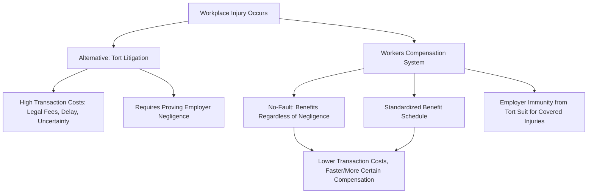

## Workers' Compensation

### Definition and Historical Origin

**Workers' compensation** is a mandatory social insurance program (administered at the state level in the U.S., with analogous systems internationally) that provides medical care and partial wage replacement to workers injured or made ill in the course of employment, in exchange for the worker relinquishing the right to sue the employer in tort for those workplace injuries. This **"compensation bargain"** — no-fault benefits in exchange for a liability shield — distinguishes workers' compensation from both ordinary tort liability and other social insurance programs like unemployment or disability insurance.

**Key Points**

- Workers' compensation is a **no-fault system**: benefits are generally payable regardless of whether the employer or worker was negligent, in contrast to the tort system it substantially replaced for workplace injuries.
- It is typically financed through **employer-paid premiums** (either through private/mutual insurance carriers, state-run funds, or employer self-insurance for sufficiently large firms), with premiums commonly **experience-rated** — a firm's own claims history affects its future premium rate, structurally analogous to UI experience rating (see [[Unemployment Insurance Design]]).
- The system emerged historically (in the U.S. context, primarily in the 1910s across most states) as a political-economic compromise: employers gained protection from potentially large, unpredictable tort judgments and litigation costs, while workers gained more certain (if typically capped and lower-value) compensation without needing to prove employer negligence.

### The Coasean Bargain Framing

Workers' compensation is frequently analyzed through a Coasean lens: in the absence of transaction costs and with well-defined property rights, workers and firms could in principle negotiate an efficient level of workplace safety investment and injury compensation privately, regardless of the initial legal liability assignment. Workers' compensation can be understood as a **standardized, low-transaction-cost substitute** for what would otherwise require costly individual tort litigation to establish liability and compensation amounts in each injury case — mandating a predictable formula-based benefit schedule in place of case-by-case judicial determination.

### Benefit Structure

Workers' compensation benefits typically comprise several distinct components:

1. **Medical benefits**: coverage of medical treatment costs related to the workplace injury, generally without the deductibles/copays typical of standard health insurance and often without a cap on total medical spending.
2. **Temporary total disability (TTD) benefits**: wage replacement (commonly around two-thirds of pre-injury wages, subject to state-specific minimum/maximum caps) during a period of total incapacity to work, following a brief waiting period analogous to UI's waiting period.
3. **Temporary partial disability (TPD) benefits**: partial wage replacement for workers who can return to work but at reduced hours or in a lower-paying capacity during recovery.
4. **Permanent partial disability (PPD) benefits**: compensation for lasting impairment that does not fully preclude work, often determined via a **scheduled injury** framework (a statutory schedule assigning specific benefit amounts to specific injury types, e.g., loss of a finger, hand, or eye) or via a broader whole-body impairment rating for non-scheduled injuries.
5. **Permanent total disability (PTD) benefits**: extended (sometimes lifetime) wage replacement for workers who are permanently unable to return to any substantial employment.
6. **Death benefits**: payments to dependents in the event of a fatal workplace injury.

### SVG Diagram: Workers' Compensation Benefit Categories (svg_diagram)

<svg xmlns="http://www.w3.org/2000/svg" viewBox="0 0 640 320">
<text x="320" y="24" text-anchor="middle" font-size="14" font-weight="bold" font-family="sans-serif">Workers Compensation Benefit Structure (svg_diagram)</text>
<rect x="30" y="60" width="140" height="200" rx="6" fill="none" stroke="#1f77b4" stroke-width="2" />
<text x="100" y="85" text-anchor="middle" font-size="11" font-weight="bold" fill="#1f77b4" font-family="sans-serif">Medical</text>
<text x="100" y="105" text-anchor="middle" font-size="9" font-family="sans-serif">Treatment costs</text>
<text x="100" y="120" text-anchor="middle" font-size="9" font-family="sans-serif">No deductible</text>
<rect x="185" y="60" width="140" height="200" rx="6" fill="none" stroke="#2ca02c" stroke-width="2" />
<text x="255" y="85" text-anchor="middle" font-size="11" font-weight="bold" fill="#2ca02c" font-family="sans-serif">Temporary</text>
<text x="255" y="105" text-anchor="middle" font-size="9" font-family="sans-serif">Total (TTD)</text>
<text x="255" y="120" text-anchor="middle" font-size="9" font-family="sans-serif">Partial (TPD)</text>
<text x="255" y="140" text-anchor="middle" font-size="9" font-family="sans-serif">~2/3 wage replacement</text>
<rect x="340" y="60" width="140" height="200" rx="6" fill="none" stroke="#ff7f0e" stroke-width="2" />
<text x="410" y="85" text-anchor="middle" font-size="11" font-weight="bold" fill="#ff7f0e" font-family="sans-serif">Permanent</text>
<text x="410" y="105" text-anchor="middle" font-size="9" font-family="sans-serif">Partial (PPD)</text>
<text x="410" y="120" text-anchor="middle" font-size="9" font-family="sans-serif">Scheduled/unscheduled</text>
<text x="410" y="140" text-anchor="middle" font-size="9" font-family="sans-serif">Total (PTD)</text>
<rect x="495" y="60" width="120" height="200" rx="6" fill="none" stroke="#d62728" stroke-width="2" />
<text x="555" y="85" text-anchor="middle" font-size="11" font-weight="bold" fill="#d62728" font-family="sans-serif">Death</text>
<text x="555" y="105" text-anchor="middle" font-size="9" font-family="sans-serif">Dependent</text>
<text x="555" y="120" text-anchor="middle" font-size="9" font-family="sans-serif">benefits</text>
</svg>

### Experience Rating and Firm Safety Incentives

**Key Points**

- Experience rating in workers' compensation is generally considered **more refined and impactful** than in UI, since workplace safety investment is a more directly firm-controllable margin than layoff avoidance, giving experience-rated premiums a clearer incentive-alignment purpose: firms with poor safety records (higher claims frequency/severity) face higher premiums, internalizing at least part of the social cost of workplace injuries.
- The theoretical prediction is that experience rating should induce firms to invest in workplace safety up to the point where the marginal cost of additional safety investment equals the marginal expected reduction in workers' compensation premiums (plus any residual liability/reputational costs) — a Pigouvian-style incentive mechanism.
- **Imperfect experience rating** — particularly for small firms, which are frequently subject to less granular experience rating (or none at all) due to the statistical unreliability of small claims samples — is predicted to blunt this safety incentive for the segment of the firm-size distribution facing flat or class-rated (rather than firm-specific) premiums. [Inference: the empirical magnitude of experience rating's effect on actual safety investment and injury rates varies across studies and industries, and isolating this effect from other confounding safety-regulation and firm-characteristic factors is methodologically challenging.]

### Moral Hazard: Claiming Behavior and Return-to-Work Incentives

A workers' compensation-specific moral hazard concern, distinct from the UI literature's job-search moral hazard, centers on:

- **Claims reporting/severity moral hazard**: more generous benefit levels are associated in several studies with increased claims filing rates and/or increased reported injury duration, raising the question of whether this reflects genuine injury severity or benefit-induced changes in claiming and recovery behavior — commonly studied using discontinuities in state benefit formulas (analogous to the UI regression-discontinuity literature) or benefit level changes over time within a state.
- **Malingering vs. genuine severity**: because pain and functional limitation for many common injury types (e.g., soft-tissue back injuries) are difficult for a third party to objectively verify, this literature parallels the disability insurance screening challenge discussed in [[Disability Insurance]], and estimates of claims-elasticity with respect to benefit generosity are subject to similar interpretive debates about how much reflects moral hazard versus genuine, benefit-independent injury severity.
- **Return-to-work programs**: many jurisdictions have implemented light-duty/modified-work return programs designed to reduce the duration of wage-replacement benefit receipt by accommodating partial work capacity during recovery, with mixed but generally supportive evidence on reducing benefit duration without compromising recovery outcomes. [Unverified: the specific effectiveness of return-to-work program design varies by jurisdiction and industry, and this is an area of ongoing program evaluation research rather than settled universal findings.]

### Interaction with Cost Shifting to Other Programs

**Example**

A recurring policy concern in this literature is potential **cost-shifting** between workers' compensation and other disability/health programs: because workers' compensation covers only injuries determined to be work-related, disputes over causation (particularly for conditions with mixed or ambiguous occupational and non-occupational origins, such as certain musculoskeletal or cumulative-trauma conditions) can result in claims being denied by workers' compensation and subsequently shifted onto general health insurance, Social Security Disability Insurance, or other social insurance programs — a phenomenon sometimes termed **"cost-shifting"** in the health/disability policy literature, with implications for how the true social cost of workplace injury risk is measured and distributed across different financing systems. [Unverified: the empirical magnitude of this cost-shifting phenomenon is difficult to precisely measure given data limitations linking claims across separate administrative systems, and estimates in the literature vary.]

### Conclusion

**Conclusion**

Workers' compensation exemplifies a distinctive social insurance design that combines no-fault, standardized compensation with a liability-shield mechanism and firm-level experience rating intended to internalize the social cost of workplace injury risk into individual employer safety incentives. Its economic analysis draws on tools common to the broader social insurance literature covered in this chapter — the moral hazard/consumption-smoothing tradeoff familiar from unemployment and disability insurance, and the experience-rating incentive-alignment logic also relevant to UI financing — while introducing distinctive features specific to workplace injury risk, including the tort-substitution rationale, scheduled-injury benefit structures, and cross-program cost-shifting concerns at the boundary with disability insurance and general health coverage. [Unverified: specific state-level benefit formulas, experience rating methodologies, and covered injury definitions vary substantially across U.S. states and international jurisdictions, and current program-specific details should be verified against current state workers' compensation board documentation.]

**Next Steps**

- Unemployment Insurance Design (comparative experience-rating framework)
- Disability Insurance (screening and claims verification parallels)
- Tort Law and the Economics of Liability Rules
- Coase Theorem and Transaction Cost Economics
- Workplace Safety Regulation (OSHA and Related Frameworks)
- Return-to-Work Program Design and Evaluation
- Scheduled vs. Unscheduled Injury Compensation Formulas
- Cost-Shifting Across Social Insurance Programs