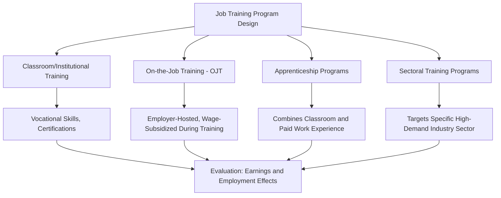

## Job Training Programs

### Definition and Scope Within Active Labor Market Policy

**Job training programs** are a category of **active labor market policy (ALMP)** — government interventions designed to improve participants' employment prospects and earnings by directly building human capital, as distinct from **passive labor market policy** (income support such as unemployment or disability insurance, discussed in [[Unemployment Insurance Design]]). Training programs sit alongside other ALMP categories — job search assistance, wage subsidies, and public employment programs — within a broader policy toolkit aimed at improving labor market matching and worker productivity.

| ALMP Category | Core Mechanism | Example |
| --- | --- | --- |
| Job training | Builds human capital/skills | Vocational classroom training, on-the-job training |
| Job search assistance | Reduces search frictions/information gaps | Job clubs, counseling, resume assistance |
| Wage subsidies | Reduces employer cost of hiring targeted workers | Targeted hiring credits |
| Public employment | Directly provides (often temporary) jobs | Public works programs |

### Theoretical Rationale

**Key Points**

- The human capital rationale (see Becker's human capital theory) holds that training raises a worker's marginal product, and therefore their market wage, by building skills valued by employers — a straightforward extension of standard human capital investment theory to a publicly-subsidized context aimed at workers who may face liquidity constraints or information gaps preventing efficient private investment in their own skills.
- A **market failure rationale** specific to publicly-provided (rather than purely privately financed) training rests on the idea that credit-constrained workers, particularly displaced or long-term unemployed workers, may be unable to finance training investments themselves (due to absent collateral and the non-bankable nature of human capital), and that general/transferable skill training is subject to a **hold-up problem** when financed by employers (a firm may underinvest in training that increases a worker's outside options, since the trained worker could then be poached by a competing firm without the training firm recouping its investment) — a classic Becker-style distinction between general and firm-specific human capital investment incentives.
- Training programs are also frequently justified as a **complement to UI/passive income support**, addressing the concern that income replacement alone does not improve a claimant's underlying employability, potentially prolonging unemployment durations if skill mismatch (rather than pure search friction) is the binding constraint on reemployment.

### Program Design Typology

### Evaluation Methodology: The Selection Problem

**Key Points**

- The central empirical challenge in evaluating job training programs is **selection bias**: individuals who choose to participate in voluntary training programs likely differ systematically from non-participants in ways that independently affect labor market outcomes (motivation, underlying ability, local labor market conditions), making simple before-after or participant-vs-nonparticipant comparisons unreliable for causal inference.
- The gold-standard approach is the **randomized controlled trial (RCT)**, randomly assigning eligible applicants to a training-offered treatment group versus a control group, as used in several influential U.S. federal program evaluations (e.g., the National JTPA Study evaluating the Job Training Partnership Act, and subsequent evaluations of the Workforce Investment Act and its successor, the Workforce Innovation and Opportunity Act).
- Where RCTs are infeasible, researchers employ quasi-experimental methods: **matching estimators** (comparing participants to observably similar non-participants), **regression discontinuity designs** (where program eligibility is determined by a sharp threshold, e.g., an eligibility score cutoff), and **difference-in-differences** designs exploiting variation in program rollout timing or eligibility rule changes across regions.

### Empirical Findings: Effect Heterogeneity

**Example**

A substantial body of RCT and quasi-experimental evidence on job training programs has produced several relatively robust patterns:

| Finding | Pattern | Notes |
| --- | --- | --- |
| Short-run earnings effects | Often modest or even negative in the first 1-2 years | "Lock-in effect" — participants reduce job search while in training |
| Medium/long-run earnings effects | More positive for several well-evaluated programs, particularly for women and disadvantaged adults | Effects often take multiple years to materialize and can fade over longer horizons |
| Effects by demographic group | Frequently larger and more consistently positive for adult women than for youth or adult men in several major U.S. program evaluations | [Inference: heterogeneity patterns vary somewhat by program design and specific study; this is a general tendency observed across several evaluations, not a universal finding] |
| Classroom training vs. OJT | On-the-job training and apprenticeship-style programs often show more consistently positive effects than pure classroom vocational training in several studies | Possibly reflects better alignment with actual employer skill demand |
| Sectoral training programs | Some of the more consistently positive recent evidence comes from sectoral programs explicitly designed around local employer-identified skill needs | E.g., certain U.S. sectoral employment initiatives studied via RCT |
| Youth training program effects | Historically weaker or null effects in several major U.S. evaluations relative to adult program effects | Motivated continued design experimentation for youth-targeted programs |

**[Inference: the table summarizes broad tendencies from a heterogeneous evaluation literature; specific point estimates, statistical significance, and even the direction of effects vary meaningfully across individual studies, programs, and countries.]**

### The "Lock-In Effect"

**Key Points**

- The **lock-in effect** is a well-documented short-run phenomenon in which participation in training reduces job search intensity *during* the training period (since time and attention are allocated to training rather than search, and some programs restrict job search while enrolled), leading to a temporary earnings/employment *disadvantage* for training participants relative to a comparison group immediately following program entry.
- This complicates evaluation and policy design because a training program can appear to have negative or null effects when measured over a short post-enrollment window, only for genuinely positive human-capital effects to emerge in subsequent years once the training investment "pays off" — underscoring the importance of longer follow-up periods in credible program evaluation, and cautioning against premature conclusions from evaluations with short observation windows.

### SVG Diagram: The Lock-In Effect and Long-Run Earnings Trajectory (svg_diagram)

<svg xmlns="http://www.w3.org/2000/svg" viewBox="0 0 640 340">
<text x="320" y="24" text-anchor="middle" font-size="14" font-weight="bold" font-family="sans-serif">Stylized Training Program Earnings Trajectory (svg_diagram)</text>
<line x1="70" y1="290" x2="580" y2="290" stroke="black" stroke-width="1.5" />
<line x1="70" y1="290" x2="70" y2="50" stroke="black" stroke-width="1.5" />
<text x="560" y="310" font-size="12" font-family="sans-serif">Years Since Enrollment</text>
<text x="20" y="50" font-size="12" font-family="sans-serif">Earnings</text>
<line x1="70" y1="200" x2="580" y2="200" stroke="#888" stroke-width="1" stroke-dasharray="4" />
<text x="590" y="204" font-size="10" font-family="sans-serif">Control group</text>
<path d="M 70 200 L 150 240 L 230 210 L 320 160 L 420 110 L 520 85" fill="none" stroke="#1f77b4" stroke-width="2.5" />
<text x="530" y="80" font-size="10" fill="#1f77b4" font-family="sans-serif">Treatment (training) group</text>
<rect x="70" y="60" width="160" height="230" fill="#d62728" opacity="0.08" />
<text x="90" y="270" font-size="10" fill="#d62728" font-family="sans-serif">Lock-in period</text>
<text x="90" y="282" font-size="10" fill="#d62728" font-family="sans-serif">(below control)</text>

<text x="330" y="140" font-size="10" fill="`#2ca02c`" font-family="sans-serif">Crossover: human capital gains materialize</text>

</svg>

### Cost-Benefit and Cost-Effectiveness Considerations

**Key Points**

- Because job training programs involve direct fiscal costs (program operation, instructor/vendor costs, and often a wage-replacement or stipend component for participants), program evaluation increasingly incorporates **cost-benefit analysis**, comparing the present value of estimated earnings gains (and any associated reductions in transfer program receipt) against total program cost per participant.
- **Cost-effectiveness varies substantially by program type**: sectoral and OJT/apprenticeship models are frequently found to be more cost-effective per participant than broad-based classroom vocational training in comparative evaluations, though direct comparisons across studies are complicated by differing populations served, cost accounting methods, and follow-up horizons. [Unverified: specific cost-benefit ratios cited in individual program evaluations are highly context- and methodology-dependent and should not be generalized across programs without examining the underlying study design.]
- A distinct policy question from *individual* program cost-effectiveness is **general equilibrium/displacement effects**: if training simply improves a participant's position in the hiring queue relative to non-participants without increasing the aggregate number of available jobs, then at the level of a full labor market, one worker's improved outcome may partly displace another (non-treated) worker who would otherwise have been hired — a concern more relevant to job search assistance and wage subsidy programs but also raised regarding training in already-saturated labor markets, and one that is generally not detected in program-level RCT estimates (which measure the effect on participants relative to a control group, not the full general-equilibrium labor market effect). [Inference: the empirical magnitude of aggregate displacement effects is difficult to estimate directly and represents a known limitation of individual-level RCT evidence for informing questions about scaling a program economy-wide.]

### Conclusion

**Conclusion**

Job training programs occupy a distinctive position within active labor market policy: they directly target human capital as the mechanism for improving labor market outcomes, in contrast to passive income-support programs and job-search-facilitation interventions, and they are supported by a comparatively rich (though heterogeneous) experimental and quasi-experimental evaluation literature. The accumulated evidence suggests that program design details — sectoral targeting, on-the-job versus classroom delivery, and the specific population served — matter considerably more for effectiveness than a generic "does job training work" framing would suggest, and that evaluation timing (accounting for the lock-in effect) is critical for accurately assessing program value. This nuanced, design-dependent evidence base has substantially shaped the evolution of U.S. and international training policy toward more targeted, employer-informed sectoral models in recent decades. [Unverified: current program funding levels, specific design features, and comparative effectiveness rankings continue to evolve with ongoing policy experimentation and new evaluation evidence; consult current program-specific evaluations for up-to-date findings.]

**Next Steps**

- Human Capital Theory: General vs. Specific Skills
- Randomized Controlled Trials in Labor Economics
- Sectoral Employment Training Program Models
- The Lock-In Effect and Evaluation Timing
- Job Search Assistance Programs
- Apprenticeship Program Design and International Comparisons
- Wage Subsidy Programs and Targeted Hiring Credits
- General Equilibrium Displacement Effects in Program Evaluation