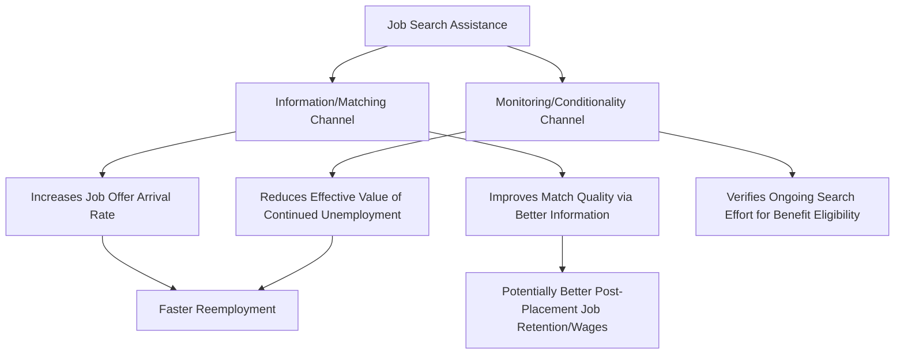

## Job Search Assistance Programs

### Definition and Position Within Active Labor Market Policy

**Job search assistance (JSA)** programs constitute a category of active labor market policy focused on reducing **search frictions and information gaps** in the job-matching process, rather than building human capital (the domain of [[Job Training Programs]]) or directly subsidizing wages/employment. JSA encompasses services such as job counseling, résumé and interview preparation, job clubs, structured job-search plans, mandatory reporting requirements, and increasingly, algorithmically-targeted vacancy referrals. JSA is generally the **least resource-intensive** ALMP category per participant, which has significant implications for its cost-effectiveness profile relative to training and wage-subsidy interventions.

### Theoretical Foundation: Search Theory

JSA programs are best understood through the lens of **job search theory**, in which an unemployed worker samples wage offers from an underlying offer distribution and accepts an offer only if it exceeds their **reservation wage** — the minimum wage at which they are indifferent between accepting the job and continuing to search.

$$w^* = \text{reservation wage such that: } U(\text{unemployed, continue searching}) = U(\text{accept offer } w^*)$$

The canonical reservation wage condition, in a simple stationary search model, can be expressed as:

$$w^* = b + \frac{\lambda}{r + \delta}\int_{w^*}^{\infty}(w - w^*)dF(w)$$

Where $b$ is the flow value of unemployment (including UI benefits and the value of leisure/home production), $\lambda$ is the job offer arrival rate, $r$ is the discount rate, $\delta$ is the job separation rate, and $F(w)$ is the wage offer distribution.

**Key Points**

- JSA interventions are theorized to operate primarily through **raising the offer arrival rate $\lambda$** (by connecting workers to more vacancies, more efficiently, than unassisted search would achieve) rather than through directly changing the reservation wage or the underlying wage offer distribution.
- Some JSA components (particularly mandatory job search verification/monitoring and job-search plan requirements) may also operate by **lowering the effective value of continued unemployment $b$** — a mechanism closer to reducing moral hazard (as in the UI literature) than to pure information/matching improvement, making some JSA interventions conceptually a hybrid between service provision and benefit conditionality enforcement.

### Mermaid Diagram: Channels Through Which JSA Affects Job Finding

### Program Design Variants

| JSA Variant | Core Mechanism | Typical Intensity |
| --- | --- | --- |
| Basic job search workshops/job clubs | Group-based resume, interview, search-strategy training | Low-intensity, short duration |
| Individualized case management/counseling | One-on-one caseworker assessment and referral | Moderate intensity |
| Mandatory reporting/work-search verification | Documentation of search activity tied to benefit eligibility | Administrative, low direct cost |
| Profiling and targeted referral (statistical targeting) | Uses predictive models to identify claimants at high risk of long-term unemployment for more intensive services | Increasingly technology-driven |
| Reemployment bonuses | Cash bonus for finding a job within a specified window | Financial incentive rather than service provision |

### Empirical Evidence: The Relatively Favorable Cost-Effectiveness Profile

**Example**

A substantial body of RCT evidence, particularly from evaluations of European and U.S. public employment service reforms, has produced a relatively consistent finding within the ALMP literature: **job search assistance programs frequently show more favorable cost-effectiveness ratios than job training programs**, primarily because JSA's low per-participant cost means that even modest reductions in unemployment duration (on the order of days to a few weeks) can generate a positive net benefit, whereas training's substantially higher cost per participant requires larger and more durable earnings gains to clear the same cost-benefit threshold.

**Key Points**

- Multiple meta-analyses of ALMP evaluations (e.g., work associated with Card, Kluve, and Weber synthesizing evaluations across many countries) find that job search assistance and monitoring programs tend to show more consistently positive short-run employment effects than either classroom training or public employment programs, though the *magnitude* of effects is generally modest (often measured in percentage-point increases in job-finding hazard rates or reductions of a few weeks in expected unemployment duration).
- Studies of the U.S. **Reemployment and Eligibility Assessment (REA)** and predecessor **Worker Profiling and Reemployment Services (WPRS)** programs, which combine mandatory in-person meetings, work-search verification, and referral to services for UI claimants statistically profiled as being at high risk of long-term unemployment, have found evidence of reduced UI benefit duration and increased earnings, with some of this effect attributed to the monitoring/verification channel (reduced continued claiming) as much as pure job-matching improvement. [Inference: disentangling the pure information/matching channel from the monitoring/conditionality channel in these specific program evaluations is methodologically difficult, and the relative contribution of each channel is not fully settled in the literature.]

### SVG Diagram: Comparative Cost-Effectiveness Across ALMP Types (svg_diagram)

<svg xmlns="http://www.w3.org/2000/svg" viewBox="0 0 640 360">
<text x="320" y="24" text-anchor="middle" font-size="14" font-weight="bold" font-family="sans-serif">Stylized Cost vs. Effect Size Across ALMP Categories (svg_diagram)</text>
<line x1="80" y1="310" x2="580" y2="310" stroke="black" stroke-width="1.5" />
<line x1="80" y1="310" x2="80" y2="50" stroke="black" stroke-width="1.5" />
<text x="550" y="330" font-size="11" font-family="sans-serif">Cost per Participant</text>
<text x="30" y="50" font-size="11" font-family="sans-serif">Employment Effect</text>
<circle cx="140" cy="180" r="10" fill="#2ca02c" />
<text x="155" y="175" font-size="10" fill="#2ca02c" font-family="sans-serif">Job Search Assistance</text>
<text x="155" y="190" font-size="9" fill="#555" font-family="sans-serif">Low cost, modest but consistent effect</text>
<circle cx="280" cy="230" r="10" fill="#ff7f0e" />
<text x="295" y="225" font-size="10" fill="#ff7f0e" font-family="sans-serif">Wage Subsidies</text>
<text x="295" y="240" font-size="9" fill="#555" font-family="sans-serif">Moderate cost, mixed displacement concerns</text>
<circle cx="420" cy="140" r="10" fill="#1f77b4" />
<text x="435" y="135" font-size="10" fill="#1f77b4" font-family="sans-serif">Job Training</text>
<text x="435" y="150" font-size="9" fill="#555" font-family="sans-serif">Higher cost, larger but slower-emerging effect</text>
<circle cx="500" cy="270" r="10" fill="#d62728" />
<text x="515" y="265" font-size="10" fill="#d62728" font-family="sans-serif">Public Employment</text>
<text x="515" y="280" font-size="9" fill="#555" font-family="sans-serif">High cost, often weakest post-program effects</text>
</svg>

### Displacement and General Equilibrium Effects

**Key Points**

- A specific concern raised regarding JSA (shared conceptually with wage subsidy programs) is **displacement**: if JSA merely helps a participant find a job faster by improving their position relative to other job seekers competing for the same vacancy, without increasing the aggregate number of vacancies available, then the participant's improved outcome may partly come at the expense of other, non-assisted job seekers — a pure **relative queue-jumping effect** rather than a genuine increase in aggregate employment.
- This concern is theoretically more salient in labor markets with significant matching frictions and a limited vacancy pool (i.e., closer to demand-constrained conditions) than in tight labor markets with abundant unfilled vacancies, where faster matching for one worker need not meaningfully reduce the job-finding prospects of others.
- Individual-level RCT evaluations, by design, estimate the effect on participants relative to a randomly assigned control group **within the same local labor market**, and are therefore generally not well-suited to detecting or quantifying aggregate displacement effects that would only become apparent if the program were scaled to cover a large share of a local labor market's job seekers simultaneously. [Unverified: empirically distinguishing pure displacement from genuine aggregate employment gains at scale requires specialized general-equilibrium or market-level research designs, and this remains a less-settled area than the individual-level effectiveness literature.]

### Reemployment Bonuses: A Financial-Incentive Variant

**Example**

A related but mechanistically distinct policy tool is the **reemployment bonus**: a lump-sum cash payment offered to UI claimants who find a job within a specified early window (e.g., within the first several weeks of a claim), intended to accelerate reemployment by directly altering the worker's private incentive calculus rather than by improving search technology or information. Experimental evaluations of reemployment bonus programs (conducted in several U.S. states in the 1980s-1990s) generally found modest reductions in unemployment duration, though effects were sensitive to the bonus amount and qualifying window design, and take-up/awareness of the bonus offer among eligible claimants was found to be an important practical constraint on program effectiveness in some evaluations. [Inference: reemployment bonus programs have seen more limited large-scale policy adoption relative to standard JSA service models, potentially reflecting this more modest and design-sensitive evidence base, though the specific reasons for adoption patterns are not fully documented in the empirical literature reviewed here.]

### Statistical Profiling and Targeting

**Key Points**

- Because JSA resources are finite, several public employment services (including the U.S. WPRS system referenced above) use **statistical profiling models** to predict which UI claimants are at elevated risk of long-term unemployment, prioritizing more intensive JSA services for this higher-risk subgroup rather than providing uniform-intensity services to all claimants.
- This targeting approach reflects an implicit efficiency judgment: since claimants likely to find reemployment quickly on their own derive limited *marginal* benefit from JSA services, concentrating services on higher-risk claimants is expected to generate a larger aggregate employment/earnings effect per dollar of program spending than untargeted universal provision.
- Modern iterations of this approach increasingly incorporate machine-learning-based predictive models trained on historical claimant and labor market data, raising both effectiveness questions (does improved statistical prediction meaningfully improve targeting accuracy relative to simpler rule-based profiling) and equity/fairness questions (whether predictive models incorporate or proxy for protected characteristics in ways that could disadvantage specific claimant subgroups) that are active areas of ongoing policy and research attention. [Unverified: the comparative effectiveness of modern machine-learning-based profiling versus earlier statistical profiling methods, and the resolution of associated fairness concerns, is an evolving area without settled consensus findings.]

### Conclusion

**Conclusion**

Job search assistance programs represent a comparatively low-cost, information/matching-focused component of active labor market policy that has generally demonstrated favorable cost-effectiveness relative to more resource-intensive training and public employment interventions, according to the accumulated meta-analytic evidence. However, this favorable individual-level effectiveness profile must be interpreted alongside open questions about aggregate displacement effects at scale, the difficulty of cleanly separating pure information/matching channels from benefit-conditionality/monitoring channels in many program designs, and the evolving methodological and equity considerations introduced by statistical targeting and profiling technologies. As with the broader ALMP literature, program design details and target population significantly influence effectiveness, cautioning against generic claims about JSA effectiveness independent of the specific program model examined. [Unverified: current program designs, targeting methodologies, and specific effect-size estimates continue to evolve with ongoing evaluation research and policy reform; consult current program-specific evaluations for up-to-date findings.]

**Next Steps**

- Job Search Theory and Reservation Wage Models
- Job Training Programs (comparative ALMP effectiveness)
- Card-Kluve-Weber ALMP Meta-Analysis
- Worker Profiling and Reemployment Services (WPRS) Program Evaluation
- Reemployment Bonus Experiments
- Unemployment Insurance Design (monitoring/conditionality interaction)
- General Equilibrium Effects and Displacement in Labor Market Programs
- Machine Learning-Based Statistical Profiling and Fairness Concerns