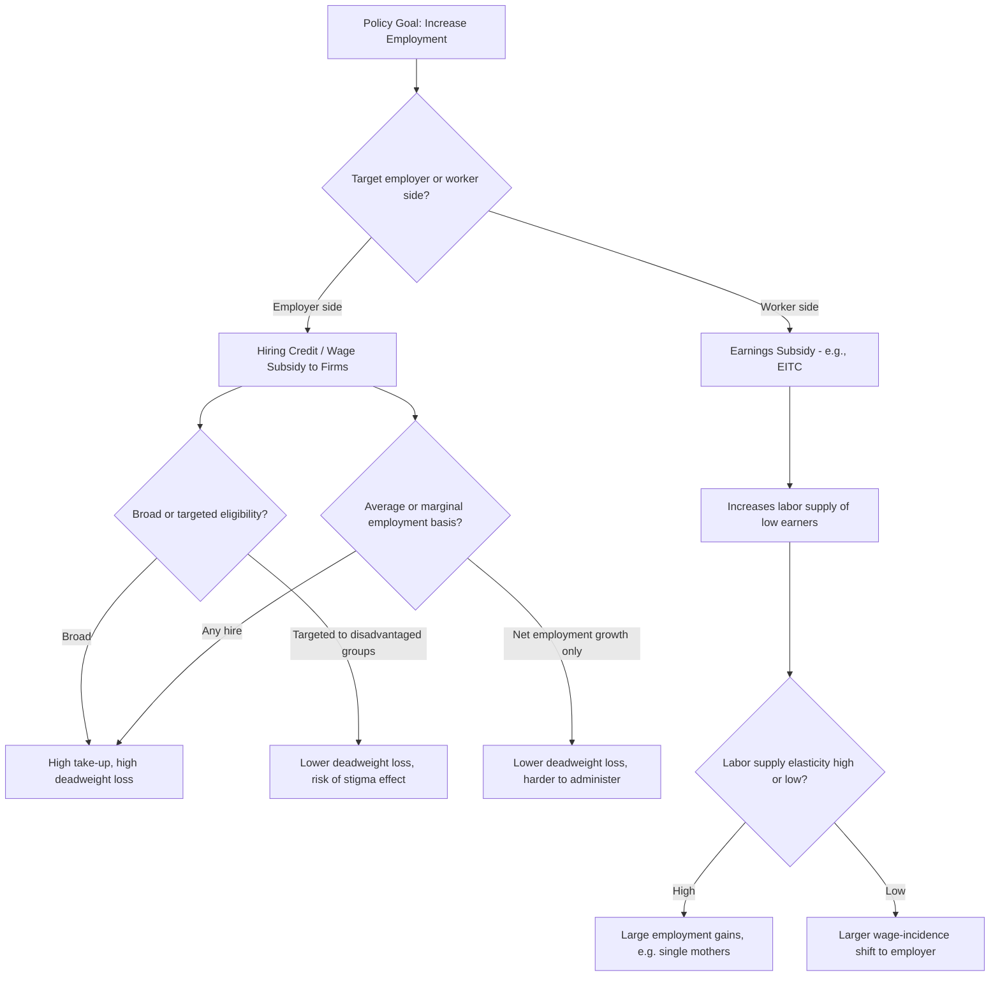

## Wage Subsidies and Hiring Credits

### Definitional Overview

Wage subsidies and hiring credits are active labor market policy (ALMP) instruments in which the government reduces the effective cost of labor to employers or increases the effective take-home earnings of workers, with the goal of increasing employment, particularly among disadvantaged or hard-to-employ groups. These instruments are distinguished from passive labor market policy (e.g., unemployment insurance) by their direct attempt to alter employer or worker incentives toward job creation rather than merely providing income replacement during unemployment.

**Key Points**

- Wage subsidies can be targeted at the employer side (reducing the cost of hiring) or the worker side (supplementing low earnings, e.g., the Earned Income Tax Credit)
- The theoretical justification typically rests on correcting a market failure or externality: hiring credits can address statistical discrimination against inexperienced/stigmatized workers, incomplete markets for on-the-job training, or short-run demand-deficient unemployment
- A central empirical concern across the literature is deadweight loss (subsidizing hires that would have occurred anyway) and substitution/displacement effects (subsidized workers displacing unsubsidized ones), both of which reduce the net employment impact relative to the gross number of subsidized positions

### Taxonomy of Instruments

**1. Employer-Side Hiring Credits**

Direct payments or tax credits to firms for hiring workers from a targeted group (e.g., long-term unemployed, youth, disabled workers, ex-offenders). Often structured as a percentage of wages paid, up to a cap, for a limited duration (commonly 6–24 months).

**2. Marginal Employment Subsidies**

Subsidies tied to *net* employment growth at the firm level (i.e., paid only for increases in headcount above a baseline), designed specifically to minimize deadweight loss relative to subsidies for any hire regardless of whether net firm employment grew.

**3. Short-Time Work / Work-Sharing Subsidies**

Subsidies that compensate firms for reducing hours rather than laying off workers during downturns (e.g., Germany's Kurzarbeit, various COVID-era furlough schemes), aimed at labor hoarding to preserve firm-specific human capital during temporary demand shocks.

**4. Worker-Side Earnings Subsidies**

Refundable tax credits paid to low-earning workers conditional on employment, most prominently the U.S. Earned Income Tax Credit (EITC) and the UK's Universal Credit earnings taper. These raise the effective wage received by the worker without directly lowering the cost to the employer, though incidence analysis (see below) shows some pass-through to employers is possible depending on labor supply and demand elasticities.

### Theoretical Framework: Incidence and Efficiency

**Employer-Side Subsidy Incidence**

Consider a per-worker hiring subsidy $s$ paid to firms. In a standard competitive labor market, labor demand $L^d(w)$ and labor supply $L^s(w)$ determine the pre-subsidy equilibrium wage $w^*$ and employment $L^*$. A subsidy $s$ shifts the effective cost of labor to the firm from $w$ to $w - s$, shifting the labor demand curve outward. The new equilibrium satisfies:

$$L^d(w - s) = L^s(w)$$

The employment effect depends on the elasticities of labor supply ($\eta_s$) and labor demand ($\eta_d$):

$$\Delta L = \frac{\eta_d \cdot \eta_s}{\eta_s - \eta_d} \cdot \frac{s}{w^*} \cdot L^*$$

[Inference] The precise incidence split between higher wages received by workers and lower net cost to firms depends on relative elasticities; in the polar case of perfectly elastic labor supply (common assumption for low-wage/low-skill labor markets with high unemployment), nearly the entire subsidy translates into increased employment/wages rather than pure profit for firms, while in the polar case of inelastic labor supply, the subsidy is largely captured as worker wage gains with little employment effect.

**Worker-Side Subsidy Incidence (EITC-type)**

An earnings subsidy that supplements wages for low-income workers shifts *labor supply* outward (since the effective after-subsidy return to work rises), rather than shifting labor demand. In a competitive market with an upward-sloping labor supply curve, this can partially depress the *pre-subsidy* market wage as more workers are drawn into the labor force, meaning employers may capture some fraction of the subsidy's value through lower wages even though the credit nominally target workers (Rothstein 2010 finds evidence of this "incidence shifting" for EITC in some specifications). [Unverified — the magnitude of employer capture from EITC-type subsidies remains debated and specification-sensitive across studies]

### Diagram: Labor Market Effects of an Employer-Side Hiring Subsidy

<svg xmlns="http://www.w3.org/2000/svg" viewBox="0 0 700 460" font-family="Helvetica, Arial, sans-serif">
<text x="350" y="28" text-anchor="middle" font-size="16" font-weight="bold" fill="#1a1a1a">Employer-Side Hiring Subsidy: Labor Market Shift (svg_diagram)</text>

<line x1="80" y1="400" x2="650" y2="400" stroke="#333" stroke-width="2" />
<line x1="80" y1="400" x2="80" y2="60" stroke="#333" stroke-width="2" />
<text x="365" y="430" text-anchor="middle" font-size="13" fill="#333">Employment (L)</text>
<text x="35" y="230" text-anchor="middle" font-size="13" fill="#333" transform="rotate(-90 35 230)">Wage (w)</text>

<path d="M 120 380 L 550 100" fill="none" stroke="#2255aa" stroke-width="2.5" />
<text x="555" y="95" font-size="12" fill="#2255aa">Labor Supply</text>

<path d="M 140 100 L 480 360" fill="none" stroke="#aa2222" stroke-width="2.5" />
<text x="440" y="375" font-size="12" fill="#aa2222">Labor Demand (D0)</text>

<path d="M 200 100 L 570 360" fill="none" stroke="#aa2222" stroke-width="2.5" stroke-dasharray="6,3" />
<text x="575" y="355" font-size="12" fill="#aa2222">Labor Demand (D0 + s)</text>

<circle cx="330" cy="230" r="4" fill="#333" />
<line x1="330" y1="230" x2="330" y2="400" stroke="#999" stroke-dasharray="3,3" />
<line x1="80" y1="230" x2="330" y2="230" stroke="#999" stroke-dasharray="3,3" />
<text x="335" y="245" font-size="11" fill="#333">E0 (pre-subsidy)</text>
<circle cx="390" cy="200" r="4" fill="#116622" />
<line x1="390" y1="200" x2="390" y2="400" stroke="#999" stroke-dasharray="3,3" />
<line x1="80" y1="200" x2="390" y2="200" stroke="#999" stroke-dasharray="3,3" />
<text x="395" y="195" font-size="11" fill="#116622">E1 (post-subsidy)</text>

<text x="150" y="415" font-size="11" fill="#333">L0</text>

<text x="380" y="415" font-size="11" fill="`#116622`">L1</text>

<text x="330" y="420" font-size="10" fill="#666">ΔL = employment gain</text>

</svg>

### Empirical Evidence

**Example**

A canonical evaluation design is the U.S. **New Jobs Tax Credit (NJTC)** of the late 1970s, which subsidized firms for net increases in employment (a marginal, not average, employment subsidy). Perloff and Wachter's evaluation found employment effects consistent with meaningful job creation, though take-up and awareness of the credit among eligible firms were incomplete — a recurring finding across many hiring-credit programs, where administrative complexity and low employer awareness reduce realized impact well below theoretical potential.

More recent randomized and quasi-experimental evaluations include:

- **Targeted Jobs Tax Credit (U.S.)** studies found relatively weak overall employment effects, partly attributed to stigma: firms may be reluctant to hire from targeted disadvantaged groups (e.g., ex-offenders, long-term unemployed) even with a subsidy, if the subsidy itself signals negative information about worker quality — a phenomenon known as the **stigma/signaling effect of targeted subsidies**
- **French and other European "youth employment" hiring credit evaluations** frequently find substantial *displacement effects* — subsidized firms substitute subsidized workers for otherwise-similar unsubsidized workers, muting aggregate employment gains even when firm-level hiring responds strongly to the credit
- **Short-time work schemes** (e.g., German Kurzarbeit during the 2008–09 financial crisis) are broadly credited in the literature with substantially reducing layoffs relative to what standard business-cycle relationships would have predicted, an example where the labor-hoarding/specific-human-capital-preservation rationale appears empirically well-supported [Inference — while the qualitative direction of this finding is widely replicated, the precise magnitude of jobs "saved" depends heavily on the counterfactual modeling assumptions used in each study]

### Key Design Trade-offs

| Design Choice | Benefit | Cost/Risk |
| --- | --- | --- |
| Broad eligibility (any hire) | Simple administration, high take-up | High deadweight loss (subsidizes hires that would occur anyway) |
| Targeted eligibility (disadvantaged groups) | Lower deadweight loss, addresses discrimination | Stigma effect may reduce employer willingness to hire target group |
| Marginal (net employment growth) subsidy | Minimizes deadweight loss theoretically | Harder to administer, easier to game via churn/gross-vs-net manipulation |
| Time-limited duration | Limits fiscal cost, encourages fast matching | May encourage firms to churn workers just before subsidy expiration ("subsidy cliff" effect) |
| Worker-side (EITC-style) | Directly raises worker income, strong labor-supply-side employment effects (esp. single mothers, per Eissa-Liebman) | Some pass-through to employers via lower wages; does not directly address employer-side hiring frictions or discrimination |

**Note (formatting):** The table above uses standard Markdown table syntax; renderers such as Obsidian and GitHub support this natively.

### Deadweight Loss, Substitution, and Displacement — Formal Distinctions

- **Deadweight loss**: the subsidized hire would have occurred even absent the subsidy — a pure transfer with no employment effect
- **Substitution effect**: the firm hires a subsidized worker instead of an otherwise-identical unsubsidized worker, with no net change in the firm's total employment
- **Displacement effect**: the subsidized firm's increased output/lower costs allow it to gain market share from competitor (unsubsidized) firms, reducing employment at competitors and offsetting some of the gross job creation at the subsidized firm

$$\text{Net Aggregate Employment Effect} = \text{Gross Jobs Created} - \text{Deadweight} - \text{Substitution} - \text{Displacement}$$

[Inference] Estimating the displacement term specifically requires general-equilibrium or market-level (rather than firm-level) research designs, since firm-level evaluations by construction cannot observe employment losses at non-treated competitor firms; this is widely acknowledged in the literature as one of the harder components of net-impact estimation to credibly identify.

### Diagram: Program Design Decision Flow

### Policy Implications

- Marginal, targeted, and time-limited hiring credits are generally favored on efficiency grounds in the theoretical literature, but empirical take-up and stigma issues frequently undermine their real-world performance relative to average, broad-based subsidies
- Combining hiring credits with complementary active labor market services (job search assistance, training vouchers, wage insurance) is commonly recommended to mitigate stigma and information frictions that undermine subsidy take-up on their own
- Short-time work/work-sharing subsidies are increasingly viewed as valuable countercyclical stabilization tools distinct from the standard hiring-credit literature, since their goal (preserving existing specific human capital matches) differs from job-creation-focused hiring credits
- [Speculation] The rise of increasingly detailed administrative and payroll data infrastructure in many countries may make marginal/net-employment-based subsidy designs more administratively feasible going forward, potentially shifting policy design away from simpler but less efficient broad-eligibility credits — this is a plausible forward-looking trend rather than an established empirical finding

### Related Topics

- Active vs. Passive Labor Market Policy Instruments
- The Earned Income Tax Credit and Labor Supply Responses (Eissa-Liebman)
- Statistical Discrimination and Employer Screening of Disadvantaged Workers
- Short-Time Work Schemes and Labor Hoarding During Recessions
- Minimum Wage Policy and Incidence Analysis
- Job Search Assistance and Training Voucher Programs
- Deadweight Loss, Substitution, and Displacement in Program Evaluation
- General Equilibrium Evaluation Methods for Labor Market Programs