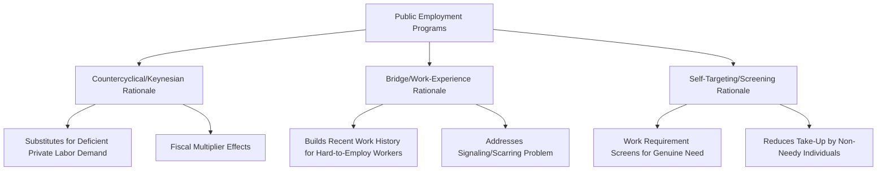

## Public Employment Programs

### Definition and Position Within Active Labor Market Policy

**Public employment programs (PEPs)** are active labor market policy interventions in which the government directly creates or funds temporary jobs for unemployed workers, typically in public works, infrastructure maintenance, community services, or environmental projects. PEPs are distinguished from the other ALMP categories covered in this chapter — [[Job Training Programs]] (which build human capital) and [[Job Search Assistance Programs]] (which address matching frictions) — by directly providing employment itself rather than improving a worker's capacity or ability to find employment in the existing private labor market.

### Historical Origins and Rationale

**Key Points**

- The modern conceptual and historical touchstone for large-scale PEPs is the array of **New Deal-era programs** in the United States during the Great Depression (e.g., the Works Progress Administration and Civilian Conservation Corps), designed to provide income and employment during a period of severe involuntary unemployment and weak private labor demand.
- The core Keynesian macroeconomic rationale treats PEPs as a form of **countercyclical fiscal policy**: during a demand-deficient recession, public employment can substitute for absent private-sector demand for labor, providing income support with a work requirement while also potentially generating a fiscal multiplier effect through worker spending.
- A distinct, **microeconomic/labor-supply-side rationale** — more relevant to PEPs used as an ongoing feature of the ALMP toolkit rather than purely as recession-response fiscal policy — holds that public employment can serve as a **bridge or work-experience mechanism** for hard-to-employ populations (very long-term unemployed workers, individuals with limited or interrupted work histories), providing recent work experience and references that improve subsequent private-sector employability, addressing a "scarring" or signaling problem rather than a pure demand shortfall.
- A further rationale, prominent in the design of certain conditional cash transfer/workfare programs, is **means-testing via work requirement**: requiring recipients to work in exchange for benefits can, under some models, help self-select benefits toward those with a genuine need for income support (since only sufficiently needy individuals will find the program's wage/effort tradeoff worthwhile), a screening rationale distinct from either the countercyclical or bridge-employment rationales.

### Mermaid Diagram: Competing Rationales for Public Employment Programs

### The Displacement/Crowding-Out Concern

**Key Points**

- The most significant and consistently raised theoretical concern regarding PEPs is **displacement**, operating through two related channels: (1) **substitution displacement** — publicly funded jobs may simply replace positions that would otherwise have been created and funded through regular government budgets or, in some designs, even private employment, generating no net new employment; and (2) **fiscal displacement** — resources spent on direct job creation carry a high opportunity cost per job created relative to alternative ALMP spending (training, search assistance) or alternative macroeconomic stimulus tools, particularly when PEP administrative costs and the value of output produced (which is sometimes low relative to program cost) are accounted for.
- This displacement concern is analytically related to, but distinct from, the queue-jumping displacement concern raised regarding job search assistance (see [[Job Search Assistance Programs]]): PEP displacement concerns the risk of substituting for *existing* public or private employment, whereas JSA displacement concerns competition among job seekers for a *fixed* pool of private vacancies.
- Empirical evidence on the magnitude of displacement varies by program design and studied context, with some evaluations of well-targeted, genuinely additional public works programs (particularly in developing-country contexts, discussed below) finding limited displacement, while broader historical evaluations of some public employment initiatives have found evidence more consistent with substantial displacement or limited net job creation relative to program cost. [Unverified: displacement magnitude is highly sensitive to program design (targeting, additionality safeguards, project selection criteria) and studied context, and the literature does not support a single generalizable displacement estimate across all PEP designs.]

### SVG Diagram: Net vs. Gross Job Creation Under Displacement (svg_diagram)

<svg xmlns="http://www.w3.org/2000/svg" viewBox="0 0 640 320">
<text x="320" y="24" text-anchor="middle" font-size="14" font-weight="bold" font-family="sans-serif">Gross vs. Net Employment Effect Under Displacement (svg_diagram)</text>
<rect x="100" y="60" width="440" height="60" rx="8" fill="none" stroke="#1f77b4" stroke-width="2" />
<text x="320" y="95" text-anchor="middle" font-size="12" fill="#1f77b4" font-family="sans-serif">Gross Jobs Created by PEP</text>
<line x1="320" y1="120" x2="320" y2="150" stroke="black" stroke-width="1.5" />
<rect x="100" y="150" width="200" height="60" rx="8" fill="none" stroke="#2ca02c" stroke-width="2" />
<text x="200" y="185" text-anchor="middle" font-size="11" fill="#2ca02c" font-family="sans-serif">Genuinely Additional</text>
<rect x="340" y="150" width="200" height="60" rx="8" fill="none" stroke="#d62728" stroke-width="2" />
<text x="440" y="180" text-anchor="middle" font-size="11" fill="#d62728" font-family="sans-serif">Displaced/Substituted</text>
<text x="440" y="195" text-anchor="middle" font-size="10" fill="#d62728" font-family="sans-serif">(would have existed anyway)</text>
<line x1="200" y1="210" x2="200" y2="240" stroke="black" stroke-width="1.5" />
<text x="200" y="260" text-anchor="middle" font-size="12" font-weight="bold" font-family="sans-serif">= Net New Employment</text>
</svg>

### Program Design Variants

| Design Variant | Description | Illustrative Context |
| --- | --- | --- |
| Emergency/countercyclical works programs | Large-scale, temporary, activated during severe downturns | New Deal programs; some crisis-response programs |
| Ongoing guaranteed employment schemes | Standing legal entitlement to public work for eligible households | India's Mahatma Gandhi National Rural Employment Guarantee Act (MGNREGA) |
| Workfare/conditional welfare-to-work | Work requirement attached to receipt of welfare/social assistance benefits | Various U.S. state TANF work requirements |
| Subsidized (semi-)private employment | Government subsidizes wages for private employers hiring targeted workers | Overlaps conceptually with wage subsidy ALMP category |
| Community/environmental service corps | Targeted at youth or specific demographic groups, often combining work with some training component | Civilian Conservation Corps-style models |

### Case Study: Guaranteed Employment Schemes

**Example**

India's **MGNREGA**, one of the largest public employment programs globally, provides a legal guarantee of up to 100 days of unskilled manual work per rural household per year at a statutorily set wage, financed by the national government but implemented at the state/local level. Research on MGNREGA has examined several distinct economic questions relevant to the broader PEP literature:

- **Local labor market wage effects**: some studies find that MGNREGA's guaranteed wage floor raises private-sector agricultural wages in participating regions by establishing an effective wage floor/outside option for rural workers, an effect distinct from and additional to the direct employment provided by the program itself — conceptually analogous to how a minimum wage might affect a broader wage distribution.
- **Insurance/consumption-smoothing value**: because the program provides an employment guarantee during agricultural off-seasons or drought/crop-failure periods, research has examined its role in insuring rural households against income shocks, a function that shares theoretical similarities with the consumption-smoothing rationale for unemployment insurance discussed in [[Unemployment Insurance Design]].
- **Asset creation and productivity effects**: because MGNREGA projects are required to create public assets (irrigation infrastructure, roads, land improvement), some research has examined whether the program generates lasting local productivity gains beyond the direct employment/income transfer, a consideration distinct from PEPs that produce lower-value or less durable output. [Inference: findings on the magnitude and persistence of these secondary productivity effects vary across studies and specific project types, and are less uniformly established than the program's direct employment and wage-floor effects.]

### Evaluation Challenges Specific to PEPs

**Key Points**

- Rigorous causal evaluation of PEPs faces distinctive challenges beyond the general selection-bias concerns common to all ALMP evaluation (see [[Job Training Programs]]): large-scale or universal-eligibility programs (such as guaranteed employment schemes) may lack an obvious untreated comparison group within the same jurisdiction, requiring researchers to rely on geographic rollout timing, administrative eligibility thresholds, or cross-region variation in program intensity/implementation quality for identification.
- **Output valuation** is a distinctive PEP-specific evaluation question largely absent from training or job-search-assistance evaluation: because PEPs produce actual physical or service output (roads, environmental restoration, community services) alongside the employment/income effect for participants, a complete cost-benefit evaluation should in principle value this output, not merely the labor market outcomes of participants — though output valuation is often more difficult to rigorously estimate than direct participant earnings/employment effects, and many evaluations in practice focus primarily on the latter. [Unverified: the completeness and rigor of output-valuation components varies substantially across published PEP evaluations, and this remains a comparatively underdeveloped component of the broader evaluation literature relative to participant-outcome measurement.]

### Conclusion

**Conclusion**

Public employment programs occupy a distinctive niche within active labor market policy, combining a potential countercyclical macroeconomic function with microeconomic bridge-employment and self-targeting rationales, but are also subject to the most significant and persistent displacement/crowding-out concerns among the major ALMP categories covered in this chapter. Their appropriate role and design depend substantially on the specific policy objective being pursued — genuine additional employment creation during severe demand shortfalls, work-experience provision for hard-to-employ populations, or self-targeted income support — with correspondingly different design implications for project selection, wage-setting, and duration limits. The accumulated evidence, particularly from large-scale guaranteed employment schemes such as MGNREGA, suggests PEPs can generate meaningful local labor market effects (including spillover wage effects on non-participants) beyond the direct participant-level employment and income effects typically measured in narrower program evaluations, though rigorous net-of-displacement, full-cost-benefit evaluation remains comparatively challenging relative to other ALMP categories. [Unverified: current program parameters, funding levels, and comparative effectiveness findings continue to evolve with ongoing policy experimentation and evaluation research across the diverse range of programs falling under this category; consult current program-specific evaluations for up-to-date findings.]

**Next Steps**

- Job Training Programs (comparative ALMP evaluation methodology)
- Job Search Assistance Programs (contrasting displacement mechanism)
- Keynesian Fiscal Multiplier Theory
- MGNREGA: Design, Implementation, and Research Findings
- Workfare and Conditional Welfare-to-Work Program Design
- Self-Targeting Mechanisms in Social Program Design
- New Deal Labor Market Programs: Historical Case Study
- Cost-Benefit Analysis Incorporating Public Output Valuation