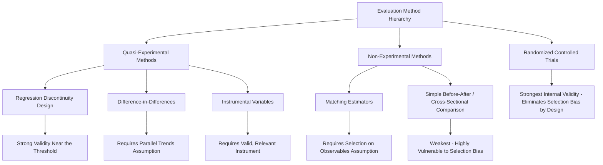

## Evaluating Active Labor Market Programs

### The Central Evaluation Problem

At the core of evaluating any active labor market program (ALMP) — whether [[Job Training Programs]], [[Job Search Assistance Programs]], [[Public Employment Programs]], or wage subsidies — lies the **fundamental problem of causal inference**: for any given participant, we observe their outcome under treatment (program participation) but never observe the **counterfactual** outcome that same individual would have experienced absent the program. Formally, using the Rubin causal (potential outcomes) framework:

$$\tau_i = Y_i(1) - Y_i(0)$$

Where $\tau_i$ is the individual treatment effect, $Y_i(1)$ is the outcome under treatment, and $Y_i(0)$ is the outcome under non-treatment — only one of which is ever observed for any individual $i$. Program evaluation methodology is, at its core, a set of strategies for credibly estimating an average version of this quantity across a population despite this fundamental missing-data problem.

### The Selection Bias Problem

**Key Points**

- A naive comparison of program participants to non-participants conflates the true treatment effect with **selection bias**: the systematic pre-existing differences between those who choose (or are chosen) to participate and those who do not.
- Selection can operate in either direction: **positive selection** (more motivated, employable, or advantaged individuals disproportionately enroll, biasing naive estimates upward) or **negative selection** (programs specifically targeted at the most disadvantaged, hardest-to-employ populations, biasing naive estimates downward relative to the true effect on a general population).
- This is formalized as the difference between the naive comparison and the true average treatment effect on the treated (ATT):

$$\underbrace{E[Y|D=1] - E[Y|D=0]}_{\text{naive comparison}} = \underbrace{E[Y(1) - Y(0)|D=1]}_{\text{ATT (true effect)}} + \underbrace{E[Y(0)|D=1] - E[Y(0)|D=0]}_{\text{selection bias}}$$

Where $D=1$ denotes treatment/participation. The evaluation methods below are, in essence, different strategies for eliminating or credibly bounding this selection bias term.

### Mermaid Diagram: Hierarchy of Evaluation Methods by Identification Strength

### Randomized Controlled Trials (RCTs)

**Key Points**

- RCTs randomly assign eligible applicants to a treatment group (offered the program) and a control group (not offered, or offered at a later date/lower intensity), ensuring that treatment and control groups are, in expectation, identical in both observable and **unobservable** characteristics — directly eliminating the selection bias term above by construction, rather than requiring an untestable assumption to rule it out.
- Notable ALMP RCTs include the U.S. National JTPA Study and various state-level reemployment bonus and profiling experiments referenced in [[Job Search Assistance Programs]]; internationally, RCT-based ALMP evaluation has expanded substantially, particularly for training and employment-service interventions in both developed and developing-country contexts.
- **Practical and ethical limitations** constrain RCT use: randomizing access to a program some applicants may urgently need raises ethical/political concerns (though this is often addressed via "randomization into random access" among an excess-demand pool, or randomized order of enrollment via a waitlist design, rather than outright denial); some programs are legally mandated as universal entitlements, precluding random denial; and RCTs estimate effects for the specific population and program variant studied, raising **external validity** questions about generalizing findings to different populations, program scales, or economic conditions. [Inference: the relative weight given to internal validity (from randomization) versus external validity/generalizability concerns in interpreting any specific RCT is a matter of ongoing methodological judgment rather than a resolved technical question.]

### Quasi-Experimental Methods

**Example**

Where randomization is infeasible, researchers exploit naturally occurring variation that approximates random assignment:

**Regression Discontinuity Design (RDD)**: exploits a sharp eligibility threshold (e.g., an age cutoff, an earnings threshold, or a statistical profiling score cutoff determining priority access to services) under the assumption that individuals just above and just below the threshold are otherwise comparable, so any discontinuous jump in outcomes at the threshold can be attributed to program access:

$$\lim_{x \to c^+} E[Y|X=x] - \lim_{x \to c^-} E[Y|X=x] = \text{treatment effect at the threshold}$$

This design identifies a **local average treatment effect (LATE)** specific to individuals near the threshold, which may not generalize to individuals far from the cutoff (e.g., much more or less disadvantaged applicants).

**Difference-in-Differences (DiD)**: compares outcome changes over time between a group gaining program access and a comparison group that does not, under the key identifying assumption of **parallel trends** — that absent the program, both groups would have followed the same underlying outcome trajectory. This method underlies much of the geographic/timing-variation-based ALMP evaluation literature (e.g., comparing regions with staggered program rollout).

**Instrumental Variables (IV)**: uses a variable that affects program participation but has no direct effect on outcomes except through participation (the **exclusion restriction**) to isolate exogenous variation in treatment status. The examiner-leniency design discussed in [[Disability Insurance]] is a canonical instrumental-variables application directly relevant to social-insurance-adjacent program evaluation, and similar leniency-style instruments (e.g., caseworker assignment leniency in referring claimants to job training) have been applied within the ALMP literature specifically.

**Matching Estimators**: construct a comparison group of non-participants who are statistically similar to participants on observable characteristics (e.g., via propensity score matching), relying on the **conditional independence/selection-on-observables** assumption — that after conditioning on the observed matching variables, remaining differences in outcomes reflect the true treatment effect rather than residual selection on unobservables. This assumption is fundamentally untestable and is considered the weakest link among quasi-experimental designs, since it requires that no *unobserved* characteristic (e.g., unmeasured motivation or ability) independently drives both program participation and outcomes.

### SVG Diagram: Regression Discontinuity Design Illustration (svg_diagram)

<svg xmlns="http://www.w3.org/2000/svg" viewBox="0 0 640 340">
<text x="320" y="24" text-anchor="middle" font-size="14" font-weight="bold" font-family="sans-serif">Regression Discontinuity: Identifying the Local Treatment Effect (svg_diagram)</text>
<line x1="70" y1="290" x2="580" y2="290" stroke="black" stroke-width="1.5" />
<line x1="70" y1="290" x2="70" y2="50" stroke="black" stroke-width="1.5" />
<text x="560" y="310" font-size="11" font-family="sans-serif">Running Variable (e.g. score)</text>
<text x="20" y="50" font-size="11" font-family="sans-serif">Outcome</text>
<line x1="325" y1="50" x2="325" y2="290" stroke="#888" stroke-width="1" stroke-dasharray="5" />
<text x="330" y="65" font-size="10" font-family="sans-serif">Eligibility Cutoff</text>
<line x1="90" y1="240" x2="325" y2="200" stroke="#d62728" stroke-width="2.5" />
<text x="120" y="255" font-size="10" fill="#d62728" font-family="sans-serif">Below cutoff (ineligible)</text>
<line x1="325" y1="150" x2="560" y2="100" stroke="#2ca02c" stroke-width="2.5" />
<text x="400" y="90" font-size="10" fill="#2ca02c" font-family="sans-serif">Above cutoff (eligible/treated)</text>
<line x1="325" y1="200" x2="325" y2="150" stroke="black" stroke-width="2" />
<text x="335" y="180" font-size="10" font-weight="bold" font-family="sans-serif">Discontinuity = treatment effect</text>
</svg>

### Key Threats to Validity Across Methods

**Key Points**

- **Anticipation effects**: knowledge of an upcoming program change or eligibility rule can alter behavior before the formal treatment date, potentially biasing DiD and RDD estimates if not accounted for.
- **Spillover/contamination**: control group members may be indirectly affected by the program (e.g., a control-group job seeker's outcomes worsen because treated job seekers found jobs faster, crowding them out of the same vacancy pool — the displacement concern discussed in [[Job Search Assistance Programs]]), violating the **Stable Unit Treatment Value Assumption (SUTVA)** required for straightforward causal interpretation of the treatment-control comparison.
- **Attrition and differential follow-up**: if treatment and control groups have different rates of dropping out of the evaluation sample (e.g., due to differential willingness to be re-surveyed), the surviving sample may no longer be comparable even under an initially valid randomization or quasi-experimental design.
- **The lock-in effect**: as discussed in [[Job Training Programs]], short observation windows can produce misleadingly negative or null estimates for programs whose benefits materialize only over a longer horizon, making the choice of follow-up period a substantively important design decision rather than a purely practical one.
- **Multiple hypothesis testing/publication bias**: with many possible outcome measures, subgroups, and specifications available to researchers, there is a risk of selectively reporting statistically significant findings — a concern increasingly addressed through **pre-registration** of evaluation analysis plans prior to data collection or analysis.

### Meta-Analysis and Evidence Synthesis

**Example**

Given the heterogeneity of individual ALMP evaluations across countries, populations, and program designs, **meta-analyses** (notably the influential work of Card, Kluve, and Weber synthesizing hundreds of ALMP evaluations across many countries) attempt to systematically characterize patterns across the evaluation literature — for example, finding that job search assistance programs tend to show more consistently positive short-term effects than classroom training, while training effects tend to become more favorable at longer follow-up horizons (consistent with the lock-in effect discussed above). Meta-analyses must themselves confront methodological choices about which studies to include, how to weight studies of differing quality and sample size, and how to handle publication bias — meaning meta-analytic conclusions, while valuable for synthesizing a fragmented literature, carry their own methodological caveats rather than providing an unambiguous final verdict. [Unverified: specific quantitative meta-analytic effect-size estimates change as new evaluations are incorporated into updated meta-analyses, and current syntheses should be consulted for up-to-date figures.]

### Cost-Benefit Integration

**Key Points**

- A complete program evaluation extends beyond estimating a treatment effect on employment or earnings to a full **cost-benefit analysis**, comparing the present discounted value of estimated benefits (earnings gains, reduced transfer payments, and for public employment programs, the value of output produced) against total program costs (direct expenditure, administrative costs, and, where relevant, estimated displacement/deadweight losses).
- This integration is what ultimately allows comparison **across** ALMP categories with very different cost structures and effect magnitudes (as summarized comparatively in [[Job Search Assistance Programs]]) — a program with a smaller estimated treatment effect can still be more cost-effective than a program with a larger effect if its cost per participant is proportionately even lower.

### Conclusion

**Conclusion**

Evaluating active labor market programs requires navigating a hierarchy of identification strategies, each carrying distinct assumptions, strengths, and vulnerabilities — from the gold-standard internal validity of randomized controlled trials, through quasi-experimental designs exploiting eligibility thresholds, policy timing, or instrumental variation, to weaker matching-based approaches reliant on the untestable selection-on-observables assumption. No single method is universally superior across all evaluation contexts; the appropriate choice depends on program design, data availability, ethical and legal constraints on randomization, and the specific policy question (average effect versus effect at a particular threshold, short-run versus long-run impact, participant-level versus market-level/displacement-inclusive effects). The maturation of this evaluation methodology over recent decades — moving from simple before-after comparisons toward increasingly rigorous quasi-experimental and experimental designs, complemented by systematic meta-analytic synthesis — has substantially improved the evidentiary basis for ALMP policy design, even as important open questions (particularly regarding general equilibrium/displacement effects and long-run outcome tracking) remain areas of active methodological development. [Unverified: the specific evaluation standards, preferred methodologies, and evidentiary thresholds considered current best practice continue to evolve, and researchers should consult current methodological literature for the latest standards.]

**Next Steps**

- Rubin Causal Model and Potential Outcomes Framework
- Randomized Controlled Trials in Labor Economics
- Regression Discontinuity Design: Practical Implementation
- Difference-in-Differences and the Parallel Trends Assumption
- Instrumental Variables and the Exclusion Restriction
- Card-Kluve-Weber Meta-Analysis of ALMP Evidence
- Pre-Registration and Reproducibility in Applied Economics
- Cost-Benefit Analysis Methodology for Public Programs