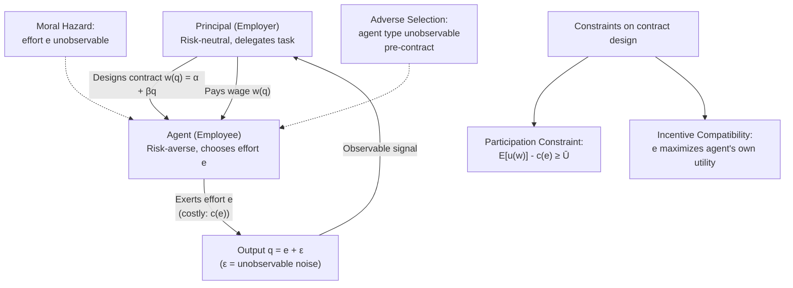

## Principal-Agent Theory in Employment

### Overview

Principal-agent theory (also called agency theory) analyzes contractual relationships in which one party (the **principal**, e.g., the employer/firm) delegates tasks to another party (the **agent**, e.g., the employee/worker), whose actions the principal cannot perfectly observe or verify. The theory is foundational to personnel economics because it explains why compensation contracts, monitoring systems, and organizational structures take the forms they do.

The central problem is **misaligned incentives under asymmetric information**: the agent's interests (effort minimization, leisure, private benefits) generally diverge from the principal's interests (profit maximization, output). Because the principal cannot costlessly observe the agent's effort or hidden characteristics, the agent may act opportunistically. Contract design becomes a mechanism for aligning incentives despite this informational gap.

### Core Assumptions

- **Self-interested rationality**: Both principal and agent maximize their own utility (the agent does not intrinsically prefer working hard).
- **Effort is costly**: The agent incurs disutility from effort, $e$, typically modeled as a convex cost function $c(e)$ with $c'(e) > 0$ and $c''(e) > 0$.
- **Output is noisy**: Output $q$ depends on effort plus a random shock, $q = e + \varepsilon$, where $\varepsilon$ is unobservable noise (e.g., market conditions, luck).
- **Risk preferences differ**: The principal is typically assumed **risk-neutral** (diversified, e.g., shareholders), while the agent is **risk-averse** (undiversified human capital, single income source).
- **Information asymmetry**: The agent's effort or type is not directly observable/verifiable by the principal, though output or noisy signals may be.

### The Two Core Problems

#### 1. Moral Hazard (Hidden Action)

Moral hazard arises **after** the contract is signed, when the agent's effort or actions cannot be observed or verified, so the agent may shirk.

- **Example**: A salesperson paid a flat salary has no financial incentive to prospect for new clients aggressively, since pay does not vary with effort.
- **Key Points**:
  - Arises from unobservable **actions**, not unobservable **traits**.
  - The solution mechanism is **incentive contracts** that link pay to observable performance proxies (output, sales, profit).
  - Cannot be fully solved because output is a noisy signal of effort — this creates the core efficiency-risk tradeoff (see below).

#### 2. Adverse Selection (Hidden Information/Type)

Adverse selection arises **before** the contract is signed, when the agent possesses private information about their own type (ability, skill, or reservation wage) that the principal cannot verify.

- **Example**: A firm hiring for a sales role cannot directly observe which applicants are high-ability closers versus low-ability closers; without a sorting mechanism, low-ability applicants may misrepresent themselves.
- **Key Points**:
  - Solved via **screening** (principal designs a menu of contracts to induce self-selection) or **signaling** (agent takes a costly action, like acquiring education, to credibly reveal type — see Spence signaling models).
  - Distinguish from moral hazard: this is a **selection problem**, not an **effort problem**.

### Formal Model: The Basic Moral Hazard Framework

Consider a risk-neutral principal and a risk-averse agent.

**Agent's utility**:

$$U_A = E[u(w)] - c(e)$$

where $w$ is the wage, $u(\cdot)$ is a concave (risk-averse) utility function over income, and $c(e)$ is the convex cost of effort.

**Principal's expected profit**:

$$E[\pi] = E[q] - E[w]$$

where $q = e + \varepsilon$ is output.

**First-Best (Full Information) Benchmark**: If effort $e$ is observable and verifiable, the principal can pay a **fixed wage contingent on effort being met** (e.g., "pay $w^*$ if $e \geq e^*$, pay 0 otherwise"). Since the agent is risk-averse and the principal is risk-neutral, optimal risk-sharing dictates the principal bears **all** the risk — the agent receives a flat wage, fully insured against $\varepsilon$. This is efficient because effort is contractible directly.

**Second-Best (Moral Hazard) Case**: When effort is unobservable, a flat wage is not incentive-compatible — the agent would set $e = 0$ (or the minimum) since the wage does not depend on effort. The principal must instead condition pay on the **observable but noisy signal**, $q$:

$$w(q) = \alpha + \beta q$$

This is the canonical **linear incentive contract**:

- $\alpha$ = base salary (insurance component)
- $\beta$ = **pay-performance sensitivity** (the piece rate or commission rate), $0 \leq \beta \leq 1$

### The Incentive-Insurance Tradeoff

The choice of $\beta$ embodies the central tradeoff of agency theory:

- **Higher $\beta$** → stronger incentives to exert effort (better incentive alignment) → but more income risk is transferred to the risk-averse agent, requiring a **risk premium** to compensate, which is costly to the principal.
- **Lower $\beta$** → better insurance for the agent (lower risk premium) → but weaker incentives, more shirking, lower expected output.

**Optimal incentive intensity** (from the LEN model — Linear contract, Exponential utility, Normal noise, developed by Holmström and Milgrom, 1987):

$$\beta^* = \frac{1}{1 + r \sigma^2 c''(e)}$$

where $r$ is the agent's coefficient of absolute risk aversion and $\sigma^2$ is the variance of the noise term $\varepsilon$.

**Key Points**:

- As **risk aversion** ($r$) increases → $\beta^*$ falls (weaker incentives; more insurance needed).
- As **output noise/variance** ($\sigma^2$) increases → $\beta^*$ falls (this is the **Incentive Intensity Principle**: noisier performance measures should be weighted less).
- As the marginal cost of effort $c''(e)$ rises (effort is more costly at the margin) → $\beta^*$ falls (incentives become less effective since the agent won't respond much to them anyway).
- This formalizes why jobs with highly volatile output (e.g., commodity trading, R&D) tend to rely more on **fixed salaries**, while jobs with stable, individually attributable output (e.g., piece-rate manufacturing, real estate sales) rely more on **commission/piece rates**.

### The Participation and Incentive Compatibility Constraints

Formal contract design solves:

$$\max_{\alpha, \beta} E[\pi] = E[q] - E[w(q)]$$

subject to:

**1. Participation Constraint (PC)** — also called the Individual Rationality (IR) constraint: the agent must get at least their reservation utility $\bar{U}$ (outside option) to accept the job:

$$E[u(w)] - c(e) \geq \bar{U}$$

**2. Incentive Compatibility Constraint (ICC)**: the agent chooses effort to maximize their own utility given the contract — effort cannot be dictated, only induced:

$$e \in \arg\max_e \{E[u(w(q))] - c(e)\}$$

The principal picks the contract $(\alpha, \beta)$ that maximizes profit while satisfying both constraints. In equilibrium, the PC typically binds (the agent is held to their reservation utility — competitive labor markets extract full surplus to the principal).

### Applications in Personnel Economics

#### 1. Piece Rates vs. Fixed Wages

- **Piece rates** ($\beta$ close to 1): appropriate when output is easily measured, attributable to the individual, and not overly noisy (e.g., data entry, fruit picking, glass installation — see the famous [Lazear (2000) Safelite Glass study](https://www.jstor.org/stable/117259), which found productivity gains of ~44% after a switch from hourly wages to piece rates, roughly half from incentive effects and half from **sorting** effects — higher-ability workers self-selected into the firm under piece rates).
- **Fixed wages** ($\beta$ near 0): appropriate when output is team-based, hard to measure, or highly noisy (e.g., research scientists, teachers, many white-collar jobs).

#### 2. Multitasking Problem (Holmström & Milgrom, 1991)

When agents perform **multiple tasks** and only some are measurable, high-powered incentives on the measurable task cause effort to be diverted away from unmeasured tasks.

- **Example**: A teacher paid based on standardized test scores may neglect broader educational goals (critical thinking, creativity) that aren't captured by the test — "teaching to the test."
- **Key Points**:
  - Optimal response is often to **flatten incentives** (lower-powered pay) across all tasks when tasks are substitutes and only some are measurable, rather than to strongly incentivize the measurable task alone.
  - This explains why many complex jobs (management, medicine, education) rely more on fixed salaries plus subjective evaluation rather than narrow objective metrics.

#### 3. Efficiency Wages

Related mechanism for solving moral hazard: pay **above market-clearing wages** to raise the cost of job loss, deterring shirking (Shapiro-Stiglitz, 1984) — see the "no-shirking condition," where the wage premium must be large enough that the expected cost of being caught shirking and fired exceeds the effort savings.

#### 4. Tournaments (Lazear & Rosen, 1981)

An alternative incentive scheme when individual output is hard to measure but **relative rank** is observable: pay is based on rank-order (e.g., promotion to a fixed number of higher-paying slots) rather than absolute output. This sidesteps the need to measure absolute output and can filter out common shocks (if $\varepsilon$ is correlated across agents, e.g., a common market condition, relative-performance evaluation cancels it out).

#### 5. Deferred Compensation and Career Concerns

- **Deferred compensation** (Lazear, 1979): back-loaded pay profiles (paying below marginal product early, above marginal product late) deter shirking and reduce turnover, since agents forfeit the deferred premium if fired for shirking.
- **Career concerns** (Holmström, 1999): even without explicit incentive pay, agents exert effort to build a reputation for high ability, since the labor market updates beliefs about their type based on observed performance — this is an implicit incentive mechanism operating through future wage/promotion prospects.

#### 6. Efficiency of Bonuses vs. Subjective Performance Evaluation

Many real-world contracts combine objective metrics with subjective supervisor evaluation to mitigate multitasking and gaming, though this introduces a secondary agency problem: the supervisor's evaluation itself may be biased, lenient, or subject to influence activities (agents spending effort to appear favorable rather than actually performing — "influence costs," Milgrom & Roberts, 1988).

### Diagram: Agency Relationship and Incentive Contract Structure

### Diagram: Incentive Intensity vs. Risk and Noise (svg_diagram)

<svg viewBox="0 0 640 380" xmlns="http://www.w3.org/2000/svg">
<text x="320" y="24" text-anchor="middle" font-size="16" font-weight="bold" fill="#1a1a1a">Optimal Pay-Performance Sensitivity β* (svg_diagram)</text>
<!-- Axes -->
<line x1="80" y1="320" x2="580" y2="320" stroke="#333" stroke-width="2"/>
<line x1="80" y1="320" x2="80" y2="60" stroke="#333" stroke-width="2"/>
<text x="330" y="355" text-anchor="middle" font-size="13" fill="#333">Output Noise Variance (σ²) or Risk Aversion (r)</text>
<text x="30" y="190" text-anchor="middle" font-size="13" fill="#333" transform="rotate(-90 30 190)">β* (Pay-Performance Sensitivity)</text>
<!-- Curve: decreasing -->
<path d="M 100 90 Q 250 120 350 200 T 560 300" stroke="#2563eb" stroke-width="3" fill="none"/>
<!-- Reference points -->
<circle cx="100" cy="90" r="5" fill="#2563eb"/>
<text x="105" y="80" font-size="12" fill="#1a1a1a">β* → 1 (piece rate)</text>
<circle cx="560" cy="300" r="5" fill="#2563eb"/>
<text x="420" y="295" font-size="12" fill="#1a1a1a">β* → 0 (fixed wage)</text>
<!-- Example markers -->

<text x="130" y="130" font-size="11" fill="#555">Fruit picking, data entry</text>

<text x="380" y="240" font-size="11" fill="#555">Sales w/ market swings</text>

<text x="420" y="330" font-size="11" fill="#555">R&D, teaching, management</text>

<!-- gridlines -->
<line x1="80" y1="320" x2="580" y2="320" stroke="#ccc" stroke-width="1"/>
<line x1="80" y1="60" x2="80" y2="320" stroke="#ccc" stroke-width="1"/>
</svg>

### Worked Numerical Example

Suppose an agent has CARA utility with risk aversion coefficient $r = 2$, the noise variance is $\sigma^2 = 0.25$, and the cost of effort is $c(e) = e^2$, so $c''(e) = 2$.

$$\beta^* = \frac{1}{1 + r\sigma^2 c''(e)} = \frac{1}{1 + (2)(0.25)(2)} = \frac{1}{1 + 1} = 0.5$$

**Interpretation**: The optimal contract pays the agent a base salary $\alpha$ plus 50% of marginal output as a bonus/commission — a moderate-powered incentive contract reflecting a balance between incentives and insurance. If noise variance rose to $\sigma^2 = 2$ (a much more volatile business), $\beta^*$ falls to $\frac{1}{1 + (2)(2)(2)} = \frac{1}{9} \approx 0.11$ — incentive pay drops sharply, and the contract shifts toward a fixed salary.

### Empirical Evidence

- **Lazear (2000)**, Safelite Glass Corp: piece-rate conversion associated with substantial productivity gains, split between incentive and sorting effects. [Inference: exact magnitude splits vary by re-analysis and are not universally agreed upon in follow-up literature.]
- **Chevalier & Ellison, Fama-French style studies on mutual fund manager tournaments**: relative performance evaluation effects documented in fund manager risk-taking behavior near year-end.
- **Bandiera, Barankay & Rasul** (2005, 2007): field experiments on managerial incentive pay and favoritism, showing subjective evaluation can be distorted by social connections — evidence for the "influence activities" problem under agency theory.

[Unverified] Precise elasticities of effort with respect to $\beta$ are highly context- and industry-dependent; the LEN model's linear contract is a tractable approximation and real-world optimal contracts may be nonlinear (e.g., convex bonus schemes, thresholds, caps) due to considerations outside the base model such as limited liability, gaming, or multitask distortions.

### Common Extensions and Related Models

- **Limited liability constraints**: when the agent cannot be paid a negative wage (cannot be fined below zero), optimal contracts become **convex/discontinuous** (bonus-threshold schemes) rather than smoothly linear.
- **Repeated games / relational contracts**: when formal contracts are incomplete or unenforceable, implicit incentives sustained by repeated interaction and reputation (self-enforcing agreements) substitute for explicit incentive pay.
- **Team production and free-riding** (Alchian & Demsetz, 1972; Holmström, 1982): when output is a joint product of multiple agents' effort, individual incentive contracts based on team output alone induce free-riding, motivating the role of monitors/supervisors (residual claimants) in firms.
- **Multi-principal problems**: an agent working for multiple principals with conflicting objectives (e.g., a doctor serving patients and an insurance company).

### Next Steps

- **Efficiency Wage Theory (Shapiro-Stiglitz Model)**
- **Tournament Theory and Rank-Order Compensation (Lazear-Rosen)**
- **Screening and Signaling Models (Spence, Rothschild-Stiglitz)**
- **Multitasking and Incentive Design (Holmström-Milgrom, 1991)**
- **Relational Contracts and Implicit Incentives**
- **Efficient Bargaining and Team Production (Alchian-Demsetz)**
- **Career Concerns and Reputation Effects (Holmström, 1999)**