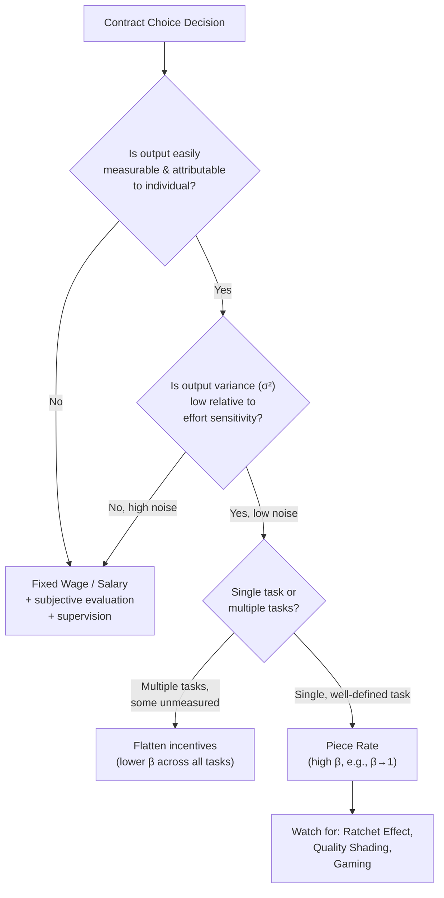

## Piece Rates Versus Fixed Wages

### Overview

The choice between **piece rates** (pay tied directly to measured output, $w = \alpha + \beta q$ with $\beta > 0$) and **fixed wages** (pay independent of output, $\beta = 0$, typically time-based — hourly or salaried) is one of the most consequential contract design decisions in personnel economics. It sits downstream of principal-agent theory: piece rates are a high-powered incentive solution to moral hazard, while fixed wages prioritize insurance and administrative simplicity at the cost of weaker incentives. The optimal choice depends on measurability of output, noise, risk aversion, multitasking concerns, and the cost of monitoring.

### Defining the Two Regimes

- **Piece Rate (Output-Contingent Pay)**: Compensation is a function of measured output, $w(q) = \alpha + \beta q$, where $\beta$ (the piece rate) is the marginal pay per unit of output. Pure piece rates set $\alpha = 0$; most real-world "piece rate" jobs include a small guaranteed base ($\alpha > 0$) plus a per-unit rate.
- **Fixed Wage (Time-Rate Pay)**: Compensation is invariant to output within the observed range, $w = \alpha$ (a flat hourly wage or salary). Output is not the direct basis of pay; effort is instead governed by supervision, social norms, or implicit incentives (promotion, termination risk).

### Key Points: Why Firms Choose Piece Rates

1. **Output is easily and cheaply measurable** — countable, attributable to a single worker, and not easily gamed (e.g., glass units installed, garments sewn, crates picked).
2. **Low output noise** — when $\sigma^2$ (variance of factors outside the worker's control) is small, the risk premium needed to compensate a risk-averse worker for pay volatility is small, so incentive pay is cheap to provide. Recall the LEN model result:

   $$\beta^* = \frac{1}{1 + r\sigma^2 c''(e)}$$

   As $\sigma^2 \to 0$, $\beta^* \to 1$ (full piece rate becomes optimal).
3. **Single-task, homogeneous jobs** — when there is one clear output dimension, there is no multitasking distortion (see below).
4. **Reduces monitoring costs** — piece rates are "self-enforcing": the worker's own incentive to earn more substitutes for direct supervision, reducing the firm's need for costly monitoring infrastructure.
5. **Positive sorting/selection effects** — piece-rate jobs attract higher-ability, higher-effort workers who self-select into pay schemes that reward their productivity (adverse-selection filtering, distinct from the moral-hazard incentive effect).

### Key Points: Why Firms Choose Fixed Wages

1. **Output is difficult to measure or attribute individually** — team production, service quality, or knowledge work often lacks a clean output metric per worker.
2. **High output noise from factors outside the agent's control** — e.g., commodity trading, insurance underwriting affected by macro shocks — a piece rate here would impose large, uninsurable risk on a risk-averse worker, requiring a large compensating risk premium that erodes the incentive gain.
3. **Multitasking problems** (Holmström & Milgrom, 1991) — when jobs involve multiple tasks and only some are measurable, high-powered pay on the measured task distorts effort allocation away from unmeasured but valuable tasks (e.g., paying assembly-line workers strictly by output count can degrade quality control if quality isn't separately incentivized).
4. **Quality and gaming concerns** — piece rates can induce workers to sacrifice quality, safety, or maintenance for speed (a classic critique of pure piece-rate systems in manufacturing history).
5. **Interdependent/team tasks** — when output depends jointly on multiple workers' effort, individual piece rates create free-riding incentives or are simply infeasible to attribute (see team production, Alchian & Demsetz, 1972).
6. **Administrative and negotiation costs** — piece rates require constant renegotiation as technology or conditions change, and are vulnerable to the **ratchet effect** (see below).

### The Ratchet Effect

A key historical/dynamic problem with piece rates: if management observes that a worker produces a high output under a given rate, they may **infer the job is "easier" than believed** and lower the rate per unit next period (or raise the output standard) to prevent excess earnings. Anticipating this, workers **restrict output** below their true capability to avoid triggering a rate cut — a self-defeating dynamic documented extensively in Soviet-era manufacturing and also observed in Western factory settings.

- **Formal intuition**: This is a repeated-game commitment problem. The firm cannot credibly commit not to revise the piece rate after learning the worker's true productivity, so workers underperform relative to the first-best in anticipation.
- **Mitigations**: multi-period contracts with pre-committed rate schedules, reputation/relational contracts, or third-party wage-setting (unions, industry standards) that constrain the firm's ability to ratchet.

### Formal Comparison via the Agency Model

Consider effort $e$, cost of effort $c(e) = \frac{1}{2}e^2$, output $q = e + \varepsilon$, $\varepsilon \sim N(0, \sigma^2)$, and a CARA agent with risk aversion $r$.

**Under fixed wage** ($\beta = 0$): Agent sets $e = 0$ (no return to effort), since $c'(e) = \beta \Rightarrow e^* = \beta$. With $\beta = 0$, $e^* = 0$. Output is at the minimum achievable through fixed-wage employment (often sustained instead by non-pecuniary motivators: supervision, intrinsic motivation, social norms, or threat of dismissal for gross underperformance — mechanisms outside this simple model).

**Under piece rate** ($\beta > 0$): Agent's effort choice solves $\max_e \beta e - \frac{1}{2}e^2 \Rightarrow e^* = \beta$. Higher $\beta$ induces more effort, but the certainty equivalent of the agent's income falls with $\beta$ due to risk:

$$CE = \alpha + \beta e^* - \frac{1}{2}(e^*)^2 - \frac{1}{2}r\beta^2\sigma^2$$

The optimal $\beta^*$ trades off the marginal incentive gain against the marginal risk-premium cost, yielding the formula above.

**Key Points**:

- The **first-best** (effort observable) always dominates weakly — it achieves the efficient effort level with zero risk premium (agent is fully insured, paid a flat wage contingent on verified effort).
- The **second-best piece rate** is a constrained-efficient response to unobservable effort — it never fully replicates the first-best when $\sigma^2 > 0$, because some risk must be transferred to induce effort.

### Diagram: Determinants of Contract Choice

### Empirical Evidence

- **Lazear (2000)**, Safelite Glass Corporation: switching windshield installers from hourly wages to piece rates raised average productivity by roughly 44%, with the gain decomposed into an **incentive effect** (existing workers producing more) and a **sorting effect** (higher-ability workers being retained/attracted under piece rates, lower-ability workers exiting). [Inference: the precise incentive/sorting split reported (~50/50) is specific to this study's data and methodology; subsequent literature has debated generalizability.]
- **Shearer (2004)**, tree-planting field experiment: randomly assigned workers to piece rates vs. fixed wages and found significant productivity increases under piece rates, providing clean causal (as opposed to purely observational) evidence isolating the incentive effect from sorting.
- **Bandiera, Barankay & Rasul (2005)**, fruit-picking farm: found that introducing relative-performance elements alongside piece rates changed worker behavior toward or away from cooperation depending on whether workers were linked by social ties — illustrating how team externalities interact with individual piece-rate incentives.
- Historical manufacturing evidence (e.g., 19th–20th century "scientific management" and Taylorism episodes) repeatedly documents the ratchet effect and worker output restriction as a rational response to anticipated rate cuts.

### Illustrative Example

A garment factory considers two pay schemes for sewing machine operators:

- **Fixed wage**: $15/hour regardless of units sewn.
- **Piece rate**: $2 per garment completed, no base guarantee.

Under the fixed wage, a worker sewing at a leisurely pace of 5 garments/hour earns $15/hour with low effort. Under the piece rate, the same worker sewing 10 garments/hour earns $20/hour — a direct financial return to effort. If output quality is easily inspected per-garment (defects can be attributed and rejected), the piece rate is close to a clean, single-task, low-noise environment, making it well-suited for high-powered incentives. If, however, defects are hard to detect until the finished product ships (quality is a "hidden" second task), a pure piece rate risks incentivizing speed over quality — the firm may respond with a **hybrid contract**: a piece rate for output plus a quality-based bonus/penalty, or a fixed wage with output monitored subjectively.

### Hybrid and Real-World Contract Forms

Most real jobs are not pure fixed-wage or pure piece-rate but blend the two:

- **Guaranteed minimum plus commission** (e.g., retail sales: base salary + commission on sales).
- **Bonus-threshold schemes**: fixed salary plus a discrete bonus if output exceeds a target (introduces a discontinuity, often due to limited liability or bounded rationality in contract design).
- **Group/team piece rates**: paying a team a piece rate on joint output, splitting the free-rider problem differently (partial mitigation via peer monitoring, at the cost of diluted individual incentives).
- **Salary plus subjective bonus/performance review**: common in knowledge work, where the "measurable" component is combined with supervisor discretion to compensate for multitasking distortions.

### Comparative Summary Table

| Dimension | Piece Rate | Fixed Wage |
| --- | --- | --- |
| Incentive strength | High ($\beta$ near 1) | Low ($\beta$ near 0) |
| Risk borne by worker | High | Low (insured by firm) |
| Best suited for | Measurable, single-task, low-noise output | Team-based, multitasking, high-noise output |
| Monitoring cost | Lower (self-enforcing) | Higher (requires supervision) |
| Quality risk | Higher (speed vs. quality tradeoff) | Lower |
| Key failure mode | Ratchet effect, gaming, quality shading | Shirking, free-riding |
| Sorting effect | Attracts higher-ability/higher-effort workers | Attracts risk-averse workers, more homogeneous pool |

[Unverified] The magnitude of sorting versus incentive effects, and the precise conditions under which hybrid contracts dominate pure forms, remain active empirical research areas; results are context- and industry-specific and should not be extrapolated uncritically across settings.

### Next Steps

- **Multitasking and Incentive Design (Holmström-Milgrom, 1991)**
- **The Ratchet Effect in Dynamic Contracting**
- **Tournament Theory as an Alternative to Piece Rates**
- **Team Production and Free-Rider Problems (Alchian-Demsetz)**
- **Efficiency Wage Theory**
- **Sorting vs. Incentive Effects in Compensation (Lazear, Shearer)**
- **Subjective Performance Evaluation and Influence Costs**