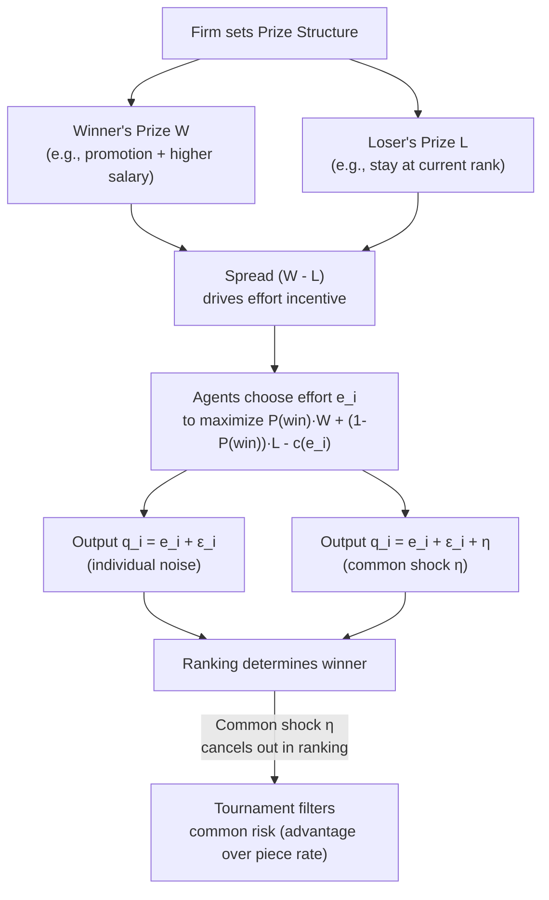

## Tournament Theory and Promotions

### Overview

Tournament theory, developed principally by **Lazear and Rosen (1981)**, models compensation as a function of an agent's **rank-order performance relative to competitors**, rather than their absolute output level. Instead of paying a piece rate per unit produced, the firm commits to a **fixed prize structure** (e.g., a promotion to a higher-paying tier) awarded to whoever ranks highest among a pool of competitors. This framework explains internal labor market phenomena — steep pay increases with hierarchical rank, "up-or-out" promotion systems, and the persistence of large pay gaps between adjacent organizational levels — that piece-rate or effort-based contracting alone struggles to rationalize.

### Motivation: Why Rank-Order Pay Instead of Piece Rates?

Tournaments solve the same underlying moral hazard problem as piece-rate contracts (unobservable effort) but are preferable in specific circumstances:

1. **Absolute output is difficult or costly to measure**, but **relative rank** among comparable workers is easier to observe (e.g., "who closed the most complex deals" vs. an exact dollar-denominated output measure for a manager).
2. **Common shocks** affect all competitors similarly (e.g., a market downturn, a firm-wide input shortage). Piece rates expose workers to this common risk; rank-order tournaments **automatically filter out common noise**, since all competitors are affected equally and only *relative* performance is rewarded.
3. **Verification costs are lower**: it may be cheaper for a firm to verify "A outperformed B" than to precisely measure and verify A's absolute output level — reducing the risk of the agent contesting or gaming the exact payout formula.
4. **Ratchet effect avoidance**: a promotion prize, once won, is not easily revised the way a piece rate can be recalibrated after observing high output (see Piece Rates vs. Fixed Wages topic) — this makes the incentive scheme more credible over time.

### Formal Model

Consider $n$ risk-neutral (or, more generally, risk-averse) agents competing for a single prize. Each agent $i$ chooses effort $e_i$ at cost $c(e_i)$, producing output:

$$q_i = e_i + \varepsilon_i$$

where $\varepsilon_i$ is idiosyncratic noise, possibly correlated with a common shock component. The firm sets two prizes: a **winner's prize** $W$ (e.g., the promoted position's higher salary) and a **loser's prize** $L$ (the salary of those not promoted), with $W > L$.

**Agent's problem**: Each agent chooses effort to maximize expected payoff:

$$\max_{e_i} \; P(\text{win} \mid e_i, e_{-i}) \cdot W + \left[1 - P(\text{win} \mid e_i, e_{-i})\right] \cdot L - c(e_i)$$

In a symmetric Nash equilibrium, each agent's first-order condition is:

$$\frac{\partial P(\text{win})}{\partial e_i} \cdot (W - L) = c'(e_i)$$

**Key Points**:

- The **incentive to exert effort depends only on the pay spread** $(W - L)$, not on the absolute wage levels. This is the central prediction of tournament theory: what motivates effort is the **gap** between winning and losing, not the level of pay at either rung.
- If the noise terms $\varepsilon_i$ across competitors are **independent**, increasing the spread $(W-L)$ raises equilibrium effort, similar to how $\beta$ operates in a piece-rate contract.
- If the noise terms are **positively correlated** (a common shock, e.g., macroeconomic conditions affecting all salespeople equally), the tournament **cancels out the common component** in the ranking, since it affects all competitors' output symmetrically — this is the same intuition as **relative performance evaluation (RPE)** in the wider agency literature.

### Optimal Prize Spread

The optimal spread $(W^* - L^*)$ that a profit-maximizing firm sets solves a similar tradeoff to the optimal piece rate $\beta^*$: a wider spread induces more effort but imposes more income risk on (typically risk-averse) agents, since only one can win regardless of effort levels close to the margin. As with piece rates, if agents are risk-neutral, the firm can, in principle, sell the "prize" to the highest bidder and extract full effort with no distortion; risk aversion is what makes the spread-setting problem nontrivial.

**Key comparative statics**:

- **More noise in individual performance measurement** → requires a **larger prize spread** to induce a given effort level (since a noisier signal makes winning less sensitive to one's own effort, diluting the incentive per unit of spread).
- **More risk-averse agents** → optimal spread narrows (analogous to $\beta^*$ falling with risk aversion $r$ in the piece-rate model).
- **Larger number of competitors ($n$)** → the marginal effect of one's own effort on the probability of winning falls (each agent is a smaller part of the competition), which can reduce equilibrium effort per contestant unless the prize spread is increased to compensate — though aggregate effort/output effects are ambiguous and depend on the specific probability-of-winning function.

### Diagram: Tournament Structure vs. Piece-Rate Structure

### Up-or-Out Systems and Internal Labor Markets

Tournament theory provides the canonical explanation for **"up-or-out" promotion systems** observed in professional service firms (law firm partnership tracks, academic tenure, consulting "pyramid" structures, military rank progression):

- **Steep pay increases across hierarchical levels** are not (only) compensating for higher marginal productivity at the next rank — they exist partly to create a large enough $(W - L)$ spread to motivate effort *at the current rank*, among those competing for promotion.
- **"Up-or-out" rules** (mandatory exit if not promoted within a set period) can be understood as a mechanism to prevent the pool of competitors from becoming stale or to preserve the credibility/scarcity of the prize (avoiding an ever-growing set of "losers" who remain in the tournament indefinitely, which would dilute win probabilities and blunt incentives for new entrants).
- **Key implication**: pay at the **top of the hierarchy** (e.g., senior partner, CEO) may be set higher than that position's direct marginal product would suggest in isolation, because part of its function is to serve as the **prize** motivating effort among those one level below — this is a leading (though contested) explanation for very high CEO-to-employee pay ratios.

### Distortions and Limitations of Tournaments

1. **Sabotage and collusion**: Because payoff depends on *relative* rather than absolute performance, agents have an incentive to **sabotage rivals** (withhold information, undermine colleagues) or to **collude** (agree to mutually restrict effort) rather than exert first-best effort — a distortion absent in individual piece-rate schemes where one worker's pay does not depend on another's output.
2. **Risk of demotivating "also-rans"**: Once an agent perceives they cannot realistically win (e.g., a clear front-runner has emerged partway through the evaluation period), their incentive to exert effort collapses — this is sometimes called the **discouragement effect**, and it implies tournaments work best when contestants are **ex ante similar in ability** (heterogeneous fields with a clear favorite generate weak incentives for all but the front-runner and the closest rival).
3. **Multiple prizes / graduated tournaments**: Firms often mitigate the discouragement effect by offering multiple prize tiers (1st, 2nd, 3rd place get different rewards) rather than winner-take-all, spreading incentive effects across more of the effort distribution.
4. **Risk of excessive risk-taking**: In some specifications, agents lagging behind may take on inefficiently high risk (a "long-shot" strategy) to increase variance and their chance of overtaking the leader — documented in studies of sales-tournament dynamics and fund-manager tournaments.
5. **Multitasking interacts with tournaments too**: if only some dimensions of performance affect perceived rank, agents will over-invest in visible/rankable activities and under-invest in unmeasured but valuable ones — the same distortion as under high-powered piece rates.

### Empirical Evidence

- **Ehrenberg & Bognanno (1990)**: studied PGA golf tournaments, finding that a larger prize spread across finishing positions is associated with better player performance (lower scores), providing early support for the core prediction that spread drives effort.
- **Eriksson (1999)**: examined pay structures in Danish firms and found evidence consistent with tournament predictions — pay gaps between hierarchical levels increase with the number of competitors at the lower level, and this correlates with performance measures. [Inference: this literature has produced mixed results across countries and settings, and causal identification of pure tournament effects (isolated from other factors like ability sorting) remains difficult.]
- **Bognanno (2001)**: examined CEO tournament effects across corporate hierarchies, finding pay ratios between CEOs and other top executives consistent with the "prize" interpretation of executive compensation.
- [Unverified] The precise share of observed executive-employee pay gaps attributable to tournament incentives versus other factors (superstar/scale effects, ability sorting, corporate governance) is contested in the broader compensation literature and should not be treated as settled.

### Worked Example

Two sales managers, A and B, compete for a single regional VP promotion. Current salary at their rank is $90,000 (the "loser" prize, $L$); the VP role pays $150,000 (the "winner" prize, $W$), giving a spread of $W - L = \$60{,}000$. Suppose each manager's probability of winning is a function of relative effort, and cost of effort is $c(e) = e^2$. If the firm believes current effort levels are too low, it can raise the VP salary to $180,000, widening the spread to $90,000 — inducing both managers to increase effort in equilibrium, since each one's marginal return to effort (partial derivative of win probability times the spread) has risen. If, however, one manager has a clear head start (e.g., a much larger existing client book), the trailing manager may become discouraged and cut effort — illustrating why firms design promotion tournaments to keep contestants close in perceived ability, or use minimum-cohort-size and periodic re-leveling to preserve competitive balance.

### Comparative Note: Tournaments vs. Piece Rates vs. Fixed Wages

| Dimension | Tournament | Piece Rate | Fixed Wage |
| --- | --- | --- | --- |
| Basis of pay | Relative rank | Absolute output | None (time-based) |
| Filters common shocks | Yes | No | N/A (no output-based risk) |
| Vulnerable to sabotage/collusion | Yes | No | No |
| Requires precise output measurement | No (only ranking) | Yes | No |
| Best suited for | Hierarchical promotion ladders, sales contests | Measurable individual output | Team-based or multitask jobs |
| Key failure mode | Discouragement effect, sabotage | Ratchet effect, quality shading | Shirking |

### Next Steps

- **Multitasking and Incentive Design (Holmström-Milgrom, 1991)**
- **Relative Performance Evaluation and Filtering Common Shocks**
- **Up-or-Out Contracts in Professional Service Firms**
- **CEO Compensation and Executive Pay Tournaments**
- **Piece Rates Versus Fixed Wages**
- **Efficiency Wage Theory**
- **Career Concerns and Reputation Effects (Holmström, 1999)**