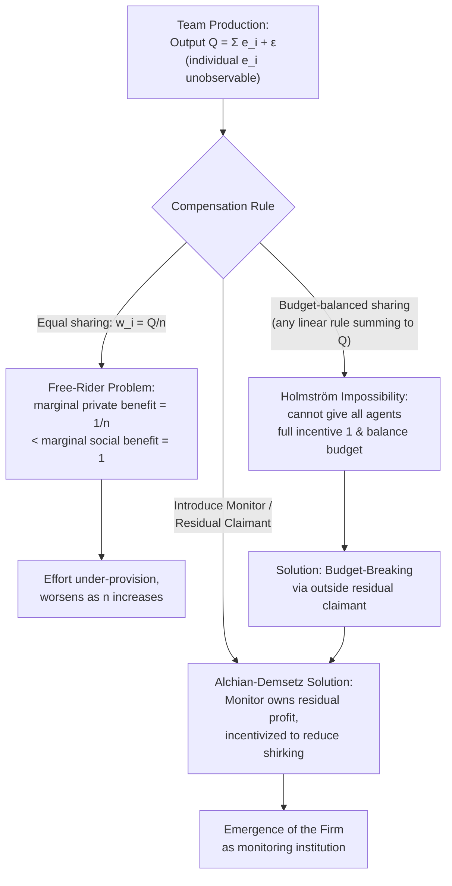

## Team Production and Free Riding

### Overview

Team production refers to situations where output is generated jointly by multiple agents whose individual contributions **cannot be separately observed or measured**, only the team's aggregate output. This structure creates a fundamental incentive problem — first formalized by **Alchian and Demsetz (1972)** and developed further by **Holmström (1982)** — because any compensation scheme based purely on team output gives each individual an incentive to **free ride**: reduce personal effort while still sharing in the rewards generated by others' effort. Team production is central to personnel economics because much real-world work (project teams, partnerships, assembly lines, academic co-authorship, surgical teams) is inherently joint, and firms must design organizational and compensation solutions around this measurement limitation.

### Defining Team Production

**Alchian & Demsetz (1972)** define team production as a situation where:

1. Several distinct inputs (effort from different workers) are combined to produce output.
2. The output is **not** simply the sum of separable individual outputs — it is a joint product, or individual contributions cannot be metered separately even if the technology is additively separable in principle.
3. **No single input's contribution can be inferred by observing the output alone.**

**Example**: A team of engineers debugging a complex software system produces a single deliverable (a fixed bug); it may be impossible to attribute the fix precisely to one engineer's hours versus another's, even though both contributed effort.

Contrast this with jobs where output is **separable** (e.g., each worker's individual output is measurable independently, as in piece-rate manufacturing) — team production problems do not arise there because individual piece rates remain feasible.

### The Free-Rider Problem: Formal Model

Consider $n$ agents, each choosing effort $e_i$ at private cost $c(e_i)$. Team output is:

$$Q = \sum_{i=1}^{n} e_i + \varepsilon$$

Suppose the team output is shared equally among members (e.g., a partnership splitting profits, or a group bonus divided evenly): each agent receives $\frac{Q}{n}$ regardless of their individual contribution to $Q$.

**Agent $i$'s problem**:

$$\max_{e_i} \; \frac{1}{n}\left(\sum_j e_j\right) - c(e_i)$$

**First-order condition**:

$$\frac{1}{n} = c'(e_i)$$

**Key Points**:

- Each agent's **marginal private benefit of effort is only $\frac{1}{n}$** of the marginal social benefit (which is $1$, since one extra unit of effort raises team output by one unit).
- As team size $n$ increases, each individual's share of the marginal return to their own effort **shrinks**, and equilibrium effort per agent falls further below the socially efficient level.
- This is the formal free-rider result: **equal-sharing team compensation systematically under-provides effort relative to the first-best**, and the distortion worsens as teams grow larger.
- Compare the **social optimum**: a planner maximizing $\sum_i \left[e_i - c(e_i) \cdot n \right]$-equivalent surplus would set $c'(e_i) = 1$ for each agent — i.e., each agent should equate marginal cost of effort to the full marginal product (which is 1), not $\frac{1}{n}$.

### Why Not Just Use Individual Piece Rates?

If individual contributions were observable, the firm could simply pay each worker their own marginal product and eliminate the free-rider problem entirely (this is the standard piece-rate solution — see **Piece Rates Versus Fixed Wages**). Team production problems arise precisely because:

- **Individual output is not separately measurable** (the joint-production assumption above), or
- **Measuring individual contributions is prohibitively costly** even if technically feasible (e.g., constant individualized monitoring undermines the efficiency gains of teamwork itself), or
- **Task complementarities** make individual attribution economically meaningless (e.g., a relay race where the exchange itself, not any single runner's speed, determines outcomes).

### Alchian-Demsetz Solution: The Monitor as Residual Claimant

Alchian and Demsetz's key institutional solution is the introduction of a **monitor** — a specialized agent whose job is to observe individual inputs (or proxies for effort/shirking) that outsiders cannot verify, and who is given the **residual claim** on team output (i.e., profit) as their own incentive to monitor effectively.

**Key Points**:

- The monitor's incentive to monitor diligently comes from being the residual claimant: since they keep whatever surplus remains after paying fixed wages to team members, their own income depends directly on reducing shirking.
- This explains the emergence of **the firm as an institution**: rather than team members contracting with each other directly (which would replicate the free-rider problem at the contracting stage), a centralized employer/monitor with the right to hire, fire, and direct resources, and who bears the residual risk, solves the incentive problem.
- **But who monitors the monitor?** The monitor's own incentives are aligned by ownership of the residual claim itself — they do not need to be monitored because they directly bear the cost of any shirking they might otherwise engage in (this is the classical "who watches the watchman" resolution in the Alchian-Demsetz framework, and it underlies theories of firm ownership and the allocation of residual control rights, later formalized in the property-rights theory of the firm, Grossman-Hart-Moore).

### Holmström's Impossibility Result and Budget-Breaking

**Holmström (1982)** shows a stronger and more troubling result: **even without free-riding via effort choice, no linear sharing rule that distributes 100% of team output back to team members can achieve the efficient (first-best) outcome**, if agents move simultaneously and output is only observed in aggregate.

**Key Points**:

- Any sharing rule satisfying **budget balance** — where the shares paid to all agents sum exactly to total output, $\sum_i s_i(Q) = Q$ — cannot simultaneously give every agent the full marginal incentive of $\frac{\partial Q}{\partial e_i} = 1$, because doing so for all agents would require paying out more than $100\%$ of output in aggregate (a violation of budget balance).
- **Solution: budget-breaking**. Holmström shows that introducing a **residual claimant/monitor who is not a working member of the team** — someone who can receive or absorb a share of output *without it needing to sum back to exactly $Q$* — restores the possibility of efficient incentives. The team's compensation scheme can then threaten to "burn" or divert some output (paid to an outside party, e.g., a supervisor or shareholder) contingent on team performance falling short, without requiring the destroyed/diverted resources to be paid to a working team member.
- This is a formal, general justification for why hierarchical firms with a residual-claimant owner/manager (rather than pure worker-owned equal-sharing cooperatives) can achieve better incentive properties in team-production settings.

### Diagram: Free-Rider Problem and Institutional Solutions

### Mitigating Mechanisms Beyond the Monitor

1. **Peer monitoring and social sanctions**: In small, repeated-interaction teams, members can observe each other's effort informally and impose social costs (reputation, exclusion, reduced cooperation) on shirkers — this substitutes for formal measurement, particularly effective when team size is small and interactions are repeated (see **Kandel & Lazear, 1992**, on peer pressure in partnerships).
2. **Team size limitation**: Because the free-rider problem worsens with $n$, firms have an incentive to **keep teams small** when joint production is unavoidable, trading off the benefits of specialization/scale against the incentive costs of larger teams.
3. **Relative performance evaluation across teams**: If multiple teams perform similar tasks, the firm can rank teams against each other (a team-level tournament) rather than rewarding absolute output, partially restoring high-powered incentives at the team level even though within-team individual measurement remains impossible.
4. **Partial individual metrics as noisy signals**: Even when full attribution is infeasible, firms often use partial/subjective signals (peer review, 360-degree feedback, supervisor ratings) to approximate individual contribution and condition part of pay on these noisy but informative measures — introducing the usual insurance-incentive tradeoff from agency theory.
5. **Selection and self-selection into teams**: Firms may design team formation processes (screening for cooperative dispositions, assortative matching of high-effort types) to reduce the ex ante severity of free-riding, since intrinsically motivated or reputation-conscious workers free ride less even under equal sharing.
6. **Deferred/dynamic incentives**: repeated team interactions with continuation value (future team assignments, promotion prospects tied to perceived team contribution) can sustain higher effort than a static one-shot equal-split game, via implicit relational contracting.

### Worked Example

A 4-person consulting team is compensated with an equal-split bonus pool based on total client billings, $Q$. If the marginal cost of effort is $c(e) = e^2$, each individual's private optimization under equal sharing gives:

$$\frac{1}{4} = c'(e_i) = 2e_i \implies e_i^* = 0.125$$

whereas the socially efficient effort level (equating marginal cost to the full marginal product of $1$) is:

$$1 = 2e_i \implies e_i^{FB} = 0.5$$

Each team member exerts only **25% of the first-best effort level** under equal sharing with $n = 4$. If team size doubled to $n = 8$, each member's private marginal incentive falls to $\frac{1}{8}$, effort falls further to $e_i^* = 0.0625$ — illustrating the Alchian-Demsetz/free-rider prediction that larger teams intensify under-provision of effort absent a monitor or alternative incentive device.

### Empirical Evidence

- **Kandel & Lazear (1992)**: theoretical and empirical discussion of peer pressure as a partial substitute for direct monitoring in partnerships (e.g., law firms, medical practices), showing that social sanctions can mitigate — though rarely eliminate — free-riding in team settings.
- Studies of law firm and accounting partnership compensation (e.g., lockstep vs. eat-what-you-kill systems) provide real-world variation in how firms trade off team cohesion (equal sharing) against individual incentive intensity (attribution-based pay), consistent with the theoretical tradeoffs above. [Inference: the empirical magnitude of free-riding losses under lockstep systems relative to eat-what-you-kill systems varies substantially by firm and practice area and is not precisely quantified by a single consensus estimate.]
- Agricultural economics literature on collective/cooperative farming versus individual-plot farming has documented productivity gaps consistent with team free-riding predictions, notably in historical comparisons of collectivized versus privatized agriculture. [Unverified as a precise causal estimate isolating free-riding from other confounds like capital access or price distortions.]

### Comparative Note

| Dimension | Team Production (Equal Split) | Individual Piece Rate | Tournament |
| --- | --- | --- | --- |
| Individual output observable | No | Yes | Rank only |
| Free-rider risk | High (increases with $n$) | None | Low (but sabotage risk) |
| Requires a monitor/residual claimant | Yes, for efficiency | No | Sometimes (evaluator) |
| Effort distortion source | Diluted marginal incentive ($1/n$) | None (in principle) | Discouragement effect |

### Next Steps

- **The Theory of the Firm (Alchian-Demsetz, Property-Rights Approaches)**
- **Holmström's Budget-Breaking and Group Incentive Design**
- **Peer Monitoring and Social Sanctions in Partnerships (Kandel & Lazear)**
- **Tournament Theory and Promotions**
- **Piece Rates Versus Fixed Wages**
- **Relational Contracts and Repeated-Game Incentives**
- **Partnership Compensation Systems (Lockstep vs. Eat-What-You-Kill)**