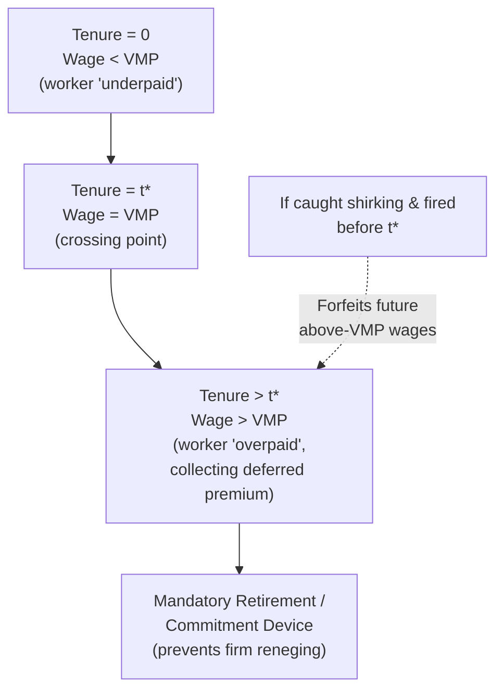
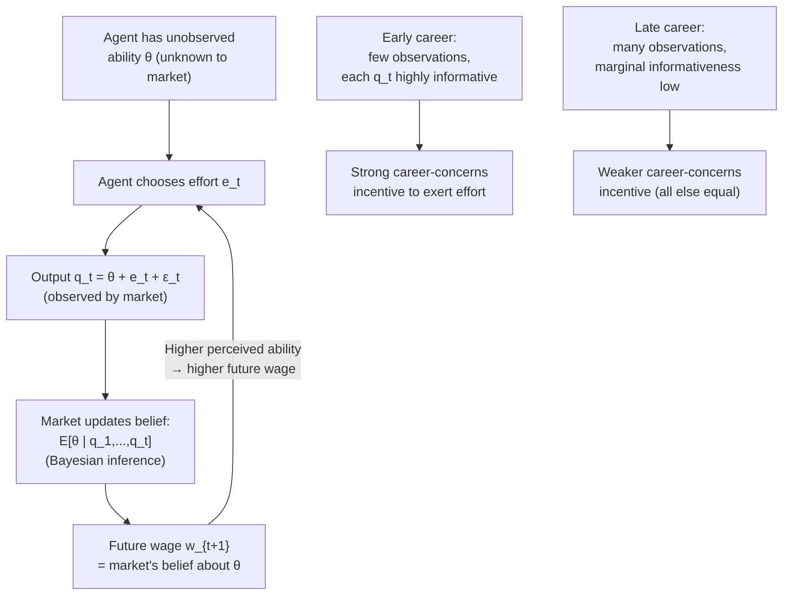

## Deferred Compensation and Career Concerns

### Overview

Deferred compensation and career concerns are two distinct but related mechanisms by which firms and labor markets generate **implicit incentives** — incentive effects that arise without an explicit output-contingent pay formula (piece rate, bonus, or tournament prize). **Deferred compensation** (Lazear, 1979, 1981) works by structuring lifetime pay so that workers are paid below their marginal product early in their careers and above it later, creating a self-enforcing incentive against shirking and quitting. **Career concerns** (Holmström, 1999) work through the labor market's continuous inference about a worker's unobserved ability, which motivates effort even absent any formal pay-for-performance contract, because current performance shapes future wage offers and reputation.

### Part I: Deferred Compensation (Lazear's Model)

#### Motivation

Lazear's original question: why do many firms use age-earnings profiles that are steeper than workers' actual productivity profiles — paying young workers *less* than their marginal product and older workers *more* — rather than paying each worker their marginal product every period (spot-market pricing)? Deferred compensation offers an incentive-based answer: this pay structure functions as an implicit bond against shirking.

#### Formal Structure

Let $VMP_t$ denote a worker's true value of marginal product at tenure $t$, and $w_t$ the wage paid at $t$. Under **spot-market pricing**: $w_t = VMP_t$ for all $t$. Under **deferred compensation**: the firm sets a wage profile such that:

$$w_t < VMP_t \quad \text{for } t < t^*, \qquad w_t > VMP_t \quad \text{for } t > t^*$$

subject to a **zero-profit (lifetime balance) constraint** over the worker's tenure $T$:

$$\sum_{t=0}^{T} \frac{w_t}{(1+r)^t} = \sum_{t=0}^{T} \frac{VMP_t}{(1+r)^t}$$

i.e., in present-value terms, the worker is paid exactly their lifetime marginal product — the firm earns zero economic profit on the arrangement, but the **timing** of payment is shifted from early to late tenure.

#### Why This Deters Shirking

**Key Points**:

- If a worker is caught shirking and **fired** before reaching the back-loaded portion of the wage profile ($t > t^*$), they **forfeit the deferred compensation** they would have received later — this is equivalent to a bond posted against future performance.
- The threat of losing this deferred premium raises the effective cost of shirking beyond what a flat spot-market wage would impose (where getting fired only costs the worker their *current* wage, replaceable immediately at another firm paying spot-market rates).
- This creates a **self-enforcing incentive** without requiring the firm to precisely measure individual output each period — the deferred wage profile itself does the incentive work.

#### Requirement: Mandatory Retirement / Enforced Endpoint

**Key Points**:

- Because the wage profile pays workers *above* their marginal product late in their career ($w_t > VMP_t$ for $t > t^*$), the firm has a temptation to fire older workers just as they enter this above-marginal-product phase, to capture the surplus for itself.
- Lazear's model requires a **credible commitment device** to prevent this — historically, **mandatory retirement ages** served this function, guaranteeing the worker will collect the back-loaded pay for a bounded period before being separated for reasons unrelated to performance.
- With mandatory retirement policies now illegal in many jurisdictions (e.g., the U.S. Age Discrimination in Employment Act extensions), firms rely on alternative commitment mechanisms: reputational costs of unjustified terminations, pension vesting schedules, defined-benefit pension formulas that back-load the *return* to tenure, and long-term implicit contracts sustained by firm reputation in the labor market.

#### Diagram: Deferred Compensation Wage-Productivity Profile

#### Implications and Predictions

1. **Steeper age-earnings profiles than productivity profiles** should be observed in jobs where individual monitoring is costly and long-term employment relationships are feasible (this is an empirically testable, though hard-to-verify, prediction since $VMP_t$ is rarely directly observable).
2. **Mandatory retirement (historically)** should be more common in occupations with strong deferred-compensation incentive structures, since firms need a credible exit mechanism.
3. **Pension vesting and defined-benefit plans with back-loaded accrual** serve an analogous bonding function — workers who quit or are fired before vesting forfeit a disproportionate share of expected pension wealth, which is consistent with (though not uniquely explained by) the deferred-compensation model.
4. **Layoffs during downturns should follow seniority (LIFO — last in, first out)** when possible, rather than firing senior high-wage workers, since firing senior workers who are past $t^*$ would violate the implicit contract and undermine the credibility of the deferred-compensation scheme for remaining and future workers.
5. [Inference] Because $VMP_t$ is unobservable in most datasets, direct empirical tests of the Lazear model typically rely on indirect evidence (quit/retirement patterns, pension structure, mandatory retirement history) rather than a clean measurement of the wage-productivity gap itself.

### Part II: Career Concerns (Holmström's Model)

#### Motivation

Holmström's insight: even in the complete absence of an explicit incentive contract (fixed wage only, $\beta = 0$), a rational agent may still exert effort because **current performance influences the labor market's beliefs about the agent's underlying, persistent ability** — and those beliefs determine future wages, promotions, and outside offers. Effort today is an investment in **reputation**, which the market rewards tomorrow even without a formal bonus formula today.

#### Formal Setup

Output in period $t$ is a function of the agent's unobserved (to the market and possibly to the agent too) ability $\theta$, effort $e_t$, and noise $\varepsilon_t$:

$$q_t = \theta + e_t + \varepsilon_t$$

The labor market observes $q_t$ (but not $\theta$ or $e_t$ separately) and, being competitive, pays the agent a wage in period $t+1$ equal to the market's updated expectation of the agent's ability:

$$w_{t+1} = E[\theta \mid q_1, \ldots, q_t]$$

**Key Points**:

- Because the market cannot separate $\theta$ from $e_t$ within a single observation, and because $e_t$ affects $q_t$ which affects inferred $\theta$, the agent has an incentive to **inflate current output via effort** even though the wage formula does not explicitly reward $q_t$ — the reward comes through the *inference channel*, not a direct contractual link.
- In a **rational expectations equilibrium**, the market *anticipates* that the agent will supply some equilibrium level of effort $e^*$ and therefore does **not** actually update beliefs about $\theta$ upward just because output was high — the market backs out the expected effort component and attributes only the residual to ability. This creates a subtle tension: the agent still exerts effort in equilibrium (because deviating, i.e., shirking, would be detected as a negative deviation from expected output, lowering perceived ability), but the market's *point estimate* of ability does not mechanically rise with observed effort in the way a naive intuition might suggest.
- **Career concerns effort typically declines over the career horizon**: early in a career, the market has little information about the agent's true ability, so each observation of $q_t$ is highly informative, giving the agent strong incentives to signal ability through effort. As the career progresses and the market accumulates many observations, each new $q_t$ becomes **less informative at the margin** (the market's posterior variance about $\theta$ shrinks), reducing the marginal incentive value of any single period's effort. This predicts an **effort/career-concerns-incentive profile that declines with tenure/experience**, all else equal — a pattern sometimes offered as a complementary (not competing) explanation alongside deferred compensation for age-related productivity and incentive patterns.

#### Diagram: Career Concerns Feedback Loop

#### Comparison: Career Concerns vs. Explicit Incentive Pay

| Dimension | Career Concerns | Explicit Incentive Pay (e.g., piece rate) |
| --- | --- | --- |
| Mechanism | Reputation/belief updating by labor market | Direct contractual link between pay and output |
| Requires formal contract | No | Yes |
| Incentive strength over career | Typically declines with tenure/experience | Constant (set by contract terms) |
| Who "pays" the incentive | Future employers/market (via wage revision) | Current employer |
| Key risk | Underinvestment late-career; short-termism (see below) | Standard risk-incentive tradeoff |

#### Interactions and Distortions

1. **Short-termism / career-concerns myopia**: because career-concerns incentives are strongest when performance signals are highly informative and rewarded soon, agents may over-invest in visible, easily-measured, short-horizon activities at the expense of long-term or hard-to-observe value creation (a variant of the multitasking problem, driven by reputational rather than contractual incentives) — e.g., a fund manager herding toward consensus trades to avoid looking unskilled by an idiosyncratic bet, even if the idiosyncratic bet has higher expected value.
2. **Complementarity with deferred compensation**: firms can combine explicit deferred-compensation structures with the natural presence of career concerns; early-career workers already face strong implicit incentives from reputation-building, which can justify firms offering relatively flatter *explicit* incentive pay early on (since implicit incentives partially substitute), while relying more on deferred/explicit incentives later in the career as career-concerns incentives naturally weaken.
3. **Multiple-market signaling**: career concerns are especially strong when the performance signal is observed by the *external* labor market (not just the current employer), since this affects outside offers as well as internal wages — this predicts stronger career-concerns effects in occupations with high external mobility and transparent, portable performance signals (e.g., academic publishing records, analyst forecast accuracy, athletic statistics) compared to occupations with firm-specific, unobservable-to-outsiders skills.

### Worked Numerical Example (Deferred Compensation)

Suppose a worker's true value of marginal product path over a 3-period career is $VMP_0 = 80$, $VMP_1 = 100$, $VMP_2 = 120$ (in present-value-equivalent $000s, no discounting for simplicity). Total lifetime $VMP = 300$.

- **Spot-market wages**: $w_0 = 80$, $w_1 = 100$, $w_2 = 120$.
- **Deferred-compensation wages** (same total, back-loaded): $w_0 = 60$, $w_1 = 100$, $w_2 = 140$.

Under deferred compensation, if the worker shirks and is caught/fired at the start of period 2, they forfeit the $140 they would have earned (versus their true $VMP_2 = 120$, an above-market premium of $20) — a stronger deterrent than under spot pricing, where being fired at the same point only costs them the *next* market-rate wage, immediately replaceable at another employer.

### Empirical Evidence

- **Lazear (1979)**: originally motivated by the puzzle of mandatory retirement's prevalence and steep observed age-earnings profiles in many firms/industries prior to widespread legal restrictions on mandatory retirement.
- **Medoff & Abraham (1980)**, and related studies: found that wages rise with tenure/seniority by more than **performance ratings** rise with tenure within firms, a pattern consistent with (though not uniquely proving) deferred-compensation-style back-loading, since observed productivity/performance ratings do not track the steepness of the wage profile.
- **Holmström (1999)** and later empirical work (e.g., in fund management, sell-side analyst forecasting, and CEO labor markets) find effort/performance patterns consistent with career-concerns predictions — younger/less-established agents in these fields often show behavior consistent with stronger reputational effort incentives. [Inference: isolating career-concerns effects empirically from other confounds like general human-capital accumulation or age-related productivity change remains methodologically challenging, and findings vary by occupation and dataset.]

### Next Steps

- **Efficiency Wage Theory**
- **Pension Design and Implicit Contracts**
- **Signaling and Screening Models (Spence, Rothschild-Stiglitz)**
- **Tournament Theory and Promotions**
- **Multitasking and Incentive Design (Holmström-Milgrom, 1991)**
- **Turnover, Tenure, and Firm-Specific Human Capital**
- **Reputation Effects in Labor Markets**