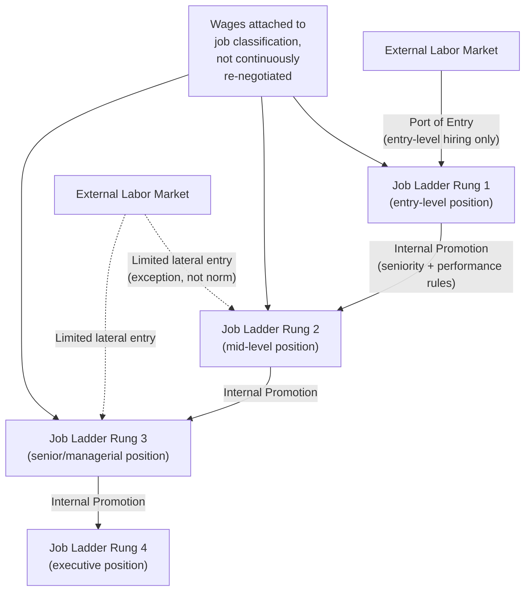

## Internal Labor Market Theory

### Overview

Internal labor market (ILM) theory, developed primarily by **Doeringer and Piore (1971)** and later formalized within personnel economics by scholars including **Baker, Gibbs, and Holmström (1994a, 1994b)** and **Rosen (1982)**, describes how large firms organize employment through **administrative rules and internal job ladders** rather than relying purely on continuous external spot-market wage-setting for every position. Entry into the firm typically occurs only at specific low-level "**ports of entry**," with subsequent staffing of higher-level jobs filled predominantly through internal promotion rather than external hiring. Wages, job assignment, and mobility are governed by internal administrative structures — job classifications, seniority rules, promotion ladders — that are partially insulated from external market wage fluctuations. ILM theory provides the organizational counterpart to many individual-incentive theories (tournaments, deferred compensation, career concerns) by explaining *why* firms build durable internal hierarchies in the first place.

### Defining Features of an Internal Labor Market

1. **Ports of entry**: new external hires enter the firm only at specific, typically lower-level positions; most positions above entry level are filled from within.
2. **Job ladders**: a structured sequence of positions through which workers progress, with promotion criteria (seniority, performance, tenure) governing movement between rungs.
3. **Administrative wage-setting**: wages are attached to **jobs/positions** (job-based pay) rather than purely to **individuals** or continuously re-negotiated against the external spot market — a given job slot pays a set wage or wage range regardless of minor external market fluctuations.
4. **Limited lateral entry**: workers cannot typically "buy" their way into a mid-level or senior position directly from outside; movement is primarily vertical within the firm's ladder.
5. **Long-term implicit employment relationships**: ILMs are associated with lower turnover, greater investment in firm-specific human capital, and longer expected tenure than pure spot-market employment arrangements.

### Why Do Internal Labor Markets Exist? (Theoretical Rationales)

#### 1. Firm-Specific Human Capital (Becker, 1964)

When workers acquire skills valuable primarily within a specific firm (firm-specific human capital), both the firm and worker have an incentive to sustain a long-term relationship rather than rely on spot-market rehiring, since the value of that capital would be lost (or substantially reduced) if the worker left. ILMs institutionalize this long-term relationship through job ladders and internal promotion, protecting the joint investment.

#### 2. Reducing Turnover and Recruitment/Training Costs

Continuous external hiring for every vacancy imposes search, screening, and training costs. Internal promotion economizes on these costs since the firm already has extensive information about internal candidates' performance history (see career concerns and information advantages below), and does not need to re-screen from scratch.

#### 3. Incentive Provision via Promotion (Tournament-Style Incentives)

As detailed under **Tournament Theory and Promotions**, internal job ladders provide an incentive structure: workers exert effort partly to win promotion to better-paying, higher-status positions. The internal labor market is the *organizational infrastructure* within which these implicit promotion tournaments operate — job ladders define the "tournament brackets," pay differentials between rungs define the "prize spread," and administrative promotion rules define the "contest rules."

#### 4. Information Advantages of Internal Promotion (Screening)

Internal candidates have an established performance track record observable to the firm (supervisor evaluations, project outcomes, peer assessments), reducing the adverse-selection risk inherent in hiring an unknown external candidate. Promoting from within is, in effect, a **screening mechanism** that leverages accumulated private information the firm has about its own employees — information an external labor market does not have access to.

#### 5. Administrative Efficiency and Perceived Fairness (Equity Considerations)

Rule-based wage structures (fixed pay for a given job classification, seniority-based increments) reduce costly individual wage negotiation for every position and can improve morale/perceived organizational justice by avoiding visible pay disparities between similarly-classified workers doing comparable work — this can matter for cooperation and morale in team-based or interdependent work settings (related to **equity theory** and internal pay compression discussed in comparable-worth and internal-equity literature).

#### 6. Insurance Against Wage Volatility

Job-based (rather than continuously spot-market-indexed) wages provide workers some insurance against short-run fluctuations in their external market wage, at the cost of some wage rigidity for the firm — a tradeoff conceptually related to the risk-insurance tradeoff in the core principal-agent model.

### Diagram: Structure of an Internal Labor Market

### The Baker-Gibbs-Holmström Framework (Personnel Economics Formalization)

Baker, Gibbs, and Holmström's influential firm-level personnel data studies (drawing on a single large firm's internal records) provided some of the first systematic empirical tests of ILM theory's predictions, examining:

- **Wage and promotion dynamics within job levels**: do wages depend more on the job level (administrative classification) or on individual performance/output within the level?
- **"Fast-track" effects**: whether early promotion speed predicts subsequent promotion probability and wage growth (a test of whether ILMs sort/screen effectively — high performers identified early continue to be promoted faster, consistent with persistent unobserved ability being revealed and rewarded through the ladder).
- **Cohort effects and vacancy-driven promotion**: promotion probabilities are found to depend not only on individual merit but also on the number of vacancies available at the next level and the size/quality of one's promotion cohort — consistent with promotion functioning partly like a **tournament with a limited number of prizes**, rather than a pure meritocratic threshold rule.

**Key Points** (stylized findings commonly associated with this literature):

- **Wages tend to be tied more closely to job level than to a smooth function of individual output** within firms using ILM structures — consistent with administrative, rule-based wage-setting rather than continuous spot-market pricing.
- **Promotion, not within-job raises, is the primary vehicle for real wage growth** in many ILM-structured firms — an implication consistent with the tournament-based promotion-incentive framework.
- [Inference] These are stylized empirical patterns drawn from specific firm datasets studied in the literature; the degree to which they generalize across industries, countries, and firm sizes varies, and more recent shifts toward flatter organizational structures and more externally-benchmarked pay in some sectors may have altered the prevalence of classic ILM features since the original studies.

### Costs and Limitations of Internal Labor Markets

1. **Wage rigidity and reduced allocative efficiency**: administratively-set, job-based wages can diverge from external market-clearing wages for a given skill set, potentially causing under- or over-staffing of specific positions relative to what a frictionless spot market would produce, and creating retention risk if external wages rise faster than internal job-based pay for high-demand skills.
2. **Reduced external competition/benchmarking**: limited lateral entry can insulate incumbent employees from external competitive pressure, potentially reducing effort incentives relative to a fully open, continuously competitive labor market — though this is partially offset by internal tournament incentives (see Tournament Theory).
3. **Promotion-based incentive distortions**: as discussed under Tournament Theory, promotion-based incentive systems are subject to the discouragement effect, sabotage/collusion risk, and can incentivize employees to over-invest in visible, promotion-relevant activities at the expense of other valuable but less visible contributions (a manifestation of the broader multitasking problem within the ILM context).
4. **Slower adjustment to technological or market change**: rigid job ladders and classification systems can be slower to adapt to new skill requirements or restructuring needs than a fully flexible external-hiring model, a criticism often raised in discussions of ILM decline in some industries.
5. **Reduced mobility can trap mismatches**: if a worker's true comparative advantage lies outside their current ladder, internal-promotion-only structures may fail to reallocate them efficiently compared to a more fluid external market.

### Evidence on the Prevalence and Evolution of ILMs

- Doeringer and Piore's original formulation was grounded in observations of large unionized manufacturing firms in the mid-20th century United States, where strong internal job ladders, seniority rules, and limited lateral entry were pervasive.
- [Inference] A substantial body of subsequent labor-market literature has documented a **decline in the prevalence of classic, rigid ILM structures** in many advanced economies since the late 20th century — attributed variously to increased use of external labor markets, greater reliance on contingent/contract work, flatter organizational hierarchies, and increased skill-specific external benchmarking of pay — though the extent and universality of this decline varies by country, industry, and firm size, and strong ILM features persist in specific sectors (e.g., large Japanese corporations historically, public-sector civil service systems, unionized industries, and many large professional bureaucracies).
- [Unverified] Precise, generalizable estimates of "how much" ILM prevalence has declined across the broader economy are difficult to establish definitively given data and measurement heterogeneity across studies; claims of a uniform, economy-wide decline should be treated with appropriate caution.

### Illustrative Example

A large manufacturing firm hires all new employees only into an entry-level "Production Associate I" classification (the port of entry). Promotion to "Production Associate II," "Team Lead," "Shift Supervisor," and eventually "Plant Manager" occurs exclusively through internal promotion based on a combination of seniority (minimum tenure requirements at each level) and performance evaluations. An external candidate with 10 years of relevant industry experience cannot be hired directly into the "Shift Supervisor" role — they must either enter at the bottom of the ladder or seek employment at a competing firm with an open external-hire policy for that level. This structure reduces the firm's screening costs for promotion decisions (it already has years of internal performance data on its Production Associates) and creates a promotion-tournament incentive structure motivating effort at each rung, but it also risks losing highly qualified external candidates who are unwilling to accept an entry-level "market price cut" to join the firm, and can create retention challenges if external market wages for specific skills rise faster than the firm's internal job-based pay scale.

### Comparative Note: Internal Labor Markets vs. Spot/External Labor Markets

| Dimension | Internal Labor Market | External/Spot Labor Market |
| --- | --- | --- |
| Entry points | Limited ports of entry | Open hiring at any level |
| Wage determination | Administrative, job-based | Continuous market-based |
| Primary incentive mechanism | Promotion (tournament-like) | Direct spot wage adjustment |
| Turnover | Lower (long-term relationships) | Higher (frequent job switching) |
| Screening basis | Internal performance history | External signals (credentials, references) |
| Adaptability to market shocks | Slower (administrative rigidity) | Faster (continuous repricing) |
| Associated theories | Tournament theory, deferred compensation, firm-specific human capital | Piece rates, competitive wage theory |

### Next Steps

- **Tournament Theory and Promotions**
- **Deferred Compensation and Career Concerns**
- **Firm-Specific vs. General Human Capital (Becker)**
- **Job Ladders and Promotion Dynamics (Baker-Gibbs-Holmström)**
- **Turnover and Retention Economics**
- **Efficiency Wage Theory**
- **Organizational Design and Hierarchy**