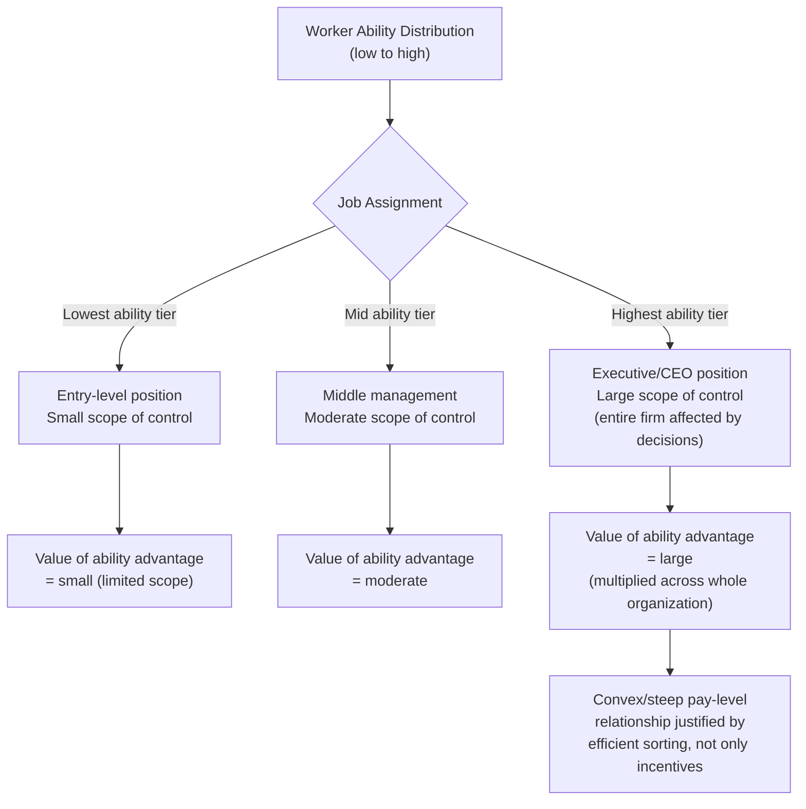
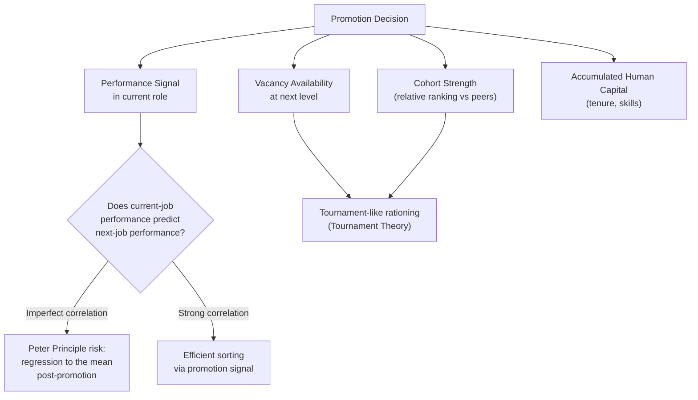

## Promotion Ladders and Job Assignment

### Overview

Promotion ladders and job assignment theory examines how firms structure sequences of hierarchical positions and decide **which workers to assign to which jobs and when to promote them**. This body of theory sits within the broader internal labor market framework but focuses specifically on the *microeconomics of the assignment and promotion decision* — how job ladders are designed (number of levels, wage differentials between levels), what informs the promotion decision (performance signals, seniority, vacancy availability), and what assignment mechanisms (matching workers to jobs based on comparative advantage) achieve efficiently. Central contributions include **Rosen (1982)** on hierarchies and the assignment problem, **Gibbons and Waldman (1999, 2006)** on integrating human capital, learning, and job assignment into a unified promotion model, and the empirical **Baker-Gibbs-Holmström** firm-personnel-data studies.

### The Job Assignment Problem

At its core, job assignment is a **matching problem**: workers differ in ability/skill (possibly multidimensional), jobs differ in their skill requirements and the productivity payoff to skill, and the firm must decide which worker goes to which job to maximize total output (or profit, net of wages).

#### Comparative Advantage and Sorting

If worker ability is one-dimensional and jobs can be ranked by how much they reward ability (i.e., jobs differ in the *sensitivity* of output to ability, not just in a flat level shift), then efficient assignment follows a **positive assortative matching** principle: the highest-ability workers should be assigned to the jobs where ability matters most (the highest hierarchical levels, where mistakes or superior judgment have the largest organizational consequences), and lower-ability workers to jobs where ability matters least.

**Key Points**:

- This is formalized in **Rosen's (1982) hierarchical assignment model**: as workers rise through levels of a hierarchy, they typically supervise/influence a larger scope of the organization (more subordinates, larger budgets, bigger decisions), so the productivity payoff to a manager's ability is **multiplied by the scale of what they control** — a small ability advantage at the CEO level, applied across an entire firm's decisions, has vastly more value than the same ability advantage applied to a single work team.
- This "scale of control" logic is a leading explanation, independent of tournament-incentive considerations, for **why pay rises convexly (steeply) with hierarchical level**: it is not solely an incentive device (as tournament theory emphasizes) but also an efficient sorting outcome, since assigning the most able people to the highest-leverage positions maximizes total output, and competitive labor markets bid up the pay of those occupying high-leverage roles.

#### Diagram: Assignment and the Scale of Control

### Promotion as a Signal-Extraction and Learning Problem

#### Gibbons-Waldman Framework

**Gibbons and Waldman (1999)** integrate three previously separate strands — human capital accumulation, employer learning about ability, and job assignment — into a unified model of promotion dynamics. Key mechanisms:

1. **Human capital accumulation**: workers accumulate general and firm-specific human capital with tenure/experience, raising their productivity in any given job over time.
2. **Learning about ability**: as in career-concerns models, the firm (and the market) updates beliefs about a worker's fixed ability component based on observed performance signals over time.
3. **Task-specific comparative advantage**: different jobs on the ladder reward different combinations of ability and accumulated human capital; promotion occurs when a worker's evolving expected productivity in the higher-level job exceeds their expected productivity (and the next-best candidate's) in their current job.

**Key Points**:

- This framework generates the empirically observed pattern that **wage increases at promotion are often larger than can be explained by the change in job duties alone** — part of the wage jump reflects the market/firm's updated (higher) assessment of the worker's underlying ability, revealed by the very fact that they were selected for promotion (a signaling/learning effect layered on top of the direct human-capital and job-content effects).
- It also explains **"fast-track" phenomena**: workers who are promoted unusually quickly early in their careers tend to continue being promoted faster and to attain higher ultimate rank, because early rapid promotion is itself an informative signal (to the firm and, via later external offers, the market) of high underlying ability — an early realization of a persistent characteristic that continues to predict future performance.

### Vacancy-Based (Tournament-Like) vs. Threshold-Based Promotion Rules

Empirical and theoretical work distinguishes two conceptually different promotion mechanisms:

#### 1. Threshold/Standards-Based Promotion

A worker is promoted whenever their assessed performance or ability exceeds a fixed, pre-announced standard — promotion is not rationed by the number of available slots; anyone who clears the bar advances. This resembles a **standards-based contest** rather than a strict tournament.

#### 2. Vacancy-Based (Tournament) Promotion

Promotion depends not only on a worker's own performance but on **the number of open slots at the next level** and the performance of the other candidates in their promotion cohort — a worker might be denied promotion in a "strong cohort" year despite performance that would have earned promotion in a "weak cohort" year with more openings or weaker competitors. This is the structure formalized in **Tournament Theory** — see that topic for the incentive-spread analysis.

**Key Points**:

- Empirical studies (e.g., within the Baker-Gibbs-Holmström personnel-data tradition) find evidence consistent with **both mechanisms operating simultaneously** in real firms: performance matters (consistent with threshold logic), but promotion probabilities are also demonstrably affected by vacancy availability and cohort strength (consistent with tournament/rationing logic).
- [Inference] The relative weight of standards-based versus vacancy-based promotion likely varies substantially across firms, industries, and hierarchical levels (e.g., promotion to a scarce, singular position like CEO is almost by definition vacancy/tournament-based, while promotion between lower clerical grades may be closer to a threshold system), and no single ratio generalizes across all settings.

### The Peter Principle and Assignment Under Uncertainty

A classic critique of promotion-based job assignment: if workers are promoted based on performance in their **current** job, but the skills required for success at the next level differ from those required at the current level, firms risk systematically promoting workers to **the level at which they are no longer competent** — the informal "Peter Principle."

**Key Points**:

- This arises because performance in the current job is used as the (imperfect) signal for expected performance in the next job, but the correlation between the two is imperfect if skill requirements differ across levels (e.g., an excellent individual salesperson does not necessarily have the management/coordination skills required to be an excellent sales manager).
- **Formal treatments** (e.g., Lazear, 2004, "The Peter Principle: A Theory of Decline") show that this phenomenon can be a **rational, unavoidable statistical consequence** of promotion-based selection under noisy performance signals, rather than simple managerial error: workers are promoted in part because they had a **positive performance shock** (luck plus ability) in their prior role; regression to the mean implies their expected performance in the new role, absent the same shock, will often be lower than their pre-promotion performance suggested — even if the *average* promoted worker still performs adequately, the *post-promotion performance dip* relative to the pre-promotion peak is a predictable statistical artifact, not necessarily evidence of promoting the "wrong" skill set.
- **Mitigations**: probationary promotion periods, dual-ladder career tracks (allowing high performers to advance in pay/status without necessarily moving into management, e.g., "technical ladders" in engineering firms alongside "management ladders"), and using multiple, role-differentiated performance signals rather than relying solely on current-job output to predict next-job fit.

### Diagram: Sources of Promotion Decisions

### Dual Career Ladders

Many firms, particularly in technical/professional fields (engineering, research science, medicine, academia), maintain **parallel promotion tracks**: a management ladder (increasing supervisory/coordination responsibility) and a technical/individual-contributor ladder (increasing expertise, autonomy, and pay without requiring a shift into people management).

**Key Points**:

- This structure addresses the Peter Principle risk directly: it avoids **forcing** high-performing technical specialists into management roles (where their skill set may not transfer) purely as the only available route to higher pay and status.
- It also helps **retain scarce technical talent** who may have a strong comparative advantage and preference for individual-contributor work, preventing the firm from losing them to a competitor offering a technical-track alternative.
- Wage-setting on parallel ladders raises its own internal-equity challenges (ensuring comparable-level positions on each ladder are perceived as fairly compensated relative to each other) — a design tension related to the compensation-fairness considerations discussed under Internal Labor Market Theory.

### Worked Example

A technology firm evaluates two candidates for promotion from Senior Engineer to Engineering Manager: Candidate A has the highest individual code output and technical performance ratings in the cohort; Candidate B has slightly lower individual technical output but has demonstrated strong project coordination and mentoring behavior in cross-team initiatives. Under a naive threshold rule based purely on the most recent individual performance metric, Candidate A would be promoted — but if management competence depends more on coordination/mentoring skill than on raw individual coding output, this risks a Peter Principle outcome (a highly productive engineer becoming a mediocre-to-poor manager). A firm aware of this risk might instead (a) weight coordination-relevant signals more heavily in the promotion decision even if they are less precisely measured than individual output, (b) offer Candidate A an alternative promotion up a parallel technical ladder (e.g., "Staff Engineer," with higher pay and technical scope but no direct reports), preserving their contribution and avoiding a mismatched assignment, and (c) promote Candidate B to management, whose demonstrated skill set is more closely aligned with the new role's actual requirements.

### Empirical Evidence

- **Baker, Gibbs & Holmström (1994a, 1994b)**: using detailed internal personnel records from a single large firm, found that promotion probabilities depend on both individual performance measures and on vacancy/cohort factors, and that fast early promotion predicts continued fast promotion — consistent with the learning/signaling elements of the Gibbons-Waldman framework.
- **Lazear (2004)**: provides theoretical and some supporting empirical discussion for the Peter-Principle-as-regression-to-the-mean interpretation, arguing that a post-promotion performance dip is a predictable statistical consequence of promotion-based selection on noisy signals rather than necessarily reflecting mismatched skill requirements. [Inference: the extent to which real-world promotion declines are attributable primarily to regression to the mean versus genuine skill mismatch across levels is difficult to fully disentangle empirically and likely varies by context.]
- Studies of dual-ladder systems in engineering and scientific organizations document their use as a retention and motivation tool for technical specialists, though systematic, generalizable causal estimates of their effectiveness relative to single-ladder systems are limited in the public empirical literature. [Unverified as a precise, generalizable quantitative comparison.]

### Comparative Note

| Dimension | Threshold-Based Promotion | Vacancy-Based (Tournament) Promotion |
| --- | --- | --- |
| Rationing | None (anyone meeting standard advances) | Limited by number of open slots |
| Sensitivity to cohort strength | Low | High |
| Incentive intensity depends on | Distance to fixed standard | Relative rank vs. cohort |
| More common at | Lower/middle hierarchical levels | Scarce senior/executive positions |

### Next Steps

- **Internal Labor Market Theory**
- **Tournament Theory and Promotions**
- **Deferred Compensation and Career Concerns**
- **The Peter Principle and Regression to the Mean in Promotion**
- **Dual Career Ladders and Technical Track Design**
- **Assortative Matching and Hierarchical Assignment (Rosen, 1982)**
- **Employer Learning and Statistical Discrimination**