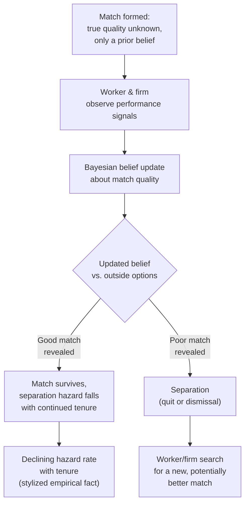

## Employee Turnover and Retention

### Overview

Employee turnover and retention economics examines why workers separate from employers (quits, layoffs, retirements) and what mechanisms firms use to influence separation rates. Within personnel economics, turnover is analyzed as an outcome of the interaction between **job matching quality**, **human capital investment**, **information revelation over time**, and **the incentive structures** (deferred compensation, internal labor markets, efficiency wages) covered elsewhere in this chapter. Turnover is not simply a cost to be minimized — some turnover is efficient, reflecting the resolution of match-quality uncertainty and the reallocation of workers to better-fitting jobs. The central analytical task is distinguishing **efficient turnover** (which firms should not necessarily try to prevent) from **inefficient turnover** (excessive quits or dysfunctional retention driven by market frictions, poor incentive design, or below-market compensation).

### Types of Turnover

1. **Voluntary turnover (quits)**: initiated by the employee, typically driven by outside offers, poor job/firm fit, or dissatisfaction with pay, working conditions, or career progression.
2. **Involuntary turnover (layoffs/dismissals)**: initiated by the employer, driven by declining labor demand, poor performance, restructuring, or (in efficiency-wage/deferred-compensation contexts) as a deliberate incentive-enforcement mechanism.
3. **Retirements**: a distinct category with its own economics (pension design, deferred-compensation "bonding" as discussed under Deferred Compensation, and Social Security/pension incentive effects), often modeled separately from ordinary quits.
4. **Efficient vs. inefficient turnover**: efficient turnover corrects poor job matches or reallocates labor toward higher-value uses; inefficient turnover destroys valuable firm-specific human capital or reflects contracting/informational failures that a better-designed compensation system could have prevented.

### Job Matching Theory (Jovanovic, 1979)

**Jovanovic's job matching model** provides the foundational framework for understanding "good" turnover: match quality between a worker and a specific job/firm is **not perfectly known ex ante** by either party — it is revealed gradually through experience on the job.

**Key Points**:

- Both the firm and worker begin with a **prior belief** about match quality (productivity of this specific worker-firm pairing) and update this belief using a Bayesian learning process as they observe performance signals over time.
- **Separations are most likely early in a job spell** and decline with tenure — this generates the well-documented empirical regularity that **turnover hazard rates decline sharply with job tenure**: most quits/dismissals happen in the first months or years, and the longer a match survives, the less likely it is to end (since the surviving matches have, on average, been revealed as good matches; bad matches have already been weeded out).
- This produces a **testable prediction distinguishing job matching from pure human-capital-accumulation stories**: match-quality models predict declining separation hazards with tenure even holding constant the worker's general experience, because it's the resolution of match-specific uncertainty (not just skill-building) that reduces the probability of separation over time.
- **Policy/managerial implication**: turnover in the first months of employment is, to a significant extent, **expected and even efficient** — it reflects the discovery that a match was not as good as initially believed by one or both parties, allowing reallocation to better matches. Firms should not necessarily treat all early-tenure turnover as a failure of onboarding or retention policy.

### Diagram: Job Matching, Learning, and Turnover Hazard

### Costs of Turnover to the Firm

1. **Direct replacement costs**: recruiting, screening, interviewing, and hiring costs for a replacement worker.
2. **Training and onboarding costs**: time and resources invested in bringing a new hire up to full productivity, which is lost (partially or wholly) if that worker later separates before recouping the investment.
3. **Loss of firm-specific human capital** (Becker, 1964): when a departing worker takes with them knowledge, skills, or relationships that have no value outside the firm, that investment is a sunk loss to the firm (and, correspondingly, the worker also loses the firm-specific-capital wage premium they had built up).
4. **Disruption costs**: temporary productivity losses to the team/unit while a vacancy is filled and the new hire ramps up, plus potential loss of institutional knowledge and continuity in ongoing projects or client relationships.
5. **Incentive-scheme costs**: turnover can undermine deferred-compensation and internal-labor-market incentive structures if it is perceived as arbitrary or if it disrupts the credibility of long-term implicit contracts (see Deferred Compensation and Internal Labor Market Theory).

### Costs of Turnover to the Worker

1. **Loss of firm-specific human capital investment** and any associated wage premium built up with tenure.
2. **Loss of accrued deferred compensation** (unvested pension benefits, deferred bonuses) if separation occurs before vesting — a deliberate design feature in some compensation systems (see Deferred Compensation topic) meant to raise the cost of quitting.
3. **Search and transition costs**: time unemployed or under-employed while searching for a new position, moving costs, and the risk of accepting a lower-quality match than the one left behind.
4. **Signaling costs**: frequent job-hopping, depending on the labor market and occupation, can sometimes be interpreted negatively by future employers as a signal of poor match quality or unreliability — though this effect is context- and occupation-dependent, and is far less pronounced (or reversed) in some fast-moving industries/labor markets where mobility is normalized. [Inference: the sign and magnitude of any such reputational penalty from job-hopping is likely highly context-dependent and not a universal empirical regularity.]

### Firm Strategies to Influence Turnover

#### 1. Efficiency Wages

Paying above-market wages raises the cost to the worker of losing their job, reducing voluntary quits (workers are less willing to leave a job paying more than they could earn elsewhere) and, in the Shapiro-Stiglitz framework, also serves an incentive/shirking-deterrence function.

#### 2. Deferred Compensation

As detailed under **Deferred Compensation and Career Concerns**, back-loaded wage profiles impose a direct financial cost on quitting (or being fired) before the deferred premium is collected, directly reducing turnover among workers who have accumulated significant tenure.

#### 3. Firm-Specific Training Investment Sharing

Becker's human capital theory implies that when training is **firm-specific**, the firm bears the risk of losing its investment if the worker quits, so firms often prefer to have **workers share the cost** of firm-specific training (e.g., accepting a lower wage during a training period) to reduce the firm's exposure and to filter for workers who intend to stay long enough to make the investment worthwhile.

#### 4. Internal Labor Markets and Promotion Ladders

As discussed under Internal Labor Market Theory, promotion-based career paths and administratively-set, job-based wages (rather than continuous market renegotiation) create switching costs and implicit long-term contracts that reduce voluntary turnover relative to a pure external spot-market employment structure.

#### 5. Realistic Job Previews and Improved Matching at Hiring

Since a large share of early-tenure turnover reflects the resolution of ex ante match-quality uncertainty (Jovanovic), firms can reduce (efficient and inefficient) turnover by investing in better pre-hire information — realistic job previews, structured interviews, trial periods, or probationary assignments — that improve the accuracy of the initial match assessment, reducing the frequency of "bad match" separations without necessarily needing higher wages.

#### 6. Non-Wage Retention Levers

Career development opportunities, workplace flexibility, organizational culture, and job design can influence turnover independent of the wage-based mechanisms above; these are typically treated in personnel economics as affecting the worker's **effective reservation utility** for staying versus the value of outside options, operating through the same participation-constraint logic as in the core principal-agent framework, even though they are not pure monetary transfers.

### The Efficient Turnover Benchmark

**Key Points**:

- Not all turnover reduction is desirable from a firm-profit or social-welfare perspective. If a firm sets retention policy to **minimize turnover** without regard to match quality, it risks retaining poor matches that would be more productively reallocated elsewhere, imposing a hidden cost (lower average productivity of the retained workforce) that does not show up directly in turnover statistics.
- The economically relevant target is not "zero turnover" but the turnover rate consistent with **efficient search and matching** — separating from genuinely poor matches while retaining genuinely good ones, and making the retention/compensation investment (efficiency wages, deferred pay, training) primarily in matches with the highest expected joint surplus.
- [Inference] Distinguishing empirically between efficient match-driven turnover and inefficient turnover driven by underpayment, poor management, or contracting frictions is difficult in practice and typically requires structural modeling (e.g., estimating a Jovanovic-style matching model) rather than simple turnover-rate comparisons across firms.

### Worked Example

A firm observes that 30% of new hires leave within their first six months, while only 5% of employees with 5+ years of tenure leave annually. Under Jovanovic's matching framework, this pattern is consistent with efficient learning: many new hires and their employers are still resolving uncertainty about match quality, and a meaningful share of the six-month departures represent the correct identification and correction of poor matches (not a "retention failure"). The firm might mistakenly respond to the high early-tenure turnover rate by simply raising entry-level wages across the board (an efficiency-wage-style fix) — but if the true cause is match-quality discovery rather than underpayment, a more targeted response (e.g., improved pre-hire assessment, structured onboarding programs that accelerate accurate mutual evaluation, or short paid trial periods) may more efficiently address the issue without unnecessarily raising the wage bill for workers who would have stayed and performed well anyway.

### Empirical Evidence

- **Jovanovic (1979)**: the seminal matching-model paper; subsequent empirical labor economics has repeatedly documented **declining hazard rates of separation with tenure** across many datasets and countries, a pattern broadly consistent with (though not exclusively explained by) the matching-model mechanism, since general human capital accumulation and other tenure-related factors can also contribute to declining separation rates.
- **Topel & Ward (1992)**: documented substantial job-to-job mobility early in workers' careers in the U.S., with wage growth concentrated in the first several years of labor market entry, partly attributed to search for better matches — consistent with the matching-theory interpretation of early-career turnover as productive reallocation rather than pure frictional cost.
- Studies of firm-sponsored training and turnover (in the Becker human-capital tradition) generally find that firms invest less in general (portable) training than in firm-specific training, and often require some wage/cost-sharing from workers during general-training periods, consistent with the prediction that firms avoid bearing the full risk of training investments that a worker could take to a competing employer. [Inference: the precise degree of cost-sharing observed varies substantially across firms, industries, and types of training, and is not governed by a single universal ratio.]

### Comparative Note

| Mechanism | Primary Effect on Turnover | Related Topic |
| --- | --- | --- |
| Efficiency wages | Reduces voluntary quits (raises cost of separation) | Efficiency Wage Theory |
| Deferred compensation | Reduces quits/dismissals before vesting | Deferred Compensation and Career Concerns |
| Internal labor markets | Reduces turnover via long-term promotion incentives | Internal Labor Market Theory |
| Improved pre-hire matching | Reduces early-tenure "bad match" separations | Job Matching Theory (Jovanovic) |
| Firm-specific training investment sharing | Filters for workers likely to stay; reduces firm's loss exposure | Human Capital Theory (Becker) |

### Next Steps

- **Job Matching Theory (Jovanovic, 1979)**
- **Efficiency Wage Theory**
- **Deferred Compensation and Career Concerns**
- **Internal Labor Market Theory**
- **Firm-Specific vs. General Human Capital (Becker)**
- **Search and Matching Frictions in Labor Markets**
- **Onboarding, Screening, and Realistic Job Previews**