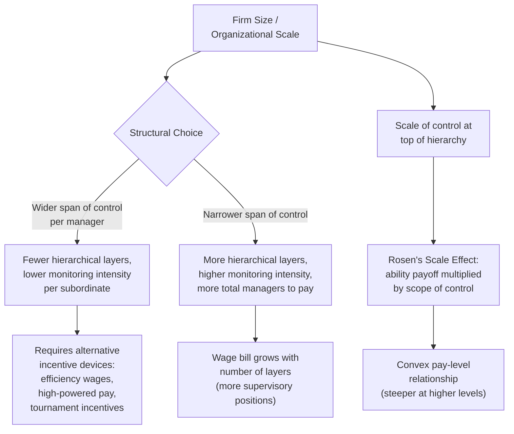

## Organizational Structure and Wage Setting

### Overview

Organizational structure and wage-setting theory examines how the **shape of a firm's hierarchy** (the number of layers, the span of control at each layer, and the allocation of decision-making authority) jointly determines and is determined by the firm's compensation policy. This body of work connects personnel economics to organizational design, drawing on **Rosen's (1982) hierarchical models**, **Qian (1994)**, **Calvo and Wellisz (1978, 1979)**, and the empirical personnel-economics literature (Baker-Gibbs-Holmström) to explain observed regularities: pay rises convexly with hierarchical level, the number of subordinates per manager (span of control) affects wage-setting, and organizational "flattening" or "delayering" has systematic wage and incentive consequences.

### Hierarchies as Solutions to Span-of-Control and Supervision Constraints

#### The Basic Span-of-Control Problem

A manager's effective supervisory capacity is limited — a single manager cannot costlessly monitor an unlimited number of subordinates. As firms grow, they must either (a) increase the number of subordinates per manager (widening span of control, at the cost of reduced individual monitoring/attention), or (b) add additional layers of management (narrowing span of control per layer, at the cost of more total managers to compensate and more information-processing/coordination overhead through the added layer).

**Key Points**:

- The **Calvo-Wellisz (1978)** model formalizes this: monitoring intensity per subordinate declines as the number of subordinates per supervisor rises, so effort/output per worker is a decreasing function of the supervisor's span of control (since each worker faces a lower probability of being caught shirking when supervisory attention is spread thinner).
- This creates a direct link between **organizational design (span of control) and the personnel-economics moral-hazard problem**: an organization choosing a wider span of control is implicitly choosing weaker monitoring-based incentives and must compensate with alternative incentive devices (higher-powered pay, efficiency wages, or promotion-tournament incentives) if it wishes to sustain effort levels.

#### Rosen's Hierarchical Assignment and Pay Structure

As introduced under **Promotion Ladders and Job Assignment**, Rosen (1982) shows that in a hierarchy where higher levels control a larger scope of resources/subordinates, the productivity payoff to a manager's ability is multiplied by the **span/scale of what they control**. This "scale effect" combines with the assignment principle (most able workers to positions of largest scale) to generate a **convex** — increasingly steep — relationship between hierarchical level and both productivity and pay.

**Key Points**:

- This is a **complementary, not competing**, explanation to tournament theory for steep executive pay: part of the pay premium at the top of a hierarchy reflects efficient sorting/scale effects (Rosen), and part reflects the deliberate incentive-spread design of promotion tournaments (Lazear-Rosen 1981) — real-world compensation likely reflects a blend of both mechanisms, and empirically disentangling their relative contributions is difficult.
- The scale-effect logic predicts that pay differentials between hierarchical levels should be **larger in larger organizations** (where the scope of control at the top is larger), a prediction with some empirical support in studies of executive compensation scaling with firm size.

### Diagram: Organizational Structure and Compensation Interactions

### Delayering and Organizational Flattening

Many firms have periodically restructured toward **"flatter" hierarchies** — reducing the number of management layers and widening spans of control — a trend documented and analyzed in organizational economics.

**Key Points**:

- **Rajan and Wulf (2006)** empirically documented that despite widespread flattening of formal reporting hierarchies (fewer layers between CEO and division managers) in many large firms during the 1990s–2000s, **pay dispersion and the pay-hierarchy-level relationship did not correspondingly flatten** — CEO and top-management compensation continued to rise steeply relative to lower levels even as formal layers were removed, suggesting that the number of *formal reporting layers* is not a perfect proxy for the underlying *scope of decision-making authority and control* that drives compensation differentials (a firm can remove a formal management layer while the removed layer's decision authority is redistributed upward rather than genuinely decentralized).
- **Delayering trade-offs**: reducing layers can lower the fixed wage bill associated with maintaining many supervisory positions and can speed decision-making/information flow, but it also widens the span of control for remaining managers, which (per Calvo-Wellisz logic) can reduce monitoring intensity per subordinate and necessitate compensating adjustments to incentive pay intensity to sustain effort.
- [Inference] The net effect of delayering on total labor costs, incentive strength, and firm performance is highly context-dependent (varying with the nature of the work, the feasibility of self-enforcing incentive contracts as substitutes for direct supervision, and the firm's information technology for performance measurement), and no single generalizable formula predicts when flattening improves versus harms firm performance.

### Centralization vs. Decentralization of Decision-Making Authority

Organizational structure is not only about the number of layers but also about **where decision rights are allocated** — a distinct but related question addressed by the property-rights/incomplete-contracts theory of the firm (Grossman-Hart-Moore) and by information-based theories of delegation (Aghion & Tirole, 1997).

**Key Points**:

- **Centralization** concentrates decision authority at the top, which can improve coordination and ensure decisions reflect the principal's (owner's/top-manager's) objectives, but risks decisions being made with less local/specific information than lower-level employees possess (an information-cost problem).
- **Decentralization** delegates decision authority to lower-level employees closer to the relevant information, potentially improving decision quality on local matters, but risks **agency losses** if delegated agents' objectives diverge from the principal's (the same fundamental moral-hazard/incentive-alignment concern from principal-agent theory, applied to decision rights rather than effort alone).
- **Wage-setting implication**: delegating real decision authority to a position (rather than just adding a supervisory title with narrow discretion) typically requires **higher-powered compensation** at that level to align the delegated decision-maker's incentives with firm objectives, since the cost of misaligned decisions under decentralization can be substantial — this connects organizational-design choices directly back to the core incentive-contract tradeoffs from principal-agent theory.

### Internal Pay Equity and Wage Compression

Organizational wage-setting is also shaped by **internal-equity considerations** — the perceived fairness of pay differentials among employees at similar or adjacent levels — which can create wage-setting constraints beyond pure marginal-productivity or incentive-optimal pricing.

**Key Points**:

- **Equity theory** (drawing on behavioral/organizational economics, e.g., Akerlof and Yellen's "fair wage-effort" hypothesis) suggests that workers compare their pay to relevant reference groups (peers, similar positions) and may reduce effort if they perceive their pay as unfairly low relative to comparable others, even if their pay is objectively consistent with external market rates.
- This can lead firms to adopt **compressed wage structures** — smaller pay differentials between adjacent job levels or among employees at the same level than a pure marginal-productivity or optimal-incentive calculation alone would generate — trading off some incentive intensity for improved morale, cooperation, and perceived fairness, particularly in team-based or highly interdependent work settings where cooperation value is high (connecting to the **Team Production and Free Riding** topic, since excessive within-team pay dispersion can undermine cooperative effort).
- **Tension with incentive theory**: wage compression directly works against the high-powered-incentive logic of piece rates and tournaments; firms must balance the incentive benefits of pay dispersion against the potential cooperation/morale costs, and the empirically optimal degree of compression likely varies with the extent to which the job involves individual versus interdependent/team-based tasks. [Inference: the precise, generalizable magnitude of this tradeoff is difficult to pin down and is an active area of empirical organizational economics research.]

### Worked Example

A firm considers restructuring from a five-layer hierarchy (CEO → VP → Director → Manager → Associate) to a three-layer hierarchy (CEO → Director → Associate) by eliminating the VP and Manager layers, redistributing their supervisory responsibilities to the remaining Director layer. This delayering reduces the total number of highly-paid supervisory positions (lowering the wage bill for those roles) and may speed up decision-making by removing approval layers. However, the remaining Directors now supervise a much wider span of Associates directly, reducing per-Associate monitoring intensity (per Calvo-Wellisz). If Associate-level work is not easily incentivized through self-enforcing piece-rate-like contracts, the firm may need to raise Director-level pay substantially (both to compensate for the increased responsibility/scope, consistent with Rosen's scale effect, and to attract managers capable of handling the wider span) while also investing in alternative incentive mechanisms for Associates (e.g., stronger internal-promotion-ladder incentives, or improved objective performance metrics) to substitute for the reduced direct supervision.

### Empirical Evidence

- **Rajan & Wulf (2006)**: documented flattening of formal management hierarchies in a large sample of firms over the 1986–1999 period, alongside evidence that compensation differentials by level did not flatten correspondingly, and that decision-making authority did not appear to decentralize proportionally to the removal of formal layers.
- Studies following the Baker-Gibbs-Holmström personnel-economics tradition have documented **convex pay-level relationships** within firm hierarchies consistent with both the Rosen scale-effect and Lazear-Rosen tournament-incentive explanations, though these studies generally cannot cleanly separate the relative contribution of each mechanism to the observed pay convexity. [Inference: this is a genuinely contested area, with the relative importance of sorting/scale-effects versus tournament-incentive-effects likely varying across firms and industries.]
- Akerlof & Yellen's fair-wage-effort literature provides theoretical and some empirical (survey and experimental) support for the idea that perceived pay fairness affects effort provision, motivating observed wage compression in many real-world pay structures relative to pure marginal-productivity benchmarks. [Unverified as a precisely quantified, universally generalizable effect size across industries.]

### Comparative Note

| Structural Choice | Effect on Wage-Setting | Related Mechanism |
| --- | --- | --- |
| Wider span of control | Requires stronger alternative incentives (efficiency wage, high-powered pay) | Calvo-Wellisz monitoring model |
| More hierarchical layers | Higher total wage bill (more supervisory positions), narrower spans, tighter monitoring | Span-of-control tradeoff |
| Larger scale of control at top | Steeper, more convex pay by level | Rosen's hierarchical scale effect |
| Decentralized decision authority | Requires higher-powered pay to align delegated decisions | Agency theory applied to decision rights |
| Internal-equity/fairness concerns | Wage compression relative to pure incentive-optimal dispersion | Akerlof-Yellen fair-wage-effort hypothesis |

### Next Steps

- **Promotion Ladders and Job Assignment**
- **Efficiency Wage Theory**
- **Internal Labor Market Theory**
- **Team Production and Free Riding**
- **Fair Wage-Effort Hypothesis (Akerlof-Yellen)**
- **Theory of the Firm and Delegation of Decision Rights**
- **Executive Compensation and CEO Pay Structures**