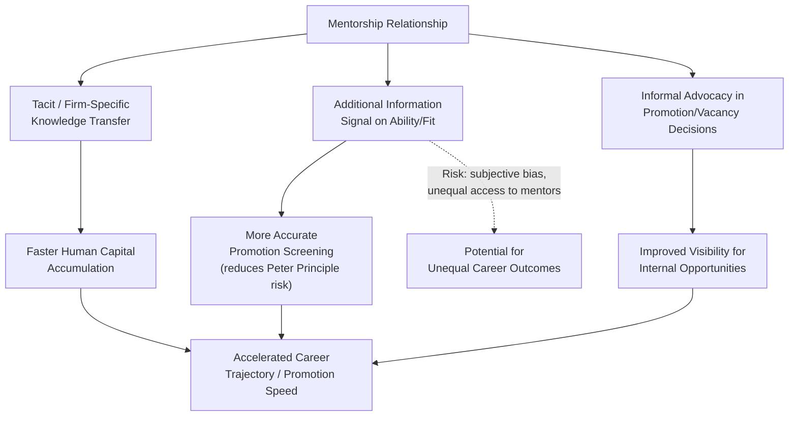

## Mentorship and Career Trajectories

### Overview

Mentorship and career trajectory theory examines how relationships between senior and junior workers within a firm affect human capital accumulation, information transmission, and long-run career outcomes such as promotion speed, wage growth, and retention. Within personnel economics, mentorship is analyzed as a mechanism that addresses several frictions covered elsewhere in this chapter simultaneously: it supplements formal training with **tacit, firm-specific knowledge transfer** (connecting to human capital theory), it provides an **additional information channel for assessing junior workers' ability** (connecting to career concerns and employer learning), and it can shape **access to internal job ladders and promotion opportunities** (connecting to internal labor market theory). Unlike the more fully formalized topics elsewhere in this chapter, mentorship economics blends established human-capital and information-based theory with a more empirically-driven literature, since a single canonical formal model comparable to Lazear's tournament model or Jovanovic's matching model does not dominate this specific subfield.

### Mentorship as a Human Capital Transmission Mechanism

**Key Points**:

- Mentorship supplements formal, codified training (classroom instruction, structured onboarding) with the transmission of **tacit knowledge** — informal know-how, organizational norms, unwritten problem-solving heuristics, and relationship/network capital — that is difficult to codify and transfer through documentation alone.
- Within Becker's (1964) human capital framework, mentorship-transmitted knowledge can be **general** (portable skills useful across employers, e.g., broadly applicable professional judgment) or **firm-specific** (knowledge of internal processes, key personnel, and organizational politics that has little value outside the current firm) — the same cost-sharing logic from general human capital theory applies: firms have stronger incentives to invest resources in facilitating mentorship relationships that transmit **firm-specific** knowledge, since the firm captures more of the return, while general-knowledge mentorship transmission is more likely to be borne informally/voluntarily or subsidized indirectly through slower promotion tracks or lower early-career wages (as in general-training cost-sharing models).
- Effective mentorship can **accelerate the human-capital-accumulation component** of the promotion process described under Gibbons-Waldman's integrated framework (see **Promotion Ladders and Job Assignment**), potentially compressing the time needed for a junior worker to reach the productivity threshold required for advancement.

### Mentorship as an Information/Signaling Channel

**Key Points**:

- In career-concerns and employer-learning frameworks (see **Deferred Compensation and Career Concerns**), the firm's promotion and wage decisions depend on noisy, imperfect signals of a worker's underlying ability. A mentor who works closely with a junior employee over an extended period **generates an additional, potentially more informative signal** about that employee's ability and effort than arm's-length supervisory performance metrics alone — mentors often observe problem-solving approach, judgment under uncertainty, and interpersonal skill in ways that standard output metrics do not capture.
- This creates a **potential double-edged dynamic**: mentorship can improve the accuracy of promotion decisions (reducing Peter-Principle-type mismatches, as discussed under Promotion Ladders and Job Assignment, by supplying richer information about a candidate's likely fit for expanded responsibilities) — but it can also introduce **subjective bias or favoritism risk** if the mentor's assessment is not fully aligned with the firm's interests, or if mentor-mentee pairings are not equitably distributed across the workforce (see disparities discussion below).
- Mentors, particularly those with organizational influence, can act as informal **advocates** within promotion and vacancy-allocation processes (relevant to the vacancy-based tournament promotion dynamics discussed under Promotion Ladders and Job Assignment) — a mentee with a well-placed advocate may have improved visibility for promotion opportunities independent of the precision of formal performance metrics alone.

### Diagram: Mentorship's Channels of Influence on Career Trajectories

### Access to Mentorship and Career Disparities

**Key Points**:

- Access to high-quality mentorship is often **not randomly or uniformly distributed** across a workforce — factors such as demographic similarity between mentor and mentee (sometimes termed "homophily" in the sociology and organizational-behavior literature), informal network structures, and geographic/team placement can affect who receives mentorship and from whom.
- Because mentorship functions as both a human-capital-accumulation channel and an information/advocacy channel affecting promotion (as outlined above), **unequal access to mentorship can compound into unequal career trajectories** over time even absent differences in underlying ability or effort — a mechanism studied in the broader labor economics literature on career advancement disparities.
- [Inference] Quantifying the precise causal contribution of mentorship-access disparities (relative to other contributing factors such as differential access to high-visibility assignments, statistical discrimination in employer learning, or preferences) to observed career-outcome gaps is empirically challenging, and the literature does not offer a single settled, generalizable effect size; findings vary by study design, industry, and population studied.
- **Firm responses**: some organizations implement **formal mentorship programs** (structured pairing, rotational mentorship, sponsorship initiatives) explicitly to broaden access beyond what informal, self-organized mentor-mentee matching would produce, aiming to reduce the compounding disparities that can arise from unequal informal-network access.

### Formal vs. Informal Mentorship Programs

| Dimension | Formal (Firm-Organized) Mentorship | Informal (Self-Organized) Mentorship |
| --- | --- | --- |
| Pairing mechanism | Assigned/structured by the organization | Emerges organically through networks/proximity |
| Access equity | Generally broader/more uniform access | Access shaped by pre-existing network structure |
| Information quality | May be lower initially (assigned pairs lack rapport) | Often higher (self-selected pairs, stronger rapport) |
| Advocacy strength | Variable; depends on program design and mentor investment | Can be strong if mentor has genuine organizational influence |
| Scalability | Easier to scale/monitor across large organizations | Harder to scale or audit for equity |

**Key Points**:

- Formal programs trade off some of the informational and relational depth of organically-formed mentorships for **improved coverage and more equitable access**, particularly for employees who might otherwise be excluded from informal high-value networks.
- [Unverified] The relative effectiveness of formal versus informal mentorship in producing measurable career outcomes (promotion speed, retention, wage growth) is an area where the empirical literature shows mixed and context-dependent results; no consensus effect-size comparison generalizes cleanly across firm types and industries.

### Mentorship and Retention

Mentorship relationships can also influence **turnover** (see **Employee Turnover and Retention**):

- A strong mentorship relationship may increase a junior employee's investment in firm-specific relationships and knowledge, raising the effective switching cost of leaving the firm — operating similarly in spirit to the retention effects of firm-specific human capital and internal-labor-market ties discussed elsewhere in this chapter.
- Conversely, if a valued mentor departs the firm, mentees may experience an elevated risk of subsequent turnover themselves — a documented pattern in some studies of "mentor departure" effects, plausibly reflecting both the loss of a valued relationship/information channel and a signal about the broader attractiveness of opportunities elsewhere (since a mentor's departure may itself be informative about outside options). [Inference: the extent and consistency of this "mentor departure" turnover-contagion effect across different organizational settings is not a fully settled empirical matter.]

### Worked Example

A junior analyst is informally mentored by a senior manager who takes an active interest in her development, provides direct feedback on judgment and communication (dimensions not captured in the firm's standard quarterly output metrics), and advocates for her inclusion in a high-visibility cross-departmental project. Two years later, when a promotion decision arises under a vacancy-based tournament system (see **Promotion Ladders and Job Assignment**), the analyst's case benefits from both a stronger underlying skill set (from accelerated tacit-knowledge transfer) and a richer information set available to the promotion committee (from the mentor's direct testimony, supplementing standard metrics) — plausibly resulting in faster promotion than an equally-skilled peer who lacked comparable mentorship access, independent of any difference in innate ability. This illustrates how mentorship access, rather than ability alone, can be a meaningful driver of realized career trajectories, and why some firms invest in structured mentorship programs to reduce the extent to which career outcomes depend on the incidental, unequally-distributed availability of strong informal mentors.

### Empirical Evidence

- Studies of mentorship in professional and corporate settings generally find **positive associations** between having a mentor and outcomes such as promotion rate, compensation growth, and job satisfaction, though the literature widely acknowledges that **selection effects** (more ambitious or higher-potential employees may be more likely to seek out or attract mentors in the first place) make clean causal identification difficult outside of settings with random or quasi-random mentor assignment. [Inference: absent experimental or quasi-experimental designs, most observational mentorship-outcome correlations should be interpreted cautiously due to this selection concern.]
- A smaller body of studies using randomized or natural-experiment variation in mentor assignment (e.g., in some corporate mentorship-program evaluations and academic-mentorship contexts) has found evidence more suggestive of a **causal** positive effect of mentorship on some career outcomes, though findings are not uniform across all studies and contexts. [Unverified as a single generalizable causal effect size across industries and populations.]
- Research on demographic patterns in informal mentorship access (e.g., studies examining gender and racial patterns in senior-junior mentoring relationships within corporate and academic settings) has documented disparities in access consistent with homophily-driven network formation, though the precise downstream career-outcome consequences attributable specifically to this access gap (versus other contributing factors) remain an active and contested area of research. [Inference: this remains a genuinely unsettled empirical question with results varying by study design and setting.]

### Comparative Note: Mentorship's Position Within the Chapter's Framework

| Mechanism | Primary Function | Connects To |
| --- | --- | --- |
| Tacit/firm-specific knowledge transfer | Human capital accumulation | Firm-Specific Human Capital (Becker) |
| Additional ability/fit signal | Reduces promotion screening error | Career Concerns; Promotion Ladders and Job Assignment |
| Informal advocacy | Improves visibility in vacancy allocation | Tournament Theory and Promotions |
| Relationship-based switching costs | Retention | Employee Turnover and Retention |

### Next Steps

- **Promotion Ladders and Job Assignment**
- **Deferred Compensation and Career Concerns**
- **Employee Turnover and Retention**
- **Firm-Specific vs. General Human Capital (Becker)**
- **Statistical Discrimination and Employer Learning**
- **Internal Labor Market Theory**
- **Networks and Social Capital in Labor Markets**