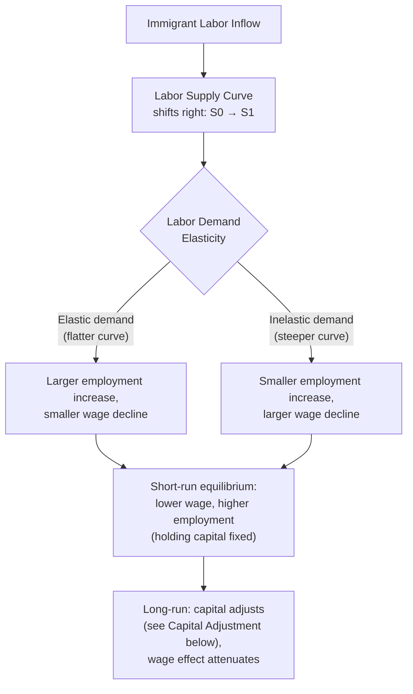
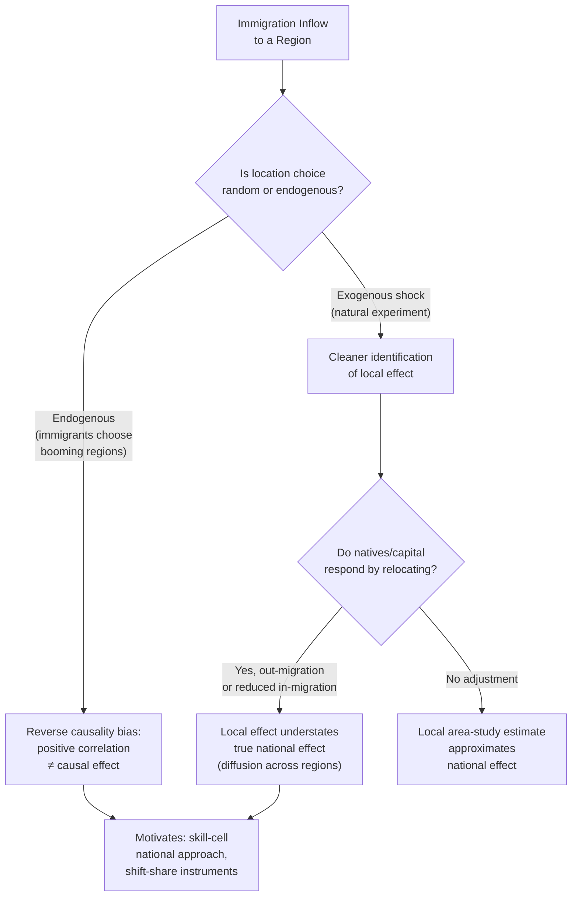

## Labor Market Effects of Immigration

### Overview

The labor market effects of immigration examine how the inflow of foreign-born workers into a host-country labor market affects wages, employment, and the allocation of labor across skill groups, industries, and regions of native-born and existing immigrant workers. This is one of the most extensively studied and empirically contested areas of labor economics, with the theoretical predictions of the standard competitive labor-demand model providing a baseline that subsequent research has substantially qualified through consideration of capital adjustment, task complementarity, geographic mobility, and empirical identification challenges. Major contributors to the modern literature include **George Borjas**, **David Card**, **Giovanni Peri**, and **Gianmarco Ottaviano**, whose competing empirical findings and methodological approaches define much of the ongoing debate.

### The Basic Competitive Labor-Demand Framework

#### Simple Model: Single Homogeneous Labor Market

In the simplest textbook model, treat labor as a single homogeneous input with a downward-sloping labor demand curve $D(L)$ and a fixed (short-run) capital stock. An inflow of immigrant workers shifts labor supply outward from $S_0$ to $S_1$.

**Key Points**:

- With a fixed downward-sloping demand curve and unchanged capital, an increase in labor supply **reduces the equilibrium wage** and **increases total employment** — this is the standard partial-equilibrium prediction that motivates concerns about native-wage effects.
- The magnitude of the wage decline depends on the **elasticity of labor demand**: a more elastic (flatter) demand curve implies a larger employment increase and smaller wage decline for a given labor-supply shift, while a less elastic (steeper) demand curve implies the opposite.
- This simple model treats all labor as a **single, perfectly substitutable input** — a strong simplifying assumption relaxed in more realistic frameworks below.

#### Diagram: Basic Supply-Shift Model

### Relaxing the Single-Labor-Market Assumption: Skill Groups and the Nested CES Framework

Realistic models disaggregate labor by **education, experience, and sometimes occupation/task**, since immigrants are not perfect substitutes for all native workers — the wage impact of immigration depends critically on the **degree of substitutability** between immigrant and native workers within and across skill cells.

**Key Points**:

- **Borjas's national skill-cell approach** (e.g., Borjas 2003) models the labor market as a nested constant-elasticity-of-substitution (CES) structure, with workers grouped into cells defined by education and years of labor market experience. Immigration's wage effect on a given native skill cell depends on how much immigration has increased the relative labor supply **within that specific cell** — the model predicts the **largest wage effects on natives who are the closest substitutes for immigrants** (typically, in many empirical contexts studied, workers without a high school diploma).
- This approach generally finds **larger and more negative wage effects** for close native substitutes than simpler aggregate models, because it does not allow immigrants and all natives to be treated as perfectly interchangeable, and it typically operates at a national level of geographic aggregation to avoid biases from cross-region native migration responses (discussed below).
- **Ottaviano and Peri (2012)** extend this framework by allowing native and immigrant workers **within the same education-experience cell** to be **imperfect substitutes** rather than perfect substitutes — reflecting, for example, language-related task specialization or comparative advantage differences even among similarly-educated workers. Allowing this imperfect substitutability generally **attenuates** the estimated negative wage effects on native workers (and can even generate positive wage effects for natives in some specifications), since immigrants and natives with similar formal qualifications are modeled as complementary inputs to production rather than direct competitors.
- [Inference] The degree of substitutability between immigrant and native workers within skill cells is the central parameter driving divergent empirical conclusions in this literature, and reasonable researchers have reached different estimates and conclusions using different data, time periods, and identifying assumptions — this remains a genuinely and actively contested empirical question rather than a settled one.

### Capital Adjustment and Long-Run Effects

**Key Points**:

- The simple supply-shift model above holds the capital stock fixed, which is a reasonable short-run assumption but likely inappropriate over longer horizons. In a **long-run model with capital mobility/adjustment** (capital flows to equalize the return to capital, or firms invest more in response to a larger, cheaper labor pool), the capital-to-labor ratio can be restored over time, which **attenuates or eliminates the negative wage effect** on average, since labor's marginal product is restored toward its pre-immigration level once capital catches up.
- This distinction between **short-run** (capital fixed, larger negative wage effects predicted) and **long-run** (capital adjusts, smaller or negligible negative wage effects predicted on average) is a standard feature of the theoretical literature and is one reason why short-run and long-run empirical estimates of immigration's wage effects can differ substantially even when applied to the same underlying labor-supply shock.
- [Inference] The empirically relevant speed of capital adjustment, and therefore how quickly the economy transitions from the "short-run" to "long-run" prediction, is itself a matter of ongoing empirical estimation and is not a fixed, universally agreed-upon parameter.

### Complementarity, Task Specialization, and the "Lump of Labor" Fallacy

**Key Points**:

- A key critique of the simplest labor-market models is the implicit **"lump of labor" assumption** — the idea that there is a fixed number of jobs/tasks to be divided between immigrants and natives, so that any job filled by an immigrant is a job "taken from" a native worker. Standard economic theory rejects this as a general proposition: labor demand is not fixed, and immigration can expand the overall size of the economy, create new job opportunities (including jobs that specifically employ native workers in complementary roles), and shift consumer demand in ways that raise labor demand elsewhere.
- **Peri and Sparber (2009)** develop and provide empirical support for a **task-specialization mechanism**: when immigrant workers (often, in the settings studied, with limited destination-language proficiency) concentrate in manual/physical-intensive tasks, native workers with similar formal education levels can respond by **specializing in more communication-intensive tasks**, for which they typically have a comparative advantage. This task reallocation can mean that immigration and native workers become **complements rather than substitutes** even within the same nominal education category, reducing or reversing the negative wage-effect prediction of models that assume perfect substitutability.
- This mechanism illustrates a broader theme: measured "substitutability" between immigrant and native labor is not a fixed technological constant but can depend on **endogenous task reallocation and occupational adjustment** by native workers in response to immigration, a genuinely dynamic process that simple static models can miss.

### Geographic Mobility and the "Spatial Correlation" Identification Problem

A major empirical challenge in measuring immigration's labor market effects is that immigrants do not settle randomly across regions, and native workers/firms are geographically mobile in response to local labor market conditions.

**Key Points**:

- The **"area approach" or "spatial correlation" method** compares wage/employment outcomes across cities or regions with differing shares of immigrant inflows, under the assumption that regional variation in immigrant inflows provides a natural experiment. However, this approach faces at least two serious identification concerns:
  1. **Non-random immigrant location choice**: immigrants may be more likely to move to regions already experiencing strong labor demand/wage growth (reverse causality or selection bias), which could bias estimated effects toward finding a spuriously *positive* (or less negative) correlation between immigration and local wages than the true causal effect.
  2. **Native/capital out-migration or in-migration response**: if native workers (or capital) respond to an immigrant inflow by relocating out of (or reducing inflow into) the affected region, wage and employment effects can be "spread" across the national economy rather than concentrated in the receiving region, causing area-based studies to **understate** the true national-level effect of immigration (since the local labor market re-equilibrates partly through geographic mobility rather than local wage adjustment alone).
- These identification concerns motivate the use of **natural experiments** (sudden, plausibly exogenous immigration shocks) and **instrumental variable strategies** (e.g., the "shift-share" or "enclave" instrument, using historical immigrant settlement patterns to predict where new immigrants are likely to locate, exploiting variation unrelated to contemporaneous local labor demand shocks) to more credibly isolate causal effects.

### Diagram: Identification Challenges in Estimating Immigration's Wage Effects

### The Mariel Boatlift as a Natural Experiment

The 1980 **Mariel Boatlift**, in which a large number of Cuban immigrants arrived suddenly in Miami over a short period, has served as a widely-studied natural experiment due to its sudden, largely unanticipated nature.

**Key Points**:

- **Card (1990)** initially found **little to no significant negative effect** on wages or unemployment of native workers (including low-skilled native workers) in Miami following the Boatlift, comparing Miami to a set of comparison cities — a finding widely cited as evidence that local labor markets can absorb substantial immigrant inflows without large negative wage effects on natives.
- **Borjas (2017)** re-examined the Mariel Boatlift data using a different, narrower comparison group (focusing specifically on native workers without a high school degree, a group argued to be the closest substitutes for the Marielitos) and reported a substantially **larger negative wage effect** for that specific subgroup than Card's original analysis found.
- This re-analysis triggered an extensive and still-active methodological debate (with subsequent responses from Card, Peri, Clemens, and others) over comparison-group selection, sample composition (e.g., survey sample size and demographic composition issues in the underlying Current Population Survey data for the relevant years), and the robustness of both the original and revised findings to alternative specifications. [Unverified as a fully settled matter: the Mariel Boatlift literature remains one of the most contested empirical case studies in the immigration-economics literature, and reasonable researchers continue to disagree on the correct interpretation of the available data.]

### Effects on Different Native Worker Groups

**Key Points**:

- The theoretical and empirical literature generally suggests that the labor-market impact of immigration is **not uniform across native workers** — it depends on the degree of skill/task substitutability with the specific immigrant inflow in question.
- **Closer substitutes** (native workers with similar education, experience, and occupational task profiles to the immigrant inflow) are predicted to experience larger negative wage effects (if any), while **complementary workers** (e.g., natives who shift into complementary, more communication-intensive or supervisory roles, or higher-skilled natives whose productivity is enhanced by a larger available pool of complementary lower-skilled labor) may experience neutral or even positive wage effects.
- **Prior immigrants** are frequently found in the empirical literature to be closer substitutes for new immigrant arrivals than are native-born workers (since prior immigrants often share similar occupational niches, language groups, or geographic concentration with new arrivals), implying that **existing immigrant workers may bear a disproportionate share of any negative wage effects** of new immigration relative to native-born workers as a whole. [Inference: the degree to which this pattern generalizes across countries, time periods, and immigrant-origin groups is not uniform across all studies.]

### Broader Economic Effects Beyond Direct Wage Competition

1. **Entrepreneurship and firm formation**: some studies find that immigrants have relatively high rates of business formation, which can create additional labor demand (including for native workers) beyond the direct labor-supply effect. [Inference: effect sizes and generalizability vary across studies and country contexts.]
2. **Consumer demand effects**: immigrant population growth increases local demand for goods and services, which can raise labor demand in the affected region, partially offsetting the direct labor-supply effect — this channel is emphasized particularly in local-area/regional studies.
3. **Fiscal effects**: immigration's net fiscal impact (taxes paid versus public services consumed) is a related but analytically distinct question from labor-market wage/employment effects, governed by different considerations (age structure, skill level, welfare-program eligibility rules) and is not covered in detail under this specific labor-market-effects topic.
4. **Innovation and high-skilled immigration**: a separate literature examines high-skilled immigration's effects on patenting, innovation, and productivity growth, generally finding different (often more clearly positive, though still debated in magnitude) labor-market dynamics than the lower-skilled immigration literature emphasized above, reflecting the different complementarity/substitutability profile of highly-skilled immigrant workers relative to the existing native workforce.

### Worked Example

Consider a simplified nested-CES exercise: suppose immigration increases the total labor supply of workers without a high school diploma by 20% in a national skill-cell model (Borjas-style), while the elasticity of substitution between different education groups is estimated at $\sigma = 2$ and the relevant labor demand elasticity implies a wage semi-elasticity of roughly $-0.3$ to $-0.4$ per 10% labor supply increase for the affected group (a range broadly consistent with some studies in this tradition). This would imply a predicted native wage decline for the closest-substitute group (workers without a high school diploma) on the order of several percentage points, holding other factors constant. If, instead, an Ottaviano-Peri-style specification is used that allows immigrants and natives within this education group to be imperfect substitutes (reflecting task specialization, as in Peri-Sparber), the predicted wage effect on native high-school dropouts would be **substantially smaller in magnitude, or potentially close to zero or slightly positive**, because part of the labor-supply increase is absorbed by task reallocation (natives shifting toward communication-intensive tasks) rather than pure head-to-head wage competition. [Inference: the specific numerical estimates used in this illustration are representative of the range and structure of published estimates in this literature but should not be read as a single, universally agreed-upon "true" parameter value; actual estimates vary meaningfully by study, country, time period, and specification.]

### Empirical Evidence Summary

- **Borjas (2003, 2017)**: national skill-cell approach; generally finds more significant negative wage effects on close native substitutes (particularly workers without a high school diploma), and re-analysis of the Mariel Boatlift finding larger negative effects than Card's original study.
- **Card (1990, 2001, 2009)**: area/local-labor-market approach; generally finds smaller or negligible negative wage effects on native workers, including in the original Mariel Boatlift study, and has emphasized methodological critiques of the national skill-cell approach's assumptions.
- **Ottaviano & Peri (2012)**: nested CES model allowing imperfect substitutability between natives and immigrants within education-experience cells; generally finds smaller (and in some specifications, mildly positive) native wage effects than the pure perfect-substitutes Borjas-style model.
- **Peri & Sparber (2009)**: task-specialization mechanism; provides a theoretical and empirical channel through which immigration and native labor can be complements rather than substitutes even within similar formal education categories.
- [Unverified/contested] Given the range of published estimates, methodologies, and ongoing scholarly disagreement (particularly evident in the Card-Borjas Mariel Boatlift exchange), this remains an area where **no single point estimate should be presented as the definitively "correct" or consensus magnitude** of immigration's wage effect on native workers; the appropriate characterization is a body of evidence spanning a range of estimates that depends heavily on modeling assumptions, comparison groups, time horizons, and geographic scope of analysis.

### Comparative Note: Modeling Approaches and Their Typical Implications

| Approach | Key Assumption | Typical Implication for Native Wage Effects |
| --- | --- | --- |
| Simple aggregate supply-shift model | Single homogeneous labor market | Larger predicted negative effects (short run) |
| Borjas national skill-cell (perfect substitutes within cell) | Immigrants and same-education/experience natives are perfect substitutes | Larger negative effects on close substitutes |
| Ottaviano-Peri nested CES (imperfect substitutes) | Immigrants and same-cell natives are imperfect substitutes | Smaller/attenuated negative effects, possibly positive |
| Peri-Sparber task specialization | Natives reallocate toward complementary tasks | Complementarity effect, reduced competition |
| Area/local approach (Card-style) | Local labor market variation is informative, subject to mobility caveats | Often smaller measured effects, subject to diffusion bias |

### Next Steps

- **Human Capital Theory and Skill Substitutability**
- **The Mariel Boatlift and Natural Experiments in Labor Economics**
- **Shift-Share and Instrumental Variable Methods in Labor Economics**
- **High-Skilled Immigration and Innovation**
- **Fiscal Effects of Immigration**
- **Task-Based Models of the Labor Market**
- **Regional Labor Market Adjustment and Native Migration Responses**