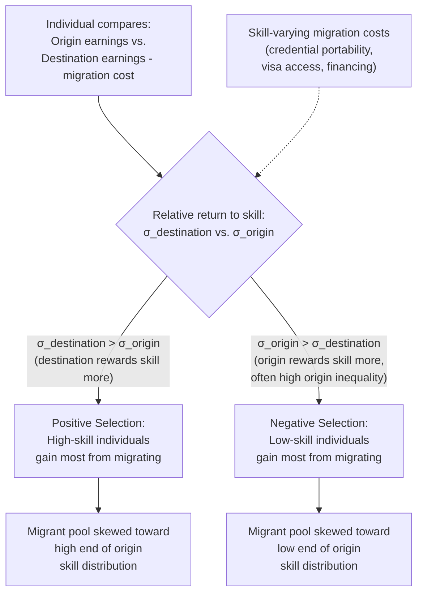

## Skill Composition of Immigrant Flows

### Overview

The skill composition of immigrant flows examines the theoretical and empirical determinants of **which types of workers select into migration** — by education level, occupation, and ability — and how this composition varies across sending countries, immigration policy regimes, and time. This is a foundational question for immigration economics because the labor-market, fiscal, and welfare effects of immigration (see **Labor Market Effects of Immigration**) depend critically on whether immigrant inflows are disproportionately low-skilled, high-skilled, or some specific non-random selection from the sending country's skill distribution. The dominant theoretical framework is the **Roy model of self-selection**, developed for migration analysis principally by **Borjas (1987)**, building on **Roy's (1951)** original occupational-choice framework.

### The Roy Model of Migrant Self-Selection

#### Basic Setup

The Roy model assumes individuals in the sending (origin) country choose whether to migrate by comparing their expected earnings in the origin country to their expected earnings in the destination country, net of migration costs. Crucially, an individual's **earnings potential in each country is not identical** — it depends on the **return to skill** in each labor market, which can differ substantially between origin and destination countries.

**Key Points**:

- Let $\theta$ denote an individual's underlying skill/ability. Origin-country earnings are $w_0 = \mu_0 + \sigma_0 \theta$, and destination-country earnings (net of migration costs) are $w_1 = \mu_1 + \sigma_1 \theta$, where $\sigma_0$ and $\sigma_1$ represent the **return to skill** (how much an additional unit of ability translates into earnings) in the origin and destination countries respectively.
- An individual migrates if $w_1 - c > w_0$, where $c$ is the (assumed skill-invariant, in the simplest version) cost of migration. This comparison depends not just on the **average wage gap** between countries but on how the **wage distributions' shapes** (specifically, the relative dispersion/return to skill, $\sigma_1$ vs. $\sigma_0$) interact with an individual's own position in the skill distribution.

#### Positive vs. Negative Selection

**Key Points**:

- **Positive selection** occurs when the destination country has a **higher return to skill** than the origin country ($\sigma_1 > \sigma_0$, i.e., the destination labor market rewards ability more steeply, often associated with lower income inequality being the relevant contrast — technically, higher skill-price dispersion in the destination). In this case, migration is disproportionately attractive to **high-skill individuals**, since their earnings gain from moving is largest — the migrant pool is positively selected relative to the origin-country skill distribution.
- **Negative selection** occurs when the origin country has a **higher return to skill** than the destination ($\sigma_0 > \sigma_1$, often associated with high origin-country income inequality). In this case, low-skill individuals gain the most from migrating (since they face a much lower skill-based penalty in the destination than at home), and the migrant pool is disproportionately drawn from the **lower end** of the origin-country skill distribution.
- **Refined (intermediate) selection**: because migration costs may themselves vary with skill (e.g., higher-skilled individuals may face lower relative migration costs due to greater access to legal migration channels, financial resources, or portable credentials), the simplest binary positive/negative selection framework can be refined to allow for a range of intermediate selection patterns depending on the relative structure of costs and returns.

#### Diagram: Roy Model Selection Mechanism

### Borjas's Application to U.S. Immigration

**Borjas (1987, 1991, and subsequent work)** applies the Roy framework to explain observed patterns in U.S. immigrant skill composition by source country.

**Key Points**:

- Borjas's analysis associates **higher income inequality in the origin country** (interpreted as a proxy for a higher return to skill at home, $\sigma_0$ relatively high) with **negative selection** — predicting that immigrants from high-inequality origin countries will be disproportionately drawn from the lower part of that country's skill distribution, since low-skill individuals in a high-inequality origin economy have the most to gain from moving to a labor market with a flatter skill-earnings profile.
- Conversely, immigrants from **lower-inequality origin countries** (relatively low $\sigma_0$) are predicted to be more **positively selected**, since higher-skill individuals from a compressed home wage distribution have more to gain from moving to a market that rewards their skill more highly.
- This framework has been used to help explain observed differences in average education and earnings outcomes among U.S. immigrants grouped by country of origin, linking cross-country variation in income inequality to variation in immigrant self-selection patterns. [Inference: this remains a debated empirical application; the strength and universality of the inequality-selection relationship predicted by the simple Roy framework is not uniformly confirmed across all origin-country/destination-country pairs studied in the subsequent literature, and several studies have found mixed or contrary evidence in specific contexts.]

### Complicating Factors and Critiques of the Simple Roy Framework

#### 1. Imperfect Skill Transferability Across Borders

**Key Points**:

- The simple Roy model implicitly assumes an individual's skill $\theta$ is **fully and identically valued** in both labor markets (only the *price* of skill, $\sigma$, differs, not the underlying skill itself). In reality, skills are often **imperfectly transferable** across countries — due to language barriers, non-recognition of foreign credentials/licensure, or skills that are specific to origin-country institutions, technology, or context.
- **Chiswick (1978)** and subsequent literature on immigrant earnings assimilation document that immigrants often experience an initial earnings penalty upon arrival relative to observably similar natives, followed by **earnings convergence/assimilation** over years in the destination country, consistent with a process of skill transfer, destination-language acquisition, and accumulation of destination-country-specific human capital over time — a dynamic not captured in the static single-period Roy framework.
- Imperfect transferability implies that observed immigrant "skill" in the destination country (e.g., initial post-migration wages) may understate their true underlying skill/ability, complicating both selection-pattern inference and labor-market-effect estimation.

#### 2. Immigration Policy and Selection Mechanisms

**Key Points**:

- Real-world immigrant flows are shaped not only by individual self-selection (as in the pure Roy framework) but also by **destination-country immigration policy**, which can impose its own selection filter independent of (or interacting with) the underlying Roy-model incentives.
- **Points-based immigration systems** (e.g., historically associated with Canada and Australia) explicitly select immigrants based on observable characteristics correlated with skill (education, language proficiency, occupation in demand, age) — a policy-driven selection mechanism that can produce **more positively selected** immigrant flows than a purely self-selected (family-reunification-dominated or unauthorized-migration-dominated) system would generate on its own.
- **Family-reunification-based systems** (historically a larger share of total immigration in some countries, including substantial shares of U.S. immigration) place relatively less weight on individual skill characteristics in the admission decision, which can result in a skill distribution among admitted immigrants that more closely reflects the underlying self-selection pattern (Roy-model-driven) of the broader eligible population, potentially generating different average skill composition than a strongly skill-selective points system.
- **Refugee and asylum-based immigration** follows yet another selection logic largely disconnected from labor-market self-selection incentives (driven instead by persecution, conflict, and humanitarian criteria), and typically exhibits a skill distribution not well-predicted by the standard Roy framework at all.
- [Inference] Comparing skill composition across countries with different immigration policy regimes (points-based vs. family-based vs. undocumented/irregular flows) is therefore confounded by both differing origin-country self-selection incentives *and* differing policy filters, making cross-country skill-composition comparisons methodologically complex.

#### 3. Return Migration and Selective Re-Emigration

**Key Points**:

- The observed skill composition of the **immigrant stock** residing in a destination country at any point in time reflects not only the skill composition of the original inflow but also **selective return migration** — if lower-performing (or, in some cases, higher-performing, depending on context) immigrants are more likely to return to their origin country over time, the skill composition of the remaining immigrant population can diverge systematically from the skill composition of the original entering cohort.
- This adds an additional layer of selection (sometimes termed "**re-selection**" or "second-stage selection" in the literature) that must be accounted for when using cross-sectional data on the current immigrant stock to infer the selection pattern of original immigration flows.

### The Brain Drain / Brain Gain Debate

A distinct but related literature examines skill-composition effects **from the perspective of the sending country**, particularly regarding high-skilled emigration.

**Key Points**:

- The traditional **"brain drain"** concern is that positively-selected emigration of high-skilled workers (e.g., doctors, engineers, scientists) from developing countries represents a loss of valuable human capital and public investment in education (since education is often significantly subsidized by the origin-country government) to the receiving (typically wealthier) destination country.
- A counter-literature on **"brain gain" / incentive effects** (associated with researchers such as **Mountford (1997)** and **Stark and colleagues**) argues that the **prospect** of high-skilled emigration can increase the **ex ante incentive** for individuals in the origin country to invest in education (since higher education raises the probability of successful emigration and access to higher destination-country returns to skill), potentially raising the *average* human capital stock of the origin-country population even after accounting for the departure of some of the most successful emigrants — since not everyone who invests in additional education in response to this incentive actually emigrates.
- **Net effects are ambiguous and context-dependent**: the balance between brain-drain losses and brain-gain incentive effects depends on migration probabilities, the responsiveness of educational investment to migration prospects, and the extent to which departed human capital is replaced through increased domestic educational investment — [Unverified as a precisely quantified, universally generalizable net effect]; empirical findings vary substantially by country and context, and this remains an active area of development and labor economics research.

### Worked Example

Consider two hypothetical origin countries sending immigrants to the same destination country with a relatively high return to skill (a relatively unequal wage distribution rewarding skill steeply). Country A has **low domestic income inequality** (compressed wage distribution, low $\sigma_0$) — under the Roy model, this predicts **positive selection**: A's emigrants should be disproportionately drawn from A's higher-skill population, since high-skill individuals in A face the largest earnings gain from moving to a market that rewards skill more. Country B has **high domestic income inequality** (high $\sigma_0$, similar to or exceeding the destination's return to skill) — under the Roy model, this predicts **negative selection**: B's emigrants should be disproportionately drawn from B's lower-skill population, since in B, it is the low-skill individuals who benefit most from escaping a home labor market that penalizes them heavily. If a policymaker or researcher naively compared the *average* education levels of the immigrant inflows from A and B without accounting for this selection mechanism, they might incorrectly attribute differences purely to differences in each country's overall population education level, rather than recognizing that self-selection into migration, driven by relative skill-return structures, is itself shaping the observed composition.

### Empirical Evidence

- **Borjas (1987, 1991)**: foundational empirical application of the Roy self-selection framework to U.S. immigration, linking source-country income inequality to immigrant selection patterns and outcomes.
- **Chiswick (1978)** and the subsequent immigrant-assimilation literature: document earnings convergence patterns of immigrants over time in the destination country, providing indirect evidence relevant to (though not a direct test of) skill-transferability assumptions underlying the Roy framework.
- **Chiquiar & Hanson (2005)**: examined Mexico-U.S. migration and found evidence **inconsistent with strict negative selection** predicted by a simple application of the Roy model to that specific corridor, instead finding evidence more consistent with intermediate selection patterns — illustrating that the simple Roy prediction does not universally hold empirically across all origin-destination pairs and that migration-cost heterogeneity (e.g., credit constraints limiting migration by the very poorest, even if they would gain the most in relative terms) can substantially modify the basic theoretical prediction. [Inference: this finding is illustrative of broader mixed empirical support for the pure Roy framework across different studied corridors, not a universal refutation.]
- **Mountford (1997)** and related "brain gain" theoretical literature; empirical tests of the brain-gain hypothesis have produced mixed results across different sending countries and time periods, and the topic remains genuinely contested in the development economics literature. [Unverified as a settled empirical consensus.]

### Comparative Note

| Selection Pattern | Condition | Predicted Migrant Pool | Example Origin-Country Profile |
| --- | --- | --- | --- |
| Positive selection | Destination return to skill > origin return to skill | Skewed toward high-skill | Low domestic income inequality |
| Negative selection | Origin return to skill > destination return to skill | Skewed toward low-skill | High domestic income inequality |
| Policy-driven positive selection | Points-based admission systems | Skewed toward high-skill (independent of pure Roy incentive) | N/A (destination policy driven) |
| Refugee/asylum flows | Humanitarian/persecution-based admission | Not well-predicted by Roy framework | N/A (non-economic selection) |

### Next Steps

- **Immigrant Earnings Assimilation (Chiswick Model)**
- **Labor Market Effects of Immigration**
- **Points-Based vs. Family-Based Immigration Policy Design**
- **Brain Drain and Brain Gain in Development Economics**
- **Human Capital Theory and Skill Transferability**
- **Return Migration and Selective Re-Emigration**
- **Fiscal Effects of Immigration**