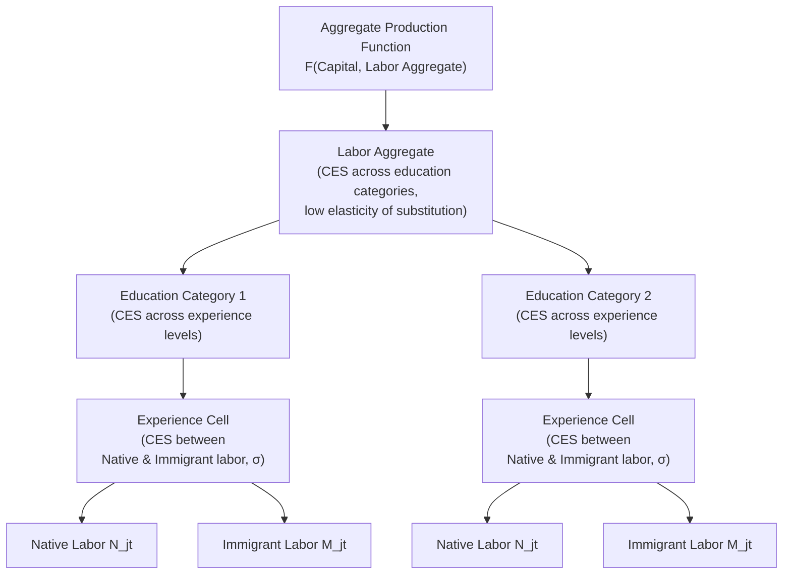

## Complementarity and Substitutability with Native Workers

### Overview

The degree to which immigrant labor is a **substitute** for or **complement** to native labor is the single parameter that most determines the sign and magnitude of immigration's wage and employment effects on native workers (as introduced under **Labor Market Effects of Immigration**). This topic develops the production-theoretic and empirical machinery used to estimate that degree of substitutability/complementarity — the nested constant-elasticity-of-substitution (CES) production function framework, the elasticity-of-substitution parameters that discipline it, and the task-based extensions that allow substitutability to be **endogenous** to occupational sorting rather than a fixed technological constant.

### Substitutes vs. Complements: Definitions

**Key Points**:

- Two types of labor are **substitutes** in production if an increase in the supply of one type **reduces** the marginal product (and, in a competitive labor market, the equilibrium wage) of the other type — they compete for the same tasks/jobs.
- Two types of labor are **complements** in production if an increase in the supply of one type **raises** the marginal product (and equilibrium wage) of the other — an increase in one type makes the other more productive, typically because they perform different, mutually-reinforcing tasks within a production process.
- Formally, using a production function $F(L_1, L_2, K, \ldots)$, labor types 1 and 2 are substitutes if the cross-partial derivative $\frac{\partial^2 F}{\partial L_1 \partial L_2} < 0$, and complements if $\frac{\partial^2 F}{\partial L_1 \partial L_2} > 0$. Whether immigrant and native labor of a given type fall into one category or the other is fundamentally an **empirical production-technology question**, not one resolvable by theory alone.

### The Nested CES Production Function Framework

The standard tool for modeling substitutability across labor types with differing skill, education, and immigration status is a **nested constant-elasticity-of-substitution (CES)** production structure, following **Borjas (2003)**, **Card (2009)**, **Ottaviano and Peri (2012)**, and related work.

#### Structure

A typical three-level nest (education → experience → nativity) takes the form, at the innermost level, distinguishing immigrant and native workers **within** a given education-experience cell:

$$L_{jt} = \left[ \theta_{jt} \, N_{jt}^{\frac{\sigma-1}{\sigma}} + (1-\theta_{jt}) \, M_{jt}^{\frac{\sigma-1}{\sigma}} \right]^{\frac{\sigma}{\sigma-1}}$$

where $L_{jt}$ is the effective labor aggregate in education-experience cell $j$ at time $t$, $N_{jt}$ and $M_{jt}$ are native- and immigrant-born labor supplies in that cell, $\theta_{jt}$ is a distribution/share parameter, and $\sigma$ is the **elasticity of substitution between immigrants and natives within the same education-experience cell**.

This cell-level aggregate $L_{jt}$ then enters a higher-level CES nest combining different experience groups within an education category, which in turn enters a still-higher-level nest combining different education categories, and ultimately combines with capital in an aggregate production function — this **nested structure** allows the model to impose different elasticities of substitution at different levels of aggregation (e.g., substitution across education categories may be much lower than substitution across experience levels within an education category, which may in turn differ from substitution between immigrants and natives within the same education-experience cell).

**Key Points**:

- **$\sigma \to \infty$** implies immigrants and natives within the cell are **perfect substitutes** — this is the assumption underlying the original Borjas (2003) national skill-cell model, which finds relatively larger negative native wage effects.
- **Finite, smaller $\sigma$** implies imperfect substitutability — immigrants and natives with the same formal education and experience are still **somewhat distinct** inputs to production, which **attenuates** the wage effect of immigration on natives within the cell (since the two labor types are not directly competing one-for-one in the same task space).
- The **empirical estimate of $\sigma$** is therefore the central contested parameter in this literature: Borjas's original specifications effectively impose or estimate a high $\sigma$ (near-perfect substitutability), while Ottaviano and Peri's estimates suggest a substantially lower (finite) $\sigma$, implying meaningfully imperfect substitutability and correspondingly smaller estimated negative wage effects on natives.

### Diagram: Nested CES Structure

### Why Might Immigrants and Natives Be Imperfect Substitutes Even Within the Same Education-Experience Cell?

**Key Points**:

1. **Language and communication-task specialization** (Peri and Sparber, 2009): as detailed under Labor Market Effects of Immigration, immigrant workers (particularly those with limited destination-language proficiency) may specialize in manual/physical-intensive tasks, while natives with the same formal education respond by specializing in communication-intensive tasks — this endogenous task sorting means the two groups end up performing **different jobs** even within the same nominal education category, generating complementarity rather than direct substitution.
2. **Differences in occupational choice driven by credential recognition**: immigrants may face barriers to having foreign credentials recognized, pushing them into different occupations than natives with nominally equivalent education levels (e.g., a foreign-trained engineer working in a technician role) — again generating occupational segregation that reduces direct head-to-head competition within the formally-defined education-experience cell.
3. **Comparative advantage and self-selection** (connecting to the Roy model under **Skill Composition of Immigrant Flows**): if immigrants are selected on dimensions not fully captured by formal education/experience (e.g., particular technical skills, entrepreneurial orientation, or specific occupational backgrounds), their effective skill bundle may differ systematically from natives with the same measured education and experience, again reducing direct substitutability.
4. **Employer-side statistical discrimination or preferences**: independent of true productivity differences, employer hiring practices that sort immigrant and native workers into different roles can generate observed occupational segregation that behaves, in the data, similarly to genuine task-based complementarity, complicating the interpretation of estimated elasticities as purely reflecting underlying production technology versus labor-market frictions/discrimination. [Inference: disentangling technology-driven imperfect substitutability from discrimination-driven occupational segregation is a genuine identification challenge in this literature.]

### The Task-Based Model as a Micro-Foundation

**Key Points**:

- Rather than treating the elasticity of substitution $\sigma$ as a fixed technological parameter, **task-based models** (building on the broader task-based labor economics literature, e.g., Autor, Levy, and Murnane's framework as applied to immigration by Peri and Sparber) model production as requiring a continuum or discrete set of **tasks**, each of which can be performed with varying relative efficiency by immigrant versus native labor, depending on factors like language proficiency.
- In this framework, the **observed** degree of substitutability between immigrants and natives is not a primitive but an **equilibrium outcome** of task-assignment decisions that respond to relative wages and relative comparative advantage — as the relative supply of immigrant labor increases, the **marginal task** at which natives and immigrants are just indifferent about who performs it shifts, and the endogenous task reallocation process itself is what generates the empirically-estimated (finite) elasticity of substitution.
- This provides a structural, micro-founded explanation for why estimated substitution elasticities can appear to vary across contexts and time periods: they are not fixed technological constants but reflect the underlying task-comparative-advantage structure and how readily native workers can reallocate toward comparative-advantage tasks in response to immigration-driven labor-supply shifts.

### Complementarity Between Skill Levels: High-Skilled and Low-Skilled Labor

A distinct complementarity channel operates **across** skill levels rather than within the same education-experience cell.

**Key Points**:

- Low-skilled immigrant labor (e.g., in child care, food preparation, or other household/personal services) can **free up time** for high-skilled native workers (particularly women, in some studies) to increase their own labor supply or specialize further in high-value-added activities, generating a complementarity channel between low-skilled immigration and high-skilled native labor-market outcomes distinct from the direct production-function substitution/complementarity discussed above.
- **Cortés (2008)** and related studies examine how low-skilled immigration affects the prices of immigrant-intensive services (e.g., housekeeping, gardening, food preparation), finding that increased low-skilled immigrant labor supply can lower the prices of such services, generating real income gains for consumers of these services (often concentrated among higher-income, often more skilled, native households) — an additional complementarity-like channel operating through consumption/service prices rather than direct labor substitution.
- This general-equilibrium "task trade" and household-production-substitution channel is conceptually distinct from, but can reinforce, the direct labor-market complementarity mechanisms discussed above.

### Empirical Estimates of the Substitution Elasticity

**Key Points**:

- **Borjas, Grogger, and Hanson (2008, 2012)**, defending the near-perfect-substitutes assumption, argue for a high elasticity of substitution between immigrants and natives within education-experience cells, consistent with larger predicted negative wage effects.
- **Ottaviano and Peri (2012)** estimate a substantially lower elasticity of substitution (their central estimates imply meaningfully imperfect substitutability), using different data construction choices (e.g., how experience is measured and how the immigrant/native distinction interacts with education-cell definitions) than the Borjas-style approach.
- [Unverified/contested] The gap between these competing elasticity estimates stems substantially from **differing methodological choices** (e.g., whether to adjust for differential rates of "downgrading" — immigrants working in occupations below what their formal education would predict — and how experience is measured for immigrants who arrive at different ages), not solely from different underlying data; the literature has not converged on a single, universally accepted point estimate of $\sigma$, and this remains one of the most consequential open parameters in immigration economics.

### Worked Example

Consider a nested-CES exercise comparing two elasticity assumptions applied to the same hypothetical immigration shock: a 15% increase in immigrant labor supply within the "less than high school" education-experience cell. Under a **near-perfect-substitutes assumption** ($\sigma$ very high, Borjas-style), this shock predicts a native wage decline within that cell on the order of several percentage points, since immigrants and natives are modeled as directly interchangeable inputs competing for the same tasks. Under an **imperfect-substitutes assumption** ($\sigma$ substantially lower, Ottaviano-Peri-style, reflecting task specialization à la Peri-Sparber), the same 15% immigrant labor-supply shock predicts a much smaller native wage effect — potentially close to zero or even mildly positive — because part of the labor-supply increase is absorbed through native task reallocation toward complementary activities rather than pure head-to-head wage competition for identical tasks. [Inference: these illustrative magnitudes reflect the general pattern and direction of results found across the cited literature but are not drawn from a single canonical calculation and should not be read as precise point predictions; actual results are sensitive to the specific elasticity values, cell definitions, and time period used in any given study.]

### Comparative Note

| Model/Mechanism | Assumed/Implied Substitutability | Typical Predicted Native Wage Effect |
| --- | --- | --- |
| Borjas national skill-cell (perfect substitutes) | High $\sigma$ (near-perfect substitutes) | Larger negative effects on close substitutes |
| Ottaviano-Peri nested CES (imperfect substitutes) | Lower, finite $\sigma$ | Smaller/attenuated, possibly positive effects |
| Peri-Sparber task specialization | Endogenous, task-driven complementarity | Complementarity effect reduces competition |
| Cross-skill household-production complementarity (Cortés) | Complementary via consumption/service channel | Positive effect on high-skilled native welfare/labor supply |

### Next Steps

- **Labor Market Effects of Immigration**
- **Skill Composition of Immigrant Flows**
- **Task-Based Models of the Labor Market (Autor-Levy-Murnane)**
- **Immigrant Occupational Downgrading and Credential Recognition**
- **Household Production and Service-Sector Immigration Effects (Cortés)**
- **Elasticity of Substitution Estimation Methods in Labor Economics**
- **High-Skilled Immigration and Innovation**