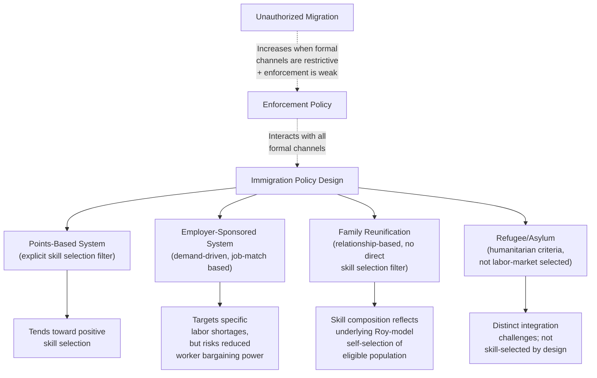

## Immigration Policy Design

### Overview

Immigration policy design examines the economic tradeoffs, instruments, and institutional structures governments use to regulate the volume, composition, and terms of immigrant admission. Building on the theoretical foundations covered elsewhere in this chapter — self-selection under the Roy model (**Skill Composition of Immigrant Flows**), labor-market substitutability/complementarity (**Complementarity and Substitutability with Native Workers**), and aggregate labor-market effects (**Labor Market Effects of Immigration**) — this topic addresses the **policy instruments** available to a destination country (points systems, employer sponsorship, quotas, family reunification, refugee/humanitarian admission, and enforcement against unauthorized migration) and the economic logic, tradeoffs, and empirical evidence associated with each.

### The Core Policy Objectives and Tradeoffs

Immigration policy design generally involves balancing several, sometimes competing, objectives:

1. **Labor-market efficiency**: admitting immigrants whose skills complement (rather than substitute for) the existing native workforce, and who fill genuine labor shortages, to maximize aggregate economic gains from immigration.
2. **Distributional effects**: managing the fact that immigration's aggregate economic gains are typically not evenly distributed — as discussed under Labor Market Effects of Immigration, close native substitutes for immigrant labor may experience wage effects distinct from complementary or capital-owning groups, raising distributional/equity considerations for policymakers.
3. **Fiscal sustainability**: balancing the fiscal contributions (taxes) versus costs (public services, transfer program eligibility) of admitted immigrants, particularly relevant for admission categories not explicitly skill/labor-market selected (e.g., family reunification, refugees).
4. **Family unity and humanitarian commitments**: many immigration systems explicitly weight non-economic objectives (reuniting families, honoring international humanitarian obligations to refugees and asylum seekers) alongside or independent of pure labor-market/fiscal efficiency considerations.
5. **Enforcement and rule-of-law considerations**: managing unauthorized/irregular migration, which operates outside the formal admission system entirely and interacts with formal policy design in complex ways (e.g., stricter formal quotas can increase pressure toward irregular channels absent effective enforcement).

**Key Points**:

- These objectives frequently **trade off against each other**: a policy heavily weighted toward labor-market/fiscal efficiency (e.g., a strict points-based system emphasizing education and language skills) will generally admit a different population — and produce different aggregate and distributional outcomes — than a policy weighted toward family reunification or humanitarian admission, even holding total admission numbers constant.
- No single "optimal" weighting of these objectives is derivable from economic theory alone; the appropriate balance reflects a **combination of economic and normative/political judgments** that vary by country and over time — economic analysis can characterize the tradeoffs and predicted consequences of different policy designs, but the choice of which objectives to prioritize is not a purely technical/economic question.

### Points-Based Systems

**Key Points**:

- Points-based systems (historically associated with **Canada** and **Australia**, though features have been adopted in various forms elsewhere) award admission based on an explicit scoring formula incorporating observable characteristics correlated with expected labor-market success: education level, language proficiency (in the destination-country's official language(s)), age (favoring younger applicants with a longer expected remaining working life), and sometimes a specific offer of skilled employment or occupation on a designated in-demand list.
- From a **Roy-model perspective** (see Skill Composition of Immigrant Flows), points systems act as an explicit policy-imposed selection filter layered on top of underlying self-selection incentives, generally pushing the admitted population toward **more positive selection** (higher average skill/education) than would emerge from a system relying purely on family ties or employer petition volume alone.
- **Efficiency rationale**: points systems are often motivated by the goal of admitting immigrants whose skills are complementary to (or at least not strongly substitutable with) the existing native workforce and who are likely to be net **fiscal contributors**, addressing objectives 1 and 3 above relatively directly.
- **Critiques**: points-based criteria (education credentials, language test scores) are imperfect proxies for actual labor-market productivity and can fail to capture skills valued by specific employers; some evidence from countries using points systems has found that a meaningful share of points-selected immigrants experience initial occupational "downgrading" (working below the skill level implied by their credentials) due to credential recognition frictions (connecting to the imperfect-transferability discussion under **Skill Composition of Immigrant Flows**), somewhat undermining the intended efficiency gains, at least in the short run. [Inference: the magnitude of this downgrading effect and its persistence over time varies across studies and countries.]

### Employer-Sponsored / Demand-Driven Systems

**Key Points**:

- Employer-sponsorship systems (e.g., the U.S. H-1B visa program for specialty-occupation workers, and various employer-driven skilled-worker visa categories elsewhere) condition admission on a specific job offer from an employer in the destination country, sometimes combined with a labor-market test (requiring the employer to demonstrate that no qualified native/resident worker is available for the position) and often subject to an annual numerical **cap or quota**.
- **Efficiency rationale**: because admission is tied directly to a concrete job match, this approach can, in principle, more directly target genuine labor-market complementarity/shortage than a points system based on general observable characteristics, since an actual employer has already identified a specific productive use for the immigrant's skills.
- **Critiques and tradeoffs**:
  - **Employer bargaining power**: because visa status is often tied to continued employment with the sponsoring employer, sponsored workers may have reduced bargaining power/mobility relative to workers with unrestricted work authorization, potentially depressing wages for sponsored workers below what a fully mobile labor-market participant with equivalent skills would command — an efficiency-wage-adjacent and monopsony-adjacent concern studied in some of the labor economics literature on employer-sponsored visa programs.
  - **Cap-driven allocation mechanisms** (e.g., lottery systems used when applications exceed the annual cap) introduce randomness into who is admitted among qualified applicants, which is not obviously efficiency-maximizing relative to alternative allocation mechanisms (e.g., wage-based prioritization, admitting the highest-wage-offer applicants first) — a design choice that has been the subject of policy debate and proposed reform in several such programs.
  - [Inference] The relative efficiency of lottery-based versus wage-based or skill-ranked allocation under a binding cap is a genuinely debated policy design question, with proponents of wage-based prioritization arguing it would better target genuinely scarce, high-value skills, and critics raising concerns about potential unintended consequences for admission of workers in lower-paying but still economically valuable occupations.

### Family Reunification Systems

**Key Points**:

- Family-reunification-based admission (a substantial component of, among others, historical and current U.S. immigration policy) prioritizes admission based on **family relationship** to a citizen or existing legal resident, rather than the individual applicant's own skill or labor-market characteristics.
- From the Roy-model/selection perspective, family-based admission does **not** impose an explicit skill-selection filter analogous to a points system — the resulting admitted population's skill composition instead reflects a combination of the underlying self-selection incentives of the broader eligible population (see Skill Composition of Immigrant Flows) and whatever correlation exists between having a qualifying family relationship and skill/education level in the relevant origin-country population.
- **Distinct rationale**: family reunification systems are typically justified primarily on **family-unity and humanitarian grounds** (objective 4 above) rather than pure labor-market efficiency grounds, and comparative policy debates about shifting the balance of a national immigration system toward more points/skill-based admission and away from family-based admission (or vice versa) center substantially on how much relative weight to place on economic-efficiency objectives versus family-unity and other non-economic values — a normative question that economic analysis can inform (by characterizing likely skill-composition and fiscal consequences of different mixes) but cannot resolve on its own.

### Refugee and Asylum Systems

**Key Points**:

- Refugee and asylum admission is governed by a fundamentally different logic — international and domestic legal obligations related to persecution, conflict, and humanitarian protection — rather than labor-market selection criteria, and (as noted under Skill Composition of Immigrant Flows) the resulting population's skill composition is not well-predicted by Roy-model self-selection logic, since the primary driver of migration in these cases is not a labor-market earnings comparison but escape from danger.
- **Economic analysis of refugee admission** typically focuses on distinct questions from the skill-selection literature: labor-market integration trajectories of refugee populations (often facing additional integration challenges relative to economic migrants, including trauma, disrupted education/career histories, and sometimes more limited pre-migration language preparation), the fiscal costs and benefits of refugee resettlement and integration support programs, and region-specific labor-market absorption effects in areas of concentrated refugee settlement.
- [Inference] Long-run economic integration outcomes for refugee populations, and the effectiveness of different integration-support policy designs (language training, employment services, initial settlement location policy), are active areas of ongoing empirical research, with findings varying by origin population, host-country context, and specific support programs studied; no single generalizable integration trajectory or optimal policy design has been established as definitively superior across all contexts.

### Enforcement, Unauthorized Migration, and Interaction with Formal Policy

**Key Points**:

- Formal admission policy does not operate in isolation from **unauthorized/irregular migration** and **enforcement policy** — the two interact: restrictive formal quotas or lengthy processing/waiting periods in legal channels can increase the relative attractiveness of irregular migration channels for individuals who would otherwise have preferred legal entry, absent effective enforcement deterrence.
- Enforcement policy design (border enforcement, interior enforcement/workplace verification, deportation policy) involves its own distinct economic literature on cost-effectiveness, labor-market effects of enforcement intensity (e.g., studies of how workplace-enforcement programs affect the wages and employment of both unauthorized and authorized workers in affected industries), and the potential for enforcement to shift rather than eliminate migration flows (e.g., toward different, potentially more dangerous, unauthorized entry routes).
- **Legalization/amnesty programs** for existing unauthorized populations represent a distinct policy instrument with its own studied labor-market effects — legalization is generally associated in the empirical literature with **wage gains** for newly-legalized workers (reflecting improved job mobility, reduced employer bargaining-power exploitation, and better job-skill matching once legal status removes prior constraints), though the broader general-equilibrium and fiscal effects of legalization programs remain subject to ongoing study and some disagreement regarding magnitude. [Inference: the size of legalization-associated wage gains varies across studies and the specific population/program examined.]

### Diagram: Immigration Policy Instrument Comparison

### Numerical/Illustrative Policy Comparison

Consider a destination country evaluating two policy reforms, holding total annual admission numbers fixed: **Reform A** shifts 20 percentage points of admission slots from family-reunification categories to a new points-based skilled-worker category; **Reform B** instead expands employer-sponsored admission by the same amount, with an accompanying wage-floor requirement (employers must demonstrate they are paying at or above the local prevailing wage for the sponsored position). Under the Roy-model/nested-CES framework covered in prior topics, **Reform A** would likely raise the average education/skill level of new admissions (moving the composition toward more positive selection) and, per the Ottaviano-Peri/Peri-Sparber complementarity mechanisms, could plausibly generate more favorable native labor-market outcomes on average than an equivalent volume of family-based admission, though possibly at some cost to family-unity objectives. **Reform B** targets specific, employer-identified labor-market complementarities more directly but requires careful design of the wage-floor and labor-market-test provisions to avoid the monopsony-like wage-suppression risk associated with employer-tied visa status noted above. [Inference: this comparison illustrates the general direction of tradeoffs implied by the theoretical frameworks covered in this chapter; it is not a precise quantitative policy simulation and actual outcomes would depend on many context-specific implementation details not modeled here.]

### Empirical Evidence

- Studies of Canada's and Australia's points-based systems have examined immigrant labor-market outcomes and skill-composition effects relative to other admission categories within the same country, generally (though not universally) finding evidence of higher average formal education among points-selected immigrants, alongside documented evidence of initial occupational downgrading/credential-recognition frictions in at least some periods and cohorts studied. [Inference: results vary across specific program design changes over time within each country, and this is not a single fixed, time-invariant finding.]
- Studies of the U.S. H-1B program and other employer-sponsored/demand-driven visa categories have examined effects on wages of sponsored workers relative to comparable non-sponsored workers, effects on innovation and firm-level outcomes at sponsoring employers, and effects on native STEM-worker labor-market outcomes, with the literature showing a range of findings across studies using different data, time periods, and identification strategies. [Unverified as a single, settled consensus finding; this remains an actively debated area of the labor economics literature.]
- Studies of U.S. legalization programs (e.g., research examining the Immigration Reform and Control Act of 1986 and its effects on the legalized population) have generally found wage gains associated with legalization, consistent with the job-mobility/bargaining-power mechanism described above. [Inference: precise magnitude estimates vary across studies.]

### Comparative Note

| Policy Instrument | Primary Selection Basis | Efficiency Rationale | Key Critique/Risk |
| --- | --- | --- | --- |
| Points-based system | Observable skill proxies (education, language, age) | Targets positive selection, complementary skills | Imperfect proxies; credential-recognition downgrading |
| Employer-sponsored | Specific job offer/match | Directly targets identified labor shortages | Reduced worker mobility/bargaining power; cap allocation design |
| Family reunification | Family relationship | Family unity, not primarily efficiency-driven | Skill composition not directly efficiency-targeted |
| Refugee/asylum | Humanitarian/persecution criteria | Not efficiency-driven; distinct integration challenges | Integration support costs; not Roy-model predictable |
| Enforcement/legalization | Status regularization or deterrence | Addresses irregular-migration interactions with formal policy | Legalization/enforcement effects contested; general-equilibrium effects uncertain |

### Next Steps

- **Skill Composition of Immigrant Flows**
- **Labor Market Effects of Immigration**
- **Complementarity and Substitutability with Native Workers**
- **Immigrant Earnings Assimilation (Chiswick Model)**
- **Fiscal Effects of Immigration**
- **Refugee Labor Market Integration**
- **Monopsony Power and Employer-Tied Visa Programs**